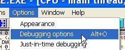

Глава 1 - Введение в OllyDbg
============================

Целью данного «Введения в крэкинг с нуля, используя OllyDbg», является дать тем, кто только начал осваивать искусство крэкнинга, базовые знания и, вместе с тем, сделать это так, чтобы эти знания позволили в дальнейшем читать и понимать более продвинутые туториалы – такие, которые можно встретить в «Новом курсе от CracksLatinos», который, разумеется, остаётся открытым для новых добавлений и пополнений.

Идея создания курса родилась из-за того, что многие туториалы в «Новом курсе от CracksLations» оказывались слишком сложными для новичков, и те, не сумев достигнуть нужного уровня, оказывались разочарованными и во многих случаях отказывались продолжать. Поэтому целью данного «Введения...» является не повторение прекрасных туториалов из «Нового курса...», число которых уже перевалило за 500, но заложить основу, чтобы те, кто закончит данный курс, смогли читать более сложные пособия. Это, как и всё в нашем ремесле, требует значительных усилий, и главной задачей является сократить их количество, дав базовые знания и позволив в дальнейшем понимать более сложный материал.

**Почему OLLYDBG?**

Мы не будем здесь рассуждать о вечном противостоянии Soft-Ice против OllyDbg, думаю, что даже фанатики от Soft-Ice признают, что проще начать с OllyDbg, так как о нём много информации и его проще изучать. Нам нужно войти в мир крэкинга через дверь под названием «OllyDbg», а уже потом тот, кому нужно, сможет перейти на любой другой отладчик, который потребуется, так как меняются лишь их способы использования, но суть остаётся неизменной.

**Начнём с начала**

Сначала нужно вооружиться инструментом, который мы собираемся в основном использовать, для чего кликните тут ***\[[ссылка](files/1/odbg110.7z)\]*** и скачайте его.

Поскольку мы начинаем с нуля, то для начала нам нужно распаковать скачанный архив в такую папку на жёстком диске, до которой можно легко добраться. Хорошей идеей будет создать папку на диске C:/. Хотя будет работать и в любом другом месте, я буду исходить из того, что выбран диск C:/.

После того, как файл был распакован, заходим в созданную папку и видим:

В ней находится исполняемый файл OLLYDBG.exe, который нам и нужно запустить и ярлык, которого я для удобства сделал на своём рабочем столе.

Ок, всё готово к запуску. Кликаем на OllyDbg:

Перед нами появляется сообщение о том, что DLL, находящаяся в библиотеке, старше, чем такая же системная DLL, и если выберем «Да», то тогда старая DLL будет стёрта из папки, а использоваться будет системная. Хотя я не вижу особых различий между этими двумя, тем не менее, предпочитаю ту, которая идёт с дистрибутивом, и поэтому всегда нажимаю «Нет».

Это чистый OllyDbg, и первой программой, которую мы откроем только для того, чтобы ознакомиться с OllyDbg, станет знаменитый CrackMe CrueHead’а ***\[[ссылка](files/1/ollydbg01-Crackme.7z)\]***, который приложен к данному туториалу.

Чтобы открыть файл в OllyDbg, идём в File -> Open или нажимаем на иконку:

Откроется окно, с помощью которого можно найти нужный файл, в данном случае это crackme CrueHead’а.

Откроется вышеупомянутый crackme, и на данный момент неважно, что совершенно непонятно, что означает открывшийся нам вид – пока мы только пройдёмся по различным частям и функциям OllyDbg и некоторым настройкам, чтобы когда в последующих туториалах будет написано, скажем, «зайдите в DUMP», вы, по крайней мере, знали, где находится эта опция.

Здесь мы рассмотрим четыре части главного окна OllyDbg:

**1) Дизассемблированный код**

Также называется листингом. Тут Олли показывает нам дизассемблированный код программы, которую мы собираемся отлаживать; по умолчанию Олли сконфигурирована так, чтобы анализировать программу при её открытии. Это можно изменить в Options -> DEBUGGING OPTIONS.

 

То есть, если отмечена галочка «AUTO START ANALISIS OF MAIN MODULE», OllyDbg проанализирует программу и покажет о ней дополнительную информацию.

Это начало проанализированного листинга крэкми CrueHead’а, и если мы откроем его без анализа, то сможем увидеть разницу.

В окне анализа содержится множество информации, которая, несмотря на то, что пока нам не очень понятна, выглядит весьма интересной. В то же время приятно знать, что её можно в любой момент убрать, если анализ оказался не слишком точным или в него закралась какая-то ошибка.

Зачастую OllyDbg отображает некоторые части программы некорректно, так как ошибочно интерпретирует исполняемый код как данные, и тогда она отображает примерно следующее:

В этом случае можно вручную убрать анализ, кликнув на листинге правой кнопкой мыши и выбрав «ANALISIS -> REMOVE ANALYSIS FROM MODULE».

И тогда листинг отобразится корректно.

Другой опцией, которой вы можете воспользоваться для облегчения работы и которая мне лично не очень нравится (но вкусы бывают разные), является подсветка jump (переходов) и call (вызовов) – кликните на листинге правой кнопкой мыши и выберите «APPEARENCE -> HIGHLIGHTING -> JUMPS AND CALLS».

Получится следующее:

Здесь мы видим, что call’ы подсвечены лазурным цветом, а переходы – жёлтым.

Теперь листинг стал более читаемым, но пока у нас нет ни малейшей идеи, что это означает, но хорошо иметь инструмент подготовленным к дальнейшему использованию.

**2) Регистры**

Второе важное окно – это окно регистров.

Вспомним, что окно регистров находится в самой правой части OllyDbg, и там отображается значительное количество информации.

Есть значительно больше информации, которую мы не видим, но можно устанавливать режим отображения в три состояния («VIEW FPU REGISTERS» – отображать FPU-регистры, «VIEW 3D NOW REGISTERS» – отображать “3D NOW”-регистры и «VIEW DEBUG REGISTERS» – отображать отладочные регистры). По умолчанию отображаются первые.

**3) Стек или «куча»**

Теперь переходим к «стеку или куче». Здесь не слишком много конфигурационных опций – разве что возможность отобразить информацию, касающуюся регистров ESP и EBP.

По умолчанию стоить режим отображения информации, связанной с ESP (и он же является самым полезным), но его можно сменить на режим отображения информации, связанной с EBP, для чего необходимо кликнуть в этом окне правой кнопкой мыши и выбрать пункт «GO TO EBP», а дальнейшее использование пункта «GO TO ESP» вернёт нас в прежний режим.

В дальнейших главах я объясню подробнее функциональность стека, но пока мы рассматриваем только то, что можно изменить с помощью конфигурации.

**4) Дамп**

У окно дампа есть много режимов отображения, которые можно менять, кликнув правую кнопку мыши в окне дампа и выбрав тот, который нужен. По умолчанию используется используется режим 8-ми байтовый Hex/ASCII.

Режим, используемый по умолчанию, также является и чаще всего используемым, но вместе с тем, у нас есть возможность изменять его на показ дизассемблированного кода (DISASSEMBLE), текста (TEXT) и других форматов (SHORT, LONG, FLOAT).

И, наконец, опция SPECIAL -> PE HEADER, которая, как мы это увидим в ближайших главах, может быть очень полезной.

Теперь мы знаем основные части главного окна OllyDbg, но есть ещё окна, которые недоступны напрямую, но могут быть вызваны как через меню, так и через кнопки на панели управления.

Рассмотрим каждую из них.

Кнопка L или VIEW->LOG показывает нам то, что OllyDbg пишет в окне лога. Его можно сконфигурировать на отображение различного рода информации, а по умолчанию в окне лога сохраняется вся информация о запуске, а также информация, связанная с «BREAKPOINTS CONDICIONAL LOGS» (условными логами точек останова). С последней мы встретимся гораздо позднее, а пока давайте посмотрим информацию о запущенном процессе (в нашем случае это крэкми CrueHead’а) и библиотеках, которые он загружает.

Одна из самых главных опций данного окна – это ведение лога в файле на тот случай, если мы хотим сохранять информацию в текстовом файле. Чтобы активировать эту опцию, нажмите на правую кнопку мыши и выберите «LOG TO FILE».

Кнопка E или VIEW->EXECUTABLES показывает нам список модулей, которые использует программа: exe, dll, ocx и прочие.

Здесь также правая кнопка мыши вызывает множество опций, которые пока мы смотреть не будем, но которые мы уже видели при исследовании главного окна OllyDbg.

Кнопка M или VIEW->MEMORY отображает память, занятую нашей программой. Здесь мы видим секции приложения, библиотеки, использующиеся процессом, стек и различные секции, занятые системой, и зачастую программы в процессе выполнения занимают новые секции памяти.

Кликнув правой кнопкой мыши можем сделать SEARCH в памяти, чтобы найти в ней строки различных родов (текстовые, шестнадцатиричные, юникодовые), также есть возможность подсветить точки останова в секциях, равно как и возможность изменить права доступа к последним (выберите SET ACCESS).

Кнопка T или VIEW->THREADS показывает нам список нитей (потоков) программы.

Хотя сейчас мы не знаем что это такое, а узнаем это лишь в последующих главах, ознакомиться с каждым из окон лишним не будет. Пользоваться ими мы научимся позднее.

Кнопка W или VIEW->WINDOWS отображает нам окна программы, но поскольку она ещё не выполняется, то и список окон остаётся пустым.

Кнопка H или VIEW->HANDLES отображает хэндлы, позже я объясню, для чего они служат.

Кнопка C или VIEW->CPU возвращает нас к главному окно OllyDbg.

Кнопка / или VIEW->PATCHES показывает список наложенных патчей, если программа была изменена. Поскольку пока никаких изменений не вносилось, сейчас окно остаётся пустым.

Кнопка K или VIEW->CALL STACK отображает «call stack», список вызовов, которые нам встретились до того места, где программа остановилась.

Кнопка B или VIEW->BREAKPOINTS вызывает список обычных точек останова, расположенных в программе. Здесь нет ни точек останова аппаратного обеспечения, ни точек останова памяти, только обычные.

Кнопка R или VIEW->REFERENCES показывает окно ссылок, полученных нами в результате поиска ссылок в Олли.

Кнопка «…» или VIEW->RUN TRACE отображает результат выполнения команды RUN TRACE. Здесь мы также можем выбрать опцию LOG TO FILE), чтобы сохранить результаты трассировки в текстовом файле.

Мы рассмотрели панель с самыми важными кнопками, чтобы вы были знакомы с возможностями, которые они предоставляют, когда мы начнём их более глубокое изучение в последующих главах.

**Как сконфигуровать OllyDbg стала JIT (JUST IN TIME DEBUGGER)**

Конечно, мы не будем всё время использовать JIT, а только в специальных случаях, так как если случится ошибка с какой-либо запущенной программой на нашей машине, то нам совсем не нужно, чтобы использовалась Олли (по умолчанию в качестве JIT используется dr.watson).

Чтобы сделать OllyDbg JIT-отладчиком, нужно перейти в OPTIONS->JUST IN TIME DEBUGGING

и нажать последовательно кнопки MAKE OLLYDBG JUST IN TIME DEBUGGER и DONE

Чтобы убрать эту функцию, нужно в том же месте нажать на RESTORE JUST IN TIME DEBUGGER и DONE.

**Подключение плагинов в OllyDbg**

OllyDbg позволяет подключать плагины, которые могут оказаться полезными для решения той или иной задачи. Пока мы ограничимся подключением плагина COMMAND BAR, чтобы научиться как это делать.

Скачиваем данный плагин отсюда ***\[[ссылка](files/1/cmdbar300108.7z)\]***

После этого распаковываем плагин и смотрим содержимое папки, где это было сделано:

Прежде всего нужно создать папку для плагинов. Я создам её на C:/ и назову PLUGINS.

Разумеется, плагины могут находиться где угодно, но мне нравится размещать всё на C. Как бы то ни было, теперь мы должны сконфигурировать OllyDbg, чтобы она распознавала эту папку как местонахождение всех плагинов.

Для этого идём в OPTIONS->APPEARANCE.

И в открывшемся окне открываем вкладку DIRECTORIES.

Видим, что в качестве пути к плагинам указана директория, где находится сам OllyDbg.exe, и можно было бы помещать плагины туда, но мне нравится держать их отдельно, и тогда нажимаем на PLAGIN PATH->BROWSE, чтобы найти созданную нами папку.

Выбираем папку PLUGINS и сохраняем изменения.

То есть нужно перезапустить Олли, чтобы она признала новую папку с плагинам, но сначала следует скопировать в последнюю скачанный плагин.

Копируем всё содержимое архива в папку PLUGINS.

Теперь все файлы плагина «Command Bar» находятся в папке PLUGINS, в неё же следует помещать и остальные (зачастую можно копировать не все файлы в архиве, а только dll).

Теперь закрываем OllyDbg, если она всё ещё была закрыта, и запускаем по новой. Видим, что в меню PLUGINS появился COMMAND BAR и его опции.

В нижней части OllyDbg видим установленный COMMAND BAR.

Это текстовое поле для ввода команд, которые нам могут пригодиться во многих случаях, и позднее мы увидим их применение, а пока важно научиться подключать плагины.

Чтобы деинсталлировать PLUGIN достаточно просто стереть соответствующую dll из папки PLUGINS и перезапустить OllyDbg, и плагин исчезнет. Вместе с тем, благоразумно всегда держать COMMAND BAR включённым.

Снова открываем крэкми CrueHead’в в OllyDbg.

**Наиболее полезные клавиши в OllyDbg следующие:**

F7: Выполняет одну строку кода (если находимся на CALL, то переходим внутрь вызванного участка кода)

F8: Выполняет одну строку кода (если находимся на CALL, то просто выполняет вызов без перехода внутрь и переходит на следующую за CALL строку).

Это два вида ручной трассировки очень разные и в каких случаях использовать каждую из них мы рассмотрим позже.

F2: устанавливает обычную точку останова на отмеченной линии. Чтобы убрать эту точку останова, надо ещё раз нажать F2.

Например:

Хотим установить точку установа в позиции 40101A, поэтому отмечаем эту линию с помощью мыши.

С помощью одного клика мыши она помечается и становится серого цвета как на картинке. Затем нажимаем F2.

Видим, что соответствующая позиция в первой колонке становится красной, что говорит о том, что здесь есть точка останова. Нажав F2 ещё раз можно её убрать.

F9: Запускает программу, которая будет выполняться до тех пор, пока не встретит точку останова, не совершиться какое-либо исключение или же просто прекратит работу по каким-либо причинам. Когда программа запущена, в нижнем правом угле OllyDbg отображается слово RUNNING.

Запустив крэкми CrueHead’а, мы увидим следующее:

Чтобы временно прекратить выполнение программы, нужно нажать F12 или DEBUG->PAUSE.

Видим, что OllyDbg отображает слово PAUSED (пауза). Продолжить выполнение программы можно нажав F9 или DEBUG->RUN.

Чтобы закрыть отлаживаемую программу выберите DEBUG->CLOSE.

Это был краткий обзор OllyDbg, более глубокое изучение множества опций и возможностей которой мы продолжим изучать в последующих главах. Главное, чтобы вы скачали программу, сконфигурировали, ещё раз посмотрели всё, о чём было рассказано в этом туториале, так же подключили плагин, позапускали и поостанавливали крэкми CrueHead’а, попробовали поставить точки останова, чтобы в следующей главе все эти вещи не вызывали у вас колебаний и сомнений.

  \[C\] Рикардо Нарваха, пер. Aquila
