# Глава 2 - Системы счисления, ASCII-символы и стек

После того, как мы рассмотрели строение, основные элементы и принципы OllyDbg, необходимо изучить системы счисления и что такое стек, чтобы иметь о них хоть какое-то представление.

## Системы счисления

Наиболее часто используемыми системами счисления являются двоичная, десятеричная и шестнадцатеричная.

Основное, что о них нужно знать:

*   ДВОИЧНАЯ: представляется символами 0 и 1, и поэтому называется двоичной.
*   ДЕСЯТЕРИЧНАЯ: представляется десятью символами (от 0 до 9), и поэтому называется десятеричной.
*   ШЕСТНАДЦАТЕРИЧНАЯ: представляется символами от 0 до F (0-9, а также A, B, C, D, E и F, то есть 16 символов в итоге).

Обычно, если будет упоминаться какое-то число, то будет считаться, что оно в шестнадцатеричной системе, если иное не указано явно.

Существуют не слишком приятные математические формулы, которые мы не будем использовать, для конвертации чисел из одной системы в другу. Настоящий крэкер использует для этого "Windows-калькулятор", что гораздо быстрее и проще и избавляет от работы со степенями, суммами и прочим при конвертации чисел.

Открываем калькулятор и подготавливаем его для работы.

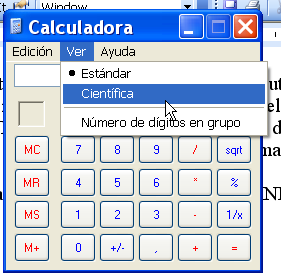

Теперь идём в меню "View", чтобы включить инженерный режим.

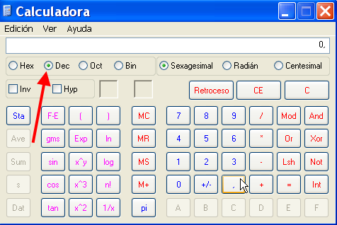

Здесь мы видим, что по умолчанию стоит десятеричная система счисления. Сбоку можно изменить её на одну из трёх: шестнадцатеричную (HEX), восьмеричную (OCT) и двоичную (BIN).

Восьмеричная система, использующая 8 символов, не слишком используется в крэкинге, но если потребуется, то в калькуляторе такая опция есть.

Поэтому, чтобы перевести число из одной системы счисления в другую наиболее простым образом, переводим калькулятор в исходную систему счисления, например, если хотим перевести 55 из десятичной в шестнадцатеричную, то ставим в калькуляторе десятеричную систему счисления и набираем 55.

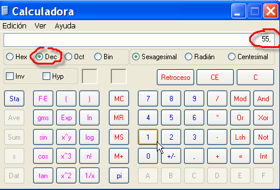

Теперь переводим калькулятор в шестнадцатеричную систему счисления, и введённое число автоматически конвертируется в него.

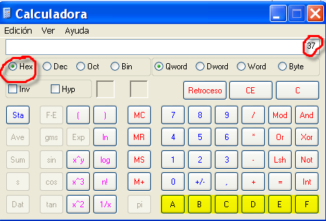

Таким образом, видимо, что 55 в десятеричной системе – это 37 в шестнадцатеричной.

При этом появились неиспользованные в десятеричной системе счисления клавиши с символами A, B, C, D, E, F, чтобы мы могли их вводить.

Думаю, что этот способ более практичен в использовании и позволяет нам переводить числа из одной системы счисления в другую без особых сложностей.

## Положительные и отрицательные шестнадцатеричные числа

Это понять гораздо сложнее, поэтому начнём издалека. Как в шестнадцатеричной системе можно представить отрицательное число, если мы не можем использовать для это цели минус как в традиционной десятеричной системе? Как представить в шестнадцатеричном формате, например, -1?

Рассмотрим эту проблему, и надеюсь, что всё станет понятно.

Если у нас есть возможность писать шестнадцатеричные числа от 00000000 до FFFFFFFF, то как нам представлять отрицательные числа?

Мы можем использовать половину этого диапазона для положительных чисел, а половину – для отрицательных.

Положительные числа будут идти от 00000000 до 7FFFFFFF, а отрицательные – до 80000000.

### Положительные

```
000000000 всё равно, что 0 в десятеричной
000000001 всё равно, что 1 в десятеричной
.........................................
.........................................
7FFFFFFF всё равно, что 2147483647 в десятеричной ( и это максимальное положительное число)
```

### Отрицательные

```
FFFFFFFF всё равно, что -1 в десятеричной
FFFFFFFE всё равно, что -2 в десятеричной
.........................................
.........................................
80000000 всё равно, что -2147483648 в десятеричной (и это максимальное отрицательное число)
```

Можно попробовать узнать в Command Bar значение 7FFFFFFF в десятеричной системе, для чего используется вопросительный знак, после которого идёт собственно само значение.

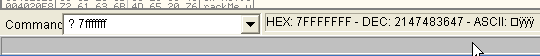

Справа видим, что получили соответствующее десятеричное значение, которое равно 2147483647, то есть всё в порядке.

Теперь когда хотим выяснить, является ли значение 80000000 отрицательным, видим, что не показываются результаты для значений после 7FFFFFFF (это баг в Command Bar), поэтому как же нам выяснить его значение в OllyDbg?

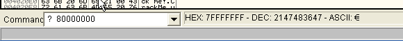

Для этого есть маленький трюк.

Идём в регистры и выделяем EAX.

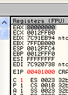

Теперь нажимаем на правую кнопку мыши и выбираем "MODIFY".


Нам показывается окно, с помощью которого мы можем поместить в EAX нужное нам значение, хотя также это окно полезно для совершения различного рода конверсий. В первом поле задаётся шестнадцатеричное значение, которое мы хотим сконвертировать, а во втором появляется соответствующее значение в десятеричной.

В данном случае видим, что 80000000 соответствует десятеричному -214783648.

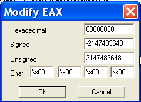

Если хотим убедиться, что FFFFFFFF это десятеричное -1.

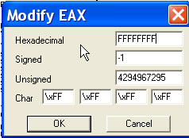

Таким образом, в окне модификации регистра мы можем легко проверять значение отрицательных числе, после чего можем выйти, нажав "Cancel", не изменив на самом деле регистр никаким образом.

## ASCII-символы

Одна из тем, которую мы должны освоить, это вид представления данных на экране, при котором каждому символу присваивается шестнадцатеричное значение, что позволяет нам интерпретировать их как буквы, символьные значения и т.д.

В таблице, скопированной (хе-хе) из "Теории ассемблера" (Caos Reptante), можно видеть десятеричное значение и соответствующие ему шестнадцатеричное и символьные значения. Например, если нужно использовать символ пробела в Олли, то можем применить 20 (hex) или 32 (dec).

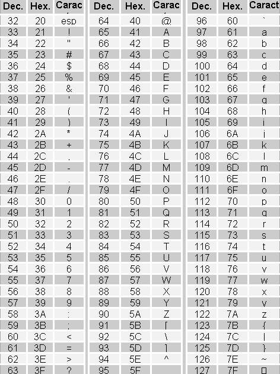

В остальных случаях мы можем узнать символьное значение шестнадцатеричного числа с помощью Command Bar:

`? 45`

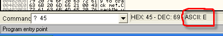

Видим, что 45 соответствует заглавное букве "E", и если поищем число 45 в средней колонке вышеприведённой таблицы, то убедимся, что это и есть шестнадцатеричное значение буквы "E".


Также в OllyDbg есть окно DUMP, где находится колонка с ASCII-символами. Давайте посмотрим, увидим ли мы какие-нибудь из них в крэкми CrueHead’а [\[ссылка\]](.gitbook/assets/files/1/ollydbg01-Crackme.7z).

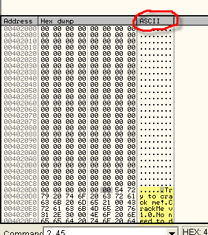

Видим, что сбоку от колонки, отображающей шестнадцатеричные значения, есть колонка ASCII, где можно видеть соответствующие им текстовые строки, состоящие из ASCII-символов.

## Что такое стек или "куча"

Стек или "куча" - это зона памяти, где сохраняются данные, которые должны быть восстановлены в ближайшее время.

Слово "куча" напоминает о пачках или кучах писем или игральных карт, встречающихся на столах. В этих пачках самое новое письмо помещается сверху, а если письмо берётся из такой пачки, то также сверху.

Это и есть основная черта стека. Письмо помещается на верх кучи, и оно же будет тем, которое уйдёт самым первым.

В дальнейшем мы рассмотрим, как работать в OllyDbg со стеком.

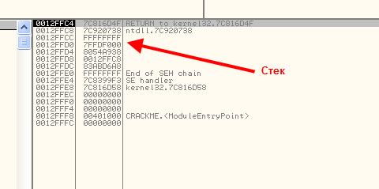

Хорошо, думаю, что на этот раз достаточно. В третьей главе мы рассмотрим, что такое регистры и флаги, и для чего они предназначаются.

\[C\] Рикардо Нарваха, пер. Aquila
