# Глава 3 - Регистры и флаги

## Для чего же нужны регистры и что это такое?

Процессору нужны помощники для выполнения программ. Таковыми и являются регистры: когда необходимо выполнить какую-либо инструкцию, например, которая складывает содержимое двух ячеек памяти, процессору нужно разместить содержимое одной из них в регистре, а затем сложить то, что в нём находится с содержимым другой ячейки. Это один из примеров использования регистров.

ESP указывает на самое верхнее значение стека, посмотрим это на примере крэкми от Cruehead’а ***\[[ссылка](files/1/ollydbg01-Crackme.7z)\]***.

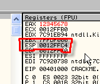

ESP равняется 12FFC4, и если посмотрим в OllyDbg на стек,

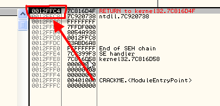

то увидим, что регистр указывает на верхнее значение нашего стека или, говоря образно, на верхнее письмо в пачке.

EIP – это другой очень важный регистр, который указывает на инструкцию, выполняющуюся в данный момент.

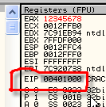

Видим в листинге, что при загрузке крэкми адресом первой выполняемой инструкции является 401000, и очевидно, что именно это значение и содержится в EIP.

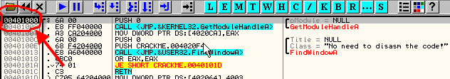

Если нажать на F7, то выполнится первая инструкцию и наступит очередь второй.

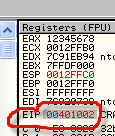

Теперь EIP равен 401002, и в листинге видим, что первая инструкция выполнилась и находимся сейчас на второй.

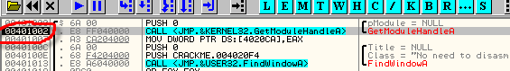

Другие регистры могут содержать различные значения и служить для помощи процессору в выполнении инструкций.

Вспомним, где OllyDbg показывает значения регистров:

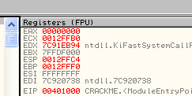

Взглянув туда, узнаём, что существуют EAX, ECX, EDX, EBX, ESP, EBP, ESI, EDI y EIP.

Они называются 32-х битными регистрами.

OllyDbg отображает их содержимое в шестнадцатеричной форме. Например, минимальное значение EAX может быть равно 00000000, а максимальное – FFFFFFFF, что в двоичной системе счисления будет 11111111111111111111111111111111.

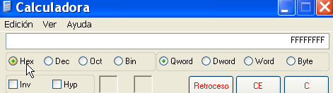

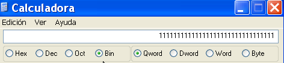

Видим, что есть 32 бита, каждый из которых может быть равен 0 или 1, поэтому регистры и называются 32-х битными.

В ассемблере можно обращаться к частям этих 32-х битных регистров.

Рассмотрим пример работы с регистрами, чтобы немного попрактиковаться в OllyDbg.

Изменим значение EAX на то, которое нужно нам, в данном случае это 12345678. Открываем OllyDbg, где загружен крэкми Cruehead’а (хотя там может быть и что-то другое).

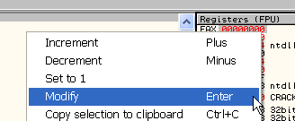

В открывшемся окне пишем в поле "Hexdecimal" 12345678.

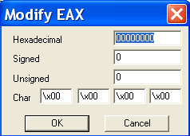

Вот так:

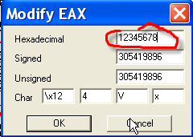

Потом нажимаем OK.

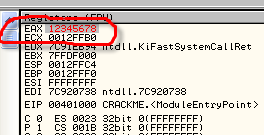

Видим, что теперь в регистре нужное значение. OllyDbg выделяет изменённые значения красным цветом.

При желании можно использовать часть EAX, в данном случае AX будет 16-ти битным регистром, например, в примере выше в нём будет находится 5678, в чём можно убедиться, напечатав в Command Bar

`? AX` (знак вопроса также служит для нахождения значения выражения или регистра).

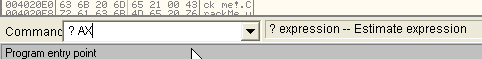

После нажатия клавиши ENTER.

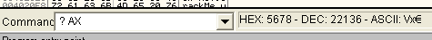

видим пресловутые 5678, т.е. AX содержит последние четыре цифры EAX. Также существуют AL и AH, значения которых также можно посмотреть в OllyDbg.

`? AL`

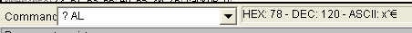

`? AH`

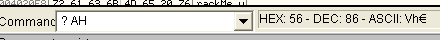

Или если EAX = 12345678, то AX – это последние 4 цифры.

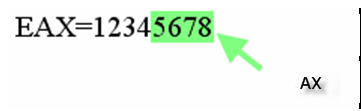

AH – это 5 и 6 цифры, а AL – это две последние.

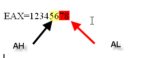

Таким же образом EBX делится на BX, BH и BL, равно как подобное деление существует и почти для всех остальных регистров.

## Как изменить значение регистров

Как мы увидели, в OllyDbg можно изменять значения регистров. Всё, что мы сделали с регистром EAX применимо и к другим регистрам: отметьте регистр, значение которого вы хотите изменить, затем кликните по правой кнопке и нажмите "Modify". Единственное исключение - это EIP, указывающий на инструкцию, которая должна выполнится.

Чтобы изменить его, сделайте следующее: поскольку EIP всегда указывает на инструкцию, которая должна выполниться, то просто выбираем новую инструкцию в листинге.

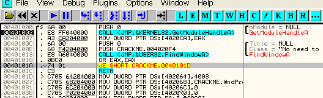

После того, как отметили, например, 40101A, кликаем правую кнопку мыши -> "New origin here", и EIP изменится на 40101A, и таким образом, программа продолжит выполнение именно с этого места.

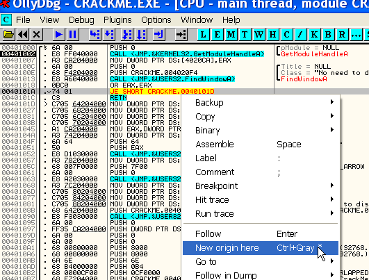

Как видим, EIP содержит 40101A.

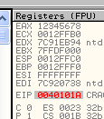

## Что такое флаги?

Как мы увидели в первой главе, в OllyDbg под регистрами находятся флаги.

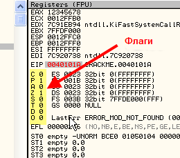

Видим, что флаги бывают C P A Z S T D и O.

Видим, что они могут иметь только два значения: ноль или один. Определённые инструкции при выполнении могут изменять их значение.

Мы собираем рассмотреть следующие флаги:

### 1. Флаг "O" или флаг переполнения

Этот флаг активируется, когда в результате операции изменяется знак и возвращается неправильное значение.

Рассмотрим в OllyDbg следующий пример, как обычно используя крэкми Cruehead’а.

Меняем таким же, как и раньше, образом значение EAX на 7FFFFFFF, которое является максимальным положительным.

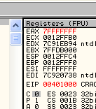

Теперь прибавим 1, из-за чего сумма превысит максимальное положительное число, потому что, как мы знаем, 80000000 соответствует числу отрицательному.

Для этого вызовем окно, где можно писать инструкции.

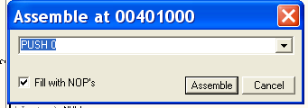

В нём пишем `ADD EAX, 1`.

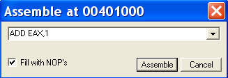

После нажатия на кнопку "ASSEMBLE" увидим, что инструкция по адресу 401000 изменится на ту, которая была введена.

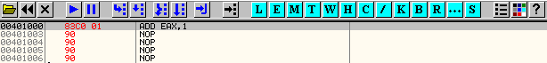

`ADD EAX, 1`, как мы узнаем, когда будут перечисляться и объясняться инструкции, прибавляет к EAX число 1 и сохраняет в этом же регистре полученное значение.

До выполнения этой строки с помощью F7 флаг "O" равен нулю.

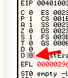

Если выполнить данную строку с помощью F7, чтобы увидеть, что произойдёт, то в EAX окажется 80000000 и знак числа будет изменён.

Флаг "O" станет активным и будет показывать 1, то есть, что результат выполненной инструкции превзошёл максимально возможный результат. Назначения этого флага – показывать когда это происходит.

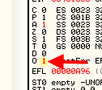

### 2. Флаг "A" или дополнительный флаг переноса.

Имеет схожее назначение при выполнении операция с другими форматом, поэтому сейчас он нам не интересен.

### 3. Флаг "P" или флаг чётности

Данный флаг активируется, когда результат выполнения инструкция в двоичной форме содержит чётное количество единиц, например, 1010, 1100 или 1111000.

Чтобы опробовать его, у нас уже есть заданная в OllyDbg инструкция "ADD EAX, 1", и чтобы выполнить это строку снова, выделим строку 401000, кликнем правую кнопку мыши и выберем "New orgin here", чтобы вернуться назад, и теперь, если нажмём F7, выполнится инструкция, которую мы задали – "ADD EAX, 1".

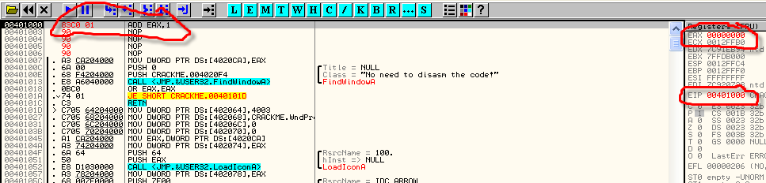

Сейчас у нас в EAX содержится значения 00000000, а флаг "P" равен 1 (как результат выполнения предыдущей инструкции), посмотрим, что случится, когда прибавим к EAX 1.

Нажимаем F7.

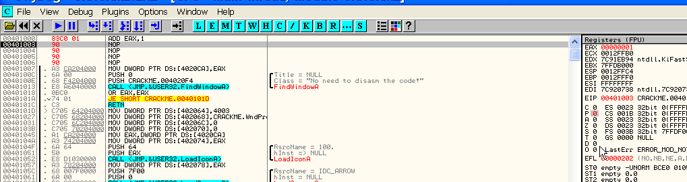

Видим, что "P" стал равен 0, так как результат, содержащийся в EAX, равен в двоичной форме 1, что в двоичной форме содержит всего лишь одну единицу, то есть нечётное количество.

И снова кликаем на "ADD EAX, 1", а потом правой кнопкой мыши и выбираем "New origin here", чтобы снова прибавить 1. Нажимаем F7.

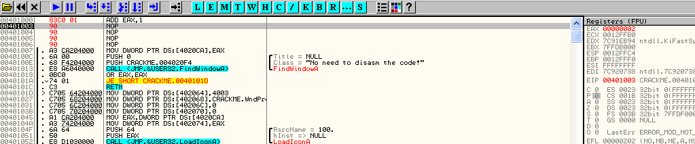

Видим, что в EAX, содержавшем прежде значение 1, теперь находится 2, что в двоичной форме равно 10. Число единиц опять нечётно и флаг "P" неактивен. Повторим процесс с прибавлением единицы ещё раз.

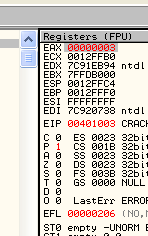

Теперь в EAX содержится значение 3, что в двоичной форме равно 11, и сейчас результат содержит чётное количество единиц, а флаг чётности стал активен.

Вот мы и познакомились с тем, как работает вышеуказанный флаг: если результат выполнения инструкции содержит в двоичной форме чётное количество единиц, то флаг активен.

### 4. Флаг "Z" или флаг нуля

Это один из самых известных и используемых в крэкинге флагов, который становится активным, когда результатом выполнения инструкции является ноль.

Вернёмся к нашей инструкции "ADD EAX, 1" по адресу 401000 (клик правой кнопкой мыши – "New origin here"), но сделаем значение EAX равным FFFFFFFF, что равно десятиричному -1, поэтому когда нажмём F7 и запустим "ADD EAX, 1", результатом -1 + 1 будет ноль и флаг "Z" должен стать активным.

Видим, что после нажатия F7 EAX содержит ноль, а раз результат – ноль, то флаг Z активен и равен 1.

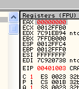

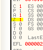

Думаю, теперь стало ясным, что данный флаг активен, когда результат инструкции равен нулю. Различные способы достичь этого мы узнаем позже.

### 5. Флаг "S" или флаг знака

Этот флаг равен 1, когда результат операции отрицателен. Что посмотреть его в действии, изменим значение EAX на FFFFFFF8, что равно -8 в десятиричной форме.

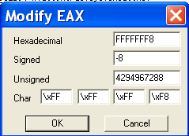

С помощью "New origin here" и кнопки А7 можно снова выполнить "ADD EAX, 1". Результатом будет FFFFFFF9, то есть -7 в десятиричной форме, которое является отрицательным числом, поэтому флаг знака должен стать активным.

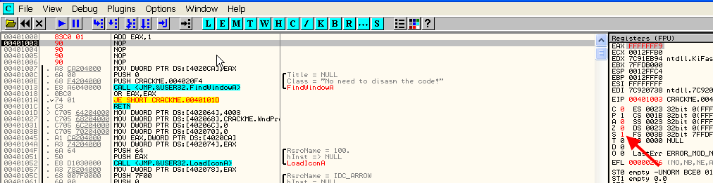

Нажимаем F7 и после выполнения инструкции активируется флаг "S", который теперь равен 1, то есть ясно, что отрицательный результат его активирует.

### 6. Флаг "C" или флаг переноса

Активен, когда превышается максимальное значение, которое может содержать регистр, например, если поместим в EAX значение FFFFFFFF и прибавим 1, то увидим, что флаг переноса стал равен 1.

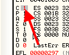

### 7. Флаги T, D и I

Я не буду объяснять их назначение сейчас, так как это достаточно сложная тема, и пока нам они не слишком интересны. Пока мы будем рассматривать более простые инструкции, а эту тему оставим на потом.

Таким образом, мы получили представление о каждом регистре и в каких случаях активируются флаги. С помощью этой информации мы можем начать изучение инструкций одну за другой, так как пока мы только видели инструкцию ADD.

Если вам ещё что-то осталось непонятным, попрактикуйтесь в изменении значений флагов с помощью использованной нами инструкции "ADD EAX, 1", а затем переходите к следующей части данного "Введения..."

Очень важно, чтобы вы поняли основную суть, так что не колебайтесь попрактиковаться и перечитать этот материал ещё раз.

\[C\] Рикардо Нарваха, пер. Aquila
