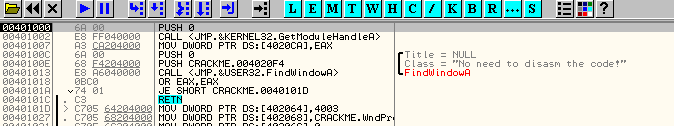
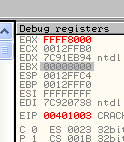

# Глава 4 - Ассемблерные инструкции

Как уже говорилось в прошлых частях, главной целью данного "Введения..." является объяснение теории, практика в OllyDbg, чтобы её усвоить, а в дальнейшем, после приобретения уверенности в своих навыках, перейти к возможностям, которые они дают.

Рассмотрев в OllyDbg почти все флаги, мы перейдём к рассмотрению наиболее важных инструкций. Если вы встретите в листинге инструкцию, которой не окажется здесь, вы можете проконсультироваться с каким-нибудь более полным руководством по ассемблеру.

## NOP (NO OPERATION)

Это инструкция, которая при запуске не производит никаких изменений в регистрах, стеке или памяти, поэтому по-английски её название расшифровывается "NO OPERATION", то есть у неё нет никакого специального назначения, и поэтому её можно использовать, например, если нужно заменить одну инструкцию на другую, более короткую. Чтобы процессор не столкнулся с ошибками, лишнее место заполняется NOP'ами.

Также она служит для полного уничтожения другой инструкции, для этого нужно заменить её соответствующим количество NOP'ов, или попросту заNOPать.

Снова откроем крэкми CrueHead'а [\[ссылка\]](.gitbook/assets/files/1/ollydbg01-Crackme.7z).

В самом начале видим оригинальный код. Чтобы занопать первую инструкцию PUSH 0, которая имеет размер 2 байта, отмечаем соответствую строку листинга с помощью мыши, а затем нажимаем клавишу "пробел" или же правая кнопка мышь - ASSEMBLE.

Здесь видим, что действительно можно просто нажать "пробел", после чего откроется окошко для ввода желаемой инструкции.

Пишем NOP и нажимаем ASSEMBLE.

Видим, что Олли, кроме того, что ввела NOP, будучи весьма умной программой, учла, что PUSH занимает два байта, и чтобы не оставлять неприкаянным следующий байт, ввела дополнительный NOP.

Теперь на месте, где был "PUSH 0", находятся два NOP'а, которые при исполнении ничего не делают, в чём мы можем убедиться, нажав два раза F7, чтобы стала отмеченной инструкция CALL. Увидим, что изменился только регистр EIP, содержащий адрес инструкции, которая должна выполнится следующей, но ничего больше не изменило своего значения: ни другие регистры, ни стек, ни флаги, ни память.

Теперь нам нужно посмотреть эти два новых байта в DUMP, и для того, чтобы найти их там, нам нужен их адрес в памяти, и это 401000 и 401001.

Идём в окно DUMP, правая кнопка мыши - "Go to" - "Expression", после чего нужно будет ввести адрес, где располагаются требуемые нам байты.

Вводим 401000.

Видим, что:

Красным выделены изменённые Олли байты. Первым идут два 90, а затем E8, FF и все остальные байты, относящиеся к следующей за NOP'ами инструкцией, которой является CALL.

Может Олли вернуть обратно изменённые нами байты?

Хе-хе, да, может.

В любом из двух окон - DUMP или листинге, отмечаем оба байта.

Потом кликаем на правую кнопку мыши и выбираем "UNDO SELECTION"

И затем снова появляется изначальный PUSH.

Также, если посмотрим в DUMP, увидим, что там находятся изначальные байты.

Это всё, что касается инструкции NOP.

## ИНСТРУКЦИИ СТЕКА

Мы уже говорили, что стек - это пачка писем, поверх которой последние помещаются или сверху которой они берутся.

Далее следуют инструкции для помещения или удаления "писем".

### PUSH

Инструкция PUSH - типичная инструкция для помещения "письма" или значения на стек. Мы можем видеть, что первая инструкция в крэкми CrueHead'а - это PUSH.

В данном случае это 'PUSH 0', и, будучи выполненной, данная инструкция поместит 0 на самый верх стека, а то, что было до этого наверху, окажется под этим значением.

Мы можем увидеть, как выглядит стек после выполнения PUSH. На вашей машине адреса могут отличаться, но эффект будет тот же самый.

Это стек на моей машине. Адрес 12FFC4 может отличаться у вас, так как стек каждый раз может располагаться по разному адресу, и его начальное содержимое также может отличаться, то есть у вас может быть значение, отличное от 7c816d4f. По нажатию F7 на самый верх попадёт ноль, а всё остальное окажется внизу него. Нажмём F7.

Видим, что по нажатию F7, ноль словно присоединился сверху того, что мы уже видели. Внизу по адресу 12ffc4 по-прежнему находится значение 7c816d4f, и ни одного из других значений в стеке также не изменилось.

Главным отличием является то, что самое верхнее значение стека находится теперь по адресу 12ffc0 (именно там и находится ноль, который мы поместили с помощью инструкции PUSH), это действительно как положить поверх пачки писем новое, которое окажется на самом верху, а остальные - под ним, но ничего в них не изменится.

Также видим, что ESP, в котором находится адрес самого верхнего значения стека, теперь содержит 12FFc0.

Конечно, инструкция PUSH имеет несколько вариантов, позволяющих помещать в стек не только числа:

PUSH EAX помещает значение EAX на верх стека. Подобным образом мы можем поместить в стек значение любого регистра, числа и т.п.

Также можно поместить значение, находящееся в памяти по определённому адресу:

`PUSH [401008]`

Обратите внимание, что это будет интерпретироваться отличным образом от следующего:

`PUSH 401008`

(Без квадратных скобок)

Если выполним 'PUSH 401008', то в стек будет помещено число 401008.

После выполнения имеем следующее:

Если заменить на `PUSH [401008]`

Квадратные скобки указывают на содержимое ячейки памяти по адресу 401008, то есть мы должны пойти в DUMP и посмотреть, что там содержится.

С помощью "GOTO EXPRESSION 401008" видим:

В этих четырёх байтах находятся `CA 20 40 00`. Запускаем PUSH с помощью F7.

Видим, что в стеке находится значение, которое мы смотрели на предыдущем шаге, но байты перевёрнуты, то есть они были помещены в обратном порядке.

Это одно из свойств процессора: при чтении или записи содержимого из/в память байты всегда переворачиваются. Жалуйтесь по этому поводу производителю процессора, хе-хе.

В общем, главная идея состоит в том, что без квадратных скобок задаваемый параметр является просто числом, а с ними оно является адресом ячейки памяти, где содержится помещаемое в стек значение.

Теперь видим, что Олли, когда пишем `PUSH \[401000\]` интерпретирует и отображает

`PUSH DWORD PTR DS:[401008]`

Это потому, что если иное не задано специально, Олли считает, что нужно читать 4 байта из памяти, то есть DWORD. Остальные варианты мы рассмотрим в других инструкциях.

### POP

Инструкция POP является обратной по отношению к PUSH: она достаёт первое письмо или первое значение из стека и помещает его в указанное параметром инструкции место назначения. Например, POP EAX берёт первое значение из стека и помещает его в EAX, после чего то значение, которое шло следующим, становится верхним.

Видим, что в начале крэкми CrueHead'а есть следующая инструкция:

Заменим данную инструкцию на 'POP EAX', отметив первую строку и нажав "пробел":

Вот что будет содержать стек до выполнения этой инструкции:

А ESP указывает на 12FFc4, что является адресом верхнего значения, содержащегося в стеке.

И видим что в EAX содержится ноль (в моём случае).

Нажимаем F7.

Видим, что в стеке исчезло наше первое "письмо", а ESP указывает на 12ffc8.

Но куда делось наше "письмо"? Так как инструкция была 'POP EAX', то видим, что сейчас EAX содержит значение 7c816d4f - это в моём случае, а в вашем там будет то значение, которое лежало сверху стека.

Таким же образом, если бы была инструкция 'POP ECX' то верхнее значение было бы помещено в ECX или иной регистр, который был бы указан.

Итак, мы рассмотрели инструкции, которые помещают или берут из стека значения по одному за раз.

### PUSHAD

PUSHAD помещает содержимое регистров в стек в определённом порядке, то есть PUSHAD эквивалентно 'push EAX, ECX, EDX, EBX, ESP, EBP, ESI, EDI'.

Посмотрим, правда ли то, что нам говорит камрад CAOS REPTANTE в своём туториале про ассемблер, хе-хе.

Загрузим снова крэкми CrueHead'а, вызовем меню для замены инструкции и напишем PUSHAD.

Это мой начальный стек и состояние регистров до выполнения регистров.

Нажимаем F7 и видим, что теперь находится в стеке:

Видим, что все регистры были подвергнуты PUSH'у. По адресу 12ffc4 находится значение, которое лежало сверху стека до выполнения инструкции, а сейчас после него лежит ноль (PUSH EAX), затем содержимое ECX, а в 12ffb0 - то, что находилось в ECX. Дальше находится содержимое регистров от ESP до EDI.

### POPAD

Обратной по отношению к PUSHAD инструкцией является POPAD, которая берёт значения из стека и помещает их в соответствующие регистры. POPAD эквивалентна 'pop EDI, ESI, EBP, ESP, EBX, EDX, ECX, EAX'.

Как и в предыдущем примере введём инструкцию POPAD:

Поскольку стек уже содержит значения регистров, то выполнение POPAD возвратит его в изначальное состояние.

Теперь он точно такой же, как и был до выполнения PUSHAD, а регистры восстановили свои значения.

Комбинация PUSHAD-POPAD часто используется, когда нужно за раз сохранить содержимое всех регистров, потом совершить какие-то другие операции, меняющие значение регистра и стека, а затем восстановить их изначальное состояние с помощью POPAD.

Существуют также следующие варианты:

* PUSHA эквивалентно 'push AX, CX, DX, BX, SP, BP, SI, DI'.
* POPA эквивалентно 'pop DI, SI, BP, SP, BX, DX, CX, AX (восстанавливаемые значения, соответствующие ESP и SP не помещаются в эти регистры, а исключаются).

PUSHA и POPA похожи на своих сестёр PUSHAD и POPAD, не считая того, что используются в 16-ти битных программах, поэтому нас они не интересуют, так как OLLYDBG - это отладчик для 32-х битных программ.

## ИНСТРУКЦИИ ДЛЯ ПЕРЕМЕЩЕНИЯ ДАННЫХ

### MOV

Эта инструкция перемещает второй операнд в первый, например:

`MOV EAX, EBX`

Здесь идёт перемещение значения EBX в EAX. Смотрим в Олли и наше старое доброе крэкми от CrueHead'а.

Уже не буду повторять, как ввести нужную нам инструкцию, просто смотрим регистры:

На моей машине EAX содержит 0, а EBX 7FFD7000. Эти начальные значения могут у вас отличаться, но важно то, что по нажатию F7 значение EBX переместиться в EAX, так что нажмём на эту клавишу.

Понятно?

У MOV есть разные варианты, например:

`MOV AL, CL`

Это перемещает содержимое CL в AL. Напишем эту инструкцию в Олли.

Регистры:

Помните, что AL - это две последних цифры EAX и CL - две последних цифры ECX. Нажмём F7.

Видим, что было только скопировано B0 в AL без изменения остального содержимого EAX и ECX, то есть две последние цифры EAX.

Также можем переместить содержимое какого-либо регистра в нужную ячейку памяти или наоборот.

В данном случае перемещаем содержимое по адресу 405000 в EAX, и как было сказано ранее, DWORD значит, что нужно переместить четыре байта. Эта инструкция может вызвать ошибку, если задаваемая ячейка памяти не существует. Мы можем легко проверить это с помощью Олли.

Идём в DUMP и делаем GOTO EXPESSION 405000.

Видим, что содержимое ячейки памяти - 00 10 00 00. Так как в памяти содержимое хранится в перевёрнутом виде, то в EAX попадёт 00 00 10 00. Нажимаем F7 и смотрим, что получилось.

Вот значение 1000, которое было прочитано из памяти. Теперь если хотим записать значение по данному адресу:

`MOV DWORD PTR DS:[400500], EAX`

Введём эту инструкцию.

С помощью DUMP видим по адресу 405000:

Однако по нажатию на F7 происходит облом:

 Вылетает исключение, и это происходит из-за того, что хотим записать в секцию, в которую писать, то есть изменять в ней байты, запрещено.Ок, как менять права на работу с секциями мы узнаем потом, пока важно изучить инструкции. Очевидно, что если для перемещения 4 байтов испольется слово DWORD, то для перемещения двух байтов используем WORD, а слово BYTE - для перемещения одного.

Смотрим.

`MOV AX,WORD PTR DS:[405008]`

Здесь перемещаются два байта из памяти по адресу 405008 в AX. В данном случае мы не можем написать EAX, так как перемещаем только два байта, поэтому необходимо использовать 16-ти битный регистр.

С помощью DUMP смотрим, что находится по адресу 405008.

По нажатию F7 должны переместить только эти два байта в AX. Проверяем:

И вот в AX в обратном порядке было считано содержимое памяти, а остальная часть EAX не изменилась.

Таким же образом используется BYTE.

`MOV AL, BYTE PTR DS:[405008]`

В данном случае в AL перемещается только последний байт, то есть 08.

### MOVSX (Move with Sign-Extension)

Копирует содержимое второго операнда, который может быть регистром или адресом памяти, в первый (который должен быть в два раза больше, чем второй), заполняя остальные биты слева значением самого значимого бита второго операнда. Далее идёт пример.

Определение взято из туториала CAOS'а. Сейчас мы попробуем тестовый пример в OllyDbg, для чего используем нашего друга CrueHead'а.

Не буду здесь много говорить, так как хочу, чтобы вы всё сделали сами и поискали значения операнда самостоятельно, хе-хе. В OllyDbg есть окошко с пояснениями прямо снизу листинга и сверху окна DUMP.

Тут видим, что окошко с пояснениями показывает нам значение операнда нашей инструкции. В моём случае BX содержит F000.

И также видим, что EAX содержит ноль, так что OllyDbg нам всегда помогает интерпретировать инструкцию, которая будет выполнена (надеюсь, что вы освоили концепцию того, где и что нужно искать, хе-хе).

Нажимаем F7.

Видим, что в AX скопировался BX, который содержал F000, и что остальное место заполнилось FFFF, так как F000 - отрицательное 16-ти битное число. Если бы BX содержал 1234, то EAX был бы равен 00001234, то есть левые байты были бы забиты нулями, так как 1234 - положительное 16-ти битное число.

Концепция положительных и отрицательных чисел в 16-ти битах работает так же как и для 32-х битных, только в интервале от 0000 до FFFF. Числа от 0000 до 7FFF являются положительными, а все, что выше до FFFF - отрицательными. Давайте посмотрим, что будет, если мы изменим BX на 7FFF, а EAX на ноль и снова выполним инструкцию.

В AX было скопировано 7FFF, а остальное - забито нулями, так как 7FFF является положительным числом. Проделаем то же самое с BX=8000 (отрицательное).

Выполним инструкцию по-новой с помощью F7.

В BX было скопировано 8000, а в остальное FFFF, так как 8000 является отрицательным числом.

### MOVZX (Move with Zero-Extend)

MOVZX похож на предыдущую инструкцию, но в данном случае свободное место просто заполняется нулями и не зависит от того, является ли второй оператор положительным или нет. Не будем приводить примеры для этой инструкции, так как они похожи на те, что выше, за исключением того, что в верхней части EAX всегда будет 0000. В AX же будет копироваться BX.

### LEA (Load Effective Address)

Похожа на инструкцию MOV, но первый операнд - это регистр общего назначения, а второй - адрес ячейки памяти. Эта инструкция полезна в первую очередь тогда, когда адрес зависит от предыдущих вычислений.

Введём в OllyDbg следующую инструкцию:

В данном случае есть квадратные скобки, однако в них задан не адрес на прямую, а вычисления, по которым он получается.

В моём случае ECX равен 12FFb0.

И в это примере LEA прибавит к значению ECX 38 и полученное значение поместит в EAX.

В окне пояснений будут отображены оба операнда.

Оно показывает, что операнд равен 12Ffe8, что является суммой ECX+38, а EAX до выполнения инструкции содержит ноль.

Нажимаем F7.

Указанный адрес был помещён в EAX, хотя квадратные скобки могли заставить нас подумать, что туда должно было быть помещено содержимое, находящееся по этому адресу, как бы это сделала инструкция MOV, но LEA просто поместила адрес в первый операнд, а не его содержимое.

### XCHG (Exchange Register/Memory with Register)

Эта инструкция обменивает содержимое двух операндов, например:

`XCHG EAX, ECX`

Значение EAX будет помещено в ECX и наоборот. Проверим это в Олли.

На моей машине до выполнения EAX содержал ноль, а ECX - 12FFb0.

Нажав F7, увидим, что они обменялись значениями.

Также можно использовать эту инструкцию для обмена значения регистра и ячейки памяти, если у нас есть разрешение на запись в данную секцию.

По нажатию на F7:

Также как и в примере с MOV было сгенерировано исключение, так как у нас нет прав на запись.

Ок, думаю, что первая из частей, посвящённых инструкциям, была интересной и полезной, надеюсь, что примеры также достаточно хорошо поясняли предмет изложения. В следующей части мы продолжим изучение инструкций.

\[C\] Рикардо Нарваха, пер. Aquila
