# Глава 5 - Математические и логические инструкции

## МАТЕМАТИЧЕСКИЕ ИНСТРУКЦИИ

### INC И DEC

Эти инструкции увеличивают или уменьшают значение операнда, прибавляя к нему один в случае с INC или, соответственно, отнимая один в случае с DEC.

Идём в Олли и, как обычно, открываем крэкми CrueHead'а ***\[[ссылка](.gitbook/assets/files/1/ollydbg01-Crackme.7z)\]*** и в первой строке пишем:

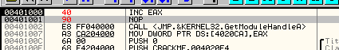

На моей машине EAX изначально равен нулю. Если у вас это не так, вы можете изменить это вручную.

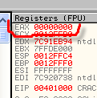

Затем нажимаем F7 и выполняем инструкцию INC EAX, увеличивая его на один.

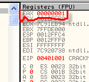

Таким же образом можем ввести DEC сразу под предыдущей инструкцией.

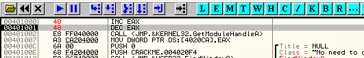

Нажимаем F7 и выполняем инструкцию DEC EAX, которая уменьшает значение регистра на 1, после чего он принимает предыдущее значение - 0.

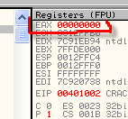

Также можно увеличивать или уменьшать значение ячейки памяти.

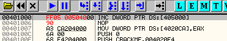

Хотя сейчас ничего не выйдет, так как у секции нет разрешения на запись, поэтому совершить данную операцию нельзя, в связи с чем генерируется исключение.

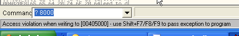

Что было бы, если бы у секции было выставлено разрешение на запись? Идём в DUMP по адресу 405000.

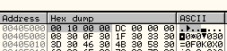

Содержимое, если его прочитать наоборот, будет равно 00001000, значит, если бы оно было увеличено, то было бы 00001001

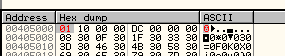

В данном случае для DWORD прибавление 1 производилось к 4 байтам содержимого.

Для WORD суммирование будет применено только к двум последним байтам.

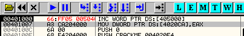

И при BYTE суммирование будет применено только к последнему байту.

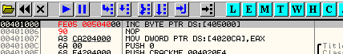

### ADD

ADD, как можно видеть, суммирует оба операнда, сохраняя результат в первом.

ADD EAX, 1 похоже на INC EAX.

Также можем складывать регистры.

Идём в Олли.

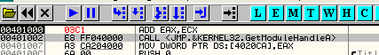

До выполнения инструкции:

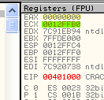

На моей машине EAX содержит 00000000, а ECX - 12FFB0. У вас данные регистры могут содержать другие значения, также вы можете, если хотите, их изменить, но когда вы нажмёте F7, оба значения будут сложены, а результат помещён в EAX. Смотрим:

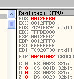

Здесь EAX стал красного цвета, потому что он был модифицирован и содержит результат суммирования.

Также можем сложить регистр с содержимым ячейки памяти.

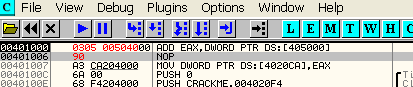

В данном случае нет проблем с правами на запись, так как меняется и сохраняет результат регистр EAX, а содержимое \[405000\] остаётся неизменным. Соответственно, не генерится и никакого исключения.

До нажатия F7 видим, что EAX содержит 0, а по адресу 405000 находится значение 00001000.

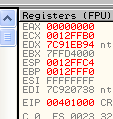

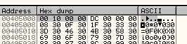

Нажимаем F7, после чего вычисляется сумма.

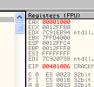

Так как EAX = 0, то в EAX сохраняется результат, равный 1000.

Если хотим, чтобы результат сохранился в памяти, то пишем:

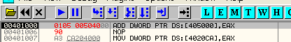

В этом случае результат сохранится в 405000, и так как это модифицирует память, то в нашем случае при нажатии на F7 будет сгенерировано исключение об отсутствии прав на запись.

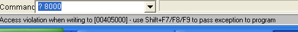

### ADC (ADD С ПЕРЕНОСОМ)

В данном случае вычисляется сумма обоих операндов и флага переноса, а конечный результат сохраняется в первом из операндов.

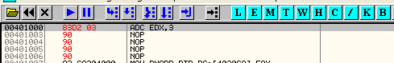

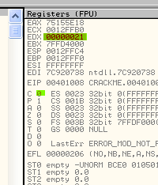

Здесь видим, что здесь будет суммирован EDX, содержащий 21, с числом 3, а также вычислен флаг C, который сейчас равен нулю. Нажимаем F7.

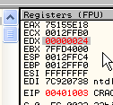

Видим, что результат равен 24. Теперь повторим эту операцию, но с флагом C равным 1, значение которого мы можем изменить, если дважды кликнем по нему мышью.

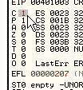

Сделав это, повторяем выполнение инструкции, изменив значение флага C.

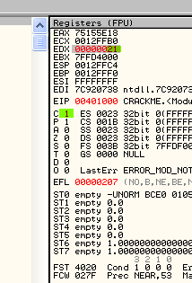

Нажимем F7 и вуаля - результат равен 25.

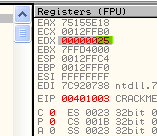

Так как сумма EDX (21) с 3 и флагом C, равном 1, равна 25.

### SUB

Это операция является обратной по отношению к ADD - она вычисляет остаток от вычитания второго операнда от первого и сохраняет в последнем полученный результат.

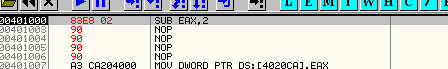

На моей машине регистры до выполнения инструкции содержали следующее:

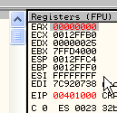

По нажатию F7 инструкция вычтет от EAX, который содержит ноль, значение 2.

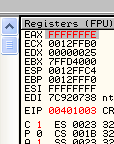

Результатом является -2, что в шестнадцатеричной системе выглядит как FFFFFFFE, в чём мы можем убедиться, если кликнем два раза мышью на данном значении:

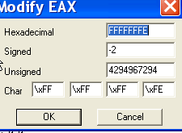

Видим, что в десятеричной системе это равно -2.

Также можно отнимать значение регистров и ячеек памяти примерно таким же образом, как и при использовании инструкции ADD.

`SUB EAX, ECX`

То есть EAX-ECX с сохранением результата в EAX.

И

`SUB EAX,DWORD PTR DS:[405000]`

Вычитает от EAX содержимое ячейки памяти по адресу 405000, сохраняя результат в EAX.

Обратный случай:

`SUB DWORD PTR DS:[405000],EAX`

Так как результата сохраняется .в первый операнд, то, поскольку у нас нет прав на запись в секцию, то получим исключение.

### SBB

Это операция является обратной к ADC: она вычисляет разность между операндами, отнимает от того, что получилось, значение флага переноса (флаг C) и сохраняется окончательный результат в первый операнд.

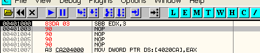

До выполнения в EDX находилось 21, а флаг переноса был равен 0.

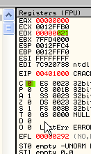

Нажатие на F7 вычтет из EDX число 3, а затем ноль, которому равен флаг C.

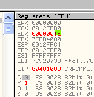

Теперь повторим операцию, присвоив флагу C значение 1.

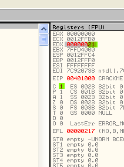

Нажимает на F7 и теперь из EDX вычитается 3, а затем единица, которой равен флаг C.

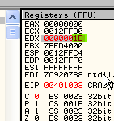

В данном случае результат равен 1D.

### MUL

Ок, есть две инструкции для выполнения умножения. Первой из них является MUL, которая не учитывает знаки чисел. Она использует только один операнд, а другим всегда является EAX Результат сохраняется в EDX:EAX.

Например:

`MUL ECX`

Здесь ECX умножается на EAX без учёта знаков их значений, а результат сохраняется в EDX:EAX.

Рассмотрим следующий пример с помощью OllyDbg:

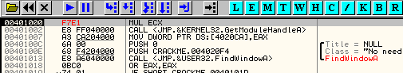

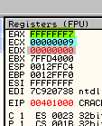

Поместим в EAX число FFFFFFF7, в ECX - 9, а затем посчитаем результат с помощью стандартного калькулятора Windows:

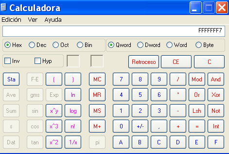

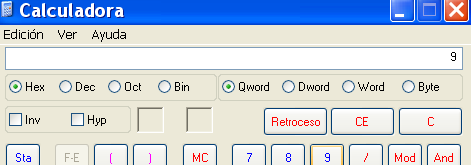

Получится:

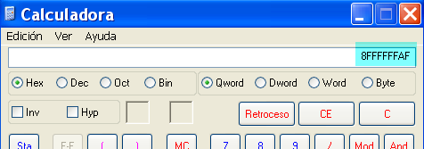

Это не поместится в EAX. Посмотрим, что будет в Олли и нажмём на F7.

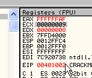

EDX и EAX выделены красным, так как их значение было изменено, и, как видим, в EAX было сохранено то, что поместилось, а остальное в EDX. В данном случае 8-рка, которую не смог вместить EAX, попала в EDX, поэтому в таких случая говорят, что результат содержится в EDX:EAX, то есть два регистра используются как один двойного размера.

В случае с

`MUL DWORD PTR DS:[405000]`

Происходит умножение ячейки памяти по адресу 405000 на EAX, а результат, как обычно, помещается в EDX:EAX без учёта знаков операндов.

Чтобы посмотреть в Олли как выглядит какое-либо шестнадцатеричное значение без учёта знака, кликните два раза мышью на любом регистре.

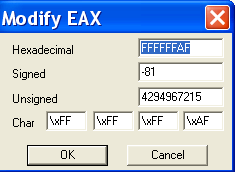

Как можно видеть, во втором ряду находится значение со знаком (в данном случае FFFFFFAF это -81, если учитывать знак), но в таких операциях как MUL все числа считаются БЕЗЗНАКОВЫМИ. Третья строка как раз и содержит десятеричное значение без знака. Сейчас видим, что число FFFFFFAF - это 4294967215, если рассматривать его как положительное, то есть беззнаковое.

### IMUL

Инструкция IMUL - это умножение со знаком и употребляется аналогично MUL.

IMUL ECX

Данная операция производит умножение ECX на EAX, а результат сохраняется в EDX:EAX с учётом знака операндов.

Несмотря на сходство с предыдущей инструкцией, IMUL позволяет использовать больше одного операнда, что невозможно в случае с MUL.

Из туториала CAOS'а:

> Несмотря на использование регистров EAX и EDX по умолчанию, можно указать другие источники и приёмники данных вплоть до трёх операндов. Первый - место, куда необходимо поместить результат и которое всегда должно быть регистром, второй и третий - два значения, которые нужно перемножить. В этих примерах увидим применение этой инструкции с двумя или тремя операндами.
>
>`F7EB	IMUL EBX EAX x EBX -> EDX:EAX`

Это первый пример, который похож на MUL, не считая того, что здесь учитываются знаки.

`696E74020080FF		IMUL EBP, DWORD PTR [ESI+74],FF800002	[ESI+74] x FF800002 -> EBP`

Это второй пример, в котором три операнда: содержимое ESI+74 умножается на FF800002, а результат сохраняется в EBP. Мы можем посмотреть его в действии с помощью Олли.

Скопируем строку `IMUL EBP, DWORD PTR [ESI+74], FF800002` **в Олли**.

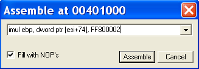

Видим, что нажатие кнопки "ASSEMBLE" выдаёт ошибку. Это происходит из-за того, что в Олли к числам, которые начинаются с букв, нужно слева приписывать ноль. Исправляем:

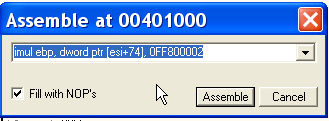

Теперь нажатие на ASSEMBLE проходит без ошибок.

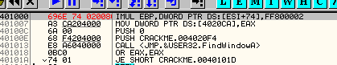

Изменяем значение ESI на 401000, чтобы быть уверенными, что адрес ESI + 74, из которого будет происходить чтение, существует.

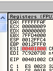

Видим в пояснениях:

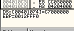

Здесь говорится, что ESI + 74 - это адрес 401074, содержимым которого является C7000000. Идём в DUMP с помощью "GOTO EXPRESSION 401074".

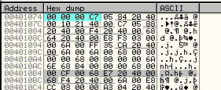

Это значение, которое, если прочитать его наоборот, равно C7000000, будет умножено на FF800002, а результат данной операции будет сохранён в EBP.

`IMUL EBP, DWORD PTR [ESI+74], FF800002`

Нажав F7, видим, что EBP стал красным, так как сейчас он содержит результат.

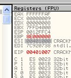

Калькулятор даёт нам следующий результат операции C7000000 \* FF800002:

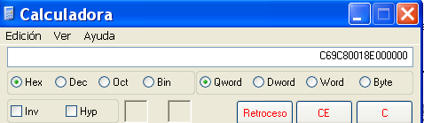

Но поскольку EBP не может вместить его полностью, то в нём остаётся только то, что поместилось, а остальное отбрасывается.

В третьем примере только два операнда, оба из которых перемножаются, а результат сохраняется в первый из них.

`0FAF55E8	           IMUL EDX, DWORD PTR [EBP-18]		EDX x [EBP-18] -> EDX`

Как видим, основной способ для умножения больших чисел - использовать IMUL только с одним операндом, так как в этом случае результат сохраняется в EDX:EAX, то есть он может быть двойного размера, чего нельзя добиться при использовании двух или трёх операндах, соответственно, данную возможность следует применять для маленьких чисел.

### DIV (Unsigned Divide) / IDIV (Signed Divide)

Это инструкции, обратные по отношении к MUL и IMUL соответственно.

DIV имеет только один операнд, не учитывает знаки и сохраняет результат в EDX:EAX.

IDIV всегда учитывает знаки. Если используется один операнд, то, как и DIV, сохраняет результат в EDX:EAX, в случае двух - делит один на другой и сохраняет результат в первый, а при трёх операндах делит второй на третий и сохраняет то, что получилось, в первый.

Не думаю, что нужно приводить здесь примеры, похожие на те, что были в разделе, посвящённом MUL и IMUL.

### XADD (Обменять и сложить)

Как можно догадаться, это смесь XCHG и ADD, то есть если :

`XADD EAX,ECX`

Видим, что ECX равен 1, а EAX - 9. По нажатию на F7 они обменяются значениям, т.е. в EAX попадёт 1, а в ECX - 9, после чего произойдёт сложение.

Видно, что результат затем был сохранён в первый операнд. Регистр ECX содержит число 9, которое находилось до выполнения операции в EAX.

### NEG

Назначением данной инструкции является менять знак заданного числа на противоположный, т.е. если у нас есть число 32 в шестнадцатеричной системе, и мы применяем к ней NEG, то результатом будет его отрицательный аналог.

Пример:

Пишем в Олли NEG EAX и заносим в EAX число 32.

После нажатия на F7 в EAX окажется отрицательный вариант числа 32. Смотрим:

Во втором ряду видим, что результатом является -50 в десятеричной системе (это соответствует -32 в шестнадцатеричной).

Если напечатаем в CommandBar'е число -32 в шестнадцатеричной системе, чтобы выяснить, чему оно равно в десятеричной, то получим ответ, что это значение эквивалентно -50, а также пояснение, что это FFFFFFCE.

Так что видим, что NEG меняет знак операнда на обратный.

## ЛОГИЧЕСКИЕ ИНСТРУКЦИИ

Далее следуют логические инструкции, принимающие по два операнда, производящие над ними побитовые операции и сохраняющие результат в первый операнд.

### AND

Результатом этой операции над двумя битам является 1, если они оба равны 1, и 0 во всех остальных случаях.

*   1 and 1 = 1
*   1 and 0 = 0
*   0 and 1 = 0
*   0 and 0 = 0

Посмотрим пример в OllyDbg:

`AND ECX,EAX`

Делаем ECX=00001200, а EAX=3500.

Чтобы сделать эту операцию вручную, нужно перевести оба числа в двоичный вид:

*   1200 в двоичном виде будет равно 01001000000000
*   3500 в двоичном виде будет равно 11010100000000

Применим вышеприведённую таблицу операции AND побитно, например, к последней цифре:

Из двух нулей получится ноль. Повторим эту процедуру над всеми битами и получим 01000000000000, поскольку ситуация, когда оба биты равны 1 у нас встречается только один раз, а посему и в результате единица встретится тоже только один раз.

Если нажмём F7 в Олли, то увидим, что в ECX находится результат 1000, что эквивалентно 01000000000000 в двоичном виде.

### OR

В этой инструкции используется примерно тот же метод, что и в предыдущем, за исключением того, что используется другая таблица.

Получается 1, если один или оба бита равны 1, и 0 во всех остальных случаях.

*   1 or 1 = 1
*   1 or 0 = 1
*   0 or 1 = 1
*   0 or 0 = 0

### XOR

Здесь то же самое, только используем таблицу функции XOR.

Получается 1, если один и только один из двух битов равен 1, и 0 во всех остальных случаях.

*   1 xor 1 = 0
*   1 xor 0 = 1
*   0 xor 1 = 1
*   0 xor 0 = 0

### NOT

Просто инвертирует значение:

*   not 1 = 0
*   not 0 = 1

Пример: not 0110 = 1001

Если у нас, например, EAX=1200, что в двоичном виде равно 1001000000000, то все нули превратятся в 1, а все 1 в 0.

`00000000000000000001001000000000`

После применения NOT получим

`11111111111111111110110111111111`

что в калькуляторе Windows в шестнадцатеричном виде отобразится как FFFFEDFF.

В Олли до нажатия на F7 сделаем EAX равным 1200.

Нажимаем F7.

Видим, что результат тот же самый.

Ок, здесь мы закончим пятую часть "Введения...". Пока подумайте над тем, что узнали в этой главе, а нам ещё предстоит рассмотреть инструкции сравнения, выходов, call и ret.

Шаг за шагом дорога приведёт нас к цели.

\[C\] Рикардо Нарваха, пер. Aquila
