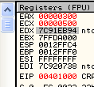
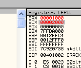

# Глава 6 - Инструкции сравнения и условных переходов

## Инструкции сравнения

Как правило, у инструкции сравнения есть два операнда, а результатом этого сравнения является решение, должна или нет программа совершать переход, указанный далее в коде.

Мы узнаем, что когда программа просит у нас серийный номер для регистрации, то в этот момент она должна решить, правилен он или нет, а для этого ей нужно провести одно или более сравнений и совершить соответствующие результаты перехода.

Далее мы рассмотрим подробно, как работают сравнение и переход.

Также мы узнаем, что, согласно изученному нами в предыдущих версиях данного "Введения...", когда в зависимости от результата выполнения инструкции меняются те или иные флаги, наиболее частым случаем является ноль в флаге Z. Также мы рассмотрим другие изменения во флагах, связанных с выполнением тех или иных инструкций.

### CMP

Это наиболее известная инструкция сравнения. Она принимает два операнда и, на самом деле, работает также как и SUB, только не сохраняет результат в первый операнд. В обоих из них остаётся то же значение, что и прежде, а изменяются только флаги согласно результату.

Рассмотрим пример:

`CMP EAX, ECX`

Пусть EAX и ECX равны, они будут вычтены друг из друга, значение их не изменится, но результатом операции станет то, что активируется флаг Z. Рассмотрим пример в OllyDbg.


Вводим инструкцию и модифицируем EAX и ECX так, чтобы они были равны.


Нажимаем F7 и видим, что значения EAX и ECX не изменились, но зато стал активным флаг Z, так как результатом вычитания одного операнда от другого был ноль, хотя мы и не можем увидеть его напрямую или сохранить куда-либо.


В реальности нам не важен точный результат вычитания, а только равен ли EAX ECX’у или нет (что чаще).

Хотя мы ещё и не дошли до самих условных переходов, есть две возможности: согласно значению флагов решить, делать переход или не делать. Самый понятный пример, который работает в сочетании с предыдущим – это инструкция JZ, которая совершает переход, если флаг Z активен, т.е. равен ЕДИНИЦЕ, и не совершает, если он не активен, т.е. равен НУЛЮ.

Таким же образом программа может вынести решение относительно двух серийных номеров, один из которых интересует вас на предмет регистрации программы и содержится, скажем, в EAX, а второй находится в EAX и является правильным серийным номером. Программа может определить с помощью CMP, являются ли они равными, и если да (флаг Z будет активным), совершить переход с помощью JZ в ту область, где происходит регистрация. А если введённый вами серийный номер, находящийся в EAX, и правильный в ECX окажутся не равны, то флаг Z будет содержать НОЛЬ, и, соответственно, никакого перехода не произойдёт.

Давайте рассмотрим более конкретные примеры условных переходов.

Точно так же флаг S или флаг знака предоставляет возможность сравнения, является ли первый операнд больше второго или наоборот.

Рассмотрим пример.

Повторим "CMP EAX, ECX", но в этот раз сделаем EAX больше ECX.


Если нажмём F7:


Видим, что флаг Z равен нулю, потому что, как мы уже знаем, значения не равны, а исходя из того, что флаг S тоже равен нулю, можно определить, что остаток от EAX-ECX является положительным, то есть EAX больше ECX.

Таким же образом повторим предыдущую операцию, но EAX меньшим чем ECX.


И нажимаем F7.


Здесь видим, что остаток от вычитания ECX от EAX отрицателен, то есть значение в ECX больше, что активизирует флаг S.

Различные результаты сравнения активизируют соответствующие флаги, и, соответственно им, программа может переходить или не переходить при активации одного или больше из этих флагов.


Здесь сравниваем EAX с содержимым 405000, и, как обычно, окошко с пояснениями нам даёт значение каждого из операндов. В моём случае они следующие:


EAX в данном примере меньше чем содержимое ячейки памяти по адресу 405000, которое равно 1000, что приведёт к отрицательному остатку и активирует флаг S.


Существуют похожие формы

`CMP AX,WORD PTR DS:[405000]`

и

`CMP AL,BYTE PTR DS:[405000]`

В этих случая сравниваются 2 или 1 байт содержимого памяти соответственно.

### TEST (Логическое сравнение)

Эта инструкция работает похожим, до некоторой степени, образом, что и CMP – производится определённая операция над двумя значениями, и результат её не сохраняется, однако могут измениться состояния определённых флагов (в данном случае SF, ZF и PF), в следствии чего программа может определить, следует или нет совершать переход. Отличие от предыдущей инструкции заключается в том, что пресловутой операцией является AND.

Это нам рассказал наш друг CAOS в своё туториале по ассемблеру. Рассмотрим несколько примеров, чтобы уяснить данное определение:

`TEST EAX, EAX`

Вы спрашиваете зачем сравнивать с самим собой EAX или любой другой регистр? Для того, чтобы определить равен ли EAX нулю. Как это работает?

Пишем в Олли:

`TEST EAX, EAX`


Таблица результатов для операции AND следующая:

Результат равен 1, если оба операнда равны 1, и 0 во всех остальных случаях.

```
1 and 1 = 1
1 and 0 = 0
0 and 1 = 0
0 and 0 = 0
```

Видим, что единственный случай, когда результат равен нулю, это если оба операнда равны нулю (нас не интересуют случаи, когда у операндов разные значения, так как мы сравниваем EAX с самим собой, поэтому они всегда будут равны), соответственно, если у EAX в двоичной форме какой-нибудь из битов равен 1, то результатом операции никак не может быть ноль.

Сделаем EAX равным НУЛЮ:


В OllyDbg это делается очень легко правым кликом мыши на нужном регистре и вводом НУЛЯ.


Теперь нажимаем F7.


Видим, что активен флаг Z, то есть знаем, что результатом операции AND был НОЛЬ, в виду чего он и активировался.

Если повторим эту операцию на EAX со значением, отличающимся от нуля:


Нажимаем F7.


И флаг Z не является активным, так как результат отличается от нуля.

Если используем калькулятор, то можем вычислить, что результатом 390 AND 390 будет 390.

В двоичной форме 390 – это 1110010000.


Так как операция AND, если оба операнда равны НУЛЮ в качестве результата также выдаст НОЛЬ, а если они оба равны ЕДИНИЦЕ, то результатом будет НОЛЬ, то видим, что в случае с 390 результат будет 390 и флаг Z не станет активным.

Это была большая часть инструкций сравнения, а теперь настал момент перейти к переходам.

## Инструкции переходов

Все инструкции переходов принимают один операнд, задающий адрес, на который должна перейти программа. Различие между ними мы увидим в следующем списке.

*   JMP – переход
*   JE, JZ – переход, если равно нулю
*   JNE, JNZ – переход, если не равно нулю
*   JS – переход, если знак отрицателен
*   JNS – переход, если знак не отрицателен
*   JP, JPE – переход, если чётно
*   JNP, JNPE – переход, если нечётно
*   JO – переход, если произошло переполнение
*   JNO – переход, если переполнения не произошло
*   JB, JNAE – переход, если ниже
*   JNB, JAE – переход, если выше или равно
*   JBE, JNA – переход, если ниже или равно
*   JNBE, JA – переход, если выше
*   JL, JNGE – переход, если меньше
*   JNL, JGE – переход, если больше или равно
*   JLE, JNG – переход, если меньше или равно
*   JNLE, JG – переход, если больше

### JMP

Это безусловный переход, то есть никакого решения не делается, и всегда происходит переход по заданном адресу. Например, напишем в Олли:


При выполнении этой инструкции программа перейдёт в 401031 и продолжит выполнение уже оттуда.

В Олли есть пара опций, которые позволяют сделать переходы более наглядными.

Если зайдём в OPTIONS-DEBUGGING OPTIONS:


А там во вкладку CPU:


Ставим следующие три галочки:


Видим, что предоставляемая информация стала гораздо нагляднее.


Видим, что теперь OllyDbg показывает нам красной линией откуда и куда совершается переход, в данном случае в 401031.

Если запустим с помощью F7:


Совершается переход и EIP становится равным 401031.


Он равен этому значению, так как EIP содержит адрес инструкции, которая должна быть выполнена.

### JE или JZ

И то и другое являются одним и тем же условным переходом, который можно записать двумя разными образами. JZ "прыгает" тогда, когда активен флаг Z.


Напишем в OllyDbg две инструкции, которые делают сравнение и совершают переход, если сравнение оказалось удачным.

Делаем EAX и ECX одинаковыми.


При выполнении сравнения будет произведено вычитание одного параметра из другого, и так как они оба равны, то результат будет равен нулю, а флаг Z станет активным.


Следующая инструкция – это условный переход:


OllyDbg сообщает нам принятое программой решение и, поскольку флаг Z активен, показывает красной линией, куда будет совершён переход. Если бы она была серого цвета, то это означало бы, что принято решение не совершать переход. Нажимаем F7.


Видим, что был совершён переход и EIP сейчас равен 401031.

Повторим пример с EAX, отличным от ECX.


При нажатии на F7, поскольку результат первой инструкции отличен от нуля, флаг Z остаётся неактивным.


И идём в Олли:


Поскольку перехода не произойдёт, то линия перехода отображается серым цветом. Ещё раз нажимаем F7.


Видим, что действительно перехода не произошло, и выполнение программы продолжается в 401004. Примерно таким образом совершаются сравнения во всех программах.

Если повторим предыдущий пример до шага с переходом, но не будем его совершать:


Мы знаем, что флаг Z равен нулю и перехода не будет. Теперь что случится, если кликнем два раза на флаге Z и изменим его значение на 1?


Видим, что линия стала красного цвета, а переход будет совершён, независимо от результата сравнения. Хотя программа уже приняла решение о переходе, его можно изменить, напрямую манипулируя значением флага.

Рассмотрим коротко другие флаги на наглядных примерах.

### JNE или JNZ

Эта инструкция противоположна предыдущей: переход совершается, если флаг Z неактивен, то есть если результат операции отличен от нуля.


Здесь пишем сравнение и JNZ.

Если EAX и ECX равны, то флаг Z будет активным.


И в отличии от инструкции JZ, совершавшей переход, когда флаг Z был активен, эта, напротив, переходит тогда, когда флаг Z равен нулю, то есть неактивен.

Как можно понять, если EAX отличен от ECX, то результат операции также будет отличен от нуля, что сделает флаг Z неактивным и, в свою очередь, приведёт к переходу.

### JS

Как видно из таблицы выше, этот переход выполняется, если результат сравнения отрицателен, то есть если в предыдущем примере EAX меньше чем ECX.




Нажимаем F7:


Флаг S равен 1, поэтому происходит переход.


Видим, что красная линия указывает нам, куда произойдёт переход. В случае, если EAX больше ECX, флаг S будет неактивным и переход JS не сработает.

### JNS

Этот переход противоположен предыдущему. Переход совершается, когда флаг S равен нулю, то есть, если рассматривать предыдущий пример, когда EAX больше ECX.

### JP или JPE

Условный переход JP срабатывает, когда активен флаг P, а это происходит, когда результат сравнения является чётным (понимая её так, как это мы рассматривали раньше).


Имеем 20 в EAX и 18 в ECX. Нажимаем F7:


Разность между EAX и ECX равна 8, что в двоичной системе отображается как 10. В этом числе всего лишь одна единица, то есть нечётное их количество, поэтому флаг P неактивен и перехода JPE не происходит.


Теперь заменим значение в ECX на 17 и снова нажмём F7:


Видим, что результат равен 3, что в двоичной системе выглядит как 11 – в этом числе чётное количество единиц, флаг P активен, поэтому переход JPE срабатывает.


### JNP или JNPE

Этот переход противоположен предыдущему и срабатывает, когда флаг P равен нулю, то есть количество единиц в числе нечётно. В рассмотренном только что примере переход произошёл бы, когда результат был равен 2, и не сработал бы, когда он равнялся 3, то есть обратно действию JP.

### JO

Срабатывает, когда происходит переполнение, в виду чего активируется флаг O.


Здесь меняем инструкцию сравнения, так как нам необходимо активировать флаг O, для чего нужно, чтобы произошло переполнение, а этого можно добиться с помощью операции суммирования.


Нажимаем F7:


И срабатывает переход JO, так как из-за произошедшего переполнения активировался флаг O.

### JNO

Противоположен предыдущему переходу и срабатывает, когда флаг O равен нулю, то есть переполнения не произошло.

### JB

Переход происходит, если первый операнд ниже чем второй. Смотрим пример.




Видим, что EAX ниже чем ECX, то есть должен сработать переход. Нажимаем F7:


Флаг C активен, так как разность между этими двумя операндами является отрицательным числом, то есть установлен самый значимый бит, на основании чего и делается вывод, что EAX меньше ECX.

### JNB

Противоположен предыдущему – срабатывает, если флаг C равен нулю, то есть результат сравнения был положителен. В предыдущем примере это произошло бы, если EAX был бы больше ECX.

### JBE

Это переход если ниже или равно, то есть проверяются два флага – активен ли флаг C, и тогда переход срабатывает, а также активен ли флаг Z, и тогда он тоже срабатывает, то есть если EAX равен ECX или меньше.


Сделаем EAX равными друг другу.


Нажимаем F7.


Видим, что флаг Z активен.


Если EAX меньше ECX:


Нажимаем F7.


В данном случае активируется флаг C, так как результат отрицателен (установлен самый значимый бит), то есть EAX меньше ECX.

В последнем примере EAX больше ECX. Нажимаем F7.


Оба флага Z и C равны нулю, поэтому перехода не происходит.


То есть, JBE срабатывает, если в нашем примере EAX ниже или равен ECX.

### JNBE

Этот переход противоположен предыдущему и срабатывает, если оба флага Z и C равны нулю. В предыдущем примере переход произошёл бы только в последнем случае.

### JL

JL – это переход "если меньше", но в несколько другой форме. Здесь проверяется, отличается ли флаг S от флага O, и в этом случае и совершается переход.

Рассмотрим пример, когда EAX и ECX положительны и EAX больше ECX.


При нажатии на F7 перехода не произойдёт, так как EAX больше ECX и результат положителен, поэтому ни флаг O, ни флаг S не будут активны.


Повторим пример при EAX меньше ECX, но оба по-прежнему положительны:


Нажмём F7:


И так как флаги S и O отличаются друг от друга, то срабатывает переход, то есть он происходит, если первый сравниваемый операнд меньше второго и оба положительны. Рассмотрим другой пример.


В данном случае EAX меньше ECX, так как первый является отрицательным. Смотрим, что произойдёт.

Переход совершается прекрасно, а теперь попробуем эти же два значения с переходом JB.


Нажимаем F7.


Видим, что JB не срабатывает, так как JB сравнивает оба значения как если бы они были положительными, то есть считает их беззнаковыми, поэтому если переход должен учитывать знак, то нужно использовать JL – это и есть основное различие между ними.


*(Данная таблица не была переведена дословно)*

Как видно, эти условные переходы делятся на две категории: те, в которых знаки операндов учитываются, и те, в которых нет.

Видим, что JA, JB, JBE И JAE считают оба операнда положительными, в то время как JG, JL, JLE и JGE рассматривают их как числа со знаком. JE и JNE работают в обоих случаях.

Думаю, что тема условных переходов и сравнений достаточно хорошо раскрыта, в дальнейшем увидим, как они используются в программах.

Следующая часть будет также посвящена ассемблеру, в ней будут рассматриваться вызовы (call) и возвраты (ret), а также режимы адресации. Потерпите ещё чуть-чуть, хе-хе.

\[C\] Рикардо Нарваха, пер. Aquila
