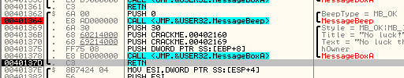

# Глава 7 - Инструкции ассемблера

Я намеренно оставил эти 2 инструкции напоследок. На данном этапе у Вас уже достаточно базовых знаний, чтобы вплотную подойти к изучению CALL и RET.

Несмотря на кажущуюся простоту этих 2х инструкций, многие новички не до конца понимают их суть. Поэтому я их выделил в отдельную главу и хочу ещё раз подчеркнуть, что к данной теме желательно отнестись внимательно - вообще эти инструкции в крэкинге играют очень важную роль. Также желательно при возможности повторить уже пройденный материал.

Итак, давайте снова загрузим крэкми CrueHead'а ***\[[ссылка](files/1/ollydbg01-Crackme.7z)\]*** в OllyDbg.

Правая кнопка мыши на любой строке листинга - "Go to" - Expression".


Во всплывшем диалоге вводим 401245


В окне дизассемблера разворачивается код по только что заданному адресу, где видим CALL, который нам и нужен для практики.


Чтобы выполнить этот CALL, подсвечиваю строчку - правая кнопка мыши - "New origin here". Теперь значение EIP указывает на 401245, а это значит, что следующей инструкцией выполнится наш CALL.


Тут можем проследить как изменяется значение EIP.


Вернёмся же к нашему CALL.


Инструкция CALL передаёт управление заданной процедуре (или просто подпрограмме), адрес которой указан в операнде. Например:

CALL 401362 означает, что управление будет передано на адрес 401362, т.е. процессор пойдёт и выполнит подпрограмму, которая находится по этому адресу, и как только подпрограмма завершится управление вернётся к следующей за CALL инструкции.

В данном случае, после завершения процедуры 401362, управление вернётся на адрес 40124A.

Когда мы имеем дело с инструкцией CALL, OllyDbg предоставляет несколько полезных механизмов трассирования. Если нам интересно продолжить трассировку по внутренностям данной процедуры, можно "нырнуть" в неё клавишей F7. Если же нам хочется просто глянуть на содержимое процедуры, чтобы далее принять решение трассировать её или нет, можно воспользоваться следующей опцией: правая кнопка мыши - "Follow". Наконец, если мы не хотим трассировать данную процедуру, т.к. её содержимое не сулит ничего интересного, можем выполнить её на одном дыхании клавишей F8 и продолжить трассировку по адресу следующей за CALL инструкции.

Итак, чтобы посмотреть содержимое процедуры, не переводя на неё управление, подсвечиваем CALL - правая кнопка мыши - "Follow":


Как видите, значение EIP по-прежнему 401245, т.к. FOLLOW просто подгружает в дизассемблер код по заданному адресу и ждёт дальнейших распоряжений, но ничего при этом не выполняет.


Итак, перед нами код процедуры, которая, естественно, начинается по адресу 401362, в соответствии со значением операнда CALL. Где же конец процедуры? - В данном случае конец приходится на следующую инструкцию RET, которая находится чуть ниже. OllyDbg использует мнемонику RETN вместо RET, что одно и тоже. Эта инструкция завершает процедуру, возвращая управление на адрес 40124A, где находится следующая за CALL инструкция.

Мы теперь знаем как подсмотреть код процедуры не переводя на неё управление. Вернёмся же назад - для этого достаточно нажать на клавишу (-), т.е. "минус". Эта клавиша всегда возвращает нас на один шаг назад в цепочке FOLLOW, ничего при этом не выполняя.

Вот мы снова видим изначальный CALL:


Далее мы погрузимся в процедуру, т.е. переведём на неё управление клавишей F7, но сначала обратите внимание на стек. Это очень важно, т.к. в стеке хранится адрес возврата, который использует инструкция RET, чтобы передать управление обратно.


Предыдущая картинка отображает содержимое стека на моей машине. Возможно, у Вас будут другие значения, но это несущественно.

Нажимаю на F7:


"Погружаемся" в процедуру и видим, что на этот раз, в отличие от предыдущих манипуляций с FOLLOW, значение EIP изменилось - теперь оно равно 401362 и это значит, что мы действительно начали выполнять код процедуры.

Давайте обратим внимание на стек


На предыдущей картинке я выделил жёлтым состояние стека до входа в процедуру. Как видите, в стеке появилась новая ячейка, т.е. при выполнении инструкции CALL в стек добавляется адрес возврата, чтобы RET знала, куда вернуть управление при завершении процедуры.

Значение этой новой ячейки - 40124A - соответствует адресу следующей после CALL инструкции. Если Вы вдруг успели забыть об этом, следующая картинка освежит вашу память:


Причём Olly заботливо добавляет к этой ячейке некоторую дополнительную информацию.


Сообщает нам, что это адрес возврата из 401262 в 40124A.

Т.е. Olly ещё не в курсе, где находится RET, но точно знает, что процедура начинается по адресу 401362 и заканчивается по какому-нибудь адресу, где вероятнее всего находится инструкция RET, которая вернёт управление на адрес 40124A.

Давайте ещё раз нажмём на F7, чтобы выполнить PUSH 0, и посмотрим, как этот ноль добавится в стек, сместив вниз наш адрес возврата.


Процедура может содержать тысячи стековых операций (PUSH, POP и др.), добавляя и удаляя из стека различные значения, но при завершении процедуры в верхушке стека должен снова оказаться адрес возврата. Давайте продолжим выполнять процедуру в пошаговом режиме, нажимая F8, чтобы не трассировать код внутри процедур, пока не доберёмся до инструкции RET.


Вот мы и добрались до завершающей инструкции RET, и в верхушке стека снова находится адрес возврата.


Таким образом, можно заключить, что RET обычно является прямой противоположностью CALL, т.е., если CALL вызывает процедуру, RET возвращает управление обратно. RET также удаляет за ненадобностью из стека адрес возврата.

Жмём F7.


и возвращаемся к адресу 40124A. При этом состояние стека становится таким, каким оно было до вызова процедуры.


Стоит добавить, что RET можно использовать не только для завершения текущего CALL, например:

```assembly
PUSH 401256
RET
```

Сначала PUSH затолкнёт в стек значение 401256. Далее, следующий за ним RET воспримет это значение как адрес возврата из текущего CALL, хотя это вовсе не так, и передаст управление на адрес 401256. Таким образом, этот код отработает точно также как JMP 401256.

Далее мы рассмотрим ещё один пример использования CALL/RET. Перезагружаем крэкми CrueHead'а. "Go to" - "Expression" - вводим 401364.


По этому адресу нажимаем F2, устанавливая таким образом точку останова (об этом мы подробно поговорим позже). Olly прервёт исполнение как только начнёт выполняться инструкция по адресу, на который установлена точка останова.


Адрес выделяется красным цветом и это значит, что точка останова (BREAKPOINT) установлена. Нажимаем на F9 (RUN), чтобы приложение запустилось...


Появилось окно крэкми. Если Вы его не видите, поищите хорошенько через Alt+Tab :)

Приложение ещё не выполнило код, на который мы поставили точку останова. В окне крэкми вызовите меню и выберите опцию "Help" - "Register".


Появилось окно, через которое нужно ввести имя и серийник.


Пишем что угодно.


Нажимаем OK.


Выскакивает сообщение о том, что нам не повезло, т.е. крэкми не понравились наши имя и серийник (было бы просто удивительно, если бы мы сразу угадали правильные регистрационные данные :-) Если закрыть это сообщение, активизируется наконец наша точка останова.


Мы находимся прямо посреди выполнения кода программы, но кое-какую базовую информацию можем почерпнуть например из стека:


Видим сразу несколько RETURN TO... Видимо, мы находимся внутри процедуры и самый верхний RETURN TO содержит адрес возврата, на который передаст управление ближайший RET. Этот адрес, вероятно, окажется на верхушке стека, перед выполнением RET и управление будет передано на адрес 40124A.

Если присмотреться, можно заметить также, что перед нами уже знакомый код. Но на этот раз он вызван не нами, а в ходе нормального выполнения программы.

Жмём на F8, чтобы добраться до RET, как и раньше. Только в этот раз при выполнении последнего CALL сразу перед RET должно появиться сообщение, которое нужно закрыть, чтобы продолжить трассирование.


Закрываем его.



Вот мы и добрались до инструкции RET и верхушка стека теперь содержит адрес возврата, как мы и предполагали.


В прошлый раз мы выполнили процедуру самостоятельно, принудительно изменив значение EIP. В этот раз мы попали в код процедуры в следствии нормального выполнения программы. Достаточно снова нажать на F9, чтобы программа продолжила выполняться как ни в чём не бывало.


В общем, я хотел показать, что при срабатывании точек останова в процессе свободного выполнения программы можно почерпнуть из стека немало полезной информации. В частности, беглого взгляда по содержимому стека обычно хватает, чтобы узнать откуда была вызвана текущая процедура и куда она вернёт управление после завершения. Если же в стеке видно несколько ячеек с комментарием RETURN TO, то, очевидно, текущая процедура была вызвана из другой процедуры, которая в свою очередь тоже была откуда-то вызвана - это называется вложенностью процедур.

Рассмотрим ещё один закрепляющий пример. Для этого нужно перезагрузить крэкми в отладчике, сразу нажать на клавишу пробела и ввести следующую инструкцию: CALL 401245.


Готово. Далее воспользуемся опцией FOLLOW, чтобы попасть во внутрь функции.


Процедура начинается по адресу 401245 и заканчивается по адресу 401288 (где находится инструкция RETN 10, которая немного отличается от знакомого нам уже RET, но об этом позже). Обратите внимание на вложенный CALL (первая инструкция процедуры является вызовом другой процедуры).

Нажмите МИНУС, чтобы выйти из FOLLOW. Теперь нажмите F7, чтобы войти в процедуру, фактически передав на неё управление.


Вот мы и внутри, о чём свидетельствует значение EIP: оно указывает на адрес 401245.


В верхушке стека хранится адрес возврата к следующей за нашим свежевписанным CALL инструкции.


Адрес возврата имеется, но OllyDbg не выделил его как RETURN TO 401005. Чтобы понять почему он в этот раз не проявил сообразительность, нужно принять во внимание, что мы вписали CALL **после** того, как OllyDbg выполнил предварительный анализ кода. Представьте себе, что OllyDbg - это Чапаев, пересекающий реку верхом :-) Прямо посреди реки мы модифицируем его скакуна, чем, мягко говоря, дезориентируем Василия Ивановича. Точно также в растерянность впадает и OllyDbg. *(В общем, OllyDbg в воде не тонет, но пословица тут не при чём - прим. переводчика ;-) )*

Чтоб исправить ситуацию, достаточно нажать на правую кнопку мыши в любом месте окна дизассемблера - "Analysis" - "Analyse code". Таким образом, отладчик снова пробежится по коду анализатором и скорректирует подсказки в стековом кадре.


Теперь адрес возврата в верхушке стека корректно распознан анализатором:


Адрес возврата в данном случае обозначен относительно стартовой точки программы: MODULE ENTRY POINT + 5 = 401000 + 5 = 4010005.

В общем, не забывайте запускать анализатор после внесения изменений в код программы (это касается также изменений кода самой программой). Иногда анализ кода может оказаться ошибочным и его следует сбросить опцией "Analysis" - "Remove analysis from module".

Давайте вернёмся к нашему примеру.


Жмём F7 и "погружаемся" в следующий CALL.


Над предыдущим адресом возврата теперь появился ещё один. В общем случае, между адресами возврата вложенных процедур могут находиться произвольные значения, попавшие в стек в результате промежуточных инструкций PUSH и других операций.

Если Вы попадёте в подобную ситуацию, например, в результате срабатывания точки останова, не имея представления о ходе выполнения программы до останова, взглянув на стек можете сориентироваться:

Ниже в окне дизассемблера виден RET, что наталкивает на мысль о том, что мы находимся внутри процедуры.


Смотрим в стек, чтобы удостовериться:


Сверху вниз первый RETURN TO указывает на возможный адрес возврата из текущей процедуры. В данном конкретном случае - это адрес 40124A.


К тому же, ниже есть ещё один RETURN TO, а это может значить, что текущая процедура была вызвана из другой процедуры.


Второй RETURN TO говорит нам, что в конечном итоге программа должна вернуться к адресу 401005 и непосредственно над этим адресом находится CALL, который инициировал всю эту цепочку вызовов. Кстати, вот он:


Привыкайте реконструировать таким образом цепочки вызовов, т.к. в подобной ситуации вместо 2х вложенных процедур может оказаться, например, 30 и трассировать их индивидуально ни у кого не хватит терпения.

Если что-то непонятно - спрашивайте. До следующей главы!

\[C\] Рикардо Нарваха, пер. Quantum
