Глава 8 - Инструкции циклов, строковые инструкции и способы адресации
=====================================================================

В этой главе мы рассмотрим ещё несколько базовых инструкций, которые остались без внимания в предыдущих главах. Как только мы их изучим, сможем, наконец, перейти непосредственно к крэкингу!

**Циклы**

Для реализации циклов можно использовать инструкции, рассмотренные ранее. Например, можно назначить счётчиком какой-либо регистр общего назначения (обычно для этой цели используется ECX), проинициализировать его числом, равным количеству повторов, при каждом прохождении тела цикла уменьшать счётчик на 1, в конце цикла проверять счётчик на равенство нулю и выполнять условный переход в случае неравенства. Вот как это может выглядеть в коде:

**MOV ECX,15h**

Инициализируем счётчик повторов значением 15h. Далее следует сам цикл:

**метка\_начала\_цикла:
DEC ECX**

Счётчик уменьшается на 1 при каждом повторе.

Далее следуют произвольные инструкции, которые мы пытаемся зациклить - это тело цикла.

В конце нужно добавить проверку на равенство нулю или любому другому условию завершения цикла:

**CMP ECX,0
JNE метка\_начала\_цикла**

При первой проверке на равенство нулю, в счётчике будет значение 14h, ведь мы уже успели 1 раз выполнить DEC ECX. Т.к. 14h не равно 0, цикл повторится снова и снова, пока значение счётчика не достигнет значения 0.

Давайте перепишем наш цикл в более компактной форме с целью оптимизации по размеру:

**XOR ECX,ECX
ADD ECX,15h
метка\_начала\_цикла:
DEC ECX
; тело цикла
TEST ECX,ECX
JNE метка\_начала\_цикла**

Можно придумать ещё более компактные версии циклов, но пока ограничимся последней. Давайте впишем этот код в OllyDbg:

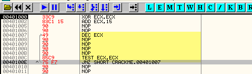

Жёлтым выделен код цикла, который будет повторяться пока значение ECX не достигнет нуля. Тело цикла содержит несколько инструкций NOP.

Давайте потрассируем код цикла, чтобы воочию убедиться в его функциональности. Нажимаем на F7 - видим как обнуляется счётчик ECX.

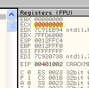

Ещё раз F7 - прибавляем к счётчику 15h, чем и задаём желаемое количество повторов.

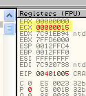

Далее нажимаем на F7 пока не выполнится инструкция DEC ECX, которая сократит значение нашего счётчика до 14h.

Продолжаем трассировать до инструкции TEST ECX, ECX. Что делает эта инструкция в данном случае? - Правильно, проверяет значение счётчика на предмет равенства нулю.

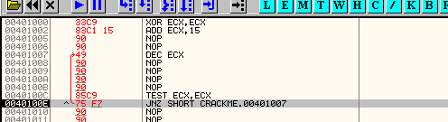

Т.к. счётчик ещё не равен нулю, флаг Z не устанавливается и, следовательно, выполняется условный переход JNZ - он передаёт управление на адрес 401007. Далее счётчик снова уменьшается - на этот раз до 13h. Продолжаем трассировать пока он не достигнет значения 0.

При нулевом значении счётчика, сравнение на ноль устанавливает флаг Z. Поэтому JNZ более не выполняется.

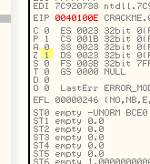

Помните, раньше мы использовали инструкцию JZ, которая осуществляла переход при установленном флаге Z? JNZ работает с точностью до наоборот - переход осуществляется при сброшенном флаге Z.

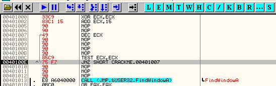

Видите серую стрелочку? - это значит, что переход не будет осуществлён. Повторное нажатие на F7 выводит нас из цикла.

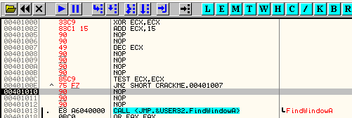

Мы рассмотрели простейший пример цикла с использованием уже знакомых нам инструкций. Существуют ещё и специальные инструкции для реализации циклов. Давайте рассмотрим и их.

**LOOP**

Инструкция LOOP берёт на себя уменьшение значения счётчика ECX, проверку на равенство нулю и переход по заданному адресу - всё в одном флаконе. (К сожалению, на большинстве современных процессоров данная инструкция отличается более низкой скоростью, чем аналог с DEC и JNZ - прим. пер.)

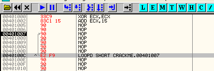

Подсвечиваем инструкцию DEC ECX - осуществляем правый клик мышью - Binary - Fill with NOPs. Аналогично поступаем с инструкциями TEST ECX,ECX и JNZ 401007. Все 3 инструкции можно заменить одной - LOOP 401007.

Подсвечиваем первую строчку (401000) - осуществляем правый клик мышью - New origin here. Теперь мы готовы опробовать наш новый цикл, использующий инструкцию LOOP.

Нажимаем F7 - снова видим как счётчик ECX сначала инициализируется значением 0, потом ему присваивается значение 15h. Продолжаем трассировать пока не достигнем инструкцию LOOP.

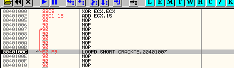

Также как и раньше, осуществляется переход на адрес 401007, т.к. счётчик ещё не равен нулю. Замечаем, что счётчик уменьшился на 1 - теперь в ECX хранится значение 14h.

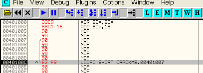

Продолжаем трассировать. Когда счётчик, наконец, достигает нуля, цикл более не будет повторяться.

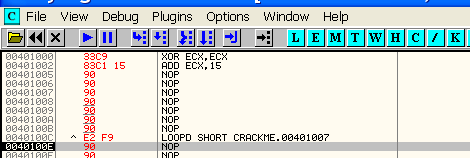

Существуют некоторые вариации инструкции LOOP:

*   LOOPZ, LOOPE Цикл повторяется пока флаг Z установлен
*   LOOPNZ, LOOPNE Цикл повторяется пока флаг Z сброшен

Обе вариации работают как обычный LOOP, т.е. повторяют тело цикла пока счётчик не достигнет нуля, уменьшая на 1 значение счётчика при каждом повторе. В добавок, LOOPZ и LOOPNZ ещё проверяют значение флага Z и прерывают цикл если Z сброшен или установлен соответственно. Таким образом, цикл можно прервать досрочно (до того как ECX достигнет нуля), используя флаг Z.

Обратите внимание на поведение цикла в том случае, если счётчик изначально равен нулю. - прим. пер.

**Цепочечные инструкции**

Далее рассмотрим основные инструкции, относящиеся к категории цепочечных, т.е. позволяющие обрабатывать сразу цепочки байт.

**MOVS**

Данная инструкция копирует данные из одного адреса в другой. Адрес источника хранится в регистре ESI, адрес приёмника - в EDI. Инструкция не нуждается в явном указании параметров, но OllyDbg дизассемблирует её как MOVS DWORD PTR ES:\[EDI\],DWORD PTR DS:\[ESI\] для наглядности. Вот как это выглядит:

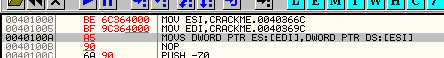

Предварительно инициализируем ESI адресом ячейки, содержимое которой нужно скопировать (источник), и EDI - адресом ячейки, в которую нужно осуществить копирование (проёмник).

Давайте посмотрим содержимое обоих ячеек в окне дампа непосредственно перед копированием.

В окне дампа можно задать Go to - Expression = 40366C. Есть более простой способ: Follow in dump - Immediate constant, как показано ниже:

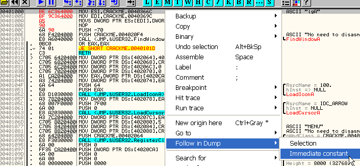

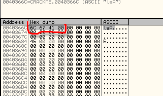

В дампе выделено содержимое ячейки, адрес которой указан в источнике (ESI).

А теперь посмотрим куда указывает EDI:

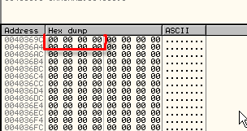

Это приёмник - сюда будет скопировано содержимое ячейки-источника.

Нажимаем F7 пока не выполнится MOVS - в приёмнике теперь находятся те самые 4 байта.

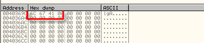

MOVS копирует 4x-байтные значения, т.е. DWORD, из-за чего этой инструкции соответствует ещё одна мнемоника - MOVSD. Существуют ещё инструкции MOVSW и MOVSB, копирующие 2 байта (WORD) и 1 байт (BYTE) соответственно.

Обратите внимание как изменяются значения ESI и EDI при копировании, в зависимости от флага D - прим. пер.

**REP**

Это префикс, который можно использовать перед некоторыми инструкциями, в частности MOVS. Данный префикс указывает, что текущую инструкцию нужно выполнить ECX количество раз. Фактически счётчик ECX уменьшается при каждом повторе, как и в обычном цикле. Таким образом, REP MOVS копирует уже не строго 4 байта, а массив размером 4 \* ECX байт, ведь каждый раз указатели ESI и EDI сами увеличиваются на 4 (или уменьшаются, в зависимости от флага D - прим. пер). Полезная фишка, не так ли?

Нет более простого и компактного способа скопировать произвольное количество байт из одного адреса в другой, хотя производительность данного способа на современных процессорах нельзя назвать оптимальной.

Давайте немного подправим наш предыдущий пример: добавим префикс REP и проинициализируем ECX.

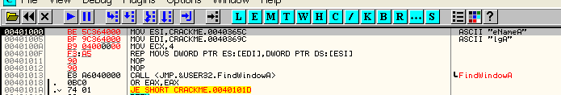

Адрес источника теперь будет 40365C (всего лишь для наглядности), а приёмника - тот же, что и раньше, т.е. 40369C. Возвращаемся к первой строчке кода дежурным New origin here и трассируем до REP MOVS.

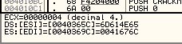

Обратите внимание на подсказку в OllyDbg - там отображаются адреса источника и приёмника, содержимое начальных ячеек и другая полезная информация. Нажимаем F7.

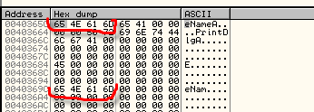

Как видите, первые 4 байта были успешно скопированы, но мы всё ещё находимся на REP, ведь цикл должен выполняться пока ECX не достигнет нуля. На данном этапе в ECX уже хранится значение 3, а указатели ESI и EDI уже увеличились на 4, указывая таким образом на следующие 4 байта, которые будут скопированы как только мы снова нажмём F7.

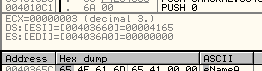

Нажимаем F7.

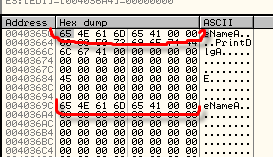

Вот и следующие 4 байта были удачно перемещены и счётчик ECX уже равен 2.

Ещё раз F7 - ECX равен 1.

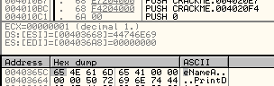

И ещё раз.

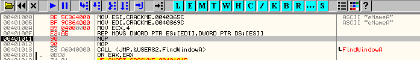

Всё, цикл завершился, т.к. счётчик достиг нуля.

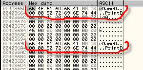

Подведём итог: инструкция MOVS выполнилась 4 раза, благодаря префиксу REP, тем самым переместив цепочку из 16 байт из одного массива в другой.

Имейте в виду, что MOVS, также как и обычная MOV, не может записать данные по адресу, принадлежащему странице не имеющей прав на запись. В таком случае будет вызвано исключение.

Кроме REP есть ещё 2 производных префикса REPE/REPZ и REPNE/REPNZ, которые позволяют прервать цикл досрочно по флагу Z. Т.к. MOVS никак не влияет на флаг Z, использовать REPE/REPZ или REPNE/REPNZ совместно с MOVS не имеет особого смысла, но есть и другие инструкции, которые также поддерживают префиксы повторения и, в добавок, влияют на флаги. Например, CMPS и SCAS являются таковыми. Одну из них мы рассмотрим чуть позже.

**LODS**

Данная инструкция загружает (от англ. LOAD) данные из источника (куда, как обычно, указывает ESI) в аккумулятор.

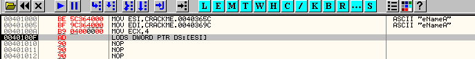

OllyDbg в своём репертуаре: дизассемблирует LODS как LODS DWORD PTR DS:\[ESI\].

Если кому-то лень посмотреть на значение ESI на панели регистров, OllyDbg заботливо дублирует его в окне подсказок.

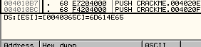

Что у нас в дампе?

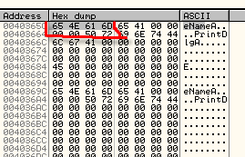

Эти 4 байта будут загружены в аккумулятор (EAX). Нажимаем F7.

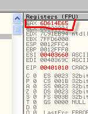

Свершилось! EAX действительно содержит те самые 4 байта.

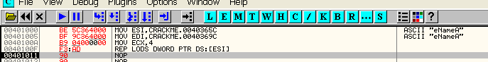

Префикс REP можно применить и перед инструкцией LODS для автоповтора, пока счётчик ECX не достигнет нуля.

При выполнении цикла REP LODS, в окне подсказки оказываются текущие значения ECX, ESI и содержимое ячеек памяти, которые будут загружены в аккумулятор при следующем повторе.

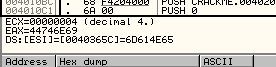

Нажимаем F7.

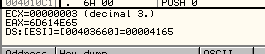

ECX теперь имеет значение 3 и адрес в ESI увеличился на 4 - теперь он указывает на следующие 4 байта, которые будут загружены в EAX.

Есть ещё инструкции LODSW и LODSB для загрузки 2-байтовых (WORD) и 1-байтных (BYTE) значений соответственно.

**STOS**

Сохраняет (от англ. STORE) значение аккумулятора по адресу приёмника EDI.

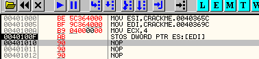

При трассировании данного примера, когда очередь доходит до инструкции STOS, в окне подсказки появляется текущее значение аккумулятора и адрес, по которому будет сохранено это значение.

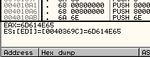

Вот результат в дампе:

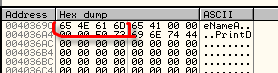

Также как и в предыдущем случае, можно использовать префикс REP для автоповторения и существуют 2-байтовая и 1-байтная версии: STOSW и STOSB.

**CMPS**

Осуществляет сравнение ячеек, указанных в источнике (ESI) и приёмнике (EDI).

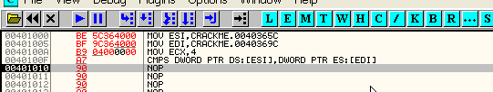

OllyDbg дизассемблирует данную инструкцию как CMPS DWORD PTR DS:\[ESI\],DWORD PTR ES:\[EDI\].

В окне подсказки отображаются значения, подлежащие сравнению:

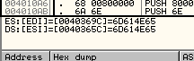

Как Вы уже знаете, сравнение кроет за собой арифметическую операцию вычитания. В данном случае значения равны и в результате мы получаем ноль, а это значит, что флаг Z будет установлен.

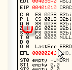

Т.к. операция сравнения влияет на состояние флага Z, можно использовать префикс REPE или REPZ для цепочечного сравнения до тех пор пока не истощится счётчик ECX или флаг Z не окажется сброшен.

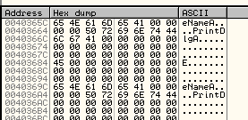

От предыдущих примеров по адресам 40365C и 40369C осталось то, что видим в дампе.

Инициализируем ECX = 10h. При использовании префикса REPE, цикл прервётся когда ECX станет равен нулю или же по состоянию флага Z - любое из этих условий приведёт к завершению цикла.

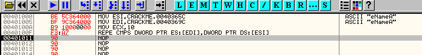

Трассируем до строчки с REPE. Значения в обоих ячейках оказываются равны, что приводит к установке флага Z.

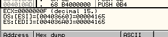

Установленный флаг Z сигнализирует REPE, что пока не нужно прерывать цикл. Нажимаем F7.

Продолжаем нажимать F7 до тех пор, пока операнды не окажутся разными. В данном случае это должно произойти до того как истощится счётчик ECX. Ага, вот:

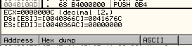

Последующее нажатие на F7 сбрасывает флаг Z и цикл прерывается.

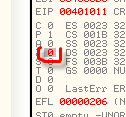

Если бы все 16 двойных слов оказались равными в обоих цепочках, цикл завершился бы по условию ECX = 0, а не раньше.

Ранее упоминался префикс REPNZ, который тоже применим к CMPS и позволяет прервать цикл досрочно, но условие в этом случае противоположно только что рассмотренному REPE/REPZ.

Мы уже изучили основную массу наиболее полезных инструкций, за исключением, пожалуй, только инструкций FPU (для операций над дробными числами), которые мы рассмотрим позже. Не лишним будет повторить пройденный материал, если у Вас остались какие-то пробелы.

**СПОСОБЫ АДРЕСАЦИИ**

**Прямая адресация**

Это самый простой способ - адрес явно указывается в одном из операндов инструкции. Например:

>        MOV dword ptr \[00513450\], ecx
>        MOV ax, word ptr \[00510A25\]
>        MOV al, byte ptr \[00402811\]
>        CALL 452200
>        JMP 421000

Не нужно производить какие-либо вычисления для разрешения адреса, т.к. его значение указано открытым текстом в листинге.

**Косвенная адресация**

>     MOV dword ptr \[eax\], ecx
> 	CALL EAX
> 	JMP \[ebx + 4\]

Чтобы узнать настоящий адрес в любой из предыдущих инструкций, необходимо остановить отладчик на нужной инструкции и посмотреть значения регистров или, что гораздо удобнее, посмотреть в окно подсказки.

Во многих программах используется косвенная адресация, чтобы усложнить задачу реверсера, ведь начальный анализ, проводимый отладчиком, не покажет настоящие адреса и, в общем случае, придётся дожидаться пока не настанет черёд выполнения этих инструкций, чтобы посмотреть значения регистров непосредственно перед этим и, таким образом, получить интересующие нас адреса.

Чтобы было нагляднее, давайте снова воспользуемся крэкми Cruehead'а ***\[[ссылка](files/1/ollydbg01-Crackme.7z)\]***. Загружаем его в отладчик.

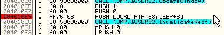

Подмечаем пример косвенной адресации: PUSH \[ebp+8\]

Т.к. мы всё ещё находимся на точке входа (Entry Point), мы не можем заранее узнать значение регистра EBP к моменту выполнения того самого PUSH'а. Поэтому, нам не известно пока ещё что именно попадёт в стек. Давайте выделим данный PUSH (он находится по адресу 401009) и нажмём F2, чтобы повесить на него точку останова (бряк).

Потом нажимаем F9 (RUN) - крэкми запускается и вскоре останавливается там, где мы установили бряк.

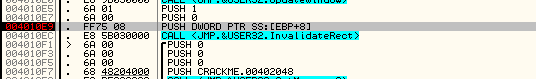

В окне подсказки высвечивается настоящий адрес EBP+8 = 12FFF8. Кстати, у Вас адрес может отличаться - это свойственно стековым адресам! Значение EBP в данный момент у меня равно 12FFF0, на основании чего и получилось, что EBP+8 = 12FFF8.

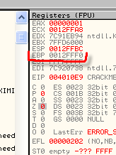

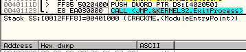

Теперь давайте посмотрим, что хранится в дампе по адресу EBP+8 : Go to - Expression = EBP+8

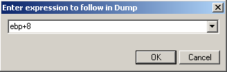

И что мы там видим?

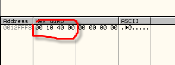

Это значение будет помещено в стек. Нажимаем F7 - так и есть.

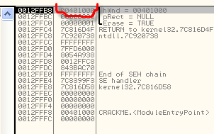

В случае любой инструкции с косвенной адресацией, настоящее значение адреса можно получить только в момент выполнения данной инструкции.

Существуют другие способы адресации, но мы их частично уже рассмотрели в примерах. На данном этапе мне нечего добавить.

Кто смог осилить весь материал (включая, наверное, и переводчика :) - прим. пер.) имеет неплохие шансы познать захватывающий мир крэкинга, но для этого понадобится ещё очень много практики и чтения серьёзной литературы. В 9й главе мы, наконец, окунёмся в азы прикладного крэкинга.

Перевод последнего абзаца получился немного вольным, но смысл сохранился. Особенно хочется подчеркнуть, что автор не спроста упоминает о серьёзных книгах - учебниках по ассемблеру, архитектуре ПК, операционных систем и т.д. Многие теоретические основы, касающиеся ассемблера вообще и крэкинга в частности, не попадают в туториалы и только лишь книги помогают до конца разобраться в тех или иных темах.

  \[C\] Рикардо Нарваха, пер. Quantum
