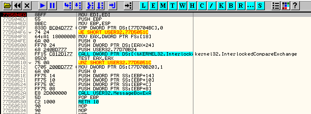

# Глава 9 - Базовые понятия

Как и было обещано, теперь мы займёмся непосредственно крэкингом. Начнём с базовых понятий, не спеша, шаг за шагом пополняя наш крэкерский арсенал знаний. Теоретические пробелы мы постараемся заполнить по ходу дела.

Экспериментировать мы будем, естественно, с уже знакомым нам крэкми Cruehead'а ***\[[ссылка](files/1/ollydbg01-Crackme.7z)\]***, но не ограничимся рассмотрением различных способов взлома этого несложного крэкми - по ходу мы постараемся изучить стандартные приёмы, применимые в дальнейшем к более "продвинутым" жертвам.

Итак, давайте загрузим крэкми в отладчик.

На примере данного крекми можно рассмотреть несколько общих понятий.

Точка Входа - адрес инструкции, с которой стартует программа. Не путать с понятием OEP (Original Entry Point), которое мы рассмотрим чуть позже. При загрузке приложения в OllyDbg, отладчик останавливается на точке входа, анализирует код и ждёт дальнейших инструкций от пользователя.


В данном случае точка входа соответствует адресу 401000. Обычно в строке состояния выводится причина, по которой остановлен отладчик. Сейчас там находится сообщение о том, что мы находимся на точке входа:


Почти все программы на старте останавливаются на точке входа. Есть такие, которые не останавливаются, т.к. используют способы обхода отладчика. Об этих способах мы поговорим позже. Пока что примите к сведению существование подобных приёмов антиотладки.

Давайте, заодно, рассмотрим понятие DLL (динамические библиотеки) и экспортируемые ими функции.


Обратите внимание на выделенную инструкцию. Вместо адреса, вроде CALL 401020, в данном случае указано имя внешней функции:

```assembly
CALL LoadIconA
```

В крайнем правом столбике выводится какая-то дополнительная информация, но что представляет собой LoadIconA?

Операционная система Windows поддерживает так называемые динамические библиотеки (файлы с расширением DLL), которые имеют тот же формат, что и обычные исполнимые файлы EXE. В динамических библиотеках содержатся функции, которые могут быть использованы другими исполняемыми файлами (EXE и DLL). Вместо статического копирования одной и той же функции в несколько экзешников, её можно поместить в DLL, а в экзешниках указать ссылки на эту DLL. Если объём подобных функций велик, получается неплохая экономия на размере экзешников и, что более существенно, расходуемой памяти. Базовые функции для работы с файлами, динамической памятью, процессами и потоками, графикой, звуком, сетью и т.д. и т.п. реализованы в стандартных динамических библиотеках. LoadIconA как раз и является одной из стандартных функций, реализованной в одной из стандартных библиотек - в USER32.DLL. Стандартные функции ещё называют API.

Давайте рассмотрим пример другой API'шной функции - MessageBoxA.

В окне Command Bar вводим: ? MessageBoxA


Получаем короткий отчёт, в котором первым делом указан настоящий адрес данной функции. Давайте пройдём по этому адресу, т.е. воспользуемся командой Go to - Expression и введём тот адрес, что выдал нам Command Bar.


Вводим тот адрес, что выдал Command Bar (у Вас этот адрес может быть другим!)


Если у Вас установлена Windows 9x, этот фокус не сработает, о чём мы подробнее поговорим ниже.


Сразу видим, что функция принадлежит USER32.DLL, но мы это уже знали, ведь имя DLL обычно указывается вместе с именем функции в дизассемблере (вроде CALL USER32.MessageBoxA). Ещё можно заметить, что MessageBoxA - это обычная функция, которая начинается по текущему адресу и завершается инструкцией RET. Код данной функции находится в библиотеке, а не в экзешнике, что позволяет сэкономить на размере и упрощает работу крэкера :)

Чтоб вернуться к текущей инструкции, достаточно нажать МИНУС. В окне Go to - Expression можно было прямо ввести MessageBoxA.


Вот, мы снова оказались внутри функции MessageBoxA из библиотеки USER32.DLL.

В имени функции важно правильно указывать строчные и прописные буквы (MessageBoxA и messageboxa - разные имена). Как же узнать правильный регистр той или иной буквы?

Нажимаем "МИНУС" - возвращаемся к точке входа.


Правая кнопка мыши в листинге: Search for - Name (label) in current module. Получаем полный список имён API'шных функций, задействованных в данном экзешнике.


Не нужно перечитывать весь список - чтобы найти нужную функцию, достаточно начать набирать её имя. Нажимаем "M":


Курсор позиционируется на первой функции, имя которой начинается на M.


В заголовке окна выводятся буквы, по которым осуществляется поиск.


Правая кнопка мыши по имени функции вызывает меню со следующими опциями:


Опция "Follow import in Disassembler" подгружает эту функцию в дизассемблер - это ещё один способ попасть внутрь API'шной функции.


Часто новички ошибочно задают поиск символов (Search for - Name (lable) in current module), находясь при этом внутри какой-либо внешней функции. К примеру, если мы воспользуемся данной опцией внутри функции MessageBoxA, мы получим список имён функций, которые импортирует библиотека USER32.DLL, а вовсе не подопытный экзешник. В меню чётко сказано, что поиск осуществляется в текущем модуле (current module), а текущем в данном случае окажется USER32, ведь функция MessageBoxA находится именно в нём.


Дабы избежать подобных ошибок, не забывайте поглядывать на заголовок окна отладчика - там отображается, в частности, имя текущего модуля.


Даже если мы просто заглянули во внешнюю функцию в дизассемблере, а не передали управление в отладчике, т.е. функция даже не выполняется ещё, текущим модулем всё равно окажется библиотека, в которой находится внешняя функция. В таком случае нужно понажимать на МИНУС пока Вы не окажитесь в "основном" модуле, чтобы воспользоваться такими опциями как Search for - Names и т.п.

## Windows NT: 2000, XP и 2003

Дальнейшее обсуждение касается операционных систем NT: 2000, XP и 2003. Если у Вас мастдай (пардон, тут автор использовал термин Windows 95/98 - прим. пер.), смею порекомендовать перейти на любую из вышеперечисленных осей, т.к. на NT OllyDbg обладает большими возможностями (и глючит меньше - опять прим. пер.) Если такой возможности нет, можете пропустить дальнейшее обсуждение и перейти сразу к "Приложение. Windows 9x"


В перечне API'шных функций, которые использует крэкми, есть ещё одна полезная опция в контекстном меню: Toggle breakpoint on import. Данная опция позволяет установить точку останова на вызове функции API.

Точку останова на вызовах конкретной API'шной функции можно установить и через Command Bar:

```
bp MessageBoxA
```

В отличие от bpx, bp ставит точку останова на первой инструкции внутри заданной функции, а не на самих инструкциях вызова (call или jmp) в текущем модуле. Давайте снова зайдём в функцию MessageBoxA (любым из вышеописанных способов) и удостоверимся, что на первой инструкции данной функции появилась точка останова. Так и есть:



Таким образом, при вызове функции MessageBoxA, должна сработать точка останова. Давайте нажмём F9, чтобы запустить крэкми.


Появилось главное окно крэкми. В меню выбираем Help - Register:


Вводим произвольные данные в поля Name и Serial; нажимаем OK. В этот момент должен произойти вызов функции MessageBoxA, который должна зафиксировать наша точка останова... Ага, отладчик прервал выполнение! В правом нижнем углу светится надпись Paused (будто нам и так непонятно, что процесс остановлен - прим. пер.).


Левее указана причина, по которой произошла остановка.


Там написано: "Breakpoint at USER32.MessageBoxA", что значит "Точка останова на USER32.MessageBoxA". Наша точка останова сработала.


В момент вызова функции можно посмотреть на значения аргументов данной функции. Аргументы API'шных функций обычно передаются через стек справа налево, согласно соглашению stdcall. Давайте рассмотрим их внимательно.

В самом верху стека хранится адрес возврата. В данном случае - 4013C1.


Когда мы проходили инструкции CALL и RET в подготовительной части этого цикла (Глава 7), мы имели возможность убедиться, что при вызове любой подпрограммы (т.е. функции) верхушка стека содержит адрес возврата - адрес, на который перейдёт управление, после завершения функции. В данном случае, после завершения MessageBoxA, управление перейдёт на адрес 4013C1.

Далее (т.е. ниже) идут аргументы функции. MessageBoxA принимает 4 аргумента (можете посмотреть описание функции API MessageBox в MSDN, чтобы убедиться): дескриптор родительского окна, текст сообщения, текст заголовка и стиль.

Текст сообщения - "No luck there, mate!" - констатирует, что Вы не угадали правильные параметры регистрации :)

Вот-вот вылезет роковое сообщение...


Чтобы убедиться, что текущий вызов MessageBoxA - это тот самый MessageBox, что уведомляет нас о неправильно набранном серийнике, если у Вас есть сомнения... Давайте изолируем текущий вызов, поставив точку останова на инструкции RETN 10h, которую можно найти чуть ниже. Адрес инструкции возврата у Вас, возможно, будет отличаться, но, в любом случае, это должен быть первый RET внутри функции.


Нажимаем F9.


Окно MessageBox появилось на экране. Текст заголовка и сообщения соответствует параметрам функции, которые мы только что перехватили: "Lo luck!" и "No luck there, mate!". Серийник не подошёл :)

Нажимаем "Да" - срабатывает точка останова на RETN 10h.


Таким образом, можно заключить, что сообщение выскочило в процессе выполнения функции MessageBoxA.

Чем отличается RETN 10h от обычного RET? Обычный RET просто вернул бы управление на адрес возврата - 4013C1.


Из стека извлекается адрес возврата. Указатель на верхушку стека перемещается на 4 байта вниз (точнее, в сторону старших адресов). Таким образом, ESP увеличивается на 4 в результате выполнения инструкции RET. В случае с RET 10h, в добавок к тому, что делает обычный RET, ESP увеличивается ещё на 10h. В общей сложности, к значению ESP прибавляется 10h + 4 = 14h = 20. Давайте проверим: нажимаем F7.

Дальнейшее обсуждение касается обоих семейств Windows: 9x и NT.


Вот мы и вернулись из API-функции обратно в код крэкми. Обратите внимание, что указатель верхушки стека сдвинулся на 20 байт вниз, как и следовало ожидать, т.е. RETN не просто извлекает из стека адрес возврата, но и очищает аргументы, переданные в функцию, как того требует соглашение stdcall.


В данный момент крэкми уже точно знает, что серийник не верен и даже успел нам об этом сообщить. На данном этапе уже поздно что-либо предпринимать. Нажимаем F9.


Снова срабатывает точка останова. Оказывается, крэкми решил снова вывести сообщение о неправильном серийнике, будто мы успели забыть, что серийник не подошёл :)


Адрес возврата на этот раз указывает на 40137D. Давайте посмотрим, что за код находится по этому адресу. Для этого можно воспользоваться опцией Go to - Expression: 40137D. Или прямо по правому щелчку в верхней ячейке стека - Follow in Disassembler.


Сразу над строчкой по адресу возврата (40137D) находится инструкция CALL, которая вызвала функцию MessageBox (401378).


Чуть выше виден другой MessageBox, но с совершенно другим текстом: Great work, mate! Похоже, что это сообщение выскакивает, если серийник оказывается правильным :) Для начала было бы неплохо попасть на тот другой MessageBox, вместо того, что вот-вот покажется на экране.


Предварительный анализ проделанный отладчиком показывает, что данный код входит в состав функции, о чём свидетельствует жирная скобка в колонке с машинным кодом. Таких функций несколько: одна начинается по адресу 401362 и содержит сообщение "No luck...", другая - "Great work..." и начинается по адресу 40134D.

Если выделить первую строчку функции "No luck..." (по адресу 401362), в окне подсказки покажется следующая информация:


Отладчик в курсе откуда вызывается данная функция, но так бывает только с прямыми вызовами! Щелчёк правой кнопкой мыши - Go to - CALL from 401245.


Занятненько... Перед нами типичный код сравнения некоторого значения, в результате которого вызывается одна из тех двух функций с сообщениями: "No luck..." и "Great work...". Такое нельзя пропускать! Ставим точку останова на условный переход.


Заодно убираем точки останова на MessageBox. Это можно сделать через окно \[B\], т.е. Breakpoints:


Правая кнопка мыши - Remove. Таким образом убираем обе точки останова на MessageBox и оставляем только свежепоставленную точку на том подозрительном условном переходе.


Командуем Run (F9), принимаем сообщение "No luck...", которое мы только что трассировали. Снова вводим имя и серийник (используйте те же, что и на снимке).


Нажимаем OK.


Переход не осуществляется, т.к. предварительное сравнение EAX и EBX обернулось неравенством. Таким образом, выполняется вызов CALL 401362 - там нехорошее сообщение, если кто-то уже забыл. Можете нажать правую кнопку мыши - Follow и освежить память.


А что будет, если повлиять на условие перехода, изменив значение флага Z? Двойной щелчёк по флагу в окне регистров меняет его текущее состояние на противоположное.


Установленный флаг Z означает, что EAX = EBX, т.е. разность EAX - EBX равна нулю. Переход осуществляется.


Теперь вызовется другая функция. Смотрим через Follow:


Нажимаем Run (F9) :)))


Значит, то сравнение является ключевым моментом в проверке правильности серийника. Если значения EAX и EBX равны, выскакивает "хорошее" сообщение, иначе выводится "Lo luck...". Раньше мы заметили, что "нехорошие" сообщения в коде имеются в двух экземплярах, но в последний раз выскочило только одно из них. Когда крэкми замечает, что в имени есть цифры (в ricnar456 как раз они есть), сначала выводится одно сообщение, а потом, после ключевого сравнения, выводится ещё одно. Давайте проверим ещё раз.


Вводим имя, содержащее цифры. Нажимаем OK.


Появляется сообщение о неправильном серийнике и уже ПОСЛЕ этого срабатывает точка останова на условном переходе!


Потом появляется окончательное сообщение. Когда мы первый раз остановились на входе в MessageBox (на начальной стадии данного пособия), это был тот первый MessageBox, т.е. не окончательный.


Адрес возврата соответствовал 4013C1.


В окне дизассемблера выделена функция (см. жирную скобку), начинающаяся по адресу 40137E и заканчивающаяся по адресу 4013C1: там находится завершающий RET сразу после вызова MessageBox.

Обратите внимание, что по адресу 4013AC есть стрелочка (>), а это значит, что данный адрес используется в каком-то прямом переходе. Давайте выделим эту строчку, чтобы узнать где находится этот переход.


Перед нами ещё одно сравнение и условный переход, который приводит к отображению нехорошего сообщения. Давайте поставим точку останова в этом месте.


Снова пускаем приложение (RUN); принимаем сообщение; опять вводим наши дежурные данные регистрации (имя содержащее цифры!) и опять нажимаем OK.


Данный код проверяет все буквы в имени пользователя. Злосчастный переход осуществляется, как только встретится цифра. При каждом прохождении цикла срабатывает точка останова. Нажмите F9 - остановка произойдёт уже на 2й букве.

На седьмом прохождении цикла (первая цифра в имени ricnar456 - это ‘4’ и занимает 7ую позицию) переход будет осуществлён, но мы этому воспрепятствуем :)


Условный переход JB осуществляется в зависимости от состояния флага C. Делаем двойной щелчёк по этому флагу, чтобы изменить его состояние.


Таким образом, переход не будет выполнен. Повторяем фокус с флагом для 2х оставшихся цифер, чтобы не сработал этот переход.


Далее мы попадаем на сравнение EAX и EBX, где нужно повлиять на флаг Z, как в прошлый раз, чтобы переход осуществился.


Нажимаем F9.


Не будем же мы всё время ручками менять флаги C и Z?! Настало время рассмотреть каким образом это дело можно зафиксировать, чтобы крэкми безропотно принимал любой серийник, причём вне отладчика.

Выделяем первый условный переход (где мы поставили точку останова).


Чтоб этот переход не выполнялся никогда, независимо от состояния флага C, его можно просто и грубо забить инструкциями NOP. Нажимаем на данном переходе пробел и вводим NOP.


Точку останова уже можно убрать. Для этого достаточно нажать F2.


Идём ко второму ключевому условному переходу.


В данном случае нам нужно, чтобы переход всегда выполнялся. Для этого его можно сделать безусловным, т.е. поменять JE на JMP.


Давайте снимем и эту точку останова (F2). Пока ещё не выходим из OllyDbg! Чтобы опробовать в свободном полёте наши достижения, нажимаем F9.


Нажимаем OK.


Все изменения проделанные через опцию Assemble (пробел) улетучиваются при закрытии программы в отладчике. Эти изменения осуществляются в памяти и никак не влияют на оригинальный образ в экзешнике. Чтобы применить изменения к образу в экзешнике, делаем следующие манипуляции:


Правый щелчёк в любом месте листинга - Copy to executable - All modifications. Далее выводится следующий запрос:


Выбираем опцию Copy all чтобы перенести все изменения (в данном случае ими являются двойной NOP и один JMP).


Открывается новое окно, в котором нужно опять сделать правый щелчёк - Save file.


Сохраняем файл под НОВЫМ именем (старый экзешник нам ещё пригодится, да и перезаписать его всё равно не получится, т.к. он всё ещё загружен операционной системой). Назовём новый экзешник CRACKME2.EXE.


Вот, теперь можно, наконец, закрыть OllyDbg.


Запускаем новую версию крэкми (уже вне отладчика) и проверяем, что регистрация проходит успешно при указании любого серийника.

 Выбераем Help - Register:

 Нажимаем OK.


Вот мы и пропатчили крэкми! Но этого мало - в дальнейшем попробуем реверсировать полностью алгоритм проверки серийника, чтобы получить настоящие регистрационные данные, без использования патча. Но для этого надо ещё многому научиться.

Приложение. Windows 9x

В мастдае возможности отладчика ограничены. К примеру, нельзя ставить точки останова прямо на вызовы API-функций, как было показано на примере MessageBox в NT/XP. При выполнении поиска API-функций по импорту:


Получаем аналогичный список импортируемых символов, но опция Toggle breakpoint on import не будет доступна, т.к. 9x не позволяет ставить точки останова прямо на внешние функции.


В остальном, контекстное меню будет сходным с полнофункциональным вариантом в NT.


Таким образом, вызовы API-функций могут идти в обход точек останова. Достаточно вызвать функцию косвенным образом, чтобы анализатор не смог его автоматически засечь, и точка останова уже не сработает. Досадное ограничение, в общем.

Вместо одной точки останова на начало функции MessageBox в данном случае Вам придётся поставить 3 точки останова (F2): по одной на каждый вызов MessageBox, которые выводятся в списке внешних символов.


Нажимаем Run (F9); выбираем опцию Help - Register; вводим следующие регистрационные данные:


Нажимаем OK - срабатывает одна из точек останова.


В NT/XP в этом месте мы ставили ещё одну точку останова на инструкции RET, внутри функции MessageBox. В 9х мы это не можем сделать, т.к. внутрь функции нас не пускают. Поэтому ограничимся точкой останова на следующей после CALL инструкции, т.е. уже после возвращения из функции.


Аналогично поступаем в любой подобной ситуации по ходу развития учебного цикла. В 9х вместо точек останова на обращениях к внешим функциям, их приходится ставить на ссылки в конкретных вызовах. Теперь можете вернуться к основному материалу статьи , где написано:

Дальнейшее обсуждение касается обоих семейств Windows: 9x и NT.

\[C\] Рикардо Нарваха, пер. Quantum
