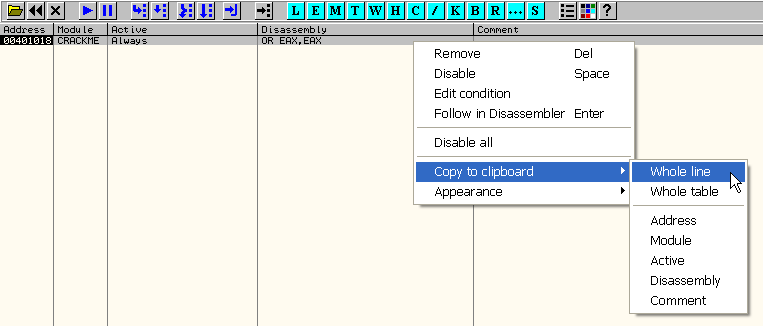
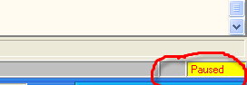

Глава 10 - Брейкпоинты
======================

Эту главу мы посвятим изучению различных видов точек останова. Они позволяют приостановить выполнение кода программы в нужном месте. И снова роль подопытной жертвы достаётся бессменному крэкми CrueHead'а ***\[[ссылка](files/1/ollydbg01-Crackme.7z)\]***.

**Обычная точка останова, она же BPX**

Это самая обыкновенная точка останова, которую мы уже не раз использовали в предыдущих главах. Иногда она обозначается сокращённо BPX как одноимённая команда, которая используется в отладчике SoftIce для установки обычных точек останова. Справедливости ради, стоит заметить, что в OllyDbg используется сокращение BP для обозначения данного вида точек останова.

Для установки BPX достаточно выделить нужную строчку кода и нажать F2. Повторное нажатие F2 снимает BPX.

Смотрим крэкми CrueHead'а на точке входа:

Выделяем, например, строчку 401018; нажимаем F2 - адрес выделился красным цветом, чтобы показать, что тут находится обыкновенная точка останова. Данный адрес также добавляется в список точек останова в окне \[B\]reakpoints.

В списке появился наш BPX и видно, что он активен в данный момент.

В колонке Active отображается статус Always, а это значит, что данный BPX (должен - прим. пер.) будет выполнен всегда, т.е. он всё время активен.

Правый щелчёк мышью в списке BPX'ов - всплывает контекстное меню, через которое можно индивидуально контролировать точки останова.

*   REMOVE: удаление данной точки останова из списка равносильно её снятию.
*   DISABLE: отключить точку останова, не удаляя её из списка. В отключенном состоянии точка останова не будет срабатывать.
*   EDIT CONDITION: задаёт условие, таким образом, превращая обычную точку останова в условную, но об этом мы поговорим позже.
*   FOLLOW IN DISASSEMBLER: показать эту точку останова в листинге дизассемблера.
*   DISABLE ALL / ENABLE ALL: отключить / включить все точки останова в списке. В данном случае нет опции Enable all, так как единственная точка останова в списке не отключена.
*   COPY TO CLIPBOARD: помещает в буфер обмена информацию о выбранной точке останова. Давайте попробуем это сделать:

Опция Whole line помещает в буфер обмена информацию об одной (выбранной) точке останова, тогда как Whole table распространяется сразу на все точки останова, находящиеся в списке.

> Breakpoints, item 0
>  Address=00401018
>  Module=CRACKME
>  Active=Always
>  Disassembly=OR EAX,EAX

В буфер помещаются: инструкция, на которой висит точка останова, статус этой точки, адрес и т.д.

Нажимаем F9 (Run) - отладчик начинает выполнять крэкми, но, вскоре, достигает точки останова и, как можно догадаться, останавливается.

В строке состояния указано, что отладка приостановлена.

И причина, по которой произошла остановка:

Давайте попробуем разобраться, что же на самом деле представляет собой точка останова. Происходит ли какое-либо изменение в двоичном коде инструкции при установке точки останова?

Правый щелчёк: Follow in Dump – Selection

Смотрим в дампе содержимое по адресу 401018:

На первый взгляд, содержимое дампа совпадает с первоначальным кодом инструкции и в листинге дизассемблера, в колонке машинного кода, мы видим то же самое:

Везде - и в дампе, и в дизассемблере - мы видим значение 0B C0, которое соответствует инструкции OR EAX,EAX. Похоже, что никаких изменений нет, но так ли это на самом деле? Перезагрузите крэкми и убедитесь, что точка останова всё ещё висит на месте (по адресу 401018).

Давайте введём следующую инструкцию, чтобы фактически прочитать из памяти машинный код инструкции OR EAX,EAX, на которой висит точка останова:

Данная инструкция помещает в EAX значение ячейки по адресу 401018. Что нам по этому поводу подсказывает отладчик?

В дампе, в листинге и теперь ещё и в окне подсказки - везде показано одно и то же значение: 0B C0. Тем не менее, давайте всё-таки нажмём F7 и проверим что окажется в EAX.

По адресу 401018 оказалось немного не то, что нам изначально показывал OllyDbg... Значение 0B C0 74 01 задом наперёд (т.е. в формате little endian) выглядит как 0174C00B, а вовсе не 0174C0CC. Итак, вместо 0B по адресу 401018 хранится CC. Каким образом это значение связано с точками останова мы детально рассмотрим позже, когда займёмся изучением исключений. Чтобы не "загрязнять" пользовательский интерфейс, отладчик скрывает от нас, что при установке обычной точки останова, первый байт инструкции заменяется на CC. Тем не менее, сама программа запросто может прочитать из памяти настоящее значение, что может использоваться для обнаружения точек останова в антиотладочных целях. Поэтому не стоит удивляться, когда обычные точки останова иногда мистическим образом не срабатывают. Быть может, сама программа их "палит" :)

Кроме F2, есть ещё способ установки обычной точки останова через CommandBar:

> BP 401018

На NT (2000, XP и 2003) можно запросто ставить точки останова на адреса API-функций - мы это уже рассмотрели в предыдущей главе. Чтобы установить точку останова на обращения к MessageBoxA, вводим:

В данном случае нужно указывать точное имя, и это касается регистра букв. В Windows 98, напротив, точки останова прямо по адресам API не поддерживаются - вместо этого приходится довольствоваться точками останова на самих вызовах:

BPX ставит точку останова не на указанный адрес, как это делает BP, а на инструкции, которые ссылаются на данный адрес. Важно отметить, что отладчик может определить далеко не все обращения к API-функциям (вызовы могут быть "замаскированы" различными способами, чтобы сбить с толку крэкера - прим. пер.) BPX можно использовать и в NT, но обычно предпочтение отдаётся более надёжной команде BP.

Вот как выглядит список точек останова после использования BPX MessageBoxA. Как видите, отладчик обнаружил 3 вызова данной функции и поставил 3 точки останова: по одной на каждый вызов.

На протяжении всего цикла статей мы будет использовать преимущественно BP (пользователи Windows 98 будут использовать BPX - у них нет выбора). Так что, когда в тексте встречается термин BREAKPOINT или BPX, под этим следует понимать команду BP.

Ещё один способ установить точку останова: двойной щелчёк в области машинного кода (колонка с байтами) по строчке с инструкцией в окне дизассемблера. Повторный двойной щелчёк снимает точку останова.

**Точки останова на обращения к памяти**

Точки останова на доступ к памяти иногда также называются BPM (от англ. Breakpoint on Memory), но не нужно путать это сокращение с командой BPM в старом добром SoftIce - это совершенно разные вещи.

Данный вид точек останова модифицирует свойства страниц памяти, которым принадлежит область, на которую вешается BPM. Например: BPM on access срабатывает на любых обращениях к данной области байт (чтение, запись или выполнение кода). Ещё существует BPM on write, который срабатывает только на обращениях на запись (чтение и выполнение в этом случае не отлавливаются). Давайте рассмотрим несколько примеров:

Находясь на точке входа в крэкми CrueHead'а, давайте попробуем установить несколько BPM. В окне дампа задаём Go to - Expression: 4020CA, чтобы переместиться на данный адрес.

Тут мы и установим первый BPM ON ACCESS: на 4 байта по адресу 4020CA. В дальнейшем, после команды Run, данная точка останова должна будет сработать при попытке чтения содержимого этих байтов, записи или исполнения (если бы там вдруг оказался исполнимый код). Давайте выделим все 4 байта:

Область байт выделена, правый щелчёк мышью: Breakpoint - Memory, on access. Вовсе не обязательно использовать именно 4-байтовые BPM. Аналогично можно было выделить область меньшего или большего диапазона.

Есть у BPM'ов парочка недостатков: они не отображаются в списке \[B\], да и ни в каком другом месте. Поэтому приходится запоминать, где его установили. Причём нельзя одновременно использовать более одного. Если установить ещё один, старый BPM автоматически сотрётся.

Итак, даём команду Run... Остановка происходит по адресу 401007, где текущая инструкция пытается что-то записать по адресу, попадающему в диапазон нашего BPM, т.е. в 4020CA.

Внизу - в строке состояния - внятно описана причина, по которой мы остановились:

Текущая инструкция намеревается записать значение регистра EAX по адресу 4020CA, что и спровоцировало остановку. Помните, когда мы пытались что-то записать в область памяти, без свойства (W)riteable, происходило исключение? Собственно, аналогичным образом действует BPM on access: отладчик сбрасывает все свойства доступа страницы, которой принадлежит заданная область памяти. Любое обращение к данной странице провоцирует исключение, которое перехватывает отладчик.

Если нажать F7, значение EAX всё-таки запишется, так как отладчик принимает меры, чтобы исключение в данном случае лишний раз не повторилось.

Значение 400000 успешно записалось. Давайте снова дадим команду Run. Так как BPM всё ещё активен, он сработает снова, если приложение попытается что-то записать/прочитать/исполнить по заданному адресу.

Как видите, теперь остановка произошла при попытке считать значение из той самой ячейки, о чём свидетельствует сообщение Memory breakpoint when reading \[004020CA\].

Опять же, по F7 операция всё-таки совершается, т.е. значение удачно считывается в EAX.

Снова F9... Сработает ли снова наш BPM? - Да, так и есть:

Отладчик снова засёк попытку чтения содержимого 4020CA, но на этот раз инструкцией PUSH, которая пытается скопировать это содержимое в стек.

Чтобы удалить BPM, достаточно щёлкнуть правой кнопкой мыши в дампе: Breakpoint - Remove memory breakpoint. Также можно установить новый BPM - при этом старый, как мы уже говорили, ликвидируется.

Если вместо "Memory, on access" указать "Memory, on write", BPM будет ловить только обращения на запись (чтение содержимого области BPM не будет вызывать остановку).

OllyDbg позволяет устанавливать BPM сразу на целую секцию (что приходится очень кстати при трассировании различного рода упаковщиков - прим. переводчика). Согласитесь, что выделять мышкой все байты нужной секции в дампе - мягко говоря, неудобно. Поэтому идём в закладку View \[M\]emory:

Данный список содержит в начале секции загруженного процесса (т.е. нашего подопытного крэкми), следом за которыми расположены секции загруженных библиотек DLL. Можете выбрать любую секцию, например ту, что начинается по адресу 401000:

Правый щелчёк по выделенной секции: Set memory breakpoint on access.

Можно было выбрать опцию on write, т.е. обращения на запись, но в данном случае речь идёт о секции кода, поэтому логичнее задействовать BPM on access. Командуем Run.

Точка останова срабатывает буквально на следующей же инструкции, так как:

Правильно, остановка произошла when executing, т.е. при выполнении кода, ведь BPM установлен как раз на текущей секции кода и попытка выполнить любую инструкцию из этой секции приводит к срабатыванию BPM.

Давайте установим BPM на секцию кода kernel32, которую можно найти чуть ниже в списке. Вот она:

Условием по прежнему ставим on access, чтобы отлавливались все попытки чтения/записи/выполнения, проецирующиеся на данную секцию кода kernel32. Снова Run.

Судя по подсказке в стеке, остановка произошла на вызове API-функции:

Таким образом можно отловить первое обращение к заданной DLL. Адрес возврата можно посмотреть в стеке:

Правый щелчёк по адресу возврата: Follow in disassembler.

Адрес возврата указывает на 401007, сразу после вызова функции GetModuleHandleA в начале программы.

Чуть ниже находится вызов функции FindWindowA, но этот вызов не спровоцирует остановку по BPM, так как данная функция принадлежит другой DLL - user32.dll. Если снова задать Run, остановка произойдёт тут же на следующей инструкции, так как следующая инструкция тоже принадлежит секции, находящейся под влиянием BPM, ровно как и все остальные инструкции текущей функции. Иными словами, BPM будет срабатывать на каждом шагу. Поэтому мы его лучше снимем опцией Remove memory breakpoint.

Чтоб вернуться снова в код основного модуля, правый щелчёк: Execute till user code. Иногда, если этот способ не срабатывает, можно задать опцию Execute till return, чтобы перескочить на выход из текущей функции, и потом трассировать далее привычными средствами: F7 и F8.

В данном случае Execute till user code вполне справляется с задачей вывести нас обратно в код основного модуля. Позже мы рассмотрим ситуации, в которых данный способ не применим.

Теперь можно снова поставить BPM на kernel32.dll, чтобы поймать следующее обращение к этой библиотеке и т.д.

Например, если нужно поймать вызов функции MessageBoxA, но BP MessageBoxA не срабатывает, так как программа считывает первый байт этой функции и проверяет его на равенство CC, можно попробовать BPM. Давайте рассмотрим этот пример более подробно.

Адрес функции MessageBoxA на моей машине соответствует 77D504EA. Перемещаемся на соответствующий адрес через Go to - Exression. Можно указать сам адрес или точное имя функции:

Подсвечиваем первую инструкцию:

В данном случае тоже предоставляется на выбор: on access или on write. Выбираем первое и отдаём команду Run.

Выбираем Help - Register, вводим произвольные данные:

Нажимаем OK.

Происходит остановка на обращении к данной API-функции точно так же, как при использовании обычного BP. Если обычные точки останова не срабатывают, возможно, данный способ поможет обойти защиту. Этому способу тоже можно противодействовать проверкой свойств доступа к страницам памяти, но подобные антиотладочные приёмы встречаются реже.

В следующий раз мы рассмотрим аппаратные точки останова (Hardware breakpoints) и Message breakpoints. Ещё есть условные точки останова, но о них мы поговорим позже.

  \[C\] Рикардо Нарваха, пер. Quantum
