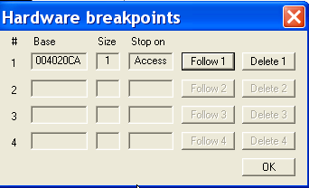

# Глава 11 - Процессорные и условные брейкпоинты

Хорошо, нам осталось рассмотреть процессорные точки останова (hardware breakpoints), условные точки останова и message breakpoints, и после этого мы закончим с этой темой.

## Процессорные точки останова

Процессорные точки останова (hardware breakpoints, HBP) - это возможность, предоставляемая процессором. Как это устроено на самом деле, я не знаю, но тем не менее мы можем устанавливать их, чтобы программа, когда их встречает, останавливалась и передавала управление.

Мы можем установить до 4 четырёх HBP, на пятый Ollydbg попросит нас указать, какой из четырёх уже установленных убрать.

Как обычно, для практики будем использовать крэкми CrueHead'а [\[ссылка\]](.gitbook/assets/files/1/ollydbg01-Crackme.7z).

Есть три возможности: HBP ON EXECUTION, ON WRITE и ON ACCESS.

Установка HBP ON EXECUTION выполняет ту же роль, что и BPX на адрес, но HBP не изменяет код и его сложнее обнаружить, хотя есть программы, которые используют кое-какие приёмы, чтобы сбросить HBP. Эти приёмы и способы противостоять им, мы рассмотрим в следующих главах.

Если хотим установить HBP ON EXECUTION на 401013, отмечаем строку, кликаем на правую кнопку мыши и выбираем BREAKPOINT-HARDWARE ON EXECUTION.

Также можем написать в командной строке:

После этого HBP установлен.

У Ollydbg есть специальное окно, с помощью которого мы можем просмотреть и управлять HBP'ами. Чтобы открыть его, идём в DEBUG-HARDWARE BREAKPOINTS.

Здесь мы видим окошко с HBP, и если нажмём FOLLOW, мы окажемся в листинге на той строке, где он был установлен. С помощью DELETE мы можем его удалить.

Теперь нажмём F9 для того, чтобы начать выполнение программы.

И остановимся на 401013.

Как видим, он ведёт себя как обычный BPX, если же сделаем то же, что делали и с BPX - напишем MOV EAX, DWORD PTR DS:\[401013\] и запустим, то увидим, что код не изменился.

Изменим EIP на 401000 с помощью NEW ORIGIN HERE и нажмём F7.

Видим, что в EAX содержатся E8 A6 04 00 (в обратной форме, поэтому мы видим 00004A6E8), то есть никаких изменений в коде не было.

Если мы перезапустим Ollydbg, то увидим, что HBP остался установленным.

Убираем его и устанавливаем HBP на MessageBoxA таким же образом, как и BPX.

Теперь смотрим список HBP.

Не будем повторять снова, но знаем, что если запустим программу и введём юзера и пароль, и мы согласимся, то выполнение остановится на API MessageBoxA, т.е. примерно так же, как если бы мы использовали обычный BPX.

HBP ON ACCESS и ON WRITE могут охватывать только 1, 2 или 4 байта, если же мы выберем в DUMP зону большего размера, то будут иметь значение только первые четыре байта.

Сбросим все HBP, установленные нами ранее, и попытаемся установить HBP ON ACCESS на адрес 4020CA.

Посмотрим в DUMP'е, что находится по этому адресу.

А теперь отметим первые 4 байта.

Нажимаем правую кнопку мыши.

Видим, что для отмеченной нами зоны был предложен HBP на байт или два байта (WORD), выбор четырёх байтов предлагается только для адресов, которые кратны 4. В данном случае это условие не соблюдается.

Проделаем ту же операцию для следующего байта и выберем HARDWARE ON ACCESS, и теперь есть только возможность выбора BYTE.

А на следующем появилась, наконец-то, опция DWORD, то есть HBP на четыре байта.

Идея в том, что если нам нужно контролировать сохранение или чтение по адресу 4020CA, то для этой цели достаточно поставить HBP на один байт.

Возвратимся к 4020CA и поставим HBP ON ACCESS – BYTE.

Видим, что поставленный нами HBP в списке имеет размер 1, т.е. байт (BYTE).

Делаем RUN.

Здесь OLLY говорит нам, что сработал HBP 1, т.е. тот, который идёт первым в списке HBP.

Видим, что выполнение программы прекращается на строке, следующей за той, где производилось сохранение или чтение. Это верно как для HBP ON ACCESS, так и для ON WRITE - инструкция, на которой срабатывает HBP, выполняется, а программа останавливается на следующей.

Как вы можете видеть, отличие от MEMORY BREAKPOINT заключается в том, что программа остановилась бы на 401007 - непосредственно на той инструкции, которая вызвала срабатывание точки останова.

Как вы можете догадаться, HBP ON WRITE срабатывает, когда происходить сохранение, а не чтение, и остановка программы происходит на инструкции, следующей за той, которая вызвала срабатывание HBP.

## Условные точки останова

В действительности это вариант обычных BPX, отличающийся тем, что при активации такого BPX OllyDbg проверяет, верно ли некое условие, и если да, то останавливает выполнение программы, а если нет, то продолжает выполнение программы, как будто BP не существует.

Рассмотрим пример.

Сбросим всё, что мы делали ранее, и установим BREAKPOINT CONDICIONAL на 40100E, для чего выделим строку, нажмём правую кнопку мыши и выберем BREAKPOINT CONDICIONAL.

Открывается окошко, в котором нужно задать условие.

Например, если хотим задать, чтобы останов происходил, когда EAX равен 400000, то условие должно быть таким: "EAX==400000".

В хелпах, прилагаемых к OllyDbg, написано какие символы мы можем использовать и каким условиям они соответствуют.

Видим, что в случае с BPX CONDICIONAL используется розовый цвет. Нажимаем F9:

Видим, что произошёл останов и OllyDbg нам сообщает:

Раз EAX равен 400000, значит сработало заданное условие.

Начнём выполнение заново, сотрём BPX CONDICIONAL и поставим другой, где, например, EAX==500000.

И сделаем RUN.

Видим, что крэкми выполнился и останова не произошло, т.к. EAX всегда был равен 400000 и условие не выполнялось.

Если откроем HELP-CONTENTS.

Вот BREAKPOINTS и место где объясняются выражения:

Также в хелпе есть примеры выражений, которые можно использовать для условий.

## Условные точки останова с логированием

Это условный BPX, такой же как и предыдущий, только в этом случае мы можем указать, чтобы все точные значения сохранялись при прохождении точки останова. Там есть много опций, и мы продемонстрируем применение этого BPX на примере одного API, который встречается в разных местах, и нам хочется, чтобы сохранялись данные, передающиеся ему.

Установим BPX CONDITIONAL LOG на адрес, где находится API, перезапустив предварительно OllyDbg.

Идем к нужному адресу, где находится api, и уже знаем, как это сделать: CLICK DERECHO-GOTO EXPRESSION.

Находясь здесь, нажимаем CLICK DERECHO- BREAKPOINT- CONDICIONAL LOG.

Видим окошко с множеством опций.

В данном случае нам нужно, чтобы сохранялись только требуемые нам данные.

Так как мы не хотим, чтобы происходил останов, то не задаём никакого условия, а в опции PAUSE PROGRAM выбираем, чтобы этого не происходило, то есть отмечаем NEVER. Потом в LOG VALUE OF EXPRESSION можем сделать так, чтобы сохранялось значение \[esp\], которое мы написали в поле EXPRESSION, в котором, как мы знаем, будет адрес возврата в основное тело программы после выполнения api, то есть самое верхнее значение стека, поэтому во второй строке LOG VALUE OF EXPRESSION выбираем ALWAYS, то есть логировать всегда. В третьей строке находится опция, задающая хотим ли мы логировать аргументы/параметры функции/api, и поскольку их немного, можем поставить ALWAYS.

Идём в окно LOG или L.

И очищаем его, чтобы ясно видеть, что сохраняет программа. Кликаем CLICK DERECHO-CLEAR WINDOW.

Видим, что есть опция, позволяющая сохранять лог в текстовый файл, если это необходимо.

Теперь запускаем выполнение программы с помощью F9.

Идём в окошко крэкми и пока в LOG’е ничего нет, так как заданное нами api не вызывалось.

Идём в REGISTER, где можем задать имя и пароль пользователя.

Когда нажимаем OK

Видим, что в окошке лога отобразилась информация о MessageBoxA, самое верхнее значение стека (которое равно 40137D и является адресом возврата из api), а затем параметры api, в данном случае это адрес из которого оно было вызвано, текст, заголовок и т.п.

В данном случае нам отобразилась информация только об одном вызове, но если api вызывается, скажем, 100 раз, то можем сохранять лог в текстовый файл. Если же нам нужно, чтобы отображались только некоторые из этих вызовов, то можем задать определённое условие.

Если у нас есть список с информацией о 100 различных вызовах данного api, выполненных программой, то можно задать какие-нибудь данные в поле условия, например, адрес возврата. В этом случае из всех 100 случаев вызова отобразятся только те, которые возвращаются на 40137D, а остальные нет.

Для этого перезагрузим крэкми, снова найдём api и установим на неё BPX CONDICIONAL LOG.

Изменим опции, так чтобы точка останова срабатывала только тогда, когда выполняется условие и зададим его, чтобы проверялось равен ли \[esp\] 40137D.

Запускаем программу, и когда появится окошко регистрации, введём имя пользователя ‘ricnar456’ и пароль ‘989898’.

Помните, что когда вводится имя пользователя, в котором есть цифры, messageboxa вызывается 2 раза? Нажимаем ОК.

Видим, что на первый MessageBoxA Олли никак не отреагировала. В логах показано, что адрес возврата был равен 4013C1, поэтому условие не выполнялось.

Когда нажимаем кнопку OK

Это второй раз, когда вызывается api. Здесь условие выполняется и срабатывает точка останова.

Видим, что верхнее элемент стека содержит значение 40137d, которое активирует BPX CONDICIONAL LOG.

В обоих случая OllyDbg сохранил информацию об обоих вызовах.

Во втором случае адресом возврата было 40137D, и мы видим, что в этот раз условная точка останова сработала.

Ок, думаю, что этого достаточно, чтобы вам было в чём попрактиковаться некоторое время. Ещё остались MESSAGE BREAKPOINTS, но я не хочу вас уморить, так что ждите 12 часть, а после того, как рассмотрим последний вид точек останова, обещаю, что продолжим крэкать по-немногу, так, чтобы не заскучать.

\[C\] Рикардо Нарваха, пер. Aquila
