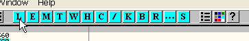
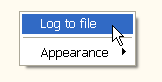

# Глава 12 - Использование сообщений Windows

Данная глава посвящена практическому использованию сообщений Windows.

Следующая цитата вкратце описывает назначение сообщений Windows:

Сообщения в Windows широко используются для уведомления о различных событиях. Если Вы хотите заставить какое-либо окно или контрол (элемент пользовательского интерфейса, на самом деле тоже являющийся окном, как то: кнопка, edit, Toolbar, Tree view и т.д.) совершить определённое действие, отправьте ему соответствующее сообщение. Сообщения также могут исходить от других приложений. Система уведомляет о таких событиях как передвижение мыши, нажатие клавиши на клавиатуре и т.д. также посредством сообщений.

Как мы уже рассмотрели ранее, в OllyDbg можно расставлять точки останова BPX на вызовах различных API-функций. Зачастую более эффективным способом "отловить" интересующие нас участки кода являются точки останова на сообщениях. Их ещё называют BMSG в честь одноимённой команды в ядерном отладчике SoftIce.

Оконные приложения имеют по крайней мере один так называемый цикл обработки сообщений (англ. - message loop). Этот цикл являет собой вызов определённых API-функций (чаще всего используются функции GetMessage и DispatchMessage, но встречаются и другие варианты воплощения message loop). Для более глубокого ознакомления с циклом обработки сообщений автор рекомендует статью "Understanding the Message Loop" (C) Brook Miles:

[http://winprog.org/tutorial/message\_loop.html](http://winprog.org/tutorial/message_loop.html)

*На русском и гораздо более подробно про цикл сообщений можно почитать у братьев Фроловых:*

[http://www.frolov-lib.ru/books/bsp/v11/ch1.htm#ch1\_4](http://www.frolov-lib.ru/books/bsp/v11/ch1.htm#ch1_4)

*Правда, там речь идёт о Win16, но именно по данной теме особых разногласий с Win32 в тексте не наблюдается. Спасибо IceStudent’у за ссылку!*

Давайте рассмотрим простой пример: для того, чтобы выудить серийник из крэкми, мы установим BMSG на сообщение о нажатии кнопки, ведь именно это сообщение должно инициировать проверку введенных данных. Итак, загружаем крэкми CrueHead'а ***\[[ссылка](.gitbook/assets/files/1/ollydbg01-Crackme.7z)\]*** в OllyDbg.

Но сначала попробуем выудить серийник классическим способом, а потом через BMSG и сравним. Для начала проанализируем API-функции, которые импортирует программа, чтобы найти ту, которой скорее всего считывается введенный текст для последующей проверки.

Правый щелчёк в ассемблерном листинге - Search for - Name (label) in current module.

Чаще всего для считывания текста из edit'а используются функции GetDlgItemTextA и GetWindowTextA. Конечно, могут использоваться и юникодовые версии данных функций (с суффиксом W), либо сообщение может посылаться напрямую (тут тоже есть несколько способов различного уровня сложности), либо более экзотический вариант с прямым считыванием буфера edit'а. Короче, и не надейтесь, что в продвинутых крэкми текст из edit'а будет извлекаться банальным вызовом GetDlgItemTextA или GetWindowTextA, но для начала мы рассмотрим именно этот вариант.

В списке видна функция GetDlgItemTextA. Это вовсе не значит, что данная функция используется именно для считывания имени пользователя и серийника (в программе могут быть и другие поля ввода), если вообще используется. Автор крэкми мог намеренно добавить данную функцию в импорт, чтобы ввести нас в заблуждение. Между прочим, функции API можно подгружать динамически (и даже разными способами), т.е. не через импорт. Таким образом, крэкми может на самом деле использовать GetDlgItemTextA, но в списке импорта функции не будет. Не будем пока усложнять и без того нелёгкий материал и предположим, что крэкми действительно использует GetDlgItemTextA для считывания текста из edit'а ;)

Ставим BP на вызов данной функции:

Или так:

После установки BPX, запускаем программу на выполнение, вводим имя пользователя и серийник:

Нажимаем OK - "брякаемся" в коде:

Обратите внимание на стек.

Видим, что один из параметров функции является указателем на буфер, в который будет скопировано содержимое edit'а.

Давайте загрузим данный буфер в дамп посредством команды Follow in dump или через Go to - Expression: 40218E.

Сейчас в буфере пусто, ведь функция ещё не выполнилась.

Давайте дадим этой функции возможность выполниться: Debug - Execute till return.

Теперь в дампе буфера находится имя, которое Вы ввели для регистрации.

Снова задаём команду Run (F9) - опять срабатывает наша точка останова.

Теперь параметр буфера указывает на адрес 40217E. Давайте посмотрим в дампе:

Задаём Execute till return.

А вот и наш серийник!

Как Вам уже должно быть понятно, для извлечения правильного серийника, первым делом нужно поймать момент доступа приложения к введенным данным (в данном случае - имя и пробный серийник). Дальнейший план действий мы рассмотрим чуть позже, а пока попробуем повторить первый шаг, но с использованием BMSG. Многие алгоритмы проверки специально не используют общепринятые API для считывания полей ввода текста, а посылают сообщения напрямую, чтобы насолить реверсеру.

Снимаем все действующие BPX в окне \[B\] командой Remove.

Снова запускаем приложение, вводим имя и серийник, но пока ещё НЕ нажимаем OK.

Одна из особенностей использования BMSG по сравнению с BPX на API-функции заключается в том, что BPX можно расставлять заранее, ещё до запуска процесса, тогда как BMSG имеет смысл устанавливать только после создания окна, чьи сообщения нужно перехватить.

Открываем окно \[W\]indows в процессе отладки (не нужно предварительно останавливать процесс, т.е. статус процесса вполне может быть Running).

Если в списке \[W\]indows пусто, нужно сделать правый щелчёк мышью и выбрать пункт Actualize.

Ищем в списке контрол "кнопка"... В колонке Class должно быть значение Button, а в Title - OK. Есть такой контрол!

Правый щелчёк в строчке данного контрола - выбираем Message breakpoint on ClassProc.

В открывшемся окне нужно указать сообщение, которое мы собираемся поймать. Во всплывающем списке:

Есть тут и стандартные сообщения для статических текстовых контролов и кнопок, и мышиные сообщения, и для буфера обмена и т.д. Если Вы не знаете точно какое сообщение нужно ловить, можете попробовать стандартные группы сообщений (в начале списка). При нажатии левой кнопки мыши система посылает сообщение WM\_LBUTTONDOWN (L означает LEFT, т.е. левая). При отжатии посылается сообщение WM\_LBUTTONUP. На это последнее сообщение мы и повесим BMSG - оно имеет номер 202.

Вот как это должно выглядеть:

Мы выбрали сообщение 202 WM\_LBUTTONUP. Щёлкаем по "Break on any window" и по "Pause program: On message" чтобы отлаживаемый процесс останавливался при поимке указанного сообщения. Ниже выбираем "Log WinProc arguments: On message", ибо регистрация каких-либо аргументов в логе не бывает лишней.

Данный BMSG будет срабатывать как при нажатии OK, так и Cancel, ведь мы указали, что BMSG вешается на все окна. Щёлкаем левой кнопкой мыши по кнопке OK.

В этом месте теряются многие новички, т.к. при срабатывании BMSG попадают в незнакомый участок кода, не принадлежащий основному коду процесса. На самом же деле вернуться к основному коду вовсе не сложно.

Как мы уже знаем, основной код находится в секции, которая начинается по адресу 401000. Ставим BPM on access на данную секцию, чтобы остановиться как только управление попадёт в диапазон адресов этой секции.

Жмём на Run и вскоре останавливаемся уже в коде программы.

Не снимая BPM on access продолжаем нажимать F9 - получается пошаговое выполнение инструкций, но только в пределах текущей секции.

Сразу после выхода по 2м RET, попадаем на участок кода с вызовами GetDlgItemTextA, которые считывают имя пользователя и серийник. Таким образом, мы снова очутились на интересующем нас участке кода, но в этот раз мы не использовали BPX на обращения к API.

Если бы приложение не использовало вызовы API для чтения серийника, методом BMSG мы бы всё равно отыскали данный участок. В этом и заключается преимущество последнего.

Если мы хотим отловить нажатие кнопки OK но не мышью, а через клавиатуру, первым делом снимаем BPM on access: правый щелчёк - Remove memory breakpoint.

Открываем список точек останова в окне \[B\] и удаляем все BMSG опцией Remove.

Снова запускаем программу и открываем окно ввода серийника, но пока ничего не вводим.

Открываем закладку \[W\].

Повторяем уже знакомые действия, но в этот раз выбираем:

Сообщение WM\_KEYUP под номером 101 - это сообщение генерируется при отжатии клавиши.

Нажимаем и отпускаем какую-либо клавишу для ввода первого символа имени пользователя - BMSG не срабатывает, т.к. чтение данных пользователя осуществляется не посимвольно, а целиком. Некоторые крэкми предпочитают проверять серийник по мере ввода, реагируя именно на клавиатурные сообщения - такую возможность важно учитывать!

Можно ли заставить отладчик показывать сообщения "в живую", при этом не останавливаясь, чтобы потом поставить BMSG на те из них, которые представляют интерес?

Для этого нужно сначала установить BMSG на какое-либо сообщение. В данном случае можно снова использовать сообщение под номером 202, предварительно удалив лишние точки останова в списке \[B\], потом спровоцировать его срабатывание нажав и отпустив левую кнопку мыши.

Устанавливаем BMSG, нажимаем мышью кнопку OK (в окне регистрации крэкми).

Срабатывает наш BMSG. Теперь мы его немного переделаем, чтобы ловить все сообщения и сбрасывать в лог.

Открываем список точек останова по закладке \[B\].

В списке находится наш BMSG: правый щелчёк - Edit condition.

Кстати, обратите внимание на то, что BMSG - это всего лишь условная точка останова, условием которой является значение параметра \[ESP+8\] - оно должно равняться 202, т.е. WM\_LBUTTONUP. Давайте посмотрим на стек:

Там хранится значение 202 по адресу ESP+8, чем и вызвано срабатывание BMSG.

Если Вы уже забыли что собой представляет \[ESP+8\], сделайте двойной щелчёк:

По самой верхней ячейке стека.

Адресация теперь показана относительно ESP: $+8 в данном случае означает ESP+8.

В общем, в ячейке \[ESP+8\] находится номер текущего сообщения, которое нам нужно сбрасывать в лог. Изменяем параметры условной точки останова:

В настройках указываем, что значение в выражении, т.е. \[ESP+8\], нужно записывать в лог вместе с другими параметрами функции; чтоб выполнение не останавливалось при срабатывании условного BPX ставим Never в Pause program.

Подтверждаем изменения кнопкой OK, дописываем имя пользователя и серийник, нажимаем OK, смотрим LOG сообщений:

Как видно в логе, сначала приходит сообщение 201 WM\_LBUTTONDOWN, а потом - 202 WM\_LBUTTONUP. Клавиатурные сообщения WM\_KEYDOWN и WM\_KEYUP не обрабатываются, как мы уже заметили.

Чтобы отловить и записать в лог все сообщения, которые получает программа (кнопки, поля ввода текста и т.д.) можно установить условные точки останова на функции обработки сообщений: TranslateMessage и/или DefWindowProcA.

Для более полной картины можете развесить условные BPX на обе функции. Вот как это делается:

Чтобы побыстрее установить оба BPX, давайте воспользуемся плагином CommandBar: BP TranslateMessage, BP DefWindowProcA.

и

Таким образом мы установили 2 обыкновенных BPX на функции API. Давайте переделаем их в условные. Для этого открываем закладку \[B\], правый щелчёк по первому BPX - Follow in disassembler.

Уже "на месте" точки останова задаём Breakpoint - Conditional log.

В качестве выражения, которое нужно записывать в лог, указываем MSG - это номер сообщения (например, для WM\_LBUTTONUP, MSG = 202).

Потом в настройках указываем, что приложение не должно останавливаться и чтобы в лог всё время записывались как текущее выражение так и аргументы функции. Аналогичным образом перенастраиваем второй BPX.

Итак, оба BPX уже превратились в условные.

Так-как результатов будет довольно много, лучше всего сохранять их сразу в файл.

Закладка \[L\] - правый щелчёк - Log to file.

Задаём имя текстового файла. Жмём Run.

Теперь в логе находятся все сообщения, полученные и обработанные оконной процедурой приложения. С помощью этого лога можно составить представление о сообщениях, которые обрабатываются приложением и точнее подобрать кандидатов для последующих BMSG.

Владение различными техниками BMSG бывает очень кстати при снятии NAG'ов и других типичных для реверсинга задач - вот увидите!

В следующей главе мы наконец получим правильный серийник для крэкми CrueHead'а.

\[C\] Рикардо Нарваха, пер. Quantum
