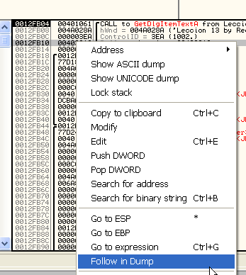

# Глава 13 - Поиск жестко заданного серийного номера. Часть 1

Думаю, что одной из самых актуальных тем сегодняшнего дня является поиск серийных номеров, в первую очередь из-за существования сильных защит, призванных его усложнить, которые мы и рассмотрим шаг за шагом, начиная с самых простых и заканчивая более сложными, практикуясь в такой степени, чтобы закрепить навыки работы с серийными номерами.

Ок, эта часть будет посвящена работе с так называемыми HARDCODED-серийниками (жёстко заданными), которые не высчитываются на основе имени пользователя, то есть являющиеся текстом или числом, которые всегда одни и те же, и зачастую так просты, как никакие другие, и считаются наиболее лёгкими для поиска, поэтому мы и начнём с этого типа. Мы рассмотрим как совсем несложные, так и потруднее.

Для практики у нас есть четыре экземпляра, двое из которых приходятся на эту главу и два посложнее на 14-ую.

Первый из этих крэкми называется "LECCION 13 HARDCODED 1" ***\[[ссылка](.gitbook/assets/files/13/Leccion_13_HARDCODED_1.7z)\]***, и он – самый простой. Откроем его в OllyDbg.

Здесь, как в самом простом случае с жёстко заданными серийными номерами, правильный ответ находится в строках, используемых программой, которые мы можем посмотреть.

Чтобы найти строки, используемые программой, кликнем на правой кнопке мыши и выберем SEARCH FOR – ALL REFERENCED TEXT STRINGS.

Результаты будут следующие:

Здесь мы видим слово "FIACA", которое может быть ключом, и если мы не хотим работать, то можем просто перебирать встречающиеся в этом списке строки, чтобы найти верный, но этот метод не рекомендуется по следующим причинам:

1.  В данном случае строк всего две, но есть программы, в которых тысячи строк и пробовать их одна за одной просто безумие, и хотя в данном случае мы сразу видим возможный правильный серийный номер, если у нас их будет тысяча, то это будет маловероятно.
2.  Есть программы, у которых в этом списке есть строки, не являющиеся серийным номером, но выглядящие специально на него похожими и являющееся ловушками для крэкеров, поэтому гораздо лучше убедиться и проверить, что серийный номер действительно является верным.

Сначала посмотрим, какие API-функции используются, с помощью клика правой кнопкой мыши и выбора SEARCH FOR- NAME (LABEL) IN CURRENT MODULE.

Выводятся API-функции, используемые программой, и видим, что среди них есть нам известные.

Видим, что используется GetDllItemTextA для получения серийного номера, введённого пользователем, и MessageBoxA для вывода сообщений, является ли серийным номер верным или нет. Установим точку останова на каждую из этих API-функций.

Кликаем на обоих правой кнопкой мыши - TOGGLE BREAKPOINT ON IMPORT или то же самое с помощью commandbar’а.

Хорошо, нажимаем F9, чтобы запустить крэкми.

Появляется окошко для ввода серийного номера, давайте введём что-нибудь, например "narvajita", хе-хе (фамилия автора "Narvaja" – прим.пер.).

Нажимаем на "Verificar" (проверить) и видим, что сработал BPX:

Если посмотрим стек, то увидим, что остановка произошла на GetDlgItemTextA, получающая введённый пользователем серийный номер, а в параметрах функции находится адрес буфера, куда он сохраняется, в данном случае – 403010.

Посмотрим, что находится по этому адресу через DUMP. Правая кнопка мыши – FOLLOW IN DUMP.

Видим буфер, но в нём ничего нет, так как API-функция ещё не выполнялась.

Выберем EXECUTE TILL RETURN, чтобы она выполнилась до инструкции RET.

Стоим на RET’е.

А в буфере – то, что мы ввели.

С этим понятно.

Если нажмём F7 и вернёмся в программу.

Увидим, что начинается сравнение и условный переход, который переходит либо на MessageBoxA, показывающий надпись "Mal Muy MAL" ("плохо, очень плохо" - прим. пер.), либо на MessageBoxA, показывающий надпись "Muy BIEN" ("очень хорошо" - прим.пер.) соответственно. Очевидно, что если мы исправим этот переход на JMP 401087, то будет всегда выполняться переход на вывод сообщения "MUY BIEN", но в данном случае я хочу найти серийный номер, поэтому будем смотреть, что сравнивается.

В 401066 в EBX перемещается содержимое памяти по адресу 403010, которое является DWORD’ом. Посмотрим, что находится по адресу 403010 через DUMP.

Отметим нужную строку, через правую кнопку мыши выберем FOLLOW IN DUMP-MEMORY ADDRESS и увидим, что там находится.

В пояснении видим, что там находится 7672616E, являющееся перевёрнутыми 4-мя байтами содержимого 403010, и это первые 4 байта неправильного серийного номера, который мы ввели. Они-то и были перемещены в EBX.

Нажимаем F7 и переходим к следующей строке.

Здесь видим, что EBX, содержащий первые 4 байта неправильного серийного номера, сравнивается с содержимым ячейки памяти по адресу 403008. Посмотрим через DUMP, что там находится, так же как мы делали это в прошлый раз.

Видим, что там находятся первые четыре байта слова "FIACA", которые и сравниваются с первыми четырьмя байтами введённого серийного номера, из чего мы можем заключить, что если бы они были одинаковы, то активировался бы флаг Z, так как между ними не было было разницы, выполнился бы переход JE и вывелось бы сообщение "MUY BIEN", но так как они не одинаковы, то нас ждёт суровое наказание, хе-хе.

Раз они не одинаковы, то перехода не происходит и выполнение идёт к окошку "MAL MUY MAL". Нажимаем F9.

Мы стоим на другом вызове MessageBoxA.

И уже в параметрах функции видим, что она нам покажет.

Продолжаем выполнение программы.

Как видим, было показано окошко с сообщением, что мы ошиблись, жмём на "OK" и вводим правильный код "FIACA".

Нажимаем на "Verificar" и повторяем процесс, пока не доходим до сравнения.

Как и в прошлый раз, содержимое EBX сравнивается с содержимым 403008.

В пояснении видим, что они оба одинаковы, поэтому в результате их вычитания друг от друга получится ноль и активируется флаг Z. Выполним сравнение с помощью F7.

Видим, что всё так и есть, поэтому выполнится JE.

Видим, что переход произойдёт на MessageBoxA c MUY BIEN. Посмотрим с помощью F9.

Здесь видим стек API-функции, которая отобразит нам правильное окошко.

Хотя создатель крэкми очевидно забыл поменять название окошка, это не важно, так как мы нашли правильный серийный номер, который был жёстко и очень просто задан.

Следующий крэкми, который мне предоставил мой друг REDHAWK, похож на предыдущий, но с небольшими изменениями (это он был так ленив, что не изменил заголовок окна на правильный, ха ха ха).

Открываем "[LECCION 13 HARDCODED 2](.gitbook/assets/files/13/Leccion_13_HARDCODED_2.7z)" в OllyDbg.

Как видим, всё очень похоже, но в используемых строках нет правильного кода.

Нет ни "FIACA", ни чего-либо другого похожего, хехе.

Да и верный код вовсе не "FIACA", хехе.

Раз уже знаем, что здесь примерно происходит, идём сразу к сравнению.

Устанавливаем на 401064 BPX и делаем RUN.

Введём неправильный серийный номер (в данном случае LUCKY).

Нажимаем на "Verificar".

И при срабатывании BPX видим, что в EBX помещается содержимое памяти по адресу 40300C. Смотрим через DUMP.

После выполнения этой строки в EBX перемещаются 4 байта, которые меняют порядок при перемещении в регистр.

Нажимаем на F7 и оказываемся на EBX. MOV EBX, DWORD PTR DS: \[40300C\] перемещает только четыре байта.

В этом примере, который почти ничем не отличается, в EDX помещается содержимое 40204B, смотрим, что там.

Там находятся четыре байта, соответствующие строке 9898 и являющиеся правильным серийным номер. Они сравниваются с четырьмя байтами введённого нами серийного номера, и если они одинаковы, то совершается переход в область MUY BIEN, но в данном случае этого не происходит, поэтому нам нужно вернуться и ввести 9898.

Нажимаем "Verificar".

При сравнении EBX с EDX оба равны 38393839, что соответствует строке 9898, поэтому совершается переход на вывод окна MUY BIEN.

Видим, что в этом крэкми мой друг сделал заголовок окна "BRAVO", ха-ха! Но главное, что мы выяснили правильный серийный номер – 9898.

Далее мы увеличим сложность – у нас осталось два более трудных жёстко заданных серийных номера, на которых мы рассмотрим техники, применяемые в более запутанных случаях.

Если вы думаете, что я один буду работать, а вы нет, то вот вам третий крэкми (mielecrackme1.zip ***\[[ссылка](.gitbook/assets/files/1/mielecrackme1.7z)\]***).

В качестве подсказки скажу, что API-функция lstrcmpA, встречающаяся в этом крэкми, используется напрямую для сравнивания строк. Когда встретите её, посмотрите на параметры в стеке.

В главе 14 рассмотрим два более сложных примера жёстко заданных серийных номеров, но перед этим нужно потренироваться на более простых примерах, так что попрактикуйтесь на третьем крэкми, который я вам дал.

\[C\] Рикардо Нарваха, пер. Aquila
