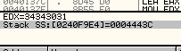
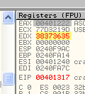

# Глава 14 - Поиск жестко заданного серийного номера. Часть 2

Прежде всего я собираюсь объяснить, как решается крэкми, над которым мы начали работать в главе 13.


Это mielecrackme [\[ссылка\]](.gitbook/assets/files/1/mielecrackme1.7z), загруженный в OllyDbg, и его точка входа. Посмотрим, какие функции API используются с помощью SEARCH FOR-NAME (LABEL) IN CURRENT MODULE.


Вот список найденных api-функций.


Среди них указаны самые важные: GetWindowTextA, использующаяся при вводе серийного номера, lstrcmpA, которая встречалась в предыдущей главе и используется для сравнения строк, и MessageBoxA, отображающая сообщение о том, верен ли серийный номер или нет.

Мы можем установить BPX на эти функции, чтобы произошла остановка, когда будет введён неверный серийный номер, но в данном случае, который весьма прост, можно сделать всё гораздо быстрее, если посмотреть СТРОКИ, используемые программой.


Выполнение SEARCH FOR – ALL REFERENCED TEXT STRINGS даёт нам список строк, которые использует крэкми.


Здесь видим как строку, отображающуюся как в успешном случае, так и строку, показывающуюся в случае неудачи. Если сделаем на какой-нибудь из них двойной клик мышью, то окажемся в окрестностях MessageBoxA. Попробуем сделать двойной клик на "YOU ENTERED THE RIGHT PASSWORD" ("Вы ввели правильный пароль").


Оказались в соответствующем месте.

Сначала идёт GetWindowTextA, считывающая серийный номер, который мы напечатали, затем lstrcmpA, сравнивающая считанный номер с правильным, а затем, если они верны, MessageBoxA показывает "YOU ENTERED THE RIGHT PASSWORD", а если нет, то происходит переход к другому MessageBoxA, отображающему "YOU SHOULD TRY AGAIN, IT'S SO EASY" ("Попробуй ещё раз, это же так просто").

Установим BPX на вызове lstrcmpA, чтобы посмотреть, что она сравнивает.


Запустим программу с помощью F9.


Выскочило окно ввода серийного номера. Введём в него что-нибудь вроде 989898.


Нажмём кнопку CHECK, чтобы сработал установленный нами BPX.


Видим, что OLLY показывает и параметры функции, которые являются двумя сравниваемыми строками, в данном случае сравниваются строки "989898" и "cannabis".

Чтобы выполнить вызов этой API-функции, нажмём F8.


В EAX помещается результат, равный FFFFFFFF или -1, а это означает, что строки не одинаковые.


В результате этого сравнения флаг Z неактивен и инструкция JNZ выполняет переход, т.к. флаг Z равен нулю (вспомним, что JNZ совершает переход, если флаг Z равен нулю, а JZ, наоборот, если флаг Z активен, т.к. равен 1).


Раз мы делаем переход, то получаем сообщение с ошибкой, но зато теперь мы знаем, что сравнение происходит со словом "cannabis", то есть это и есть верный серийный номер. Снова продолжим выполнение программы.


Нажав на "ОК", снова вернёмся в окно ввода серийного номера и напечатаем правильный – "cannabis".


Нажмём кнопку CHECK, и срабатывает BPX.


Видим, что будут сравниваться две одинаковые строки. Жмём F8, чтобы выполнить вызов API-функции..


Обе строки были равны, и в EAX был сохранён результат функции – ноль, что активирует флаг Z.


И поэтому JNZ не будет совершать переход.


А раз так, то как только мы продолжим выполнение программы, отобразится окошко, сообщающее о том, что мы ввели верный серийный номер.


Это и есть решение крэкми из главы 13. Хе-хе, серийным номером является слово "cannabis".

Продолжим дальше и рассмотрим более сложные случаи с жёстко заданным серийным номером, чем те, что мы рассматривали ранее.

В следующем случае уже не производится прямого сравнения серийного номера с введённой строкой. Откроем крэкми crackmeeasy [\[ссылка\]](.gitbook/assets/files/14/crakmeeasy.7z) в OllyDbg.


Мы уже знаем, как посмотреть используемые API-функции. В списке также есть GetDlgItemTextA, на который мы и установим BPX.


В commandbar’е напечатаем:


Теперь запустим программу с помощью F9, и откроется окно ввода серийного номера.


Напечатаем неверный серийный номер.


Кликнем по кнопке "Check" и попадём на вызов нужной нам функции.


Посмотрим, какие параметры в стеке.


Здесь видим буфер, в котором сохраняется неправильный серийный номер, отметим эту строку, затем правый клик мышью и FOLLOW IN DUMP.


Буфер пуст, так как функция ещё не запустилась, поэтому выберем DEBUG-EXECUTE TILL RETURN.


Это приведёт к выполнению функции, которое остановится на инструкции RET.


Нажмём F7, чтобы вернуться в программу.


И видим, что в буфере окажется введенный нами неверный серийный номер.


Здесь мы также видим большую процедуру, делающую что-то с какой-то строкой в виде числа. Кому-нибудь пришла мысль, что это правильный серийный номер? Я знаю, что нет, хе-хе.


Здесь в EAX помещается число 401222, которое является адресом, указывающем на строку, содержащую число-константу.


На следующей строке, где EAX равен 401222:

```assembly
MOV EDX,DWORD PTR DS:[EAX]
```

Это, на самом деле, всё равно, что:

```assembly
MOV EDX,DWORD PTR DS:[401222]
```


То есть содержимое памяти по адресу 401222 перемещается в 401222.

Олли показывает, что это первые 4 байта числа 10445678951.


Выполнение строки с помощью F7 перемещает их в EDX (они всегда перемещаются в регистр в порядке, обратном тому, как они располагались в памяти).


На следующей строке байты, находящиеся в EDX, перемещаются в `[EBP-30]`.


Из пояснений Олли видно, что `[EBP-30]` на моей машине – это 240f9e4. Поищем это значение в DUMP’е.




F7 копирует байты, находящиеся в EDX.


После чего


в EDX перемещаются следующие 4 байта числа-константы.


Пояснения Олли показывают, что `[eax+4]` содержат 401226, и выполнение инструкции с помощью F7 перемещает следующие 4 байта в EDX.



И копируется продолжение того, что копировалось ранее.


В действительности происходит вот что: этот номер копируется по 4 байта в другую часть памяти.


И наконец копируются последние 4 байта.


Наконец-то номер скопирован полностью.

Видим, что чуть ниже находится вызов функции memset. Посмотрим её параметры с помощью OllyDbg.


Здесь три значение (n, c и s).

*   s – начальный адрес
*   n – количество байтов, которых нужно заполнить требуемым значением
*   c – значение, которым будет заполняться указанная область памяти


В стеке находятся вышеуказанные параметры: область памяти по адресу 240f9f0 продолжительностью в 8 байт должна быть заполнена нулями.


Выполнив эту функцию с помощью F8, мы видим, что указанная нами область памяти действительно была заполнена нулями.

Ещё ниже находится вызов lstrlen, которая считает длину строки, адрес которой задаётся непосредственно до вызова самой функции.


В стеке находятся следующие параметры:


То есть будет вычислена длина строки, которая начинается по адресу 240f9E4, что является адресом уже известного нам числа, хех.

F8, и происходит выполнение strlen, а в EAX возвращается длина строки.


Видим, что размер равен 0B, то есть 11 в десятиричной системе, что является длиной нашего номера.


Здесь LEA перемещает в EDX значение EAX минус 1, то есть 0A.

На следующей строке происходит сравнение 0A с содержимым `[EBX-10]`, то есть с нулём.


И раз ноль меньше чем 0A, то переходим на 401360.


На следующей строке в EAX помещается указатель на наш неверный серийный номер, и поэтому когда нажмём на F7, то EAX будет указывать на "98989898".


На следующей строке перемещаем в EDX ноль.


На следующей строке


Так как EAX указывает на начало неверного серийного номер, прибавляем к нему EDX (который изначально равен нулю) для создания цикла, каждый увеличивает значение EDX на 1 (1, 2, 3 и т.п.), чтобы получить все байты неверного серийного номера по одном в указанном цикле.


Как мы уже знаем, MOVSX переместит байт в EDX и если он положителен, то заполняет остаток регистра нулями, а если отрицателен – ‘F’.

В данном случае первый байт неверного серийного номера переместится в EDX и выполнение строки покажет, что EDX стал равным 39.


Следующая строка с LEA.


EDX равен 39, вычитаем из него 14 и с помощью LEA помещаем результат непосредственно в EAX.


То есть в результате произведённых операций получили 39 (шестнадцатиричное значение первого символа моего серийного номера), отняли от него 14 и результат, равный 25, поместили в EAX.


Следующая строка перемещает значение, находящееся по адресу EBP-30 (на моей машине равное 240f9E4, и оно указывает на начало номера-константы), в EDX.


Нажмём F7.


EDX указывает на начало номера-константы.


Далее видим, что в ECX перемещается сначала значение равное нулю, а затем при каждом новом проходе оно увеличивается, чтобы ECX+EDX указывали на разные байты номера-константы.


Здесь видим, что ECX теперь содержит ноль, а EDX указывает на начало номер, поэтому в данном случае в EDX будет помещён первый байт номера, дополнительная информация о котором выводится в пояснении OllyDbg.


Пояснение говорит, что 31 соответствует ‘1’ в кодировке ASCII, что является первой цифрой номера-константы.


Здесь мы дошли до сравнение, где участвуют:


В EAX находится значение 25 (значение первого байта неверного серийного номера (39), от которого было отнято значение 14), а в EDX первый байт номера-константы или 31.

А потому видим, что

```assembly
CMP EAX,EDX
```

на самом деле является

CMP (ПЕРВЫЙ БАЙТ НЕПРАВИЛЬНОГО СЕРИЙНИКА– 14), ПЕРВЫЙ БАЙТ НОМЕРА-КОНСТАНТЫ

```assembly
CMP 25,31
```

И поскольку разность между этими двумя операндами равна нулю, то флаг Z не активируется и выполняется переход JNZ.

Мы вводили неверный серийный номер, а сравнение может дать верный результат, если будет введён правильный серийный номер, чтобы сравниваемые значения были верны.

CMP (ПЕРВЫЙ БАЙТ ПРАВИЛЬНОГО СЕРИЙНИКА– 14), 31

Это и есть условие, при котором сравниваемые значения будут равны.

ПЕРВЫЙ БАЙТ ПРАВИЛЬНОГО СЕРИЙНИКА-14 = ПЕРВЫЙ БАЙТ НОМЕРА-КОНСТАНТЫ

Поэтому

ПЕРВЫЙ БАЙТ ПРАВИЛЬНОГО СЕРИЙНИКА = ПЕРВЫЙ БАЙТ НОМЕРА-КОНСТАНТЫ + 14


ПЕРВЫЙ БАЙТ ПРАВИЛЬНОГО СЕРИЙНИКА = 31 + 14

ПЕРВЫЙ БАЙТ ПРАВИЛЬНОГО СЕРИЙНИКА = 45, что соответствует "E" в ASCII.

То есть первая буква серийного номера равна E.

Эта побайтовая проверка повторяется в цикле до конца.

ПЕРВЫЙ БАЙТ ПРАВИЛЬНОГО СЕРИЙНИКА = ПЕРВЫЙ БАЙТ НОМЕРА-КОНСТАНТЫ + 14

ВТОРОЙ БАЙТ ПРАВИЛЬНОГО СЕРИЙНИКА = ВТОРОЙ БАЙТ НОМЕРА-КОНСТАНТЫ +14

ТРЕТИЙ БАЙТ ПРАВИЛЬНОГО СЕРИЙНИКА = ТРЕТИЙ БАЙТ НОМЕРА-КОНСТАНТЫ +14

Вот таким образом.

Применим этот алгоритм для каждого байта, прибавляя 14 и получая значение байта, соответствующее верному серийному номеру.

```
31 30 34 34 35 36 37 38  10445678
39 35 31 00 00 00 00 00  951.....
```

```
31 + 14 = 45 это буква **E** в ASCII
30 + 14 = 44 это буква **D** в ASCII
34 + 14 = 48 это буква **H** в ASCII
34 + 14 = 48 это буква **H** в ASCII
35 + 14 = 49 это буква **I** в ASCII
36 + 14 = 4A это буква **J** в ASCII
37 + 14 = 4B это буква **K** в ASCII
38 + 14 = 4C это буква **L** в ASCII
39 + 14 = 4D это буква **M** в ASCII
35 + 14 = 49 это буква **I** в ASCII
31 + 14 = 45 это буква **E** в ASCII
```

Поэтому правильный серийный номер следующий:

`EDHHIJKLMIE`

Введём его в окне серийного номера, убрав предварительно все точки останова.


Нажмём "Check".


Мы рассмотрели как выполняется цикл сравнения, как формировались значения, как последовательно перебирались байты номера-константы и неверного серийного номера и исходя из чего выдавалось сообщение о корректности или некорректности введённого серийного номера.

Этот крэкми не такой простой как предыдущий, но думаю, что вам полезно попрактиковаться, чтобы играть в эти игры лучше.

Ок, прилагаю к этой части крэкми "Splish" [\[ссылка\]](.gitbook/assets/files/14/Splish.7z), попробуйте найти серийный номер, захардкоденный в нём.

\[C\] Рикардо Нарваха, пер. Aquila
