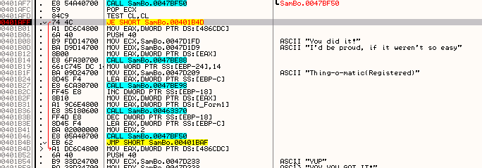

# Глава 15 - Поиск жестко заданного серийного номера. Часть 3

Прежде, чем перейти к последнему из крэкми с жёстко заданными серийными номерами, рассмотрим тот, который я оставил вам в прошлый раз для самостоятельной работы. Он назывался SPLISH ***\[[ссылка](files/14/Splish.7z)\]***.

Откроем его в OllyDbg.

Он открывается на точке входа (ENTRY POINT).

Смотрим используемые API-функции (правая кнопка мыши - SEARCH FOR-NAME (LABEL) IN CURRENT MODULE).

Видим список используемых API-функций.

Видим, что используется GetWindowTextA при вводе серийного номера и MessageBoxA для отображения сообщения, правилен ли он или нет. Можем установить BPX на обе функции, но сначала ещё глянем, что покажет список строк, используемых программой.

Кликаем правой кнопкой мыши на листинге и выбираем SEARCH FOR-ALL REFERENCED TEXT STRING.

Здесь видим текст окошка с поздравлением, которое отображается если был введён правильный серийный номер, поэтому кликнем два раза на этом тексте, чтобы увидеть где он используется. Мы окажемся в окрестностях того места, где к нему есть обращение.

Попадаем в область, где ведётся работа с серийным номером.

Видим ввод текста с помощью функции GetWindowTextA и два MessageBoxA с разным текстом: правилен ли серийный номер или нет.

Ставим здесь на вызов API-функции GetWindowTextA BPX, чтобы начать с того места, где вводится серийный номер.

Запускаем крэкми с помощью F9 или RUN.

Так как пока что мы можем решить только ту часть, которая относится к жёстко заданным серийным номерам, пишем в поле HARDCODED, которое находится наверху, неверный серийник или нажимаем на кнопку CHECK HARDCODED.

Останавливаемся на BPX, установленный ранее.

Пояснения показывают нам, что находится в стеке и это даёт нам сразу понять, что буфер, в котором будет сохранён введенный серийный номер, находится по адресу 403215.

Посмотрим через DUMP, что находится в буфере.

Вот этот буфер, куда будет сохранён введённый серийный номер. Нажимаем F8, чтобы выполнить вызов API-функции.

Так как использовали F8, выполняется вся функция, так что неправильный серийник уже находится в буфере.

Ок, следующая строка переместит 401353 в EAX (помните, что LEA не перемещает содержимое ячейки памяти по заданному адресу, а только результат того, что находится в квадратных скобках; в данном случае это будет 401353). Видим в DUMP’е, что по вышеуказанному адресу (кликаем на строке правой кнопкой мыши и выбираем FOLLOW IN DUMP-MEMORY ADDRESS, и это нам покажет, что находится по адресу 401353).

По адресу 401353 находится строка "HARDCODED"; нажимаем F7, чтобы выполнилась LEA.

После выполнения в EAX остаётся 401353, а с правой стороны появляется пояснение, что данный адресу указывает на строку "HARDCODED".

Следующая строка загружает в EBX другой адрес, в данному случае это 403215.

После нажатия F7 EBX содержит значение 403215.

И справа Олли показывает нам, что этот адрес указывает на строку "98989898", являющуюся введёнными нами неправильным серийным номером, который мы посмотрим в DUMP’е так же, как сделали это для предыдущей инструкции.

Здесь 403215 указывает на наш неправильный серийный номер.

Следующая строка проверяет, равен ли нулю первый байт содержимого EAX, который равен 401353.

Так как мы уже смотрели содержимое по этому адресу через DUMP, то уже знаем, что там находятся байты строки "HARDCODED".

Первый байт в данном случае равен 48, пояснения OllyDbg нам также говорят, что это соответствует символу "H" в кодировке ASCII, а это первая буква слова "HARDCODED". Так как это не ноль, то продолжаем.

Так как сравнение не активирует флаг Z (операнды не равны друг другу), JE не совершает перехода (помните, что JE срабатывает только тогда, когда активируется флаг Z),

Нажимаем на F7 и продолжаем.

Здесь очень хорошо видно, что сначала будет перемещён первый байт \[EAX\], равный 48, что соотвтествует слову "HARDCODED", а на следующей строке перемещается \[EBX\], являющийся первым байтом неправильного серийного номера, после чего оба сравниваются и если они не равны, то происходит переход на 4013D2, где выводится сообщение "SORRY, PLEASE TRY AGAIN".

Проверим это следующим образом.

Нажмём F7 и переместим в CL значение 48.

CL, как мы помним, это регистр, соответствующий двум последним цифрам ECX, здесь перемещаем 48, и вот, что получится в результате.

Затем в DL перемещается первый байт неправильного серийного номера.

Выполним строку с помощью F7, видим, что в DL находится значение 39.

Теперь CL сравнивается с DL.

Пояснение OllyDbg не оставляет сомнение: сравнивается 39 (что есть 9, т.е. первый символ введённого мной серийного номера с H, являющейся первым символом строки "HARDCODED").

Видим, что они не равны, поэтому совершается переход на сообщение с ошибкой, а поведение, если бы они были равны, можем сэмулировать, изменив значение флага Z, сделав по нему двойной щелчок.

Теперь Z равен 1, как если бы в сравнении двух байтов они были равны и их вычитание друг от друга дало бы ноль, активировав данный флаг.

Видим, что в этом случае происходит увеличение EAX и EBX и переход с помощью JMP на начало цикла.

Теперь EAX указывает на второй байт строки "HARDCODED" и видим, что цикл повторяет побайтовое сравнение, пока \[EAX\] не будет указывать на ноль, то есть пока не завершится строка "HARDCODED" (в конце строки за последним символом находится ноль).

Тогда, после увеличения значения EAX и EBX на 1, будут считаны и сравнены друг с другом вторые байты, если равны, то цикл повторится, но уже будут рассматриваться третьи байты, а когда слово "HARDCODED" закончится, то если все сравнения на равенство CL с DL прошли успешно, перехода на окошко с ошибкой не произойдёт и попадём вот куда:

Здесь EAX указывает не на какой-либо из байтов слова "HARDCODED", а на ноль, так как строка уже закончилась.

Вот и тот самый ноль, а это значит, что сработает соответствующая проверка.

Срабатывает JE и мы выходим из цикла.

И попадаем в то место, где отображается сообщение о правильно введённом номере (так как поменяли значение флага Z при побайтовом сравнении, хе-хе).

Очевидно, что менять значение флага Z пришлось при каждом сравнении CL с DL, чтобы программа поверила в одинаковость обоих серийников и не перешла на сообщение об ошибке и не вышла, но в любом случае мы теперь знаем, что правильный серийный номер – это слово "HardCoded" (с соблюдением прописных и строчных букв, так как у них разный ASCII-код).

Уберём все точки останова, введём найденный серийный номер и нажмём кнопку "CHECK HARDCODED".

Ещё одна победа, поздравляю.

Хорошо, тогда переходим к последнему крэкми с жёстко заданным серийным номером и заканчиваем на этом с ними, а в главе 16 перейдём к следующей теме.

Алгоритм следующего крэкми, который называется SAMBO ***\[[ссылка](files/15/SamBo.7z)\]***, отличается от предыдущих. Откроем его в OllyDbg.

Выходим из этого окошка, которое говорит нам, что файл, возможно, самораспаковываемый или автомодифицируемый. Такие файлы на крэкерском жаргоне мы называем пакованными, запакованными или сжатыми. В дальнейшем мы изучим их подробно, но пока запустим его в OllyDbg и, несмотря на то, что он запакован, попробуем найти серийный номер.

Соглашаемся с предупреждением OllyDbg и прибываем в EP.

С помощью ещё одного окошка OllyDbg сообщает нам, что программа, возможно, запакована или зашифрована, поэтому анализ её будет настолько же неэффективным, как пепельница в мотоцикле, так как программа будет распаковывать себя во время выполнения, поэтому пока что выберем "Нет".

Уже на первых строках листинга мы можем заметить, что этот крэкми выполняется не так, как его не запакованные сородичи, чья первая секция начинается с 401000.

Здесь точка входа равна 4d4001.

Посмотрим, является ли секция исполняемой, для этого идём VIEW-MEMORY или нажмём клавишу M.

Видим, что программа стартует в секции, начинающейся с 4D4000, размер которой равен 2000 (в шестнадцатеричной системе), и поэтому 4d4001 – это адрес, который относится к данной секции.

Это и есть то, о чём говорила OllyDbg – точка входа находится за пределами секции code.

Секция CODE начинается с 401000, а выполнение начинается с адреса 4D4001, который относится к другой секции. OllyDbg нам сообщила, что это характеристика многих запакованных программ.

Секция, в которой находится точка входа, соответствует распаковщику, и как только он отработает и сделает то, что должен сделать, он сделает переход на секцию code, где и будет выполнена сама программа.

А раз так, нажимаем F9.

Мы уже знаем, что когда появится окошко крэкми для ввода серийника, программа уже распакована в памяти и выполняется в секции code, поэтому можем установить на эту секцию BPM ON ACCESS , чтобы остановить выполнение на её первой строке.

При попытке вернуться в окошко крэкми OllyDbg остановится в секции code (т.е. первой секции после PE-заголовка).

Видим, что теперь программа распакована в памяти, можем её анализировать. Кликнем правую кнопку мыши в листинге.

Видим, что OllyDbg прекрасно показывает нам проанализированный код.

Теперь, когда мы находимся в секции code, можем посмотреть какие api используются программой – то, что мы не могли посмотреть в начале, так как в тот момент нам показывались только API-функции, используемые распаковщиком, а не те, которые используются программой; сейчас же никаких проблем нет.

Уфф, какой ужасный список и ничего знакомого, посмотрим список строк; ясно, что с этим у нас тоже были бы проблемы в начале, так как находились в другой секции, и кроме того, строки были запакованы вместе с программой, так что ничего бы мы не увидели.

Ещё один ужасный список.

"YOU DID IT" – одна из строк с поздравлением.

Хорошо, есть сравнение и переход, где мы видим строки с поздравлением и ошибкой, хотя здесь и нет MessageBoxA.

Устанавливаем BPX на условный переход, чтобы проверить, решающий ли это переход, и убираем BPM ON ACCESS щелчком правой кнопки мыши.

И делаем RUN.

В окне крэкми вводим "Narvajita" или любой другой неправильный серийный номер.

Нажимаем кнопку "Test-o-Doom".

Видим, что произошёл переход, нажимаем F9.

Тогда соглашаемся с окошком с поздравлением, что у нас получилось.

Оно говорит, что это была шутка, и ничего не вышло на самом деле, ха ха! Делаем RUN по-новой и снова прибываем к переходу, связанному с кнопкой "Test-o-Doom".

Инвертируем переход, чтобы посмотреть, отобразится ли окошко с поздравлением и понять, отвечает ли за это вообще данный переход.

После двойного щелчка на флаге Z и изменения его значения, делаем RUN.

И отображается окошко с поздравлением, значит, это и есть то место, где решается правильность или неправильность серийного номера. Посмотрим сравнение до перехода.

Это TEST CL, CL, где проверяется, равен ли CL нулю или единице, что задаётся где-то до этого, возможно в CALL, вызываемый ранее, на который мы можем поставить BPX.

Делаем RUN, возвращаемся в окно и снова нажимаем кнопку Test, чтобы остановиться на CALL.

Остановившись, осмотримся любопытным взором вокруг, хе-хе.

Если посмотрим в стек, то увидим введённый неправильный серийный номер, заглянем в DUMP (через FOLLOW IN DUMP).

Мой глаз крэкера видит здесь строку, которая, возможно, является верным серийником; могли бы посмотреть, так ли это, но пока делать этого не будем и продолжим поиск серьёзным образом.

Если внутри данного CALL производятся какие-либо сравнения или операции с неправильным серийником, то можно установить BPX ON ACCESS на него, чтобы программа остановилась, когда с ним будет что-нибудь делаться, то есть на какой-либо операции или сравнении.

Выделим неправильный серийный номер, нажмём правую кнопку мыши и выберем BREAKPOINT-MEMORY ON ACCESS.

После этого, когда продолжим выполнение, то если внутри call происходит какая-либо работа с этим серийником, OllyDbg остановится.

Нажимаем F9.

Видим, что остановки не произошло, возможно, сравнение происходит раньше, так что мы можем поставить точки останова на CALL'ы, находящиеся ещё выше, и повторить то, что делали прежде, но лучше пустим в ход другой способ остановиться на том месте, где вводится серийный номер: здесь не используется API-функция GetWindowTextA, но у нас есть сообщения Windows, которые послужат нам не хуже.

Убираем BPM ON ACCESS.

Ставим быстрым способом BP TranslateMessage.

А теперь RUN.

Остановившись на API-функции, нажимаем на правую кнопку мыши и выбираем:

И в окошке печатаем условие MSG==202, которое является значением WM\_LBUTTONUP.

И устанавливаем переключатели так, чтобы остановка происходила по ON CONDITION, и чтобы логгировалось всё.

Здесь розовым цветом обозначен BPX CONDICIONAL. Делаем RUN.

Открывается окошко крэкми и, чтобы избежать путаницы, меняю серийный номер на тот случай, если предыдущий остался в памяти.

И по нажатию на кнопку срабатывает BPX CONDICIONAL.

Остановка произошла на WM\_LBUTTONUP.

Возвращаемся в программу с помощью EXECUTE TILL RETURN.

Нажимаем F7 и возвращаемся в программу.

Здесь у меня появляется две возможности. Установить BPM ON ACCESS в первой секции, чтобы сделать переход с помощью F9 и посмотреть, куда ведёт процедура сравнения серийного номера, что мне кажется сложноватым, так как я уже видел, что эта процедура весьма большая.

Другая возможность – это посмотреть, находится ли уже в памяти введённый нами серийный номер, так что идём в окно M.

Кроме того, что оно позволяет просматривать секции, здесь можно искать строки, находящиеся в памяти, кликаем правую кнопку мыши и выбираем SEARCH.

В появившемся окне в поле ASCII введём наш неправильный серийник.

Нажимаем OK, чтобы начать поиск в памяти.

С помощью CTRL+L можно искать остальные вхождения этого слова, но больше ничего не находим ни в секции, которую мы открыли, ни в остальной памяти.

Устанавливаем BPM ON ACCESS на этот неправильный серийник, чтобы найти момент, когда с ним производятся какие-либо операции, чтение или сравнение.

И нажимаем F9.

Останавливаемся там, где он копируется в то место, которое мы видели в последнем CALL’е.

Мы знаем, что REP MOVS копирует содержимое из ESI в EDI, так что посмотрим EDI в DUMP (правая кнопка мыши на EDI-FOLLOW IN DUMP).

Сюда REP MOVS скопирует серийник, нажмём F8, чтобы он это сделал.

Оказались после этого на RET, серийник полностью скопировался, и устанавливаем на него BPM ON ACCESS.

Выполнив RUN, останавливаемся здесь.

Точнёхонько на сравнение, хех.

ESI указывает на мой неправильный серийник, а EDI на правильный, который равен "1556555".

Убираем все BPX.

Появляется окошко с поздравлением.

В следующей главе мы начнём разбор крэкми, в который используются не только серийный номер, но и имя пользователя.

\[C\] Рикардо Нарваха, пер. Aquila
