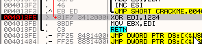

# Глава 16 - Поиск переменного серийного номера. Часть 1

В этой части мы начнём разбор крэкми, которые отличаются от предыдущих тем, что серийный номер является переменным и высчитывается на основе имени, которое мы вводим.

Способ его решения очень похож, но рассмотрим несколько примеров, чтобы всё стало понятным.

## Крэкми CrueHead’а

Начнём с поиска правильного серийного номера в крэкми CrueHead’а ***\[[ссылка](files/1/ollydbg01-Crackme.7z)\]***.

Откроем его в OllyDbg.


Мы находимся на точке входа.

Смотрим какие API-функции используются для получения введённого серийного номера.


Попробуем установить BP на указанной функции, чтобы остановиться на том месте, где будет считываться имя и серийный номер.


Делаем RUN.


После нажатия на OK оказываемся на api-функции и в стеке видим параметры.


Буфер, в котором сохраняется введённый текст, начинается с 40218E, посмотрим через DUMP, что там находится – правый клик мыши и FOLLOW IN DUMP на строке, где приводится информация о буфере.


Здесь ничего нет, потому что API-функция ещё не выполнилась, так что выполняем DEBUG-EXECUTE TILL RETURN, и когда оказываемся на RET, нажимаем F7, чтобы вернуться в программу.


Видим, что в буфере сохранилось моё имя, чтобы в дальнейшем произвести соответствующие операции и создать правильный ключ для него. Если мы хотим сделать кейген, то должны изучить алгоритм, который выполняется программой для вычисления ключа из имени, но пока что просто дадим программе его сгенерировать и попытаемся посмотреть, где с ним сравнивается введённый нами серийный номер.


Встречаем ту же API-функцию во второй раз. Здесь используется новый буфер, куда помещается введённый серийник. Посмотрим его через дамп.


То же самое, что и в прошлый раз; выполняем API-функцию с помощью EXECUTE TILL RETURN, а чтобы вернуться в программу, нажмём F7.

Теперь здесь наш неправильный серийный номер, начиная с этого места программа будет сравнивать его с правильным, который высчитывается на основании имени, поэтому можем установить BPM ON ACCESS на неверном серийнике, чтобы узнать, что с ним делает программа.


Отметим нужные байты, правый клик – BREAKPOINT – MEMORY ON ACCESS и RUN.


Видим, что остановка произошла там, где программа считывает первый байт неправильного серийного номера и перемещает его в BL. Нажимаем F7.

В BL находится 39 – значение первого байта. Нам нужно отловить, что программа делает с ним и, по возможности, записать, какие математические действия программа над ним совершает.


Здесь делается проверка на то, равен ли он нулю, если да – это конец строки и произойдёт выход из цикла.


Так как нулю первый байт не равен, то перехода не происходит и попадаем на SUB BL, 30.


После того, как было вычтено 30, в BL осталось 9.

На следующей строке EDI умножается на EAX.

s

Эти регистры были инициализированы следующими значениями: в начале процедуры в EAX было помещено 0A, а EDI до входа в цикл приравнен к нулю с помощью инструкции XOR EDI, EDI.


По нажатию F7, как мы помним, исходя из определения инструкции IMUL с двумя операндами, в данном случае, они будут умножены с учётом знака, а результат сохранён в первый операнд, т.е. в EDI.


Таким образом, в EDI остаётся ноль, ставший результатом выполнения предыдущей операции.


Дальше идёт сложение EDI со значением в EBX.


В результате в EDI остаётся 9, а на следующей строке выполняется инструкция INC ESI, что увеличивает ESI, чтобы затем вернуться на начало цикла и прочитать следующий байт неправильного серийника.


После это в AL снова помещается значение 0A, прочитывается следующий байт неправильного серийного номера (это будет 38), проверяется, равно ли оно нулю, из него вычитается 30 и прибываем в IMUL.


Видим, что умножается EDI, в котором осталось значение ещё с прошлого пробега цикла, на 0A, а результат помещается в EDI же.


Теперь EDI содержит 5A, а на следующей строке он складывается с EBX.


То есть результат всех производящихся операций накапливается в EDI; тем, кто усерден и прилежен на ниве крэкинга, уже ясно, что происходит. Объясним.


Достаточно установить точку останова на выход из цикла: нажимаем F9 и, когда происходит остановка, видим, чему равен EDI.


Если кликнем два раза на EDI.


Значение EDI – значение шестнадцатеричное, во втором поле видим его же в десятеричной системе счисления, и это значение соответствует серийному номеру, введённому мной, т.е. после выхода из цикла в EDI содержится серийник в шестнадцатеричном виде.

Т.е. резюмируя кратко: если напечатаем слово 98989898, оно будет трансформировано в десятеричное число 98989898 или шестнадцатеричное 5E6774A.



На следующей строке EDI xor’ится с 1234.


В результате получается 5E6657E, которое перемещается в EBX, а затем мы прибываем в RET.


Видим, что выйдя через RET, мы оказались у сравнения EAX с EBX, то есть туда, где находится переход, решающий, правилен или нет серийный номер.


И видим, что сравнивается вычисленное значение, находящееся в EBX с EAX, который содержит 547B.

Так как EAX определяется программой, а EBX – высчитывается, то очевидно, что поскольку мой серийный номер неверен, то и значения этих регистров не будет равно.

Если EBX был бы равен EAX, то программа сделала бы нужный переход, поэтому нам нужно проанализировать, отчего произошло неравенство регистров.

Смотрим сделанные нами заметки.

EBX= (Шестнадцатиричное значение неверного серийного номера) XOR 1234

Мне нужно, чтобы EBX был равен EAX, тогда проверка на равенство выдаст нужный результат.

Если EAX=EBX

Заменим EBX на EAX, то есть чтобы они были равны.

EAX=(Шестнадцатиричное значение правильного серийного номера) XOR 1234

При выполнении этого условия введенный серийный номер будет верным.

Переформулируем.

EAX XOR 1234= (Шестнадцатиричное значение правильного серийного номера)

И поскольку в EAX есть значение (547B), то можем заменить на него EAX.

547B XOR 1234 = (Шестнадцатеричное значение правильного серийника)

Если посчитаем результат операции XOR:

464F = (Шестнадцатеричное значение правильного серийника)

Если 464F – это шестнадцатеричное значение, то соответствующее десятеричное, которое нужно ввести, будет:


Переводим в десятеричную систему.


Это и есть правильный серийный номер для имени “narvaja”. Убираем все BPM и BP.


Нажимаем OK.


Так мы получили серийник для моего имени.

Это один способ решения. Можно прибегнуть и к другому ходу мысли, чтобы придти к тому же результату.

Если над моим неправильным серийным номером выполняются некие операции, трансформирующие его, то эти операции назовём функцией F.

F (неправильный серийный номер) =EBX

То есть над неправильным серийником производятся операции, называемые функцией F, результат чего сохраняется в EBX, с которым и происходит сравнение.

Другим членом сравнения является EAX, что приводит нас к следующему равенству:

F (правильный серийный номер)=EAX

Применение вышеуказанных операций над правильным серийным номером в данном случае даст то же значение, что и в EAX, поэтому если у нас есть EAX, то мы также имеем на руках данные для сравнения и производимые операции.

Чтобы получить правильный серийный номер, нужно применить над EAX операции, обратные используемым при проверке введённого серийника.

Правильный серийный номер = (операции, обратные F)EAX

То есть, если неправильный серийный номер перед сравнением складывается с каким-то значением, то мы должны это значение отнять от EAX, таким образом применяя обратную операцию.

В данном случае операцией, обратной XOR, является тот же самый XOR, так как эта операция инвертируемая.

Поэтому XOR EAX будет функцией обратной F и даст мне шестнадцатеричное значение правильного серийного номера, из которого, если переведём его в десятеричную систему, получится собственно серийник.

Таким образом, можем применять любой из этих способов, чтобы получить правильный серийный номер, за исключением тех случаев, когда у операции нет обратного эквивалента. Мы рассмотрим и такие варианты.

Теперь снова вернёмся к SPLISH. Мы решили ту часть, которая касалась жёстко заданного серийника, а теперь решим вторую с вводом имени пользователя.

## Крэкми Splish

Загрузим SPLISH ***\[[ссылка](files/14/Splish.7z)\]*** в OllyDbg и окажемся на точке входа.


Смотрим используемые API-функции.


Ставим BPX на уже знакомую нам GetWindowTextA.


И запускаем программу с помощью F9.


Вводим имя и неверный серийник, после чего нажимаем кнопку NAME/SERIAL CHECK.


Остановившись на вызове API-функции, смотрим буфер.


Ищем буфер в DUMP’е.


Так как здесь ничего нет, выполним EXECUTE TILL RETURN, чтобы остановиться на RET, а затем нажмём F7 для возврата в программу.


Видим, что сначала получили неправильный серийный номер, поэтому отмечаем его и устанавливаем BPM ON ACCESS.


Делаем RUN.


Снова останавливаемся на вызове той же функции, которая в этот раз получает из формы имя, но поскольку нам это сейчас не интересно, снова нажимаем RUN.


Останавливаемся на этой процедуре.

Первая строка перемещает первый байт неправильного серийник. Если выполним её:


Дальше следует инструкция CDQ. Посмотрим, что о ней говорит наш друг Google.

```assembly
CDQ
IDIV ESI
```

Инструкция IDIV ESI делит содержимое EDX:EAX на ESI, сохраняя результат деления в EAX, а остаток в EDX. Чтобы это деление было эффективным, содержимое EDX должно быть равно нулю, что можно сделать с помощью CDQ или XOR EDX, EDX. В этом случае не нужно помещать ноль в регистр EDX, потому что результат предыдущей инструкции уже делает это.

В этом случае EDX подготавливается перед делением для получения остатка, а поскольку у нас здесь цикл, то каждый раз для этой цели перед выполнением команды IDIV используется CDQ.

EDX:EAX делится на ECX, результат помещается в EAX, а остаток в EDX. Ок, посмотрим как это работает. Первый байт равен 39, он делится на ECX, который содержит 0A.


Видим, что получилось.


Здесь результат деления (5) оказывается в EAX, а остаток (7) – в EDX.


Видим, что следующая строка сохраняет результат деления в 40324D. Посмотрим через DUMP, что там.


Продолжаем выполнение с помощью F7.


Здесь сохраняется 7.


Видим, что EBX, равный нулю, увеличивается на 1 и сравнивается с 6, и так как эти значения не равны, то цикл повторяется.


Теперь посмотрим, что происходит со вторым байтом.


Снова происходит деление на 0A и сохранение остатка.


Сохраняем…


Ок, одна и та же операция производится над всеми байтами.


И выходим из цикла, так как не происходит перехода с помощью JNZ, возвращавшего нас раньше.


Попадаем сюда и видим сообщения о правильном и неправильном вводе серийного номера, похоже, что мы находимся рядом с тем, что нам нужно.


Здесь два LEA, которые помещают адреса в ESI и EDI.


ESI указывает туда, где сохраняются остатки, а EDI, возможно, на что-то интересное?


Продолжаем.


Видим, что EBX содержит ноль, который сравнивается с 7, и если бы они были равны…


Перешли бы на окошко с сообщением о правильном вводе. В середине находится другой JNZ, который перемещает на другое окошко с сообщением о неправильном вводе.


Ок, видим, что сравнивается.


В EAX переместится первый байт, на который указывает EDI, то есть 02, а в ECX будет перемещён первый байт наших остатков, то есть 7.


И если остаток первого байта был бы равен 02, то был бы совершён переход.

В моём случае найти остаток можно было бы следующим образом.

39 - 5 x 0A = 7

То есть результатом деления 39 на 0A является 5 с остатком 7. Переформулируя, можно сказать, что умножив 0A на 5, получим 32 и прибавление 7 даст 39.

39 = 5 x 0A + 7

Правильный остаток должен быть равен двум в случае правильного серийного номера.

ПРАВИЛЬНЫЙ БАЙТ = 5 x 0A + 2

ПРАВИЛЬНЫЙ БАЙТ = 32 + 2 = 34

34 это цифра 4 в ASCII.

Мы можем также увидеть, что

ПРАВИЛЬНЫЙ БАЙТ = 5 x 0A + 2

Даёт нам одно из цифровых значений (от 30 до 39). В случае, если результат выходит за эту границу, то нужно сделать понижение и считать так:

ПРАВИЛЬНЫЙ БАЙТ = 4 x 0A + ОСТАТОК

Ок, посчитали, что первый байт равен 34 или ‘4’ в ASCII.

Высчитаем другие правильные байты с помощью наших остатков.


C 02 уже посчитали.

Продолжаем с 08.

ПРАВИЛЬНЫЙ БАЙТ = 5 x 0A + 8

ПРАВИЛЬНЫЙ БАЙТ = 32 + 8

Получилось 40, что превышает максимальное установленное нами значение 39 (‘9’ в ASCII), поэтому понижаем и пересчитываем заново:

ПРАВИЛЬНЫЙ БАЙТ = 4 x 0A + 8

ПРАВИЛЬНЫЙ БАЙТ = 28 + 8 = 30, то есть ‘0’ в ASCIII

Если хотите доказательство, то смотрим, что 30, делённое на 0A, даёт 4 с остатком 8.


Поэтому у нас есть второй правильный байт, равный 30, то есть 0 в ASCII.

Посчитаем всё остальное байт за байтом.

Следующий опять 08, то есть результатом будет 30 или 0 в ASCII.

Потом 03.

ПРАВИЛЬНЫЙ БАЙТ = 5 x 0A + 3

ПРАВИЛЬНЫЙ БАЙТ = 32 + 3 = 35, то есть 5 в ASCII.

Затем 05.

ПРАВИЛЬНЫЙ БАЙТ = 5 x 0A + 5

ПРАВИЛЬНЫЙ БАЙТ = 32 + 5 = 37, то есть 7 в ASCII

Потом снова идёт 5, то есть повторяется 37 или 7 в ASCII.

Последним идёт 3, который, как мы уже знаем, даёт 35 или 5 в ASCII.

Таким образом, правильным серийным номером для имени "narvaja" будет 4005775. Убираем все BPM и BPX и запускаем RUN.


Нажимаем кнопку NAME/SERIAL CHECK.


Ещё одна победа.

К этой главе прилагаетcя крэкми для практики под названием MEXCRK1.ZIP ***\[[ссылка](files/16/mexcrk1.7z)\]***.

\[C\] Рикардо Нарваха, пер. Aquila
