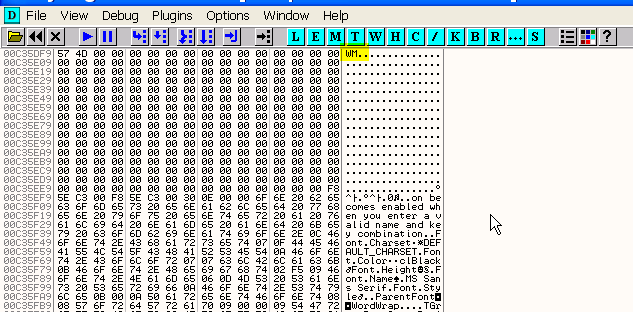
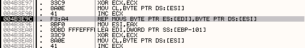

# Глава 17 - Поиск переменного серийного номера. Часть 2

## Крэкми CrueHead’а

Хорошо, прежде всего мы решим крэкми MEXCRK1.ZIP ***\[[ссылка](files/16/mexcrk1.7z)\]***. Он очень лёгкий. Откроем его в OllyDbg и окажемся в точке входа.

Смотрим строки, которые используются программой. Нажимаем правую кнопку мыши.

Видим среди строк следующие:

Можем кликнуть на той, которая сообщает об успехе, или сообщающей о неудаче, чтобы попасть в интересующую нас область программы.

Видим, что здесь есть call, после которого управление передаётся на код либо с "WRONG CODE DUDE", либо c "THANKS YOU MADE IT".

Устанавливаем BPX на CALL в 42d534 и нажимаем RUN.

Введём неправильный серийный номер в поле, которое называется "Enter Serial #".

В моём случае печатаем Narvajita.

Если войдём в режиме трассировки в CALL, то увидим, что сравнивается введённый серийник "Narvajita" со строкой "Benadryl".

Ок, теперь мы оказываемся рядом со сравнением, так что правильным серийным номером является слово "Benadryl". Сделаем RUN по-новой, убрав предварительно все BPX.

Здесь видим, что нас поздравляют с нахождением правильного серийного номера .

## Игра Canasta v5.0

Ок, теперь разберём последний случай подобного типа, а со следующей главы начнём новую тему. Это небольшая программка, являющееся игрой под названием canasta 5.0 ***\[[ссылка](files/17/cansetup.7z)\]***.

Эта программа относится к той категории, где кнопка OK в начале недоступна для нажатия, но когда пользователь заканчивает вводить свои данные, то если они верны, на неё становится возможным нажать.

Установим программу и зайдём в About.

Она стоит, друзья, 20 долларов, вернее 19.95.

Видим кнопку "ENTER LICENSE".

Здесь говорится, что кнопка OK станет доступна, когда будет введена правильная комбинация.

Запустим программу в OllyDbg.

Мы оказываемся в точке входа.

Уфф, список используемых API-функций велик, также как и список строк.

Среди этих строк нет никаких, которые подходили бы нам по смыслу, хех.

Запускаем программу в OllyDbg и оказываемся в окне регистрации. Попробуем применить какой-нибудь из методов взлома данного типа защит.

Вводим имя, предполагая, что оно может быть любым, поскольку узнать мы это можем только потом, затем вводим какой-нибудь редкий License Key, состоящий из 6 символов, например, WMYXSZ.

Теперь нажимаем M.

Поищем, нет ли в памяти строки "WM", соответствующей двум уже введённым буквам.

Нажимаем клавишу M, чтобы перейти в VIEW-MEMORY, и начать поиск вышеуказанной строки.

В данном случае отмечаем опцию CASE SENSITIVE, чтобы не выдавались аналоги WM в других регистрах.

После двух или трёх раз, когда встретятся слова, начинающиеся с WM, и которые можно пропустить, нажав CTRL+L, и после того, как пройдём одну секцию и будем искать ниже в окне M, нам встретится WM, не входящая в состав других слов, и ещё ниже находится текст, говорящий о том, что на кнопку OK можно будет нажать после введения правильного серийного номера.

Поищем это место через DUMP.

Вспомним, что адрес, который начинается с буквы (как в данном случае), должен начинаться с нуля, иначе OllyDbg его не признает.

Чтобы быть уверенными, что это именно та область, где сохраняется серийный номер, введём следующую букву в поле серийного номера.

После этого смотрим в DUMP, символ был добавлен, а значит это и есть область, где сохраняется серийный номер, поэтому ставим сюда BREAKPOINT MEMORY ON ACCESS, охватывающий 6 цифр (так как мы знаем, что их будет ровно шесть).

Теперь делаем RUN.

Появляется окно, в котором вводим следующий символ – "X".

Останавливаемся на том месте, где происходит сохранение.

Здесь по нажатию на F8 происходит копирование ESI в EDI.

Здесь происходит копирование четырёх байтов, введённых нами ранее.

По нажатию на F8 они копируются в 12E79C.

Так как мы уже используем BREAKPOINT MEMORY ON ACCESS, то можем установить HARDWARE BPX ON ACCESS.

Если оттрассируем немного, увидим моё имя также перемещается в стек.

Точно перед именем находится 0E, которое является его длиной, и она сравнивается с нулём.

Так как не равно нулю, выполнение программы продолжается.

Затем происходит сравнение имени с теми, кто находится в чёрном списке, то есть оно не должно быть TNO, afdad и т.п.

Снова делаем RUN.

Останавливаемся на сравнении с серийным номером.

И можем посмотреть, действительно ли это правильный серийный номер. Убираем все точки останова.

После его введения становится доступной кнопка "OK", после её нажатия мы регистрируемся, хе-хе. Другим способом, на объяснении которого я не буду задерживаться, но который не слишком сложен, является использование WM\_KEYUP каждый раз, когда нажимаем клавишу, чтобы останавливать OllyDbg и отслеживать, что происходит с введенным нами символом, но это довольно скучно, и способ, который мы применили, гораздо более простой.

Ок, давайте отдохнём немного. В следующей части мы изучим немного теории и рассмотрим несколько примеров по новой теме.

\[C\] Рикардо Нарваха, пер. Aquila
