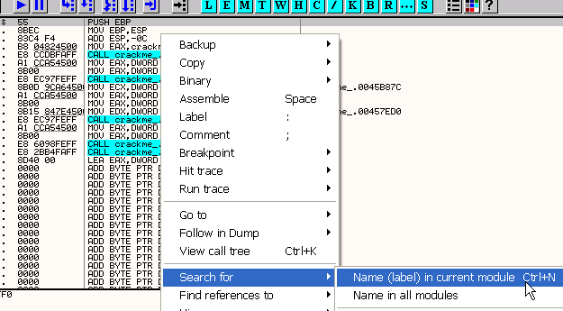
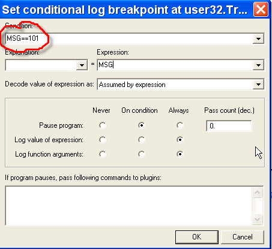

Глава 18 - Поиск переменного серийного номера. Часть 3
======================================================

Ок, в прошлой главе я упомянул, что собираюсь начать другую тему, связанную с обнаружением OllyDbg программами, запускающимися в ней (что, как правило, называется антиотладкой), как этого избежать и в каких случаях какие плагины можно использовать.

Но эту тему мы начнём в 19-ой главе, так как среди тех, кто изучает этот курс, нашлись люди, написавшие мне на почту и попросившие разобрать пример крэкми без кнопок как в прошлой части, и рассмотреть применение другой техники, использующей WM\_KEYUP.

Хорошо, используем для этого крэкми, предоставленный мне Stzwei’ем (спасибо ему), который называется \_4stz.exe ***\[[ссылка](.gitbook/assets/files/18/crackme_4stz.7z)\]***. Его мы и рассмотрим в данном туториале.

Откроем крэкми в OllyDbg.

Находимся на точке входа. Посмотрим, какие здесь есть не запакованные строки.

Отображается список строк, используемых программой.

Здесь нет ничего интересного, посмотрим API-функции.

Уфф, так много.. Ок, запустим программу и окажемся в окошке, где вводится серийный номер.

Видим, что кнопки регистрации нет. Введём полное имя.

И установим BPX CONDITIONAL LOG на TranslateMessage – сначала обычный BPX.

А когда вернёмся в крэкми, отредактируем установленный BP.

Если кто-то не помнит значение WM-сообщения, которое собираемся использовать, то нужно перейти в окно W, которое показывает, какие окна используются программой.

И отображается список окон, осталось только узнать числовое значение, поэтому кликаем правой кнопкой мыши.

И мы попадаем в окно точек останова на сообщения с раскрываемым меню с WM-значениями.

Поищем в списке WM\_KEYUP.

Видим, что это 101, поэтому уберём всё, что мы делали только для того, чтобы узнать это значение, и вернёмся к BREAKPOINT CONDITIONAL LOG в TranslateMessage.

И устанавливаем здесь MSG==101 (обратите внимание на двойной знак равенства), также, если бы не нашли значение, могли бы написать MSG==WM\_KEYUP и это бы сработало, но мне больше нравятся числовые значения. Здесь каждый волен поступать так, как ему это нравится.

Хорошо, точка останова трансформировалась в условную (розовый цвет).

Делаем RUN и вводим первый символ неправильного серийного номера.

И тут срабатывает условная точка останова.

Смотрим параметры API-функции, по адресу 12ff78 находится структура, в которой сохранены значения нажатой клавиши, в данном случае это 39, что соответствует цифре 9.

Смотрим через DUMP указанную область памяти – нажимаем правую кнопку мыши на указанном адресе и выбираем FOLLOW IN DUMP.

Видим, что нам удалось узнать, куда помещается байт. Проблема в том, что это программа на Delphi (что мы рассмотрим в другой раз), и если мы установим на него BPM ON ACCESS, программа будет ходить сто раз туда-сюда, прежде чем дойдёт до сравнения, поэтому метод, который мы рассматривали в прошлый раз, работает здесь гораздо лучше, так что его мы и используем. В любом случае, вы уже знаете, как остановить программу по нажатию клавиши и как установить местонахождение байта. Разумеется, в крэкми, не написанном на Delphi, гораздо проще использовать BPM ON ACCESS.

И запускаем.

Вводим 9898, идём в окно M и ищем по всей памяти.

Нажимаем правую кнопку мыши и выбираем SEARCH.

И ищем строку 9898.

Первое вхождение обнаруживается в стеке. Нажимаем CTRL+L несколько раз, чтобы увидеть, сколько раз оно в нём встречается.

Как только нам внизу отобразится жёлтым цветом слово ITEM NOT FOUND, выходим и возвращаемся в окно M.

Оказываемся там, откуда искали, так что идём дальше вниз с помощью CTRL + L.

Первый раз в этой секции, нажимаем CTRL + L, чтобы посмотреть, найдётся ли здесь что-либо.

Нет, ничего нет, если посмотрим область, находится вхождение чего-то подозрительного.

Видим возможный серийный номер 418507, установим на это место BMP on ACCESS, чтобы посмотреть, не с ним ли происходит сравнение.

Делаем RUN.

Останавливаемся здесь и видим, что копируется моё имя.

Видим, что каждый раз, когда печатаем, по новой копируется мой неправильный серийный номер, и с каждым следующим символом по новой копируется правильный серийный номер. Как только введём 6 символов, то установим на них BPM (помните, в предполагаемом серийном номере как раз 6 символов? – прим. пер.).

Останавливаемся прямо на сравнении.

Тут видим, что ESI и EDI указывают на неправильный и правильный серийные номера.

Они сравниваются по четыре байта за оборот цикла. Проверим, является ли найденный серийник действительно верным.

*(Сообщение гласит: "Поздравляю, победитель!" - прим. пер.)*

Видим, что не смотря на то, что это сложный крэкми, можно поймать точный момент, когда происходит сравнение, для чего нужно отслеживать местоположение неправильного серийного номера и ставить на него BPM.

Есть и другая возможность. Видим, что в памяти появляются 4 байта неправильного серийного номера.

Он же, но уже из 5-ти первых байтов, чуть ниже.

Соответственно, можем установить BPM ON WRITE на область, находящуюся ниже, где будет записан следующий символ.

Отметим место, куда будет помещён следующий символ, а затем делаем RUN.

Здесь записываю наиболее возможный серийный номер.

Делаем RUN.

И далее программа останавливается на том месте, где копируется неправильный серийный номер, и прежде, чем это произойдёт, можем установить на него BPM ON ACCESS, а затем выполнить RUN и снова остановиться точно на сравнении.

Хорошо, думаю, что это был сложный случай, какой бы способ вы не избрали, так как место, в котором сохранялся серийник, постоянно менялось.

Ладно, оставляю домашнее упражнение – крэкми CrueHead’а 2 ***\[[ссылка](.gitbook/assets/files/18/CRACKME2.7z)\]***, а со следующей главы мы переходим к новой теме.

\[C\] Рикардо Нарваха, пер. Aquila
