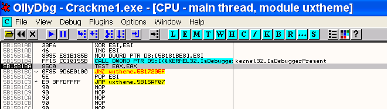
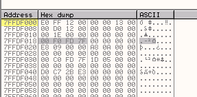
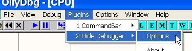

Глава 19 - Обнаружение OllyDbg (IsDebuggerPresent)
==================================================

Как уже говорилось в предыдущей части, мы сконцентрируемся на том, какими способами избежать обнаружения OllyDbg отлаживаемой программой и какие плагины для этого используются. Многие программы, когда обнаруживают, что они работают под отладчиком, закрываются или начинают работать по-другому, поэтому нужно любыми способами добиться того, чтобы жертва этого не узнала.

Эта часть посвящена способу обнаружения отладчика с помощью API-функции IsDebuggerPresent, которая наиболее часто используется.

Для этого используем Crackme1.exe ***\[[ссылка](files/19/Crackme1.7z)\]***, который идёт вместе с данной лекцией. Загрузим его в OllyDbg.

Помните, что у моей OllyDbg пока что установлен только COMMAND BAR, а значит и нет никакого плагина, который мог бы избежать обнаружения с помощью IsDebuggerPresent, но как вообще работает эта функция?

Если запустим крэкми с помощью F9, то увидим, что не только не открылось окошко крэкми, но и программа не запустилась.

В нижней части окна OllyDbg сообщает нам, что программа прекратила выполнение и, соответственно, никакого окна мы не увидим, хе-хе. Скорее всего, крэкми использует наиболее известный метод для обнаружения, использующий API-функцию IsDebuggerPresent.

Перезагрузим крэкми и посмотрим, находится ли она в списке API, используемых жертвой. Жмём на правую кномку мыши на листинге и выберем..

Видим список используемых API-функций.

И смотрите, что мы нашли, хе-хе.

Устанавливаем BP на эту функцию, чтобы выяснить где она применяется программой.

Нажимаем RUN и останавливаемся на вызове этой функции.

Из стека видно, что это API-функция без параметров, единственное, что она делает, это проверяет, отлаживается ли сейчас программа или нет, а если у вас есть какие-либо сомнения относительно данной функции или того, как она работает, то проконсультируйтесь со справочником по API-функциям.

Вот страница руководства, которым пользуюсь я.

Это разъяснение функции. Переведём его.

API-функция IsDebuggerPresent показывает, находится ли процесс, который её вызывает, в контексте отладчика, то есть отлаживается ли он.

Далее говорится, что функция экспортируется из KERNEL32.dll, у которой, как видим, нет параметров, и если программа находится под отладкой, то возвращаемое значение равно единице, а если нет, то нулю.

Это очень важная информация, выполняем API-функцию до RET, чтобы посмотреть, куда возвращается интересующая нас информация.

Доходим до RET, где смотрим регистры.

Выделенное розовым цветом – это место, где изменяется EAX. Как практически все API-функции, IsDebbuggerPresent помещает возвращаемое значение в EAX, тогда если в нём 1, то это говорит о том, что программа находится под отладкой.

Попробуем, что случится, если вручную сделать EAX равным 0, как если бы программа не отлаживалась.

Делаем RUN.

Снова останавливаемся на API-функции, поэтому снова доходим до RET и меняем EAX на ноль.

Видим, что программа запустилась, то есть вся её система обнаружения отладки основывалась на рассматриваемой API-функции. Перезапустим крэкми, и когда он остановится на IsDebuggerPresent, посмотрим, что происходит с возвращаемым значением.

Снова доходим до RET, теперь можем перейти к пошаговой отладке с помощью F8.

Когда доходим до RET, EAX равен 1, вернёмся в программу, нажав на F8.

Здесь мы, прежде всего, видим, что если нет DLL uxtheme, то вызова не произойдёт. Делаем RUN и теперь происходит остановка на API-функции.

Там останавливаемся во второй раз, доходим до RET и возвращаемся в программу с помощью F8.

Оказываемся у JE, где происходит тестирование, равен ли EAX нулю или нет. Идём дальше.

Видим, что если EAX отличается от нуля, то перехода не происходит, также замечаем, что если переход происходит, то выполнение программы продолжается функцией GetDlgItem, которая считывает информацию из окна крэкми.

После не выполнившегося перехода находится JMP, миновать который нельзя.

Продолжим трассировку, чтобы узнать, куда попадём.

Новая API-функция – PostQuitMessage, посмотрим её описание.

В переводе это означает, что данная API-функция посылает сообщение для закрытия окна WM\_QUIT, то есть указание на то, что выполнение скоро будет завершено.

По возвращению оттуда:

И если у нас будет достаточно терпения оттрассировать до того момента, когда всё закрывается, то обнаружим, что вызывается API-функция ExitProcess, которая и завершает процесс (если терпения нет, то установите на неё ExitProcess и остановитесь прямо на ней).

Так что теперь видим, что переход, который находится после возвращения из API-функции IsDebuggerPresent, отвечает за принятие решения о том, продолжать выполнение программы или нет. Одним из решений может быть патч, перезапустим программу и выполним её до пресловутого перехода.

Останавливаемся там и изменим JE на JMP 4011b2 (для этого нажмите пробел).

А здесь видим, что избежали перехода, который ведёт к завершению выполнения программы, поэтому она продолжила выполнение.

Сохраним программу с внесёнными нами изменениями под каким-нибудь другим именем. Нажимаем правую кнопку мыши.

И в открывшемся окне снова нажимаем правую кнопку.

Сохраняем под именем crackme1p, так что теперь у нас исходная программа и пропатченная.

Теперь откроем пропатченную программу в OllyDbg, чтобы проверить, выполнится ли она в отладчике. Никаких BP устанавливать не будем.

Выполняется превосходно, так что теперь мы знаем, что эту программу можно заставить выполняться, изменив значение, возвращаемое функцией IsDebuggerPresent в EAX, также знаем, как пропатчить программу, чтобы не приходилось делать это каждый раз вручную.

С этим крэкми у нас нет проблем – пропатчили и работает, но, конечно, существуют более простые способы, использующие плагины, которые позволяют нам избежать всех этих хлопот. Тем не менее, полезно знать, как это делать самим.

А сейчас загрузим исходный файл и рассмотрим API-функцию поподробнее.

Здесь три невзрачных инструкции MOV, с помощью которых данная API-функция каким-то образом определяет, отлаживается ли программа или нет. Первое, что мне пришло в голову – это то, что если программа отлаживается, то они не может выполнить эти три строки, и в EAX попадает значение 1. Попробуем перезагрузить исходный файл крэкми и добавить в точку входа следующие строки:

> MOV EAX,DWORD PTR FS:\[18\]
> MOV EAX,DWORD PTR DS:\[EAX+30\]
> MOVZX EAX,BYTE PTR DS:\[EAX+2\]

Можем их просто скопировать их по очереди.

Итак, добавили три строки.

Видим, что после выполнения последней из них, в EAX содержится значение 1, также, как после выполнения API-функции, из которой мы и взяли эти строки.

Естественно, что программа не остановилась на IsDebuggerPresent, потому что мы её не вызывали, но тем не менее, мы определили, что программа отлаживается точно с таким же успехом.

Поэтому очень важно определить, что же действительно считывается и что именно говорят эти три строки.

Когда программа запускается, система сохраняет в определённом месте в памяти, находится ли она (программа) под отладкой, и если там находится ноль, то значит, что нет. Этот байт и считывают эти три строки и соответствующая API-функция.

Как мы можем найти этот байт? Давайте взглянем на первую строку из указанных трёх и шаг за шагом их проанализируем.

Первая строка:

В OllyDbg идём сюда:

В окне регистров отображается очень важное значение, не хочу нагружать сложными названиями, но это значение указывает на структуру, где содержится также очень важная информация о выполняемой программе. Посмотрим через DUMP, что находится по данному адресу (на вашем компьютере этот адрес может быть другим, так что смотрите в вашей OllyDbg правильное значение).

Эта структура называется TEB или TIB и хранит полезную информацию, которая нам может быть нам очень полезной. Например, в TIB хранится, откуда начинается и где заканчивается стек программы.

Посмотрим в окне M секцию стека.

Видим, что начинается в 12d000 и заканчивается там, где начинается следующая секция (130000).

Есть много других интересных значений, которые мы рассмотрим, когда будем изучать исключения, но пока, если взглянем на стек, то увидим по вышеуказанному адресу значение 12ffE0 (у меня).

Поищем его в стеке.

Видим, что оно помечено как END OF SEH CHAIN (конец SEH-цепочки). Пока что это нам мало что говорит, но это связано с исключениями.

Интересно то, что следуя определённому алгоритму можно достать из него любое значение, например, которое находится после Fs:\[0\].

Это Fs:\[0\], если поищем в command bar’е значение fs:\[1\], то получим:

Поэтому:

> Fs: \[0\] на моей машине здесь содержится 7ffdf000
> Fs: \[1\] на моей машине здесь содержится 7ffdf001
> …………………………………………………………………….
> …………………………………………………………………….
> Fs: \[18\] на моей машине здесь содержится 7ffdf018

То есть, это значение, которое, как мы помним, было на первой строке API-функции.

То есть видим содержимое 77ffdf018 (оно же FS:\[18\]).

Вот это значение, которое сохранено в TIB, в FS:\[18\] – значение, которое отображается в регистрах, указывающее на начало TIB.

Таким образом, первая строка загружает в EAX указатель на начало TIB, конкретное значение может отличаться на разных машинах. Нажав F8, мы переместим это значение в EAX.

Хорошо, теперь в EAX находится указатель на TIB.

Теперь следующая строка.

К EAX прибавляется 30, на моей машине в результате получается 7ffdf000 + 30 =7ffdf030.

Это fs:\[30\].

То есть в EAX помещается содержимое 7ffdf030 или fs:\[30\], на моей машине это содержимое равно 7ffdc000, не спутайте это с началом TIB, эти значения различаются.

Это указатель на что-то другое, посмотрим на что именно через DUMP:

Последняя строка:

Сумма 2 и EAX равна:

> 7FFDC000 + 2= 7FFDC002

И в EAX перемещается байт, адрес которого получился в результате, а он и есть искомый байт. На моей машине он находится по адресу 7FFDC002.

Система сохраняет 1 в этот байт, который считывается API-функцией IsDebuggerPresent. У вас адрес этого байта может отличаться, но вы сможете легко его найти, используя вышеуказанный метод. Загрузим заново крэкми в OllyDbg.

Вот краткое изложение того, как найти искомый байт, используемый в IsDebuggerPresent.

Ищем начало TIB в окне регистров.

Смотрим TIB через DUMP (он уже не будет располагаться по тому адресу, что в прошлый раз).

Ищем fs:\[30\], то есть к адресу, указывающему на TIB, прибавляем 30 и смотрим содержимое, находящееся по получившемуся адресу.

Его содержимое (7ffde000) также является адресом, смотрим через DUMP.

И прибавляем 2 – вот и искомый байт. (Многие обращают внимание, что когда программа запускается, в EBX уже находится указатель на эту область, так вот, EBX=fs:\[30\]).

Ок, это и есть весь метод целиком, который можно использовать, если не находимся в начале программы и не знаем значения, которое имел EBX при старте. Теперь поместим ноль в найденный байт.

Теперь установим BP на функцию IsDebuggerPresent, чтобы посмотреть, работает ли данный подход.

Трассируем до RET.

Видим, что возвращённое в EAX значение равно нулю, так как поменяли значение байта, из которого берётся значение, и программа верит, что она не находится под отладкой.

И поэтому выполняется без проблем.

Разумеется, есть множество плагинов, которые делают то же самое, один из них – это HideDebugger 1.24 ***\[[ссылка](files/19/HideDebugger124.7z)\]***.

Сначала скачиваем его, затем копируем dll в директорию с плагинами.

Копируем, хехе.

Теперь перезапускаем OllyDbg.

Смотрим настройки плагина.

Видим, что уже отмечена опция против IsDebuggerPresent, то есть плагин делает за нас работу, которую мы делали руками. Остальные опции пока оставляем не отмеченными, когда до них очередь, мы их подробно изучим.

Нажимаем SAVE.

Запускаем по новой крэкми . Обратите внимание, что EBX указывает на область, где находится тот самый байт.

Теперь EBX-FOLLOW IN DUMP.

И видим, что всё, что делает плагин – это помещает ноль в этот байт, преодолевая таким образом данный тип защиты. Можно было бы сразу это сделать, но я считаю, что очень важно понимать, как это всё работает на самом деле.

  \[C\] Рикардо Нарваха, пер. Aquila
