Глава 20 - Обнаружение OllyDbg (По названию процесса)
=====================================================

Следующий приём против отладки в OllyDbg, который мы рассмотрим, это обнаружение её по имени процесса, но прежде всего настроим OllyDbg так, как это необходимо в данном случае.

Если перейдём в DEBUGGING OPTIONS-SECURITY:

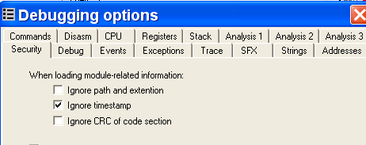

Здесь находится три галочки. Если мы их все отметим, то увидим, что установив BPX на API-функцию, и если переинициализируем OllyDbg (Restart), то BPX останутся установленными, что позволяет нам избежать повторение всего процесса каждый раз, когда мы делаем рестарт.

Строго говоря, я не знаю, как именно работает OllyDbg "внутри", но на практике достаточно просто отметить эти три галочки, чтобы установленные на API-функции BPX оставались установленными после перезапуска.

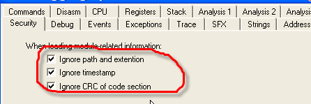

Именно так, как мне кажется, без особых проблем и хлопот, мы и начинаем изучение темы антиотладки по имени процесса.

Обнаружение OllyDbg по имени процесса

Запустив OllyDbg, мы можем посмотреть список процессов с помощью CTRL + ALT + SUPR.

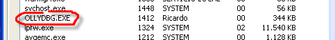

Видим, что имя процесса находится среди остальных, что позволяет программе пробежаться по их списку, и если она встретит называющийся OllyDbg, она закрывается, оставив противника ни с чем, ха-ха!

Крэкми, который мы используем, решать пока не будем, так как он находится на более продвинутом уровне, чем материал, изученный ранее – мы сделаем это в другой раз, но на его примере мы изучим то, как программы находят OllyDbg по имени процесса, как этого избежать вручную и автоматически, хе-хе.

Приложенный к статье крэкми называется DAXXOR ***\[[ссылка](.gitbook/assets/files/20/daxxor.7z)\]***. Если запустим его и OllyDbg по отдельности, то увидим, что крэкми запускается, но закрывает отладчик, а если загрузим программу в OllyDbg, то закроются оба.

Изучим, как это происходит. Откроем крэкми в OllyDbg.

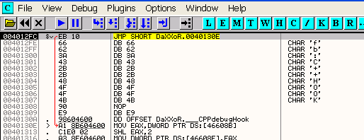

Оказавшись в точке входа, посмотрим, какие API-функции используются.

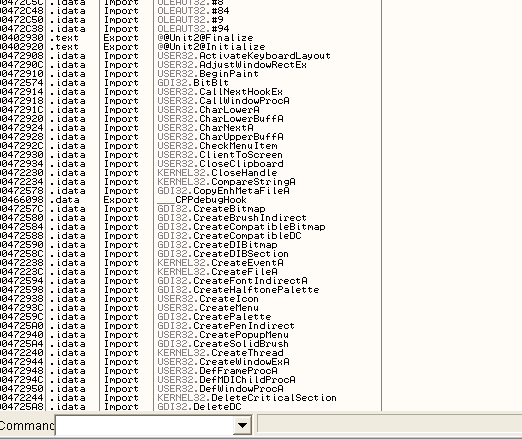

Ок, их тут немало, но дело в том, что они используются защитой, а не самим крэкми, который сам в начале не грузится, поэтому API-функции, используемые для обнаружения OllyDbg, мы сможем посмотреть только в середине выполнения. Заодно я объясню этот способ защиты, который не позволяет нам увидеть список API-функций. С другой стороны, теперь мы точно знаем, что эти среди них есть важные API-функции, раз программа их скрывает и они не появляются в списке.

Почти в каждом таком случае, когда программа не запакована, как здесь, используется API-функция GetProcAddress.

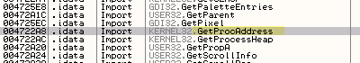

Она используется программой, чтобы загружать другие API-функции, которые не находятся в списке используемых. Мы более подробно рассмотрим GetProcAddress в главе, посвящённой распаковке, но пока просто установим на неё BP.

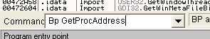

И делаем RUN.

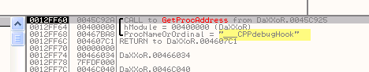

Каждый раз, останавливаясь на ней, видим, что именно запрашивается, в данном случае первой запрашивается функция \_\_CPPdebugHook, не связанная с защитой, которую мы изучаем, поэтому снова жмём RUN.

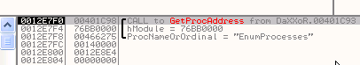

Таким образом, с помощью F9 доходим до API-функций, относящихся к защите. Здесь видим, что используется функция EnumProcesses, так что после того, как дойдём до RET в GetProcAddress, в EAX будет возвращен адрес функции, действительный для конкретной машины, и туда мы установим BPX, после чего выполним RET с помощью EXECUTE TILL RETURN.

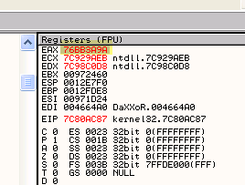

Здесь в EAX возвращается адрес указанной функции для конкретной машины, в моём случае это 76BB3A9A (он может отличаться у вас).

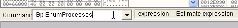

С другой стороны, видим, что OllyDbg не обнаружила эту API-функцию, и её нет в списке NAMES, поэтому мы не можем установить BP напрямую по имени функции, и поэтому устанавливаем точку останова на адрес.

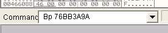

Вот она установилась.

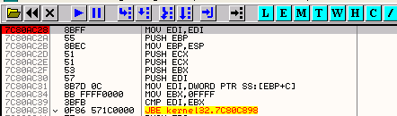

Итак, мы установили BP на подозрительную API-функцию, продолжаем выполнять программу в OllyDbg, чтобы увидеть, загружается ли ещё что-нибудь.

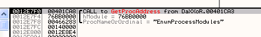

Хм, перебираются модули процесса, дойдём до RET и установим BPX на адрес, который будет возвращён в EAX.

Чтобы много не печатать, то находясь на RET, можем сделать так:

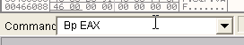

Так я устанавливаю BPX на все API-функции, когда нахожусь на RET.

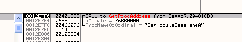

Ещё одна подозрительная API-фукнция, устанавливаем на неё BP таким же образом, что и в прошлые разы, делаем и останавливаемся на EnumProcesses.

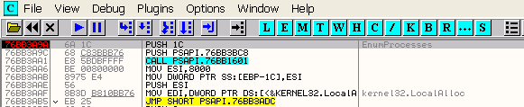

Комментарий справа, содержащий имя API, был добавлен мной. Комментарии можно добавлять с помощью двойного щелчка на нужной области.

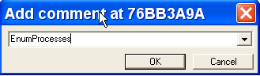

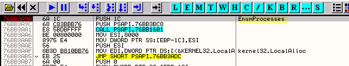

Все эти функции, загруженные программой, не были увидены OllyDbg и не были отражены в списке, также она не даёт по ним какую-либо информацию.

Поищем в гугле, что это за функция "EnumProcess".

Находим её на сайте Микрософта, адрес страницы:

[http://msdn2.microsoft.com/en-us/library/ms682629.aspx](http://msdn2.microsoft.com/en-us/library/ms682629.aspx)

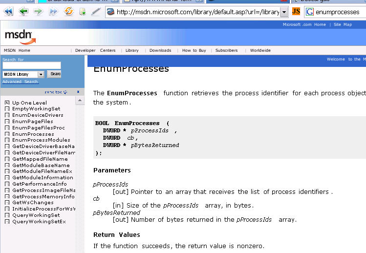

Хорошо, здесь говорится, что вышеупомянутая функция возвращает нам идентификатор или PID каждого запущенного процесса, ок, рассмотрим что такое этот PID, хе-хе.

Каждому запущенному процессу присвоен идентификатор – число, меняющееся каждый раз при запуске процесса. Посмотрим на список процессов.

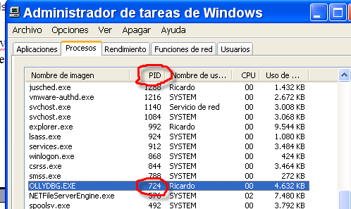

Видим, что в данном случае OllyDbg присвоен PID 724 – в десятеричной системе счисления, так как программа просмотра процессов работает именно с ней. Переведём вышеуказанное число в шестнадцатиричную систему с помощью калькулятора Windows.

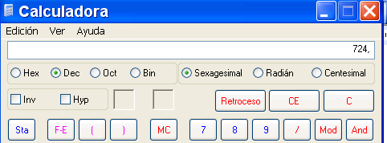

Нажимаем на кнопку HEX, чтобы перейди в шестнадцатеричную систему.

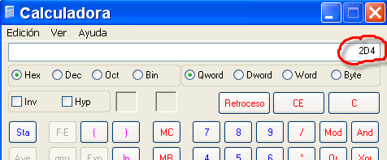

PID OllyDbg в шестнадцатеричной системе равен 2D4. Можем закрыть и запустить по новой OllyDbg, и увидим, что PID изменился. Каждый раз, когда процесс запускается заново – PID меняется.

Также нам не повезло с отображением параметров функции, так как для OllyDbg она не существует.

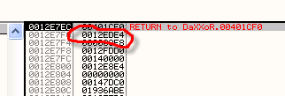

Из страницы на сайте Микрософта, знаем, что у неё три параметра.

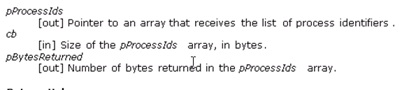

То есть в 12EDE4 сохраняется список PID’ов всех процессов, запущенных на моей машине, делаем EXECUTE TILL RETURN, чтобы вернуться из API-функции и смотрим через DUMP, что там лежит.

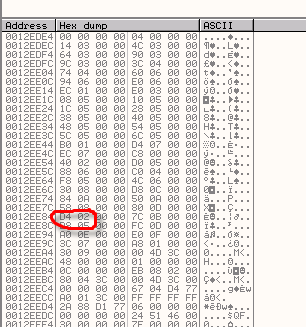

Там находится список PID’ов, а среди них и PID OllyDbg, хнык, хнык.

Ставим здесь BPM ON ACCESS, чтобы посмотреть, где он используется.

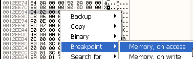

Теперь делаем RUN.

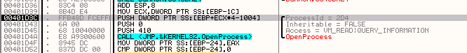

Видим, что остановились там, где будет применена функция OpenProcess, которая проверяет, работает ли процесс, и если да, то возвращает его хэндл (логический номер).

Какая разница между PID и хэндлом? Это очень просто – PID – это общий идентификатор – на всей машине, в какой угодно программе PID OllyDbg остаётся одним и тем же, пока процесс не будет перезапущена, в моём случае это 2d4, а хэндл – это номер, который позволяет позволяет вашей программе управлять процессом и который будет отличаться в другой программе. Это своего рода заявка на контролирование процесса, без номера не сможете им управлять, а чтобы получить номер, нужно попросить систему, которая вернёт вам хэндл. Тогда сможете и управлять и подстроить какую-нибудь гадость, хе-хе.

Вот более подробное определение OpenProcess в WinApis32, у неё тоже много параметров, но нам они не интересны.

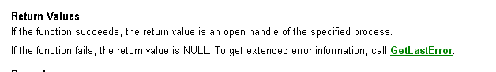

То есть возвращается логический номер исполняющегося процесса, коротко говоря, это то, что программа в данном случае и хочет узнать.

Трассируем с помощью F8, пока не остановимся на API-функции.

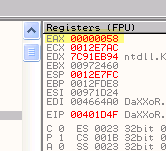

В EAX возвращается логический номер OllyDbg, который в моём случае равен 58.

Тот же OllyDbg умеет показывать логические номера, с которыми программа работает в настоящее время, с помощью окна H.

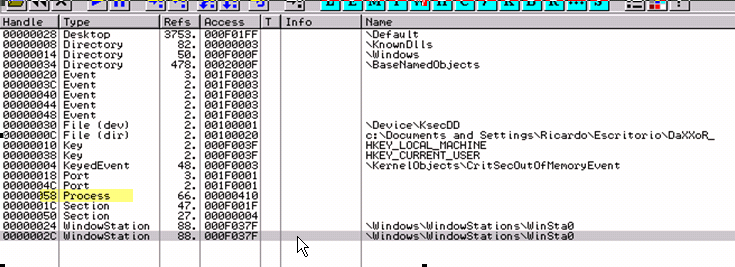

Видим, что здесь есть 58 и TYPE или тип является PROCESS, т.е. процесс, таким образом, у программы есть логический номер 58, действительный в процессе OllyDbg.

Если другой процесс использует EnumProcess, чтобы получить PID, то для OllyDbg, если она не будет перезапущена, он будет равен 2d4, а если потом попросить логический номер данного процесса, то он будет каким-нибудь другим, так как хэндлы для каждого процесса, их запрашивающих, уникальны.

В данном случае, опасность для OllyDbg заключается в том, что у программы уже есть логический номер, с которым она может делать всё, что хочет. Хотя она и не знает, что выполняется из под OllyDbg, она может проверить имя процесса, чтобы определить, не называется ли он OllyDbg, и очевидно, что для этого будут перебираться все PID’ы, полученные в списке процессов, поэтому бросаем всё и отправляемся туда, где это будет происходить, для чего установим BPM ON ACCESS на соответствующий PID.

Продолжаем трассировать с помощью F8.

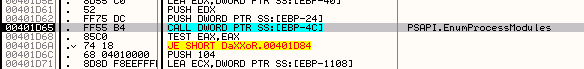

Дошли до ещё одной API-функции, которую от нас пытались скрыть, – EnumProcessModules. Посмотрим её описание на том же сайте, что и ранее.

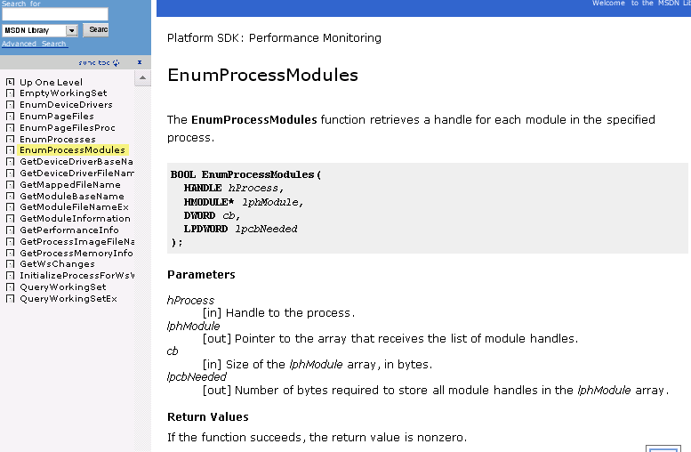

То есть будет проводиться поиск в исследуемом процессе, получаем список модулей, используемых им. Продолжаем трассировать с помощью F7.

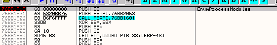

В стеке видим параметры:

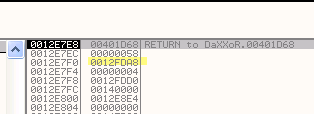

Список хэндлов всех модулей сохранён по выделенному адресу, а первым параметром, как мы видим, является логический номер процесса OllyDbg.

Здесь нужно прояснить одну вещь: когда запрашиваем логические номера модулей, система возвращает нам адресную базу или откуда начинается указанный процесс в памяти. В данном случае нам было возвращёно 400000, так как именного отсюда начинается процесс OllyDbg.

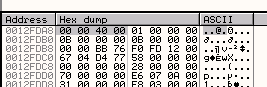

Продолжаем трассировать и находим ещё одну API-функцию.

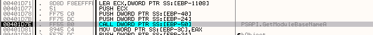

GetModuleBaseNameA

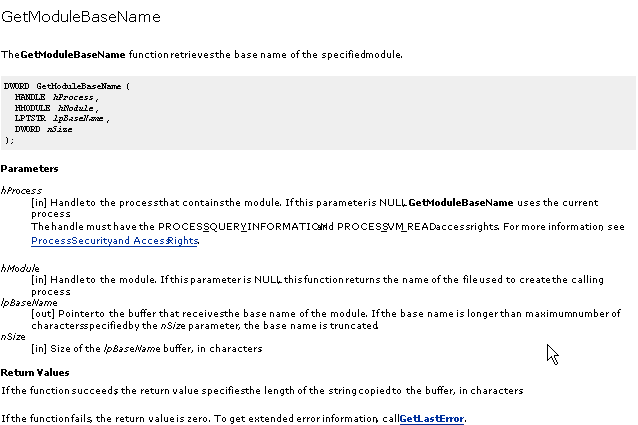

Т.е., что с помощью этой функции ходим найти имя модуля, так как эта API-функция помещает в буфер по адресу lpBaseName имя модуля, соответствующего адресу, выясненному ранее.

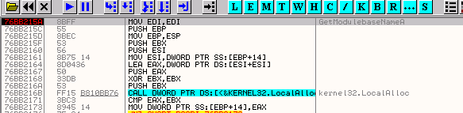

В стеке следующие параметры:

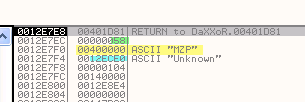

58 – это логический номер OllyDbg, 400000 – это база главного модуля, а буфер располагается по адресу 12ECE0, так что смотрим эту область памяти через дамп.

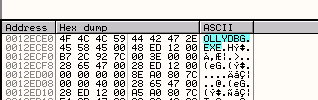

Хе-хе, уже понятно, что эта операция будет проведена для каждого процесса, который запущен в машине, чтобы узнать, не является ли его именем ‘OLLYDBG.exe’.

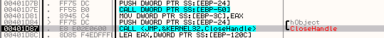

Доходим до CloseHandle, где закрывается логический номер, то есть 58 исчезает из их списка.

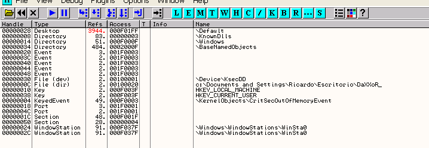

Ну да, теперь мы не можем делать никаких шалостей, так как логический номер закрыт, и мы больше не можем полагаться на него.

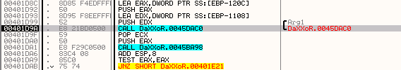

Дошли до CALL, входим в него, нажав F7.

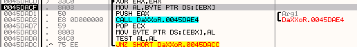

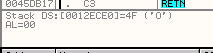

Здесь считывается первая буква "OLLYDBG" (4F) и помещается в стек с помощью PUSH, затем идёт новый CALL, в который мы также заходим.

Видим, что в этом вызове не происходит ничего особенно важного, поэтому выходим и оказываемся рядом со следующим CALL'ом.

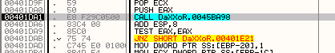

Заходим в него.

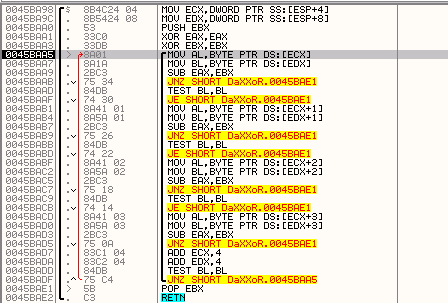

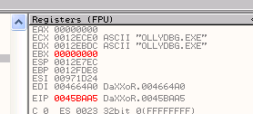

Ах, где-то здесь сравнивается полученное имя процесса с ‘OLLYDBG.EXE’, и если они равны, то всё, капут.. хе-хе, сейчас они равны, посмотрим, что случится. Возвращаемся через RET.

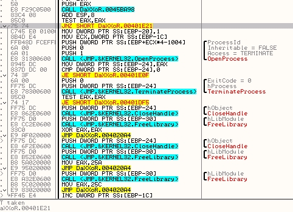

Если бы они не были равны, то EAX должен был бы отличаться от нуля, и был бы совершён переход, чего не происходит, если EAX равен нулю, как в данном случае.

Перехода не происходит, и снова вызывается OpenProcess, чтобы получить логический номер процесса и убить последний.

Если выполним с помощью F8.

Система возвращает номер 58, так что продолжаем.

Как видим, API-функция TerminateProcess, которой передаётся логический номер 58, служит для того, чтобы убить OllyDbg.

И по нажатию F8 – до свиданья, Олли. Всё закрывается. Вот так мы и исследовали, как работает обнаружение по имени.

Ладно, я слегка устал от роли убийцы, хе-хе, перезапускаем OllyDbg и устанавливаем BP на OpenProcess.

Останавливаемся тут, и если подредактируем API-функцию так, чтобы она всегда возвращала ноль, то программа будет думать, что никакие другие процессы не выполняются, и у неё не будет никаких логических номеров. Для этого можно изменить последние строки.

Вот так, теперь эта API-функция всегда возвращает ноль. Теперь убираем все точки останова, и так как программа генерирует кучу исключений, то, хотя мы ещё и не рассматривали данную тему, чтобы она нормально выполнялась, отметим все опции в DEBUGGING OPTIONS-EXCEPTION следующим образом:

Пока что просто отметьте все опции, чтобы программы перепрыгивала через все исключения, так как их очень много (для прохождения через них надо нажимать SHIFT+F9, а вышеуказанная конфигурация позволяет миновать их автоматически). Делаем RUN.

И вот она выполняется без проблем, но вот ещё, что можно сделать:

Меняем JNZ на JMP, чтобы избежать выполнения кода защиты.

Программа запускается и показывает нам окно, которое исчезает после нажатия на TRY.

Выскакивает сообщение об ошибке. Прекрасно, потому что это говорит о том, что защита против отладки была побеждена.

Всё это не обязательно делать, чтобы обойти подобную защиту, достаточно скопировать OLLYDBG.exe под другим название, скажем, PIRULO.exe, работать отладчик после этого будет также, а вот отлаживаемая в нём программа не найдёт ни одного процесса под имени OLLYDBG, так как теперь он называется PIRULO.

Важно помнить, что переименованный файл необходимо держать в той же папке, что и исходный, во избежание проблем с плагинами.

Может быть защита и такого рода, когда программа идёт на уступки, если вводим правильный серийный номер, а также использовать другие API для нахождения имён процессов. Всё это мы рассмотрим в следующих главах.

\[C\] Рикардо Нарваха, пер. Aquila
