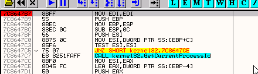

# Глава 21 - Обнаружение OllyDbg (По названию процесса, имени и классу окна)

Продолжаем углубляться в различные методы антиотладки. Сейчас будем использовать крэкми, которое было специально модифицировано для целей данной статьи.

Это крэкми buggers3 [\[ссылка\]](.gitbook/assets/files/21/buggers3.7z), в котором были сделаны некоторые изменения, чтобы можно было объяснить нахождение имени процесса с помощью других API-функций, использующихся в этом крэкми, и обнаружение OllyDbg по имени окна или его класса, которое также применяется здесь.

Откроем крэкми в оригинальном OllyDbg, не переименованном, потому что также будем изучать разновидность метода, применённого в 20-й главе, и поэтому необходимо, чтобы файл OllyDbg назывался ollydbg.exe. Тогда защита сработает, и мы сможем её изучить.

После того, как загрузили его в OllyDbg, настроим HideDebugger 1.23f [\[ссылка\]](.gitbook/assets/files/19/HideDebugger124.7z) против использования программой API-функции IsDebuggerPresent.

Посмотрим текущую конфигурацию плагина HideDebugger:

Пусть он защищает только от IsDebuggerPresent. Также откроем список процессов и убедимся, что используем не переименованный файл, то есть имя процесса ‘OLLYDBG.exe’.

Ок, возвращаемся к buggers3. Посмотрим, какие API-функции он использует.

Опа! Единственная функция в списке – это ExitProcess, всё остальное грузится через GetProcAddress, но и сама она в списке не присутствует.

Поставим BP, и что будет, если сделаем RUN?

Видим загружающиеся API-функции, конечно, если находим такую, что нам интересна, идём до RET, чтобы узнать её адрес, и также можем сделать BP EAX, так как именно в EAX будет находится возвращаемый GetProcAddress адрес.

В данном случае ничего интересного нет, поэтому продолжаем, нажав F9.

В некоторых случаях вы можете спросить, как я определил защиту ещё до того, как она сработала. Как и в прошлый раз, это потому что я уже знал о ней, чтобы продемонстрировать, как она работает и какие API-функции в ней используются.

Ок, делаем EXECUTE TILL RETURN, чтобы дойти до RET.

Доходим до RET, и конечно, в EAX находится адрес загружаемой API-функции на моей машине, в данном случае это CreateToolhelp32SnapShot. Чтобы узнать, когда эта функция используется, установим точку останова с помощью BP EAX.

Здесь осталось установить BP на API-функцию.

Снова делаем RUN, чтобы посмотреть, будут ли загружаться ещё какие-нибудь подозрительные функции.

Хорошо, уже знаем, чем это рискованно – для того, чтобы принудительного завершить процесс нужно получить логический номер (о чём мы говорили в главе 20), а это делается с помощью OpenProcess, так что дойдём до RET и установим BP EAX также и на эту функцию.

Другая подозреваемая в убийстве процессов, хе-хе, пока что таким же образом установим на неё и её сестрёнку Process32Next.

Дальше идёт TerminateProcess.

Мы уже знаем, что эта функция закрывает OllyDbg. Пока что не будем устанавливать BP, но эта функция всегда является кандидатом на точку останова, хе-хе.

Другая преступница, хе-хе, устанавливаем на неё BP вышеописанном способом.

В следующий раз мы останавливаемся на API-функции CreateToolhelp32SnapShot.

Стек:

Посмотрим описание этой функции.

То есть эта функция делает "фотографию" (моментальный снимок) процессов, которые запущены на машине, но возвращается нам только логический номер, и в параметрах нет никакого буфера, где должен быть сохранён список процессов. Выполняем до RET.

И в EAX получаем логический номер.

Который в моём случае равен 2C. Мы можем посмотреть информацию о нём с помощью Олли.

Нажмём кнопку H, что откроет окно логических номеров.

Не слишком понятно, что такое 2C, но ладно, программа получала этот номер, сделаем RUN, чтобы посмотреть, как его получить с его помощью доступ к указанному списку процессов.

Останавливаемся на API-функции Process32First, которая вместе c Process32Next служит для чтения полученного моментального снимка, извлекая информацию о выполняющихся процессах.

Ок, вот описание этой функции.

Здесь говорится, что функция получает информацию о первом процессе, записанном в моментальном снимке, чей логический номер передаётся в первом параметре (в моём случае это 2C). Вторым параметром является адрес буфера, куда собственно помещается информация.

Эта API-функция возвращает информацию только о первом процессе в списке, а для остальных надо использовать Process32Next.

Буфер, куда сохраняется информация о первом процессе, виден через DUMP, так что делаем "Execute till RET", чтобы она там появилась.

Видим имя первого процесса, которое всегда будет "SYSTEM PROCESS". Делаем RUN и продолжаем.

Ха-ха, а здесь другой трюк, использующий FindWindowA. Окно OllyDbg относится к одноимённому классу, так что можно искать отладчик по имени окна. В данном случае запрашивается класс окна, являющимся главным по отношению к текущему, которым, очевидно, является OllyDbg.

Класс окна можно узнать с помощью утилиты WinDowse [\[ссылка\]](.gitbook/assets/files/21/WindowseGREATIS5setup.7z).

Я знаю, что существуют плагины для OllyDbg, которые позволяют выяснить класс и другую информацию об окне, но, по правде говоря, эта программа предоставляет куда более подробные сведения, так что установим и запустим её.

Видим, что во вкладке "Window" выводится имя окна OllyDbg, а во вкладе "Class" - его класс.

Как видим это OllyDbg.

Видим, что API-функция возвращает логический номер окна, с помощью которого мы можем сделать с этим окном всё, что захотим.

То есть нет необходимости передавать оба параметра - и имя и класс, можно искать только по одному из них, а вместо другого передать ноль.

Хорошо, доходим до RET в API-функции, чтобы посмотреть, вернёт ли она логический номер окна.

Конечно, он совпадает с тем, который отображается в Windowse.

Ладно, трассируем дальше, чтобы посмотреть, что программа делает с окном.

То есть, сравнивает полученный номер с нулём, и если он ему равен, то значит, нет окна с классом OllyDbg, а значит и такого процесса нет. Если же было возвращено значение отличное от нуля, то значит, существует окно с таким классом, и программа вызывает ExitProcess.

Переход сразу ведёт к выходу программ без отображения каких-либо сообщений.

То есть суть в том, что нам нужно, чтобы FindWindowA вернула в EAX ноль.

Ок, плагин HideDebugger 1.23f позволяет не делать это вручную. Откроем его настройки.

Если отметим вторую опцию, то плагин станет защищать нас от обнаружения с помощью FindWindow и EnumWindows (это другая функция, с помощью которой можно узнать имя окна), но нам нужно научиться избегать этих функции вручную и понимать, как это работает, поэтому пока что галочку ставить не будем, так как надо будет перезапустить OllyDbg, чтобы это оказало необходимый эффект. Сделаем так, чтобы переход, который отправляет нас к функции ExitProcess, не был совершён, и выполнение программы продолжилось.

Кликаем два раза на флаге Z, меняем его значение на 1, после чего JNZ не должен совершить переход.

И правда, JNZ не срабатывает.

И доходим до JMP, перепрыгивающего через вызов ExitProcess.

Ок, продолжаем, мы изучили как предотвратить приём с FindWindowA, а теперь продолжим изучать метод, использующий имена процессов. Делаем RUN.

Видим, что вызывается Process32Next, чтобы получить информацию о втором процессе из моментального снимка, которая сохраняется в 403134.

Делаем EXECUTE TILL RETURN и смотрим, что было сохранено.

Здесь находится имя "System" и его PID, равный 4. Посмотрим список процессов.

Здесь видим, что программа делает с каждым процессом. Трассируем.

Видим, что здесь вызывается API-функция lstrcmpA, с помощью которой сравнивается строка "System", являющейся именем процесса, с "buggers3.exe", т.е. именем процесса самого крэкми. Если они равны, то вызывается MessageBoxA, сообщающий "NOT DEBUGGED". Но в данном случае мы сюда не попадём, так что продолжаем трассировать.

Если строки не равны, то результатом сравнения является FFFFFFFF.

И так как это не ноль, то переходим в 40119f.

Здесь видим насыщенную действием часть программы: сравнивается имя первого процесса с "OLLYDBG.EXE", и если они равны, тогда результатом является ноль и перехода не происходит, в следствии чего вызывается OpenProcess, чтобы узнать логический номер процесса, а потом – TerminateProcess, закрывающий его, как это мы уже видели в главе 20-ой.

Видим, что первый процесс не является OllyDbg.exe, поэтому переходим на Process32Next, чтобы найти второй процесс.

В то же место сохраняется имя второго процесса. Делаем EXECUTE TILL RETURN.

Второй процесс – это smss.exe, чей PID равен 026C. Заглянем в список процессов.

Вот PID, равный 620 в десятеричной системе, то есть 026C в шестнадцатеричной.

Хорошо, похоже, что все выполняющиеся процессы сравниваются один за другим c "OLLYDBG.EXE".

И каждый раз условный переход будет переносить нас на 4011B1, до тех пор, пока не встретиться процесс OLLYDBG.exe. Тогда перехода не произойдёт и Олли будет закрыта, так что если мы заменим JNZ на JMP, то избежим этого.

Теперь убираем все точки останова и делаем RUN.

Таким образом, защита была побеждена. Сейчас мы уже знаем, что плагин HideDebugger позволяет спрятать окно OllyDbg от обнаружения с помощью FindWindowA. Также можно попробовать избежать обнаружения процесса и выполнить программу, используя упомянутый ранее способ переименования OllyDbg в PIRULO.exe.

Откроем PIRULO.exe.

Отметим галочкой опцию, включающей защиту от FindWindowA, и нажмём SAVE.

Потом перезапустим OllyDbg.

И откроем buggers3, но прежде я хочу избавиться от сомнений, поэтому посмотрю, что сделал плагин с окном Олли, чтобы оно не было обнаружено.

Видим, что имя OLLYDBG не отображается в заголовке окна, а класс?

Видим, что от нахождения по классу плагин нас не защитил, поэтому надо искать другой способ.

Утилита, которая должна помочь нам с тем, что не смог сделать плагин, называется Repair 0.6. Это патчер OllyDbg, и его можно скачать отсюда [\[ссылка\]](.gitbook/assets/files/21/repair0.6.7z).

Скачаем, а потом закроем OllyDbg и запустим патчер.

Так что теперь у нас есть третий файл OllyDbg, который называется NVP11.exe. Заглянем в папку, где он находится.

Запустим его и посмотрим, какой у него класс окна.

Видим, что класс окна – это "Nvp11", так же как и имя процесса, а значит, buggers3 теперь должен выполняться превосходно, не требуя каких-либо изменений в нём. Пробуем.

Делаем RUN и…

Хочу сказать, что наш пропатченный OllyDbg с каждым днём становится всё менее подверженным обнаружению, теперь его нельзя найти ни по имени процесса, ни по имени или классу окна, хе-хе, в главе 22 продолжим укреплять отладчик и изучать, как работают другие методы и способы антиотладки, как их понять, как победить вручную и, наконец, какой плагин применить, чтобы не слишком перетрудиться, хе-хе.

\[C\] Рикардо Нарваха, пер. Aquila
