# Глава 22 - Обнаружение OllyDbg (UnhandledExceptionFilter, ZwQueryInformationProcess)

В этой главе мы продолжим изучение противотладочных приёмов, а конкретнее – рассмотрим сразу два одновременно, так как они работают в паре. В этом туториале мы будем использовать пропатченный в 21-ой главе OllyDbg, который называется NVP11, с плагином HideDebugger ***\[[ссылка](.gitbook/assets/files/19/HideDebugger124.7z)\]***, сконфигурированным следующим образом.

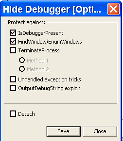

Здесь видим, что среди настроек есть опция под названием UNHANDLED EXCEPTION TRICKS. Этот противоотладочный приём мы и будем изучать. Он работает совместно с другим приёмом, который можно использовать и отдельно – это API-функция ZwQueryInformationProcess, применяющаяся для обнаружения отладчика.

Используем крэкми, который идёт в файле sphynx.zip ***\[[ссылка](.gitbook/assets/files/22/sphynx.7z)\]***. Как вы уже могли догадаться, если включить вышеозначенную опцию, то он выполнится без каких-либо проблем, но нам нужно исследовать, как работают оба метода.

Сразу скажу, что сейчас мы не будем решать этот крэкми, а займёмся гораздо позже. Чтобы найти для него правильный серийный номер, нужно использовать метод "грубой силы", который будет рассматривать в свой черёд, а пока что просто запустим этот крэкми в OllyDbg и изучим вышеупомянутый метод защиты.

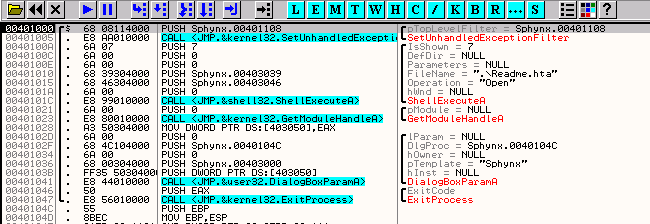

Загружаем крэкми в Nvp11 (пропатченный OllyDbg) и проверяем настройки плагина HideDebugger, которые должны соответствовать нижеприведённой картинке (отмечены все исключения).

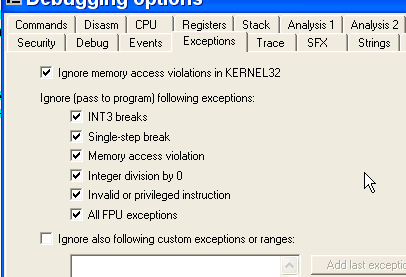

Делаем RUN.

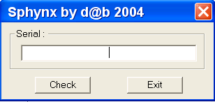

И появляется главное окно крэкми, а защита сработает после него.

Вводим неправильный серийный номер и нажимаем "check".

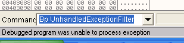

Нам говорят, что невозможно обработать исключение, и программа закроется, если сделаем RUN.

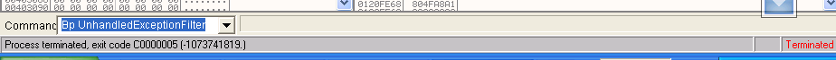

Ок, если бы мы запустили крэкми не из-под OllyDbg, то крэкми бы не закрылся, а продолжил бы работать и дал возможность попробовать другие серийные номера.

Ладно, перезагрузим крэкми и посмотрим, какие API-функции используются.

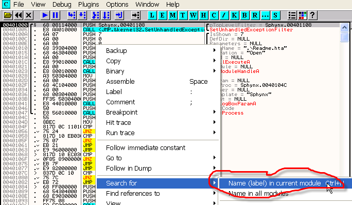

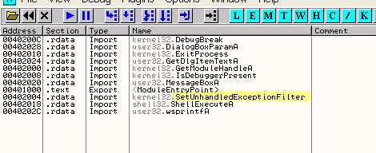

Помните, что у плагина HideDebugger есть настройка для защиты от этого приёма.

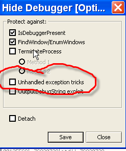

Но прежде, чем её включать, мы должны посмотреть своими глазами, как работает этот метод.

Смотрим описание SetUnhandledExceptionFilter.

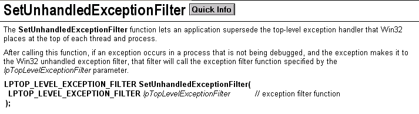

Видим, что единственным параметром функции является адрес, откуда начинать выполнение, когда программа вызывает исключение, всегда когда программа НЕ НАХОДИТСЯ ПОД ОТЛАДКОЙ, хе-хе, что можно использовать для определения, отлаживается ли программа или нет, и не использовать ZwQueryInformationProcess.

Вернёмся к программе, как раз к тому месту, где вызывается эта API-функция.

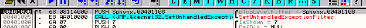

Как видим, один-единственный параметр - адрес, откуда продолжается выполнение, когда программы вызывает исключение, если она не находится под отладкой, хе-хе. В этом случае управление перейдёт по адресу 401108, в противном случае, если программа отлаживается, она завершится.

То есть, мы увидели, что программа может устанавливать обработчики исключений, и когда она использует один из них, то выполнение передаётся по заданному адресу, каждый раз, когда случается данное исключение, но работает этот только тогда, когда программа не находится под отладкой.

Ладно, установим BP на обе функции: SetUnhandledExceptionFilter и UnhandledExceptionFilter, так как они - сёстры и работают вместе.

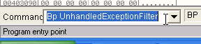

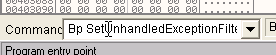

А теперь делаем RUN.

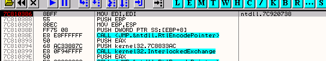

Программа должна продолжить выполнение по заданному адресу, когда возникнет исключение.

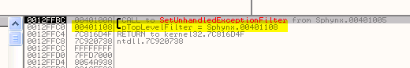

Как видим, адрес - 401108, установим на него BP.

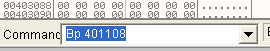

Теперь делаем RUN и наблюдаем за вызывающейся из DLL-библиотек функцией SetUnhandledExceptionFilter.

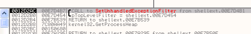

Нам это не интересно, так как мы уже узнали, где находится обработчик, установленный программой, поэтому уберём с этой функции точку останова.

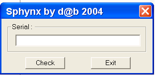

Теперь введём неправильный серийный номер, нажмём CHECK и остановимся на другой API-функции в UnhandledExceptionFilter, так как возникло исключение, которое, разумеется, было сгенерировано программой нарочно, чтобы сюда попасть, и эта функция определит, отлаживается программа или нет, и таким образом управление перейдёт или по адресу 401108, или в мусорную корзину, хе-хе.

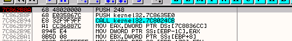

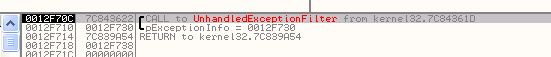

Эта API-функция проверяет, не отлаживается ли процесс, и осуществляет переход в 401108. Оттрасируем функцию с помощью F8, чтобы узнать, как она определяет отладчик.

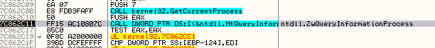

Прибыли, здесь используется второй антиотдочный приём, который мы сегодня рассмотрим. Его можно применять отдельно, и заключается он в вызыве ZwQueryInformationProcess напрямую с параметром INFO CLASS=7.

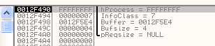

Эта API-функция возвращает информацию о выполняющемся процессе и с параметром INFOCLASS=7 возвращает через буфер информацию о том, отлаживается ли процесс или нет.

Смотрим, что находится в буфере через DUMP.

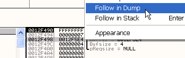

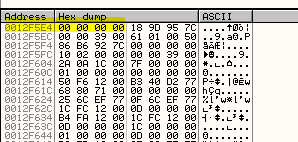

Это буфер, видим, что его размер равен 4 байтам, и эта API-функция возвращает FFFFFFFF, если процесс находится под отладкой, и ноль, если нет. С помощью F8 оттрасируем дальше, чтобы посмотреть, что будет возвращено в этот раз.

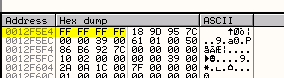

Видим, что было возвращено значение FFFFFFFF, то есть процесс отлаживается, мой друг, хе-хе.

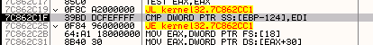

Видим, что затем проводится сравнение, равно ли это значение нулю или нет, так как EDI равно нулю.

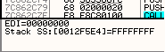

В данном случае перехода не происходит.

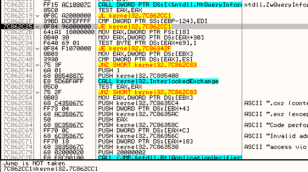

Если буфер не равен нулю, перехода не происходит и программа завершается.

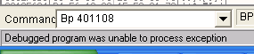

Видим, что выдаётся ошибка, а затем приложение завершается.

Теперь перезапустим его и повторим весь процесс, но на этот раз изменим результат, возвращаемый ZwQueryInformationProcess.

Когда прибудем в

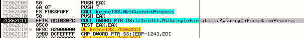

Посмотрим буфер через DUMP.

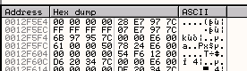

Пройдём по API-функции с помощью F8.

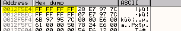

В буфере лежит то же самое, что и в прошлый раз - FFFFFFF, так как программа под отладкой. Изменим на ноль.

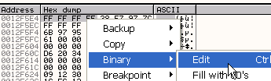

Меняем всё на нули.

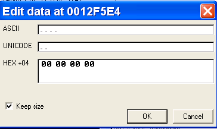

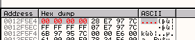

Доходим до сравнения.

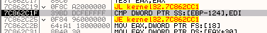

Так как оба операнда равны нулю

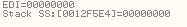

Теперь переход сработает.

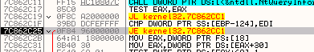

И если сделаем RUN.

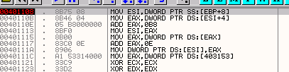

В этот раз прибываем в 401108 и ниже видим интересующее нас место.

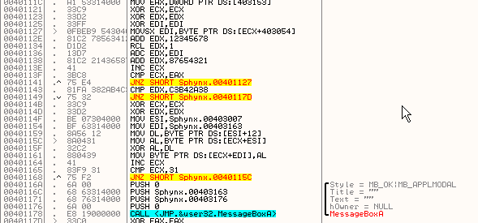

И окошко с сообщением о решении крэкми, можем проверить.

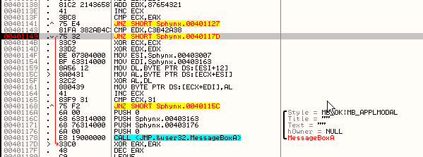

Если изменить переход так, чтобы он не срабатывал, то будет показано сообщение о том, что крэкми был решён.

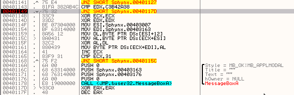

Теперь делаем RUN.

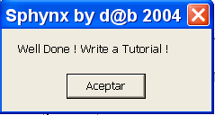

Ок, как уже говорилось, всего этого можно избежать, если включим в плагине HideDebugger настройку UnhandledExceptionTricks, тогда этот крэкми будет работать без каких-либо проблем.

Осталось рассмотреть ещё один вопрос - как избежать обнаружения с помощью API-функции ZwQueryInformationProcess, когда она применяется напряму, а не через UnhandledExceptionFilter.

Конечно, обойти её вручную несложно - достаточно изменить на ноль значение, возвращаемое ею, но существует ли плагин, который позволяет сделать это автоматически?

Плагин [HideOD](.gitbook/assets/files/22/hideod.7z) обеспечивает защиту от вышеуказанной функции без необходимости менять что-либо вручную.

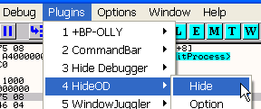

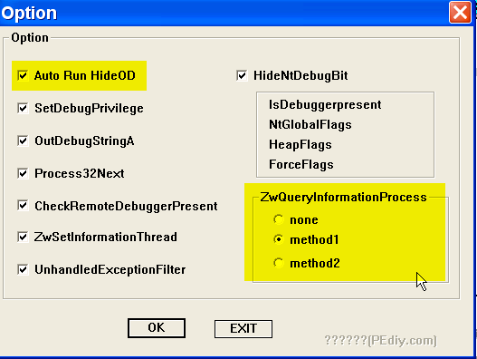

Видим, что здесь есть настройки, которых нет в HideDebugger, так что они могут дополнять друг друга, но главное, не забудьте отметить "Auto Run HideOD", чтобы вам не приходилось нажимать "HIDE" каждый раз, когда вы запускаете OllyDbg.

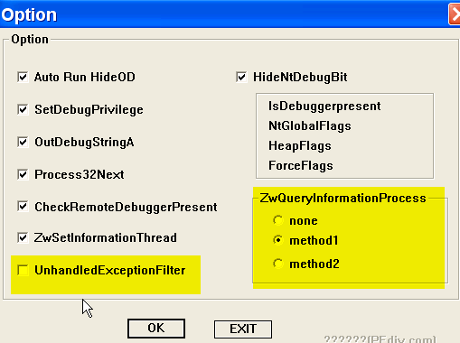

Видим, что несмотря на отключённую защиту от  UnhandledExceptionFilter, так как работает противодействие  ZwQueryInformationProcess, то это нас обезопасило в равной мере, так как именно эта функция используется для нахождения отладчика.

Мы научились обходить защиту с помощью UnhandledExceptionFilter, обнаруживающую защиту посредством ZwQueryInformationProcess. В этом нам помог плагин HideOD, который в сочетании с HideDebugger делает нашу пропатченную Олли чуть ли не крепостью, хе-хе.

\[C\] Рикардо Нарваха, пер. Aquila
