# Глава 23 - Обнаружение OllyDbg (Флаги ProcessHeap и NTGlobalFlag, баг с OutputDebugStringA)

Это последняя глава, посвящённая антиотладке, в которой рассказывается о флагах ProcessHeap и NTGlobalFlag, и как они используются. Таким образом, мы получим представление о самых известных антиотладочных приёмах. Конечно, это не все, но думаю, что все основные, которые нужно знать и которые обычно применяются. Конечно, есть протекторы вроде execryptor, который является чемпионом по обнаружению OllyDbg и использует кроме приёмов, описанных здесь, ещё 4 или 5, но они весьма специфичны, и прочитать о них можно в туториалах Хуана Хосе об этом протекторе, а также нужно знать, что в каждой следующей версии execryptor'а добавляются новые приёмы, поэтому для этого нужно изучать уже не антиотладку вообще, а конкретно данный протектор.

Мы уже знаем, что плагины позволяют нам избежать антиотладки, поэтому сначала нужно выставить правильные настройки.

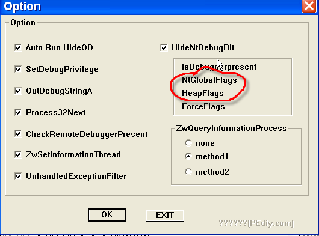

Это плагин HideOD ***\[[ссылка](files/22/hideod.7z)\]***, красным обведены опции, которые прячут OllyDbg от обнаружения с помощью этих флагов, но мы будем исследовать вручную.

Эти два флага показывают, что процесс находится под отладкой, их легко найти. Если вы не можете вспомнить, как найти область, где находится байт IsDebuggerPresent, то прочитайте главу 19, в которой объясняется как найти её вручную, так как эти флаги располагаются неподалёку.

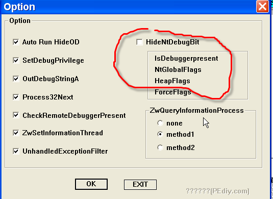

Пока отключим эту настройку, чтобы посмотреть, какие значения у вышеуказанных флагов, а иначе плагин их скроет.

Чтобы попрактиковаться с этими флагами, будем использовать крэкми Cruehead'а ***\[[ссылка](files/1/ollydbg01-Crackme.7z)\]***, в котором и отыщем оба из них.

Откроем его в OllyDbg, предварительно убедившись, что настройка, указанная на картинке выше, отключена.

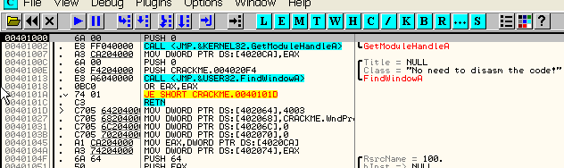

Хорошо, теперь посмотрим, как найти и изменить оба эти флага вручную.

Их можно найти в той же области, где находится и байт IsDebuggerPresent, о котором рассказывалось в 19-ой главе. Простой способ заключается в том, чтобы прямо на точке входа отметить EBX и выбрать FOLLOW IN DUMP, а о полном варианте, если вы его забыли, прочитайте в вышеуказанной главе.

Находим на точке входа.

Отмечаем EBX-FOLLOW IN DUMP.

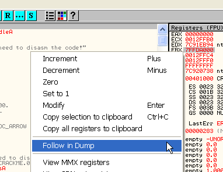

В дампе видим нужную область, помните, что её местонахождение у вас может отличаться, более того, оно меняется каждый раз, когда программа перезапускается.

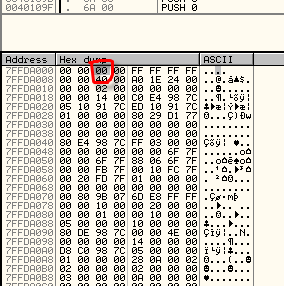

Разумеется, мы помним, что этот байт заполняется API-функцией IsDebuggerPresent, а NTGlobalFlag находится по соседству - надо прибавить 68 к адресу, который находился в EBX, в моём случае EBX содержал 7ffda000, прибавляем 68 и получается 7ffda068.

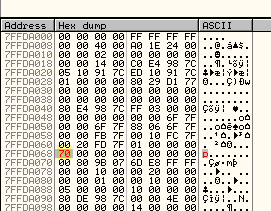

Это и есть знаменитый NTGlobalFlag, значение которого отличается от нуля, если есть отладчик и ноль, если нет, так что можем вручную выставить его значение в ноль.

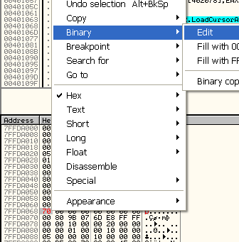

Помещаем сюда ноль.

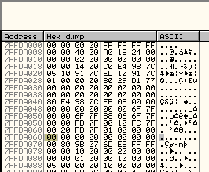

Так мы нашли флаг NtGlobalFlag и поместили в него ноль.

Теперь нужно найти другой флаг ProcessHeap, что также нетрудно сделать.

К значение, которое содержится в EBX на точке входа, надо прибавить 18, это адрес, по которому в моём случае лежит 014000, это тоже адрес - адрес "кучи", то есть область памяти, созданная при запуске программы, куда та может помещать какие-то свои данные, не будем заострять на этом много внимания.

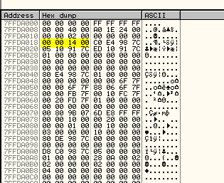

Идём посмотреть, что находится в "куче".

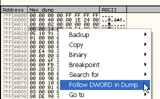

Отмечаем байти и выбираем FOLLOW DWORD IN DUMP, что перенесёт нас в область памяти, зарезервированной под "кучу".

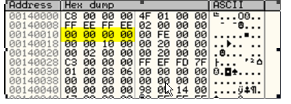

И прибавляем 10 к исходному адресу кучи, это отмеченный на картинке dword, в котором содержится ноль, если отладчика нет, значит сейчас там ноль из-за установленных плагинов, поэтому откроем крэкми в OllyDbg без плагинов.

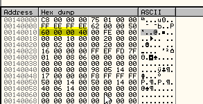

Сейчас здесь содержится не ноль, что говорит о наличии отладчиков, а значит какой-то плагин менял значение этого байта на ноль, хотя мы и не включали какую-либо специальную настройку.

Теперь вернёмся, чтобы включить настройки в HideOdb.

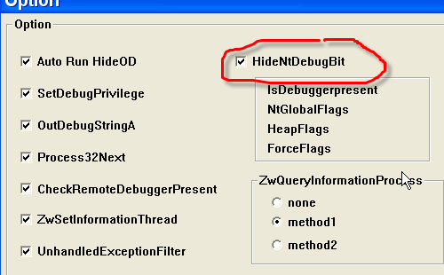

И перезапустим крэкми cruehead'а.

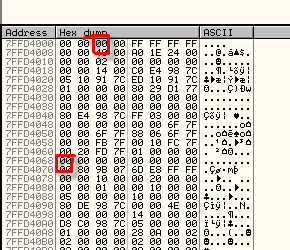

Видим, что остановились на точке входа, флаги IsDebbuggerPresent, как и NtGlobalFlag равны нулю, и поищем ProcessHeapFlag.

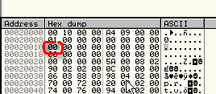

Он также равен нулю, то есть плагин работает правильно. Кроме того, мы научились искать и менять эти флаги вручную.

Последний противооллиный приём также предотвращается установленными плагинами.

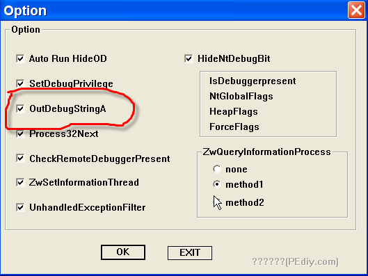

И

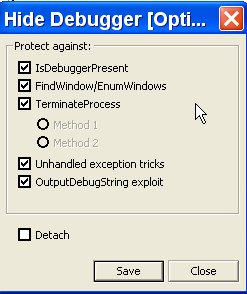

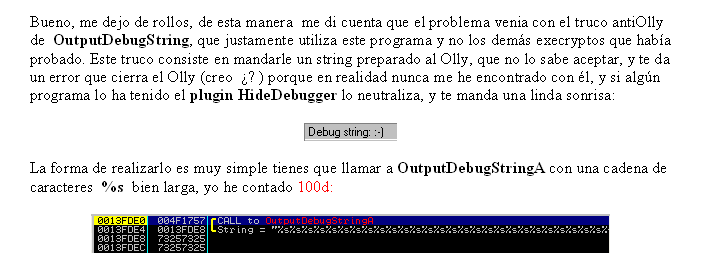

Текст на картинке гласит:

"Хорошо, таким же образом я понял, что проблема связана с противооллиным приёмом, основанный на OutputDebugString и использованный данной программой. Этот приём заключается в передаче Олли специально подготовленной строки, которую та не может обработать, и происходит ошибка, закрывающая OllyDbg. В реальности я никогда не встречался с этим, так как плагин HideDebugger ***\[[ссылка](files/19/HideDebugger124.7z)\]*** нейтрализует данный антиотладочный метод и выдаёт следующее сообщение:

Способ реализации очень прост: вызывается OutputDebugStringA, которой передаётся строка, состоящая из множества символов %s, я насчитал 100d:"

Это описание из прекрасного туториала. Плагины позаботятся об этом баге OllyDbg в лучшем виде.

Чтобы попрактиковаться, вот крэкми ***\[[ссылка](files/23/antisocial1.7z)\]***, где применяются все приёмы, о которых рассказывалось в главах, посвящённых антиотладке, плюс пара других, хе-хе. Идея в том, чтобы запустить его в OllyDbg с отключенными плагинами, и вручную обезвредить антиотладочные приёмы. Для этого вам потребуется немного воображения, например, там есть приём, который можно победить, забив строку нопами. Чтобы обнаружить такие места, нужно зайти в DEBUGGIN OPTION-EXCEPTIONS и убрать все галочки, так как при использовании INT68 генерируется ошибка, которая, если эти настройки включены, приведёт к тому, что Olly не выдаст нам предупреждение об исключении и просто закроется.

То есть, знайте, что если остановились на каком-то исключении (которое не было отмечено в настройках), то нужно нажать SHIFT+F9, чтобы миновать его. Мы рассмотрим это подробнее в следующей главе. Но если исключение генерируется через INT68, то надо забить NOPами это место и сделать RUN, чтобы пройти его без каких-либо проблем.

И в качестве развлечения, можете попробовать запустить крэкми со всеми плагинами, посмотреть, как действует INT68 и выполнится ли программа, а во второй раз уже откройте в OllyDbg без плагинов и попытаться избежать все приёмы вручную, хе-хе.

\[C\] Рикардо Нарваха, пер. Aquila
