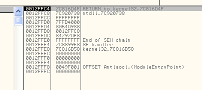
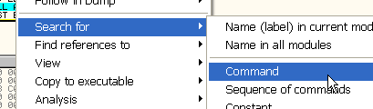
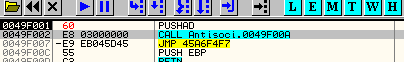

# Глава 24 - Обнаружение OllyDbg (Закрепление темы на примере крэкми "antisocial")

Мне попросили, чтобы прежде, чем начинать рассказ об исключениях, я рассказал о том, как запустить в OllyDbg крэкми "antisocial" ***\[[ссылка](.gitbook/assets/files/23/antisocial1.7z)\]***, которое было приложено к предыдущей статье.

Прежде всего, необходимо знать, что это запакованная программа, поэтому сначала необходимо сделать определённые изменения в памяти без сохранения и только, когда она будет распакована, сохранить насовсем.

Сначала загрузим её в переименованную OllyDbg со всеми плагинами, чтобы посмотреть, почему крэкми не выполняется и попытаться это исправить.

Итак, запускаем antisocial в переименованном и пропатченном OllyDbg со всеми доступными плагинами.

Это уже даёт нам идею о том, что программа может быть запакована. Оказываемся на точке входа.

Здесь видим что-то странное, а именно инструкцию POPAD, которая служит для получения значений из стека, помещённых туда ранее с помощью PUSHAD, а никаких PUSHAD до этого нет, что весьма подозрительно.

Запускаем, чтобы посмотреть, до куда дойдёт.

Досюда.

То есть, когда крэкми пытается сделать PUSH, выдётся ошибка, что нет прав писать в стек, но права писать в стек должны быть всегда. Взглянем на стек.

То есть, значение наверху стека равно 130000, и если рестартуем программу:

Посмотрим секции и увидим, что стек на моей машине идёт с 12c000 до 12ffff, ошибка возникает, потому что стек вышел за пределы своей секции на другую, которая начинается с 130000, а туда-то писать как раз прав и нет.

Вернёмся обратно в место, где произошла ошибка.

Видим, что программа выполняет ещё один popad и совершает JNZ-переход на PUSH, который также вызывает ошибку. Установим BPX на этот popad до того, как произойдёт ошибка.

Теперь перезагрузим программу, сделаем RUN и остановимся здесь.

Смотрим стек.

Находимся в правильной секции. Запускается POPAD.

Здесь заканчивается секция, так что проблему можно решить, забив POPAD NOP’ами, но вообще, POPAD должен предшествовать PUSHAD, которая сохраняет начальные значения регистров в стек, а этот POPAD тогда будет получать их обратно, поэтому давайте посмотрим, что будет, если заменить POPAD на PUSHAD. Рестартуем программу.

Нажимаем пробел.

Пишем PUSHAD.

Теперь нажимаем RUN и останавливаемся на второй POPAD.

Но в этот раз стек в порядке.

Поэтому POPAD не выходит за границу секции стека, и мы можем миновать это место с помощью F8.

Видим, что всё прошло без проблем.

Доходим до PUSH и RET, трассируем и, нажимая на F8, доходим до RET.

Хорошо, здесь есть проблема с анализированием.

Здесь это особенно видно.

Посмотрим, что случится, если сделаем RUN.

Так как программа завершилась, посмотрим в LOG’е OllyDbg, есть ли там что-нибудь интересное.

Видим, что возникло исключение после точки останова на POPAD. Рестартуем и повторим все шаги, чтобы оказаться там, где были.

Уберём галочки со всех опций, которые относятся к исключениям.

Делаем RUN.

Останавливаемся на исключении, что отображается в LOG’е.

INT68 – одно из немногих исключений, которое OllyDbg не может избежать, но можем забить его NOP’ами.

С другой стороны, знаем, что могут быть ещё INT68, которые будут мешать, поэтому поищем их и также забьём NOP’ами.

Видим, что нашлось ещё одно исключение, забиваем его NOP’ами.

Ищем заново, находим, забиваем NOP’ами.

Если нажмём CTRL + L, то продолжим искать то, что искали в последний раз.

Когда ничего больше не находим, делаем RUN.

Как видим, это всё, что нужно сделать, чтобы запустить крэкми из-под OllyDbg с плагинами, а теперь попытаемся сделать тоже самое, но без плагинов, переименования и пропатчивания.

Я распаковал OllyDbg без плагинов, всё, что есть – это command bar, так что никакой защиты. Для этого используем другую директорию и другой путь, указывающий на плагины.

Как видим, здесь только один плагин. Запускаем OllyDbg.

Повторяем операции по замене popad.

Устанавливаем BPX на POPAd, нажимаем RUN и смотрим куда попадём.

Прибываем туда, где распаковывается код программы.

Можем забить INT68 или снять галочки с исключений, и каждый раз, останавливаясь на INT68, забивать его NOP’ами, а не идти дальше с помощью SHIFT+F9, как это мы обычно делаем с другими исключениями.

Посмотрим, какие API-функции используются в программе, для чего нужно вспомнить следующую настройку:

Необходимо отметить её, чтобы отображалась информация о секции, в которой мы сейчас находимся.

Отлично, видим, что подозрительных API-функций нет, но их используется очень мало, а также есть GetProcAddress для загрузки новых, поэтому ставим на неё BPX.

Жмём RUN.

Ничего подозрительного нет, продолжаем нажимать RUN, пока не встретится что-нибудь странное.

Здесь нам повстречалась первая странность: API-функция, которая делает снимок состояния всех выполняющихся процессов. Доходим до RET и ставим BP EAX, так как EAX будет содержать адрес функции.

Там, где находится BP, оставим комментарий, чтобы не забыть, к какой API-функции это относится.

Список продолжается.

Ещё что-то похожее на прошлый случай, на всякий случай поставим BP и сюда.

Жмём RUN.

Ставим BP на неё.

То же самое.

Останавливаемся на API-функции, которая делает снимок, от которого и зависит вся защита. С его помощью производится обработка списка процессов, потоков и множество других вещей. Мы можем попытаться пропатчит эту API-функцию так, чтобы она не возвращала логический номер снимка, для чего проследуем к RET функции.

Видим пустые пробелы (NOP’ы), так что можем сделать EAX равным нулю, до того как его значение будет возвращено.

Так мы возвращаем ноль, и у программы нет логического номера, с помощью которого она могла бы обработать снимок или что-то узнать о процессах. Это один способ, а другой состоит в изменении кода самой программы. Выполним неизменённый RET функции.

Чуть пониже есть JNZ-переходы, а ещё чуть ниже их – вызов TerminateProcess, который закрывает OllyDbg, и перед которым есть OpenProcess, получающий логический номер программы.

Если заменить все JNZ на JMP, можно избежать перехода на TerminateProcess и закрытия OllyDbg.

Первая часть защиты преодолена, теперь переходим ко второй части. Жмём RUN.

Забиваем NOP’ами, запускаем выполнение программы, но она всё равно закрывается. Если поставить плагин HideDebugger ***\[[ссылка](.gitbook/assets/files/19/HideDebugger124.7z)\]***, который защищает от FindeWindows/EnumWindows, то выполнится нормально, если повторить сделанные до этого шаги.

Место, где происходит закрытие, следующее:

Выполняем программу и когда останавливаемся на верхнем вызове,

Видим, что здесь сравнивается.

Вопрос в том, как избежать сравнения этих нехороших вещей, хе-хе, можно сделать это заменив JNZ, который стоит после первого CALL, на JMP.

Этот загадочный переход заменяется на JMP.

Избегаем второго CALL, внутри которого находится следующее.

Здесь находится PostQuitMessage, который даст приложению сигнал о необходимости выхода из цикла обработки сообщений и завершения приложения.

Конечно, если спросите меня, как найти этот JNZ, то это легко.

Как только прошли первую часть защиты, устанавливаем BPX на PostQuitMessage.

Останавливаемся на API, смотрим на стек, чтобы узнать откуда вызывается.

Идём в 4532d7, так что стек расскажет, откуда происходит вызов.

Конечно, я попробовал изменить JE, стоящий перед PostQuitMessage, на обратный и не смог избежать закрытия окна, так что идём ко втором RETURN TO, который есть в стеке.

Он ведёт в 4532СС.

Как видим, этот call можно избежать, обратив JNZ, и тогда не будет вызван и PostQuitMessage, и изменив JNZ на JMP видим, что крэкми выполняется без помощи каких-либо плагинов.

К статье приложен распакованный крэкми ***\[[ссылка](.gitbook/assets/files/24/muysocial.7z)\]***, выполняющийся под OllyDbg без каких-либо ухищрений. В этом курсе вы не будете учиться распаковке, но если вам интересен этот крэкми, то вы можете использовать приложенный файл, чтобы посмотреть, как он работает. С него уже снята распаковка и внесены необходимые изменения, чтобы он запускался под Олли без плагинов.

До встречи в 25-ой главе, где мы будем изучать исключения.

\[C\] Рикардо Нарваха, пер. Aquila
