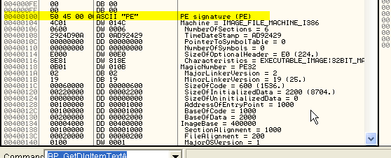
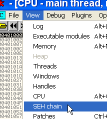

# Глава 25 - Исключения

В этой главе мы рассмотрим обработчики исключений, которые обычно являются камнем преткновения для новичков, но на самом деле это не слишком сложная тема, если немного в неё углубиться.

Исключение создаётся программой, когда процессор выполняет неправильную операцию. Мы увидим различные примеры того, как это случается в OllyDbg, для чего откроем крэкми CrueHead’а ***\[[ссылка](files/1/ollydbg01-Crackme.7z)\]***.

Мы находимся в точке входа и в первой строке будем писать разные инструкции ассемблера, которые приводят к возникновению исключений. Будем использовать туториал Mr Silver’а об исключениях и иллюстрировать последние конкретными примерами.

**Нет доступа к памяти**: возникает, когда тред пытается получить доступ к памяти не в том режиме, на который у него есть права. Данный тип исключения, например, может случиться, если поток попытается записать что-то в ячейку памяти, имея только права на её чтения.

Напишем в OllyDbg следующую строку.

В данном случае, есть только право на чтение и исполнение к ячейке памяти по адресу 401057, но не на запись, поэтому при попытке записать что-либо в данную позицию возникает исключение. Нажмём F8.

У каждой секции есть начальные настройки доступа, хранящиеся в заголовке, до того как программа не выполнит какую-нибудь API-функцию, например VirtualProtect, позволяющую изменить настройки доступа, заданные изначально, во время выполнения.

Где в OllyDbg мы можем посмотреть начальные настройки доступа для каждой секции и изменить, если нужно?

Для этого нажмём кнопку M.

Видим, что секция, начинающаяся с 400000, т.е. первая, являющаяся заголовком PE (исполняемого файла), имеет небольшой размер в 1000 байт, в котором хранятся данные о секциях, именах, размере, в общем, всю необходимую информацию о запуске файла.

Смотрим заголовок через DUMP.

Вводим 400000, то есть адрес, откуда начинается заголовка.

У OllyDbg есть опция для интерпретация большинства параметров заголовка. Находясь в DUMP, нажимаем на правую кнопку мыши.

Видим, что OllyDbg отобразила нам различную информацию, содержащуюся в заголовке.

Если начнём спускаться вниз, то первое, что мы встретим – это PE SIGNATURE, являющееся значением, которое говорит нам, где действительно расположена информация о заголовке. Видим, что оно содержит 100, так что нужно прибавить это число к 400000 и получим 400100. Спускаемся туда.

Как видим, никакой ошибки – именно отсюда начинается важная информация о программе.

Поясним более подробно, что означают некоторые из этих параметры.

То есть, значение этого указателя (1000) надо прибавить к 400000, и получим адрес точки входа программы. Если хотим изменить его, например на 2000, нажимаем на правую кнопку мыши.

Мы можем написать любое число, которое ходим, например, если нужно, чтобы программа начиналась с 402000, то пишем тут 2000, так как отсчёт всегда начинается с 400000, то есть с этого адреса начинается заголовок, который является первой секцией программы.

Затем, чтобы сохранить изменения в файле, нажимаем правую кнопку мыши – COPY TO EXECUTABLE, а в возникшем окне ещё раз правая кнопка мыши и SAVE FILE. Сейчас этого делать не будем, я просто хотел, чтобы вы знали об этой возможности.

Ок, продолжаем идти вниз по заголовку.

Здесь начинаются данные секций, видим, что секция начинается с позиции 1000, т.е. 401000, а её характеристиками являются CODE, EXECUTE и READ.

Если мы хотим, чтобы у этой секции было разрешение на запись, то нужно изменить значение этого поля с 60000020 на E0000020. Это число задаёт сразу права на всё, хе-хе, пробуем.

Хорошо, теперь сохраняем значения с помощью обычной процедуры.

Меняем имя на CRACKME 3, чтобы знать, что это модифицированный нами вариант.

Теперь откроем этот crackme 3 в OllyDbg.

Вернём обычный режим отображения DUMP’а.

Теперь попробуем ту инструкцию, которая вызывала ошибку при записи.

Нажимаем F8.

Видим, что исключения не возникло и значение EAX прекрасно сохранилось по адресу 401057.

Другим типом исключения является:

**Деление на 0**: вызывается, когда пытаемся поделить число на 0.

Например, напишем в OllyDbg:

Здесь происходит деление ECX на EAX, и если последний равен нулю, то будет вызвано исключение.

Нажимаем F8.

Не всегда OllyDbg предоставляет ясную информацию, в данном случае, она не сказала, что происходит деление на ноль. Перепрыгиваем через исключение.

**Неверная инструкция, попытка запуска привилегированной инструкции**: возникает, когда процессоры пытается выполнить инструкцию, не относящуюся к набору, поддерживаемого им, например, при встрече неизвестной операции.

Этот случай мы не сможем опробовать, так как OllyDbg не даёт нам задавать инструкции, которые не существуют, но программист может задать такую, которую процессор не будет поддерживать, и тогда выдастся соответствующая ошибка.

Также очень известным является INT 3, которое генерирует исключение, и используется отладчиком, когда устанавливаем обычный BPX, чтобы остановить программу и передать управление ею туда, где INT 3 был вызван.

Также некоторые программы вызывают INT 3 напрямую, это исключение является одним из наиболее возможных.

Есть много других исключение, и все мы рассматривать не будем. Вот простой пример.

Мы теперь знаем, что программа может генерировать исключения, но что именно при этом происходит? Рассмотрим следующую схему:

На этом графике, который я стащил из туториала SILVER’а, изображено, как возникает исключение при условии, что процесс находится под отладкой.

В случае, если программа находится под отладкой, контроль получает отладчик, который (как это изображено на картинке, смотрит, может ли он контролировать исключение или нет, почти всегда ответ утвердительный и тогда, если включена опция в DEBUGGING OPTIONS-EXCEPTIONS для перепрыгивания через этот тип исключений, контроль возвращается обратно программе, если не включена, то для этого нужно нажать SHIFT+F9, то есть на графике, где сказано CONTROLA LA EXCEPCION-SI отсутствует изображение, отображающее процесс принятия решения, останавливать или продолжать выполнение программы в зависимости от вышеуказанной опции. Смотрим следующую схему.

Здесь видим весь процесс полностью – добавлена красная стрелка. После CONTROLAR LA EXCEPCION происходит определение, нужно ли останавливать или продолжать выполнение программы в зависимости от того, включена ли соответствующая опция, если происходит остановка, то ждём нажатия SHIFT+F9.

Далее видим, что когда возвращаемся из OllyDbg, то происходит проверка, установлен ли SEH, если да, то переходим к нему, если нет, то используем SEH по умолчанию. Это может показаться сложным, но на самом деле, это не так. Объясню поподробнее.

**ЧТО ТАКОЕ SEH**

SEH или Structured Exception Handling – это обработчик, который служит для того, чтобы программа имела возможность восстановиться после ошибки, то есть, если не установили собственный SEH-обработчик, то при возникновении ошибки выполняется системный обработчик, который отображает нам сообщение об ошибке в приложении, программа закрывается и адью. Установив же собственный SEH-обработчик, можем перехватить ошибку, обработать её и возвратить управление программе, которая, вместо закрытия и назойливых сообщений от системы, продолжит выполняться.

Также, хотя мы и не рассматривали серьёзно треды, вот минимальное определение этого термина: это «нити» программы или части, которые могут выполняться одновременно, соответственно, у каждого треда есть собственный обработчик исключений, то есть, если тред установил его, то последний будет выполняться только в нём, а не в других.

**Как устанавливается обработчик исключений**

Ок, снова откроем крэкми CRUEHEAD’а и посмотрим в стек.

Это SEH-обработчик по умолчанию, устанавливаемый системой, и он будет срабатывать при любой ошибке до тех пор, пока не будет заменён на наш собственный, выдавая зловещее сообщение об ошибке. Посмотрим, где находятся указатели на системный SEH-обработчик.

Как можем видеть, в FS:\[0\] находится текущий указатель на обработчик исключений, можем здесь перейти в DUMP.

Как можно видеть, FS:\[0\] – это содержимое памяти по адресу, отмеченное OllyDbg, оно может быть разным на разных машинах, но в моём случае FS:\[0\] всегда содержит 12ffe0.

Как видим в стеке, 12ffe0 указывает на последний обработчик в цепочке, то есть на тот, который работает именно в данном треде, и именно по этому адресу происходит передача управления, когда возникает исключение. Системный обработчик при этом отображает нам знаменитое сообщение об ошибке в приложении.

И если перейдём по VIEW-SEH CHAIN:

Видим адрес системного обработчика, который является единственным установленным, а если бы их было больше, то обработкой исключений занимался бы находящийся в самом верху списка.

Так как крэкми CRUEHEAD’а не устанавливает собственных обработчиков исключений, используем программку под названием SMARTMOUSE ***\[[ссылка](files/25/smartmouse111.7z)\]***, которая прилагается к этой главе.

Загрузим её в OllyDbg.

Здесь видно, что в начале программа собирается установить собственный обработчик исключений, о чём прямо говорится в комментарии OllyDbg.

Оттрассируем по шагам и объясним каждый из них.

Инструкция, с которой, как указывает OllyDbg, начинается установка обработчика исключений, это PUSH адреса, на который должна переходить программа при возникновении исключения. В данном случае этот адрес будет. Выполняем данную инструкцию.

Адрес сохраняется в стек.

Следующая строка перемещает действительное значение fs : \[0\] в EAX. Посмотрим, чему равен FS:\[0\] через DUMP.

Идём туда.

Видим, что fs:\[0\] равно 12ffe0. Можем посмотреть, какую информацию предоставляет по этому поводу OllyDbg.

Теперь выполняем эту строку.

Перемещаем это значение в EAX.

Теперь делаем PUSH с этим значением.

SEH CHAIN означает, что это цепочка. Сохраняемое значение указывает на предыдущий обработчик, являющийся на данный момент активным.

Последняя строка меняет содержимое fs:\[0\], куда помещается содержимое ESP, указывающая туда, где находится новая структура.

После выполнения строки:

Наш обработчик установлен по адресу 12ffb0, как всегда видим, что fs:\[0\] указывает на действующий в настоящее время обработчик.

OllyDbg говорит нам, что это SEH-обработчик, первое значение указывает на старый, а второй – это адрес, по которому будет передано управление, когда возникнет исключение.

То есть, вот что происходит, когда возникает исключение:

Система передаёт управление отладчика, который останавливает выполнение программы или нет (в зависимости от того, включена ли соответствующая данному исключению опция), а затем возвращает управление программе – сразу или ожидая нажатия SHIFT+F9, и как показывает рисунок, теперь, когда установлен SEH-обработчик, выполнение продолжается по адресу 4066d8.

Если посмотрим SEH CHAIN, то теперь увидим:

Видим, что здесь присутствуют как активный обработчик, установленный нами, так и системный, который в данный момент не функционирует.

Вызовем исключение в программе.

Изменим данную строку на:

Это вызовет ошибку, так как не можем писать по адресу 0. Выключим все опции в DEBUGGING OPTION-EXCEPTIONS, кроме первой.

Делаем RUN.

Показывается ошибка и выполнение программы прерывается.

Теперь программа должна продолжить выполнение с SEH-обработчика, пытаясь восстановиться после ошибки.

Обработчик установлен по адресу 4066d8. Идём туда и ставим BP.

Как видим, OllyDbg всегда нам всё рассказывает, хе-хе, нажимаем SHIFT+F9, чтобы продолжить выполнение программы.

Как видим, останавливаемся на обработчике. Узнаем, что он делает, и может ли он оправиться от такой серьёзной ошибки как изменение кода программы.

Видим, что не можем продолжить выполнение и переходим на системный обработчик.

Это произошло, потому что ошибка очень серьёзная, которую программа преодолеть не смогла и передала управление системному обработчику, показавшему зловещее окошко с сообщением и закрывшему приложение.

Очевидно, что обработчик исключений, установленный программой, ожидает другой тип исключений, а не тот, что вызывается из-за изменения кода, но зато увидели, что происходит, если происходит неконтролируемое исключение.

Чтобы рассмотреть другой случай, когда исключение успешно обрабатывается, посмотрим крэкми SDUE ***\[[ссылка](files/25/SDUE1.7z)\]***, которое прилагается к данной главе.

Откроем его в OllyDbg и сообщение отладчика о том, что приложение может самомодифицироваться и т.д. и т.п., говорит нам о том, что крэкми запакован.

Снимем все галочки кроме первой в DEBUGGING OPTIONS-EXCEPTIONS.

И делаем RUN.

Останавливаемся на исключении.

Где находится обработчик:

На вашей машине этот адрес может отличаться, так как секция создаётся во время выполнения программы.

Устанавливаем сюда BP.

Устанавливаем сюда UN BPX.

Нажимаем SHIFT+F9.

Происходит остановка на обработчике, который, если нет никаких странных изменений, должен вернуться на строку следующую за той, что вызвала исключение, после чего выполнение программы продолжится.

Установим UN BP на следующую строку после той, где генерируется исключение, и нажмём RUN.

Видим, что ошибка была обработана и программа продолжает выполняться без каких-либо сообщений об ошибках.

Как видим, это простая процедура, и в обычном случае возвращение происходит на строку следующей за той, которая вызвала исключение, хотя адрес возврата можно изменить в самом обработчике. В этом случае можно установить BPM ON ACCESS на секцию, где возникает исключение, и когда оттрассируем обработчик строка за строкой с помощью F9 и вернёмся в программу, то сработает BPM ON ACCESS и мы точно узнаем, где находимся.

Очевидно, что если хотим остановиться в том момент, когда программа устанавливает обработчик исключений, то лучше создать HARDWARE BPX ON WRITE в FS:\[0\]. Во многих случаев DLL также устанавливают обработчики, затем они убираются и при возвращении в программу остаются те, которые были раньше, и вышеуказанным образом можно контролировать их установку и снятие во время выполнения программы.

Установить обработчик исключений можно и другим способом – с помощью API-функции SetUnhandledExceptionFilter, которой передаётся адрес обработчика.

Ладно, думаю, что мы рассмотрели полезную информацию, которая позволит нам продвинуться дальше в крэкинг. В дальнейшем мы рассмотрим подробные примеры по этой теме.

\[C\] Рикардо Нарваха, пер. Aquila
