# Глава 26 - Взлом приложений, написанных на Visual Basic. Часть 1

В этой и последующих главах мы будем учиться крэкать программы, написанные на Visual Basic’е, с помощью OllyDbg, на что вы можете мне сказать, что для этого существует специальный инструменты, но так как этот курс посвящён именно отладчику OllyDbg, то будем стараться использовать как можно меньше других инструментов, и только, если мы никак не можем добиться того, что нужно, с помощью OllyDbg, тогда и только тогда мы будем прибегать к ним.

Прежде всего, я приготовил для вас небольшой подарок.

Он называется "OLLYDBG PARCHEADO PARA BUSCAR OEPs" ***\[[ссылка](files/26/olly_parcheado_para_vb.7z)\]***, который, как правило, требуется только для распаковки, но на самом деле, он также очень полезен при анализе программ, написанных на VISUAL BASIC и скомпилированных в "родной" код (но не для тех, что используют P-CODE).

Между обоими случаями есть значительное различие, и будет несколько глав, посвящённая P-CODE, но кратко можно сказать, что при "родном" коде, код, как и полагается, выполняется инструкциями в секции "code" программы, а при P-CODE запускается специальная DLL-библиотека, которая читает из секции "code" байты, содержащие информацию о том, какие команды надо исполнять.

То есть, если программа, написанная на Visual Basic’е, никогда не выполняет строки из секции кода, то в этом случае она использует P-CODE, и как с ним работать, мы изучим гораздо позже.

Чем отличается пропатченный OllyDbg? Тем, что при установке BPM ON ACCESS остановка происходит не по событиям ON READ и ON EXECUTE, а только по ON EXECUTE, и это очень полезно для нахождения OEP’ов и для Visual Basic, так как программа не будет останавливаться тысячу раз в библиотеке VB, а будет каждый раз возвращаться обратно в код программы, и мы не потонем в DLL-библиотеке Visual Basic’а.

Также, чтобы работать с Visual Basic, необходимо знать API-функции VB, которые отличаются от обычных, и их нельзя встретить в стандартных мануалах (как, например, WINAPIS32).

В остальном, есть множество туториалов, специально посвящённых VB и содержащие множество приёмов и способов, которые мы не будем использовать, но если вы захотите ознакомиться с ними, то обратитесь к "Новому курсу…" от Crackslatinos и найдите туториалы COCO и других участников, что может весьма вам помочь в данной области. Здесь мы не будем использовать данные методики и будем крэкать только с помощью OllyDbg.

Пропатченный OllyDbg помещаем в ту же папку, где лежит и непропатченный. Естественно, использовать первый имеет смысл тогда, когда взламываем VB-программы, или когда ищем OEP’ы, или в любом другом случае, когда нужно чтобы BPM ON ACCESS работал как BPM ON EXECUTION.

Конечно, если используем этот OllyDbg, то мы не можем использовать BPM ON ACCESS так, чтобы он останавливался по событиям ON READ и ON EXECUTE, в этом случае иногда можно применить HARDWARE BPX ON.

Основная проблема с API-функциями Visual Basic’а – это то, что Microsoft не распространяет информацию о них. Если нужно что-то узнать о какой-то функции, то надо делать поиск в Google, и если повезёт, то найдётся какая-нибудь страница, где будет объяснено, что она делает и для чего служит. Поэтому перед тем, как перейти к собственно крэкингу, в этом главе приводятся собранные мной материалы о некоторых наиболее важных API-функциях и содержащих некоторую общую информацию о программах на Visual Basic’е.

ЗНАЧИМЫЕ СОСТАВЛЯЮЩИЕ ИМЕНИ API-ФУНКЦИИ VB

В именах функций, которые мы повстречаем, могут встречаться следующие аббревиатуры:

```
bool - boolean
str - string
i2 - byte или integer (2 битный integer)
ui2 - unsigned integer (2 битный unsigned integer)
i4 - long (4 битный integer)
r4 - single (4 битный real)
r8 - double (8 битный real)
cy - currency
var - variant (VB) или variable (OLEAUT)
fp - число с плавающей точкой
cmp - сравнение
comp - сравнение
```

Ниже идёт таблица с определениями типов переменных. Имея представление о них, мы уже многое можем понять о самой функции.

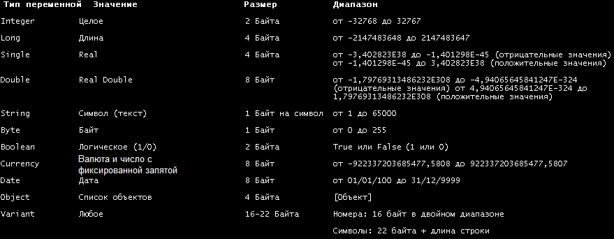

Например:

\_\_vbal2Str говорит о том, что строка конвертируется в число.

Видим, что аббревиатуры дают нам представление о типах. Вот ещё несколько API-функций:

1. Примеры API-функций, конвертирующих данные:
   1. \_\_vbaI2Str преобразует String в Integer.
   2. \_\_vbaI4Str преобразует String в Long.
   3. \_\_vbar4Str преобразует String в Single.
   4. \_\_vbar8Str преобразует String в Double.
   5. VarCyFromStr преобразует String в Currency.
   6. VarBstrFromI2 преобразует Integer в String.
2. Перемещение данных:
   1. \_\_vbaStrCopy – копирует строку в память - аналог API функции HMEMCPY.
   2. \_\_vbaVarCopy - копирует переменный тип (variant) в память.
   3. \_\_vbaVarMove – копирует переменный тип (variant) в память.
3. Математические:
   1. \_\_vbavaradd – сложение двух переменных типа Variant.
   2. \_\_vbavarsub – деление двух переменных типа Varian.
   3. \_\_vbavarmul – умножение двух переменных типа Variant.
   4. \_\_vbavaridiv – сложение двух переменных типа Variant с выводом результата в переменную типа Integer.
   5. \_\_vbavarxor – функция XOR.
4. Вспомогательные:
   1. \_\_vbavarfornext - используется в конструкциях For... Next... (Loop).
   2. \_\_vbafreestr – удаление не использующейся переменной типа String.
   3. \_\_vbafreeobj – удаление не использующегося объекта.
   4. \_\_vbastrvarval – получение численного значения из строки.
   5. multibytetowidechar – преобразование кодировки
   6. rtcMsgBox – отображает окошко с сообщение – похоже на API-функцию MessageBox/A/ExA.
   7. \_\_vbavarcat – объединяет две переменные типа Variant.
   8. \_\_vbafreevar – удаление не использующейся переменной типа Variable.
   9. \_\_vbaobjset - создает объект.
   10. \_\_vbaLenBstr – определяет длину строки.
   11. rtcInputBox – показывает форму с полем ввода - похоже на API-функции GetWindowText/A, GetDlgItemText/A.
   12. \_\_vbaNew – аналог API-функции DialogBox.
   13. \_\_vbaNew2 - аналог API-функции DialogBoxParam/A.
   14. rtcTrimBstr – удаляет пробелы вначале и в конце строки.
   15. \_\_vbaEnd – завершение программы.
   16. \_\_vbaLenVar – получить размер переменной.
   17. rtcMidCharVar –получить определённый символ строки.
   18. \_rtcDir – проверка, существует ли файл.
   19. \_\_vbaFileOpen – открыть файл.
5. Сравнения:
   1. \_\_vbastrcomp – сравнивает две строковые переменные - аналог API-функции lstrcmp.
   2. \_\_vbastrcmp – сравнивает две строковые переменные - аналог API-функции lstrcmp.
   3. \_\_vbavartsteq – проверка на равенство двух переменных.
   4. \_\_vbaFpCmpCy – сравнивает значение с плавающей точкой с Currency значением.
   5. \_\_vbavartstNe – сравнение двух переменных на неравенство.

Эти описания помогают нам получить представление о том, что программа делает в данный момент. Имя функции не даёт нам много информации, возможно, она неполная, но тем не менее она помогает нам понимать, что происходит.

И хотя пока что мы не рассматриваем крэкинг в SMART CHECK’е, вот адрес со списком внешних функций VB, с которым может консультироваться крэкер.

[http://www.w3schools.com/vbscript/vbscript\_ref\_functions.asp](http://www.w3schools.com/vbscript/vbscript_ref_functions.asp)

Например, в Smartcheck’е нам показывается функции ASC или MID, которые не соответствуют тому, что мы видим в OllyDbg или функциям в языке программирования Visual Basic, но на этой странице хорошо объяснена каждая из возможных команд и их параметры, поэтому крэкинг в SMART CHECK’е существенно легче.

Например, в SMART CHECK’е видим команду LEN, которая соответствует API-функции \_\_vbaLenVar.

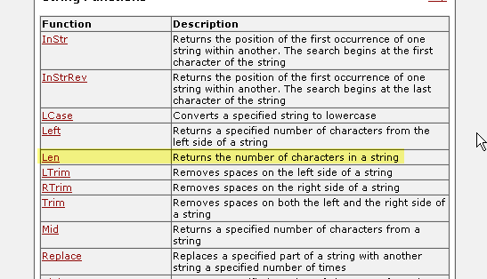

На странице смотрим определение LEN.

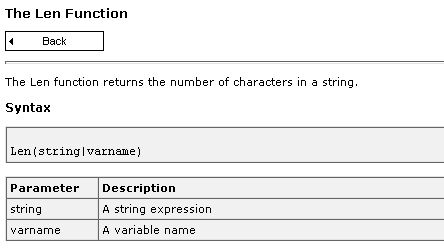

Это поможет тем, у кого есть проблемы с использованием SMART CHECK’а. Хотя в этом туториале мы не будем его рассматривать, думаю, что ни одна из статей, посвящённых этому инструменту, не даёт точный список используемых им выражений, поэтому я и упомянул его.

Ладно, теперь, когда мы всё это знаем, перейдём к крэканию CrackMePls ***\[[ссылка](files/26/CrackMePls.7z)\]***.

Открываем его в пропатченном вышеуказанным образом OllyDbg.

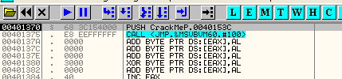

Этот крэкми очень простой: есть наг (nag), который нужно убрать, и серийный номер, который нужно найти. Смотрим и делаем RUN.

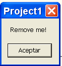

Закрываем наг-окошко, которое похоже на MessageBoxA, хотя в Visual Basic’е этому соответствует API-функция rtcMsgBox. Установим на неё BP.

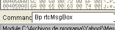

И рестартуем, чтобы посмотреть, произойдёт ли остановка до того, как выйдем из наг-окошка.

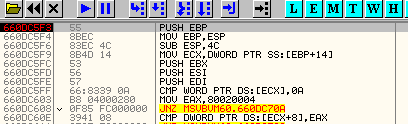

Останавливаемся здесь, нет никакой подсказки относительно параметров или чего бы то ни было ещё, но это неважно.

Видим, откуда вызывается эта API-функция, первое значение стека – это адрес, по которому будет осуществлён возврат управления.

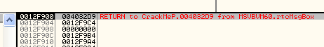

Смотрим место, откуда произошёл вызов.

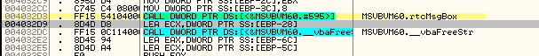

Вот вызов API-функции, а ниже, соответственно, находится точка возврата, адрес которой 4032d9.

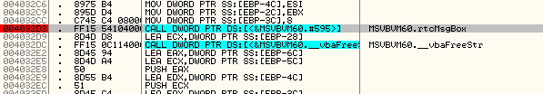

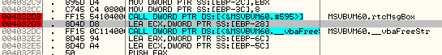

Устанавливаем BP на точку возврата из API-функции и нажимаем RUN.

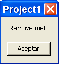

Нажимаем и останавливаемся на возврате.

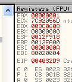

EAX=1 означает, что API-функция выполнилась успешно. Теперь надо рестартовать крэкми, чтобы затем каким-нибудь образом забить наг-окно NOP’ами.

Рестартуем крэкми и останавливаемся на вызове.

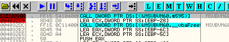

Если кликнем правой кнопкой мыши на строке, куда происходит возврат, и выберем NEW ORIGIN HERE, то выполнение продолжится отсюда без отображения окошка. Это симуляция забивки вызова NOP’ами.

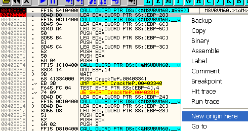

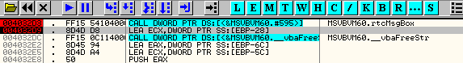

Здесь делаем RUN и смотрим, что происходит.

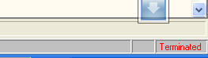

Очевидно, что решение забить NOP’ами вызов API-функции не работает. Попробуем другой способ. Рестартуем крэкми.

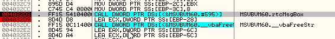

Доходим до 4032d9 и продолжаем трассировать с помощью F8.

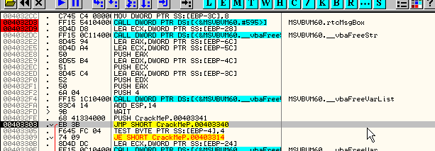

Доходим до JUMP и продолжаем трассировать.

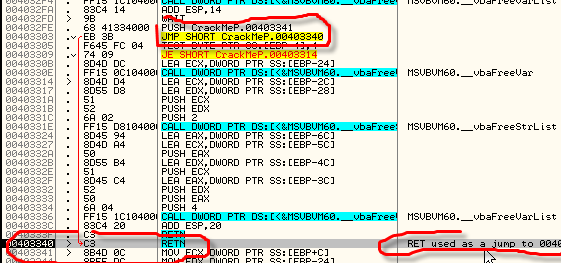

JMP, перед которым находится PUSH 403341, переходит на RET, то есть тот используется для перехода на 403341, о чём нам также говорит и OllyDbg. Этот приём используется для того, чтобы не дать нам заметить адрес возврата в стеке. Продолжаем трассировать.

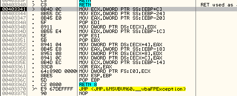

Доходим до RETN 8.

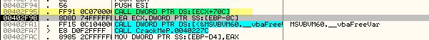

Здесь, по адресу 402f95 заканчивается выход из CALL'а, но адрес возврата не остаётся в стеке благодаря трюку, используемого для скрытия CALL'а и адреса возврата.

Устанавливаем BP на этот CALL и рестартуем крэкми.

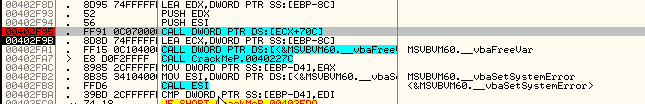

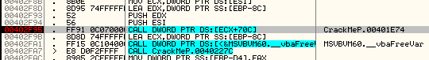

Забиваем CALL нопами, чтобы посмотреть, запустится ли он без наг-окошка.

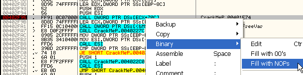

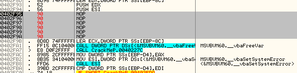

Делаем RUN.

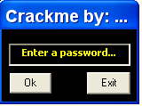

Пока-пока, наг, хе-хе, позже мы рассмотрим другие примеры того, как убирать наги, но этот пример был достаточно прост, не считая маленького рассмотренного выше трюка. Вопрос состоял в том, чтобы идти от появления нага до возвратов из CALL’ов, чтобы увидеть, можно ли забить NOP'ами какой-то из них для устранения назойливого окошка.

Теперь крэкми работает и предлагает нам ввести правильный серийный номер.

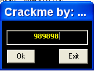

Тут мы увидим возможность, даваемую пропатченным OllyDbg. Хотим поставить BPM ON ACCESS (выполнение) на секцию кода, идём в M.

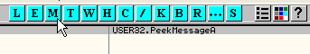

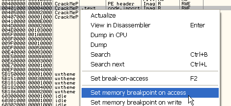

Вспоминаем, что в этом OllyDbg это BPM ON EXECUTION, при котором не происходит остановки при чтении и записи в секции, где выполняется DLL-библиотека Visual Basic'а, а быстро происходит возврат в программу, благодаря чему мы избегаем тысячи лишний остановов.

Нажимаем OK.

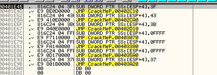

Останавливаемся здесь и немного потрассируем.

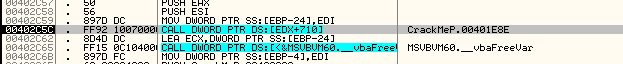

Доходим до этого вызова. Быстро проходим через вызовы API-функций и заходим во внутренние функции программы.

Тогда заходим с помощью F7.

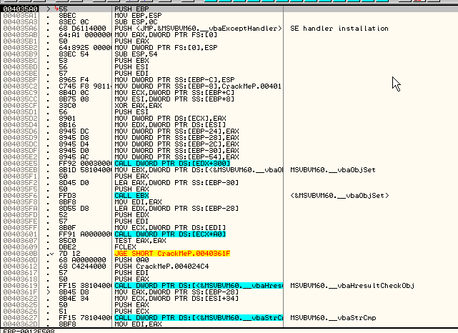

Доходим до места, возможно, представляющего интерес, внизу видим vbaStrCmp, что может являться возможным сравнением строк. Устанавливаем сюда BP и снимаем BPM до того, как сделаем RUN.

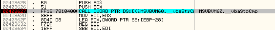

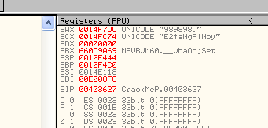

Видим, что происходит сравнение введённой строки "989898" с правильным серийным номером. Копируем его.

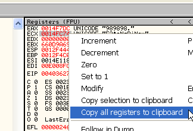

И помещаем содержимое буфера в блокнот..

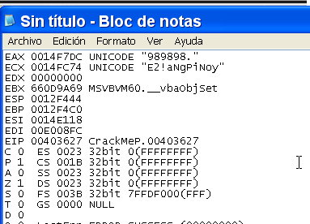

Отсюда легко можем скопировать правильный серийный номер.

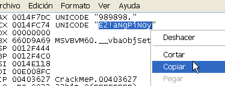

Пробуем поместить его в окошко крэкми.

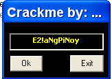

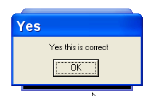

Хорошо, получилось. Конечно, нужно сохранить изменения (мы же забили наг-окошко NOP'ами), чтобы теперь это крэкми выполнялось нормально.

В главе 27 продолжим углубление в крэкинг приложений на Visual Basic и будем использовать более сложные примеры.

\[C\] Рикардо Нарваха, пер. Aquila
