# Глава 27 - Взлом приложений, написанных на Visual Basic. Часть 2

## Продолжаем с Visual Basic'ом

Ок, продолжаем с Visual Basic’ом. Здесь у нас крэкми, в котором нужно избавиться от наг-окошка. Я это сделаю это тем способом, который подойдёт для данного конкретного случая (мне нравится размышлять и пробовать новое), но конечно, используя OllyDbg, специально заточенный для VB, тот же, что и в прошлой главе. Потом мы рассмотрим механический способ, позволяющий сэкономить время. Можно было бы сразу дать его, но я считаю, что очень важно самому попытаться это сделать, чтобы понять как его работает, поэтому сначала рассмотрим мой способ снятия нага, а потом – механический способ, потому что вы должны знать и уметь применять оба.

Killme ***\[[ссылка](files/27/killme.7z)\]*** – это крэкми, которое мы будем изучать. В нём нет крэкми, а есть только назойливое наг-окошко, появляющееся при запуске программы и которое нужно убрать.

Если запустим крэкми в OllyDbg, то увидим наг-окошко.

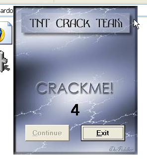

Видим, что есть недоступное для нажатия окошко и таймер от пяти до нуля, и когда он становится равным нулю, то кнопку CONTINUE становится возможным нажать.

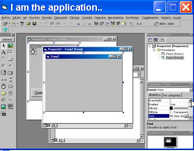

Появляется указанное приложение, которое должно запускать сразу без каких-либо нагов. Изучим немного о том, как работает крэкми, разумеется, с помощью OllyDbg.

Первое побуждение, возникающее при исследовании программы с наг-окном — это посмотреть JMP-переходы, ведущие в разные части программы.

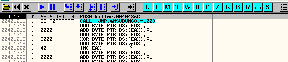

Запускаем программу и нажимаем F9.

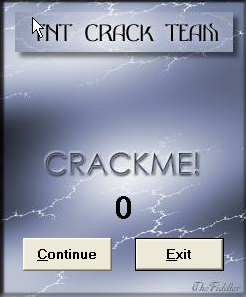

Указанное время прошло и кнопка CONTINUE становится доступной для нажатия.

Знаем, что при закрытии нага осуществляется проход через JMP в секции кода, поэтому устанавливаем BPM ON ACCESS в указанной секции (что в реальности будет BPM ON EXECUTION) и нажимаем кнопку CONTINUE.

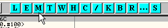

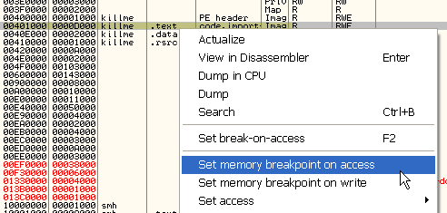

Останавливаемся здесь.

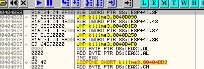

То есть видим, что собственно программа начинает выполнение в 40D090, то есть мы видим JMP-переход на 40D090, где начинается указанная часть и видим остальные JMP на разные части программы. Устанавливаем BP на все эти JMP, чтобы куда и в каком случае они ведут.

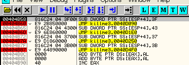

Перезапускаем программу.

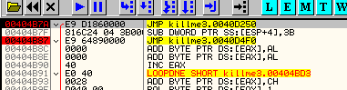

Видим, что после выхода из нага останавливаемся здесь. Есть большой соблазн поменять JMP на JMP 409090, чтобы происходил прямой переход на программу, но это вызовет ошибку и запуска не происходит, так что опять делаем RUN.

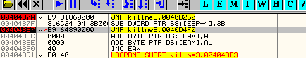

Видим, что останавливаемся на следующем JMP и если нажмём RUN снова:

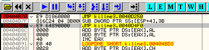

Несколько секунд и останавливаемся снова, и так – 5 раз, что говорит мне о том, что в этой процедуре содержится таймер.

Оттрасируем эту процедуру и посмотрим, что в ней находится.

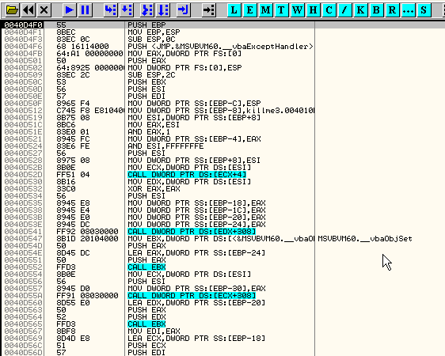

Ничего хорошего, продолжаем трассировать с помощью F8.

Доходим до каких-то условных переходов. Можно посмотреть, что произойдёт, если заменим их на обратные: перестанет ли работать таймер и станет ли доступной для нажатия кнопка. Попытаемся выяснить, для чего они служат.

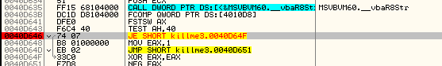

Это сравнение, использующее плавающую точку, пока не знаем, для чего она, так что менять переходы на обратные даст нам не очень много.

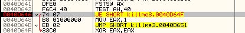

Видим, что в первые проходы здесь происходил переход, а в последний раз – нет, делаем вывод, что это и есть сравнение таймера, которое заканчивает работу, когда достигает нуля. Забиваем условный переход NOP’ами и смотрим, что произойдёт.

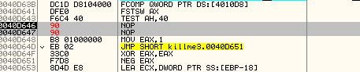

И нажимаем RUN.

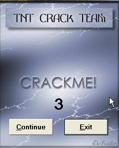

Видим, что попали в цель, изменили условный переход, прервав тем самым счёт таймера и сделав доступной кнопку CONTINUE, так что пока что нам подойдёт этот вариант. Теперь надо добиться, чтобы кнопка была доступна после возврата из этой процедуры, нужно, чтобы происходил переход в начало программы. Перезапустим программу.

Идём к строке, которую забиваем NOP’ами до запуска чего бы то ни было.

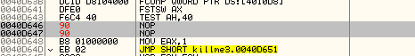

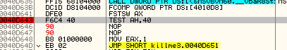

Убираем все BP и ставим один сюда. Теперь делаем RUN.

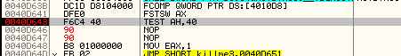

Останавливаемся здесь и трассируем, чтобы посмотреть, где завершается процедура и происходит возврат в библиотеку Visual Basic’а.

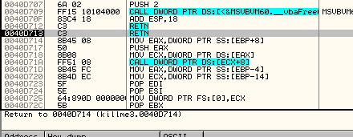

Видим, что дошли до RETN, но переходит не в DLL VB, а продолжаем с 40d714.

Продолжаем трассировку.

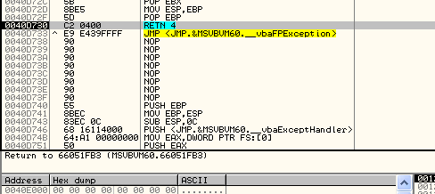

Здесь видим RETN, который, согласно пояснению, производит возврат в DLL Visual Basic’а, поскольку тут уже всё подготовлено для запуска программы, так что можем попытаться изменить этот RETN 4 на переход в начало программы. Смотрим.

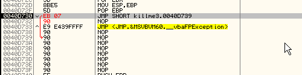

Прыгаем сюда, поскольку здесь достаточно места, чтобы написать всё, что нам нужно, а затем переходим на 40d090, откуда начинается программа.

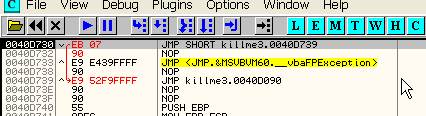

Пробуем, запустится ли. Делаем RUN.

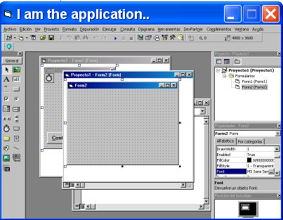

Можем сохранить эти изменения, начальные NOP’ы и эти два перехода.

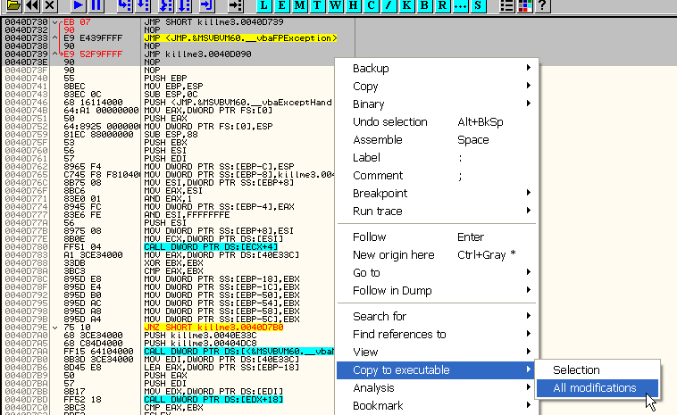

Нажимаем правую кнопку мыши – COPY TO EXECUTABLE – ALL MODIFICATION и сохраняем всё, что изменили.

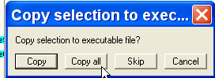

Нажимаем COPY ALL.

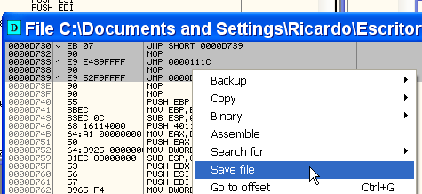

Теперь правая кнопка мыши – SAVE FILE.

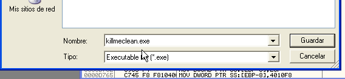

Ок, теперь мы гораздо ближе к решению. При запуске наг-окошко появляется и после нескольких секунд исчезает, так что снова устанавливаем BPX на эти JMP-переходы.

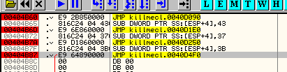

Делаем RUN.

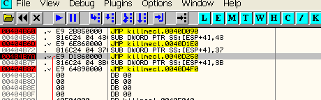

Видим, что сначала происходит остановка на том переходе, который создает наг-окошко (404b7a), а спустя нескольких секунд происходит закрытие окошка и остановка на 404b87, после чего сразу запускается программа благодаря нашему патчу, так что нам нужно изменить переход, который создаёт наг-окно, чтобы сначала выполнялась пропатченная нами процедура, а затем сразу запускалась сама программа.

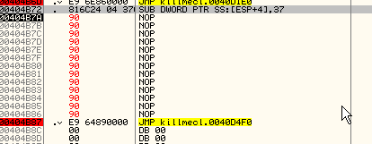

Забиваем переход, который создаёт наг-окно, и идём сразу туда, где инициализируется таймер и начинается программа. Смотрим, что получилось, нажав F9.

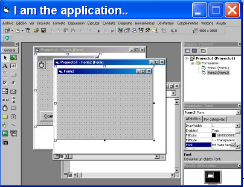

Сохраняем изменения и пробуем ещё раз.

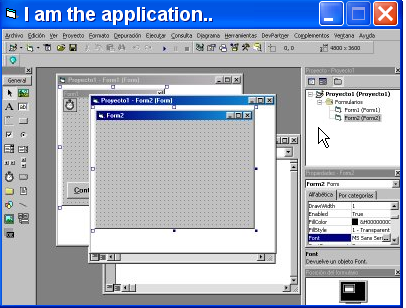

Происходит "чистый" запуск без каких-либо всплывающих окон – чистый как слеза младенца.

Метод 4c – это механический метод, который очень полезен, чтобы сделать это быстро и просто, и основывается на знании того, как устроен VB-файл.

Посмотрим на точку входа:

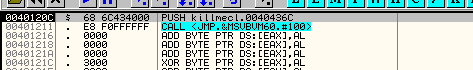

Видим, что программы, написанные на VB начинаются с PUSH и CALL (если вам они не встретились, значит, что exe-файл был изменён, тогда необходимо найти PUSH и записать адрес, который кладётся в стек, в данном случае 40436C).

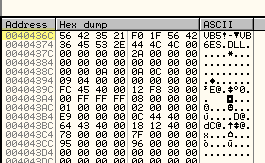

Как видим, это адрес VB-заголовка.

К этому адресу необходимо прибавить 4C.

`40436c + 4c`

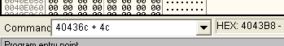

Это 4043b8.

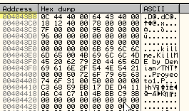

Вот он, теперь ищем адрес, который здесь лежит – это 4044c0.

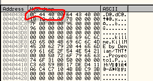

Находим данный адрес в DUMP’е.

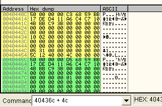

Видим похожие элементы, каждый из которых соответствует какой-то форме (FORM). Двадцать четвёртый байт каждого из этих элементов – это порядок, в котором формы должны появляться. Смотрим:

`40440c + 24=404430`

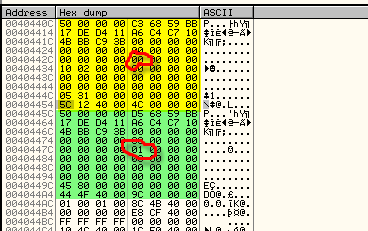

Здесь находится 00, то есть эта форма будет появляться первой, а 01 означает, что это вторая, так что можем изменить порядок.

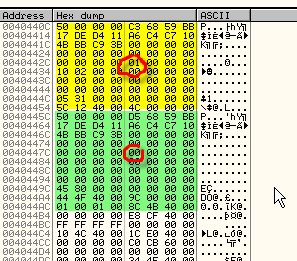

Так что первой появится программа, хе-хе, а наг-окно вторым или вообще не появится, так как при закрытии программы приложение завершится, и у второй формы не будет шансов.

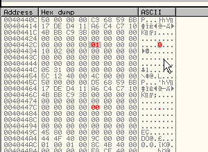

Вот мы и решили крэкми с помощью метода 4c, конечно он гораздо легче и быстрее, но всегда полезно понимать как программа работает и сражаться с ней, поэтому я показал вам оба метода, так как автоматический метод подойдёт не во всех случаях, и придётся исследовать программу глубже.

К этой главе прилагаются два крэкми – один простой ***\[[ссылка](files/27/CrackMe.7z)\]** (для запуска крэкми понадобиться MSVBVM50.dll **\[[ссылка](files/27/MSVBVM50.7z)\]**)* и один посложнее ***\[[ссылка](files/27/CrackMe2.7z)\]***, посмотрите, сможете ли вы найти серийные номера, избавиться от наг-окон и так далее. В следующей главе мы их решим.

\[C\] Рикардо Нарваха, пер. Aquila
