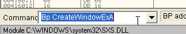
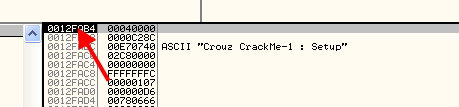

# Глава 28 - Взлом приложений, написанных на Visual Basic. Часть 3

## Ещё техники для Visual Basic (абсолютная война)

Лично я слышал немало крэкеров, которые говорили, что тот или другой метод – это не "чистый" крэкинг, не "элегантный" крэкинг или что-нибудь ещё вроде этого. Для меня "элегантный" крэкинг – тот, который работает, и это всё, что имеет значение, потому что на войне как на войне: программисты, создающие упаковщики и протекторы не задумываются о том, насколько "элегантны" их действия, они используют любые методы, которые могут найти, не думая о том, как те повлияют на наши машины. Мы рассмотрим примеры грязных трюков, которые используются упаковщиков в отчаянной попытке сделать так, чтобы никто не мог распаковать защищаемую ими программу.

Поэтому я думаю, что если враг использует ракеты, ограничивать себя в бою револьвером – это значит заведомо проиграть, так что я использую ЛЮБОЙ метод, который нормально работает, не портит другие программы, корректен и юзабелен, и то, что он не одобрен АЭК (Ассоциацией Элегантных Крэкеров) меня не остановит.

Прояснив этот момент, переходим к рассмотрению следующего крэкми ***\[[ссылка](files/27/CrackMe2.7z)\]***, которое будет объектом сегодняшнего изучения.


С помощью метода 4c мы может легко избавиться от наг-окна. Часть, связанная с серийным номером, сделана с помощью P-CODE, и его мы оставим до того момента, как начнём рассматривать эту тему.

Найти в этом крэкми серийный номер очень просто. Главный вопрос с его окном в том, является ли оно нагом или нет. Если наложить метод 4c, то можно увидеть, что там две формы и, используя этот метод, избежать их появления друг за другом нельзя.

Прежде всего посмотрим, что там с вводом серийного номера.


Оказываемся в окне крэкми и вводим неправильный серийный номер.


Одна из самых полезных функций для сравнения – это vbaStrCmp.


Устанавливаем на неё BP, чтобы посмотреть, будет ли она использоваться для определения, является ли введённый серийный номер правильными.

Так как останавливаемся множество раз и постоянно нажимать на F9 лень, то посмотрим, можно ли перехватить сообщение об ошибке и оттуда попасть в сравнение, которое должно быть где-то поблизости. Снимаем BP на сравнение и устанавливаем его на вывод окошка сообщения.

`Bp rtcMsgBox`


Останавливаемся здесь, когда должно быть отображено сообщение о том, что серийный номер неверен, смотрим, откуда произошёл вызов в первой строке стека, которая содержит строку возврата из данной API-функции.


Идём сюда.


Вот куда произойдёт возврат. Это вызов API-функции и смотрим выше, есть ли там какое-нибудь сравнение.


Немного ранее видим его, устанавливаем BP, чтобы проверить, верно ли наше предположение, нажимаем F9.


Здесь видим, что мой серийный номер сравнивается с другим числом. В моём случае это 4887649. Смотрим, является ли этот серийный номер правильным. Убираем все BP и снова попадаем в окно ввода серийного номера.


Да, это правильный серийный номер, кейген оставим когда-нибудь на потом.

Сначала, для того чтобы убрать наг-окно, нужно сделать возможным модификацию крэкми, то есть установить разрешение на запись в секцию кода, для чего идём в заголовок программы, который начинается с 400000.


И переходим в режим PE HEADER.


Спускаемся оттуда, где начинается PE SIGNATURE заголовка, до места, где находится первая секция.


Здесь видим характеристики. Знаем, что если изменим на E0000020, то сможем производить запись в данную секцию.


Хорошо, теперь сохраняем изменения.


Сохраняем как CrackmeA.exe.


Теперь открываем CrackmeA в версии OllyDbg, пропатченной на предмет OEP’ов и Visual Basic’а ***\[[ссылка](files/26/olly_parcheado_para_vb.7z)\]***.

Устанавливаем BPM ON ACCESS (которые исчезли после выхода из отладчика) на секцию CODE.


Делаем RUN несколько раз досюда.


Продолжаем, пока не остановимся на знакомых нам JMP’ах, уводящих в разные части программы.


Видим, что в первый раз останавливаемся на первом JMP и переходим на 40bd80, то есть здесь выполняется первая часть программы. Смотрим, появляется ли наг-окно до того как происходит возврат к этим переходам. Убираем BPM ON ACCESS, так как сейчас будет выполняться значительная часть программы в секции кода, и останавливаться на каждой строке нам совсем не нужно, лучше установим BP на эти конкретные переходы в разные части программы.


Посмотрим, будет ли наг-окно или перейдём к другому JMP. Делаем RUN.


Сейчас останавливаемся на последнем переход, который ведёт в 40c470, но нага ещё нет.

Снова делаем RUN.


Здесь появляется наг-окошко, то есть часть программы, которая начинается с 40c470 ответственна за наг, нажимаем кнопку "Register".


Возвратившись из окна, останавливаемся на втором JMP, который, предположительно, ведёт в начало программы, так что можно попробовать, что произойдёт, если мы заменим последний JMP, ведущий в наг-окно на этот, переход на который осуществляется при выходе из этого окна.


Меняем второй переход, которые ведёт в часть, ответственную за появление наг-окошка на третий, который должен вести в начало программы. Сохраним изменения и посмотрим, что произойдёт.

Запускаем изменённый нами CrackmeA не из-под OllyDbg.


Видим, что наше изменение слегка улучшило состояние дел с проблемой, хотя и не решило её, т.к. изначальное наг-окно не исчезло и требует, чтобы была нажата кнопка "Register", для чего отображает окошко для ввода серийного номера, которое находится сзади под первым. Это большой шаг вперёд, так как раньше если мы делали наг невидимым, то мы не могли нажать вышеупомянутую кнопку. Теперь же мы можем сделать так, что окно ввода отобразится, а наг сделать невидимым, так что окно для ввода серийного номера останется одно на экране.

Поскольку наши попытки с JMP не решили проблему полностью, не остаётся ничего другого, как вносить изменения в VB-библиотеку. Это может стать для многих крэкеров поводом, чтобы сказать, что не подобает изменять VB-библиотеку, но это верно только тогда, когда она находится в system32 и используется всеми программами. Мы скопируем её в ту же папку, где и располагается программа, так что она будет использовать только последней, а остальные программы будут продолжать использовать библиотеку в system32.

Вопрос заключается в том, как именно называется эта DLL.


Копируем в папку с программой.


Теперь она находится вместе с CrackmeA, то есть чтобы перестала использоваться системная VB DLL, нужно скопировать её в папку с программой, и та будет использовать именно эту копию библиотеки.

Соответственно, когда некая программа использует какую-то нестандартную DLL, то первым дело надо поискать её в папке этой программы, а если её там нет, то в system32. Подобное положение вещей нас очень даже устраивает, хе-хе, потому что позволяет нам вносить изменения только для конкретной программы, не меняя ничего для других.

Снова открываем CrackmeA в OllyDbg, в этот раз используя обычный, неизменённый вариант отладчика, чтобы внести те строки кода или изменения, которые нельзя сделать в пропатченной версии.


Проверяем с помощью кнопки E, используется ли DLL из директории программы или из system32.


Видим, что загружена DLL из папки крэкми, поэтому все изменения, которые мы внесём в эту библиотеку, окажут воздействие только на данный крэкми и больше ни на какую программу.

Хорошо, у нас есть VB DLL. Для того, чтобы можно было вносить в неё изменения, нам нужно выставить в секции кода права на запись. Это можно сделать следующим образом.

Открываем OllyDbg и идём в меню OPEN.


Видим, что по умолчанию стоит отображение EXE-файлов, но сейчас нам нужно открывать DLL, так что меняем соответствующую настройку внизу.


Ставим "Dynamic-link library (\*.dll)", что позволит нам открыть DLL Visual Basic’а.


Останавливаемся на точке входа библиотеки.

Ок, сейчас нам нужно найти заголовок, который в данном случае не будет располагаться там, где обычно. Посмотрим, чему равна база образа файла, то есть адрес, откуда он начинается. Нажимаем кнопку E.


В колонке "Base" мы находим базу образа DLL, которая в моём случае равна 66000000 и может отличаться на вашей машине.

Идём в DUMP и смотрим заголовок.


Теперь меняем режим "Special - PE HEADER" согласно процедуре, которую делали в крэкми. Спускаемся и ищем секцию кода.


Меняем на E0000020, чтобы установить разрешение на запись.


Сохраняем изменения.


Здесь не меняем имя, а сохраняем под тем же.

Как только у нас есть крэкми и DLL с возможностью писать в неё, до того как делать вставку, покажу в чём заключается идея того, как сделать так, чтобы не появлялось наг-окно.

Открываем в OllyDbg крэкми, которое нам нужно пропатчить, останавливаемся, когда поверх окна ввода серийного номера появляется наг-окно, устанавливаем BP на API-функцию создания окон с помощью команды "Bp CreateWindowExA".


Теперь открываем крэкми.


Несколько раз останавливаемся, когда создаются различные окошки и кнопки, используемые крэкми. Прибываем в то место, где создаётся наг-окно.


Тут мы легко обнаружили её по имени окна, т.к. оно совпадает с названием в заголовке окна.


Хорошо, тут создаётся наг, можем здесь поменять его стиль, давайте посмотрим, что произойдёт если поставим 40000000.


Меняем стиль на WS\_CHILD. Вы можете поэкспериментировать с разными значениями. Теперь убираем все BP и делаем RUN.


Видим, что появляется только окно регистрации, а наг – нет. То есть можно добиться цели и не меняя DLL и других программ, как если бы мы боксировали со связанными руками.

Ок, повторяем процедуру до того момента, как создаётся окно, чтобы вмешаться в API-функцию CreateWindowsExA.




Видим, что API-функция вызывается из DLL Visual Basic'а, смотрим, откуда происходит вызов, информация об этом содержится в первой строке стека. Идём туда.


Устанавливаем BP сюда и выходим из API-фукнции.

Теперь посмотрим, когда произойдёт останов. Рестартуем и делаем RUN.


Останавливаемся здесь и смотрим стек.


Видим, что в первый раз останов происходит при создании наг-окна, а так как в последующие разы останова на этой API-функции, вызов происходит не отсюда.

К сожалению, это не единственный раз, когда мы здесь проходим, так как когда создаётся окно регистрации, оно тоже делается здесь, так что мы должны быть внимательными, чтобы сделать выборочную вставку.

Вставка начинается с JMP в пустую область, куда можно писать. Если поищем конец секции, то найдём там такую зону.


На моей машине такая область находится в конце секции кода, идите туда, где много нулей.

Нажмите правую кнопку мыши – VIEW EXECUTABLE, чтобы посмотреть эту область и подготовиться к сохранению изменений в exe-файле.


Видим, что область находится в исполняемом файле.

Ок, нам нужно сделать вставку, так что проверяем, можем ли мы сохранить изменения в выбранной нами зоне, так как очень часто бывает, что часть секции со множеством нулей существует только в памяти, а не в исполняемом файле, и в таком случае будет невозможно сохранить изменения в exe-файле (это будет дополнительно объяснено, когда речь пойдёт о распаковке).


Сначала в том месте, где находится вызов API-функции, делаем переход на вставку.


Делаем косвенный переход, так как это делает возможным не модифицировать следующую строку после вызова – "MOV EDI, EAX". Всегда надо следить, чтобы добавление кода не разрушало инструкций, идущих после. Это обеспечивает нормальное выполнение программы. Если перезапишем какой-либо байт "MOV EDI, EAX", то после возврата из вставки, получим ошибку.

Делаем косвенный переход, который содержит адрес 660fc400, указывающий на место, находящееся чуть ранее моей вставки, где хранится собственно её адрес. Можно было бы сделать прямой переход, но ладно, обе возможности равноценны.


Как видим, здесь находится адрес начала вставки, когда мы дойдёт до JMP, то будет совершён переход по нему.


Конечно, в стеке находятся параметры API-функции, видим имя окна.

Нам нужно сначала проверить, существует ли такое имя, так как иногда имя может быть равно нулю, и если не проверить, то возникнет ошибка.



Если сделаем двойной щелчок здесь в стеке, то увидим, что изменилось.


Это значит, что первая строка является ESP, вторая ESP+4 и так далее. Видим то, что нас интересует, находится в ESP+8. Перемещаем значение, находящееся там, в EAX.


Будем трассировать вставку, чтобы понять, как она работает. После выполнения этой строки в EAX остаётся.


Указатель на строку с названием, затем следующая строка проверяет, равен ли EAX нулю, что может случиться, если окно без названия.


Здесь видим, что если EAX равен нулю, то не надо ничего модифицировать, так что идём прямо к вызову API-функции.

Если EAX не равен нулю, то в этом случае переходим к следующей строке.


Здесь проверяется, так ли это текстовая строка, что мы ищем, то есть равны ли первые четыре байта названия 756f7243.


В данном случае равенство верно, то есть должно быть создано наг-окно. Не совершаем переход, а если бы это было бы какое-то другое окно, то перешли бы к API-функций без каких-либо изменений.


Здесь видим, что если не равны, то переходим к API-функции без каких-либо изменений, сейчас равны, то есть это нужное нам окно, поэтому продолжаем и меняем параметр в ESP+C, являющийся стилем окна, на 40000000.


Здесь, после выполнения строки:


Доходим до API-функции и видим, что параметры следующие:


Видим, что изменили ESP+C на 40000000, то есть на стиль WS\_CHILD, как и хотели.

Следующая строка – это вызов API-функции, которая должна совершаться в прямом виде, а так как это было в оригинальном вызове.


Видим, что это косвенный CALL, считывающий правильный адрес API-функции из 66014e8, для чего оно должно быть туда записано.

```assembly
CALL [660014e8]
```

И OllyDbg изменит и поместит имя API-функции, куда совершается переход, однако всегда важно учитывать, что это косвенный вызов, идентичный исходному, работающий на любой машине. Подобные вещи мы рассмотрим глубже в части, посвящённой распаковки и IAT’ам.


После вызова API-функции возвращаемся на следующую за оригинальным вызовом строку. На моей машине это "MOV EDI, EAX".


Продолжается выполнение программы.

Как видим, то, что нужно сделать – это заменить вызов API-функции на собственную процедуру, которая проверяет окна, и если это наг, то меняет стиль.

Сохраняем все изменения и пробуем.


Видим, что пропатчив крэкми и DLL, избавились от наг-окна. Пробуем правильный серийный номер, выясненный нами.

Вводим его в соответствующем поле.


Нажимаем OK.


Видим, что всё работает превосходно. Не нужно быть ханжами, надо делать то, что проще всего.

Мне хотелось бы, чтобы для практики вы посмотрели, сможете ли вы убрать наг из другого крэкми ***\[[ссылка](files/27/CrackMe.7z)\]** (для запуска крэкми понадобиться MSVBVM50.dll **\[[ссылка](files/27/MSVBVM50.7z)\]**)*, которое было приложено к прошлой части, но в этот раз не используя метод 4c.

\[C\] Рикардо Нарваха, пер. Aquila
