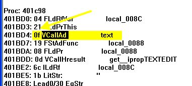
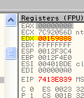
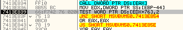
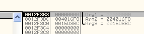
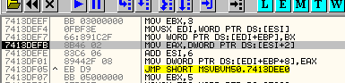
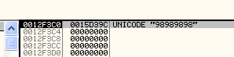
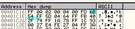

# Глава 29 - P-CODE. Часть 1

*(для запуска крэкми понадобиться MSVBVM50.dll **\[[ссылка](files/27/MSVBVM50.7z)\]**)*

Думаю, что в предыдущих главах мы рассмотрели все основные вещи относительно Visual Basic’а, а те, кто хочет изучить эту тему поглубже, могут прочитать посвящённые VB туториалы с cracklatinos *(на испанском – прим. пер.)*, которые укрепят и дополнят ваши знания.

Среди них встречаются очень хорошие туториалы о Visual Basic’е, написанные COCO, которые достаточно сложны и могут стать хорошей практикой, туториалы ARAMPUMK о волшебных точках Visual Basic’а, а также другие прекрасные туториалы, которые открывают дорогу для дальнейшего углубления в данную область. А мы меж тем перейдём к следующей теме, а именно к P-CODE.

Программы на Visual Basic’е могут быть двух типов: NATIVE, который мы рассматривали ранее, и P-CODE (псевдокод). Это то, что мы будем рассматривать в данной главе.

Основная разница заключается в том, что программы в NATIVE-коде выполняют строки кода в секции кода программы, в то время как если мы откроем программу, где используется P-CODE, в OllyDbg, модифицированном на предмет OEP’ов и VB, и установим BPM ON ACCESS в секции CODE, то увидим, что при выполнении не происходит остановок в секции кода, кроме тех случаев, когда встречается вызов какой-либо API-функции. Это очевидным образом указывает на то, что никакого исполняемого кода в данной секции нет.

Дизассемблирование программы, использующей P-CODE, ничем не поможет, так как там нет исполняемого кода. В ней всегда запускается DLL Visual Basic'а, которая читает значения из секции кода, указывающие ей, что нужно сделать. Например:

`1e делает Безусловный переход`

1e означает Безусловный переход. Он выполняется в DLL Visual Basic’а, то есть, то есть она считывает эти значения из секции кода, и они указывают DLL, что нужно сделать. Таким образом, никакого выполнения кода в соответствующей секции не происходит, только считываются из неё значения.

А сейчас, раз мы такие нахальные, то возьмём нож в руки и решительно атакуем то, за что ещё никто не брался: оттрасируем и интерпретируем действия, выполняемые крэкми с помощью псевдокода, и всё это в OllyDbg, опкод за опкодом, хе-хе.

Рассмотрим первый крэкми под названием clave1 ***\[[ссылка](files/29/clave1.7z)\]***, в котором необходимо найти серийный номер. Этот крэкми мы позаимствовали у нашего друга JB DUC’а, написавшего очень хорошие статьи по данной тематике.

Очевидно, что большая часть исследования P-CODE проводится с помощью прекрасного отладчика WKT. Если хотите почитать туториалы с его применением, то поищите те, что были написаны JB DUC’ом, а также в "Новом курсе" от CracksLatinos также есть превосходные статьи о P-CODE. Здесь мы будем использовать OllyDbg и EXDEC, который нам поможет видеть имена опкодов, так как Билл Гейтс не предоставил нам их список, хе.

Здесь открываем крэкми в обычном, непропатченном, OllyDbg с установленными плагинами для его сокрытия, которые мы рассматривали в прошлых главах.

Поверхностный осмотр показывает, что как и в NATIVE-крэкми метод 4c может быть применён и здесь, и мы можем найти место, где находятся формы таким же образом, что и в NATIVE-приложениях (4c для снятия наг-окон отлично работает и в P-CODE, так что можно использовать именно этот метод, когда его возможно применить).

Что мы ещё видим?

Если пойдём вниз от точки входа, то не видим строк с кодом.

Только мусор в подобном роде, поэтому не надо пытаться бессмысленно анализировать его, вспомним, что в NATIVE-приложениях на Visual Basic’е мы видели примерно то же самое, если спускали вниз от точки входа.

Появляется мусор, но если продолжим дальше, то:

Встречаем кусок кода довольно большого размера, который идёт до самого конца секции и представляющий собой исполняемый код вместо P-CODE, за исключением некоторых строк, которые, учитывая близлежащие байты, OllyDbg интерпретирует как инструкции, хотя на самом деле это тоже мусор.

Возвращаемся к крэкми с псевдокодом.

Другая особенность – это API-функция под названием MethCallEngine, которую мы встречаем в крэкми, использующих псевдокод, так что теперь, когда нам нужно сделать первый шаг – определить, использует ли программа псевдокод или нет, то уже знаем, что нужно делать: надо посмотреть, есть ли исполняемый код в секции CODE или встречается ли там упомянутая нами функция.

Первое, что нам стоит сделать – это посмотреть, найдём ли мы какие-нибудь строки.

Это не слишком нам поможет, хотя, возможно, поможет что-нибудь другое.

Хорошо, установим BP прямо на JMP, который является прямым переходом к функции MethCallEngine,

Ищем сверху от точки входа и быстро встречаем JMP на функцию MethCallEngine и, находясь прямо на этой строке, делаем правый клик мышью и выбираем FOLLOW, что приведёт нас прямо к данной функции, где и устанавливаем BP.

Теперь делаем RUN.

Видим, что окно для ввода серийного номера появилось до остановки на вышеуказанной API-функции, что логично, так как создание окна и всё, что с этим связано, происходит таким же образом, как и в VB-приложениях, использующих "настоящий" код.

Теперь вводим ложный серийный номер.

И нажимаем "REGISTRAR".

Останавливаемся на JMP, который начинает истинную часть P-CODE.

Здесь входим в API-функцию, посмотрим, что она будет делать.

Здесь начинается.

Теперь, если откроем то же крэкми с помощью exdec ***\[[ссылка](files/29/exdec.7z)\]***, являющегося дизассемблером P-CODE, чтобы немного помочь себе, то увидим следующее:

То есть первый байт, который будет прочтён – это 04, находящийся по адресу 401BD0. Он находится не очень далеко отсюда, так что установим на него BPM ON ACCESS.

Этот первый байт, который будет прочтён. Когда остановимся, то окажемся в начале, и таким образом, мы можем оказаться там без помощи EXDEC. Как только остановимся на BP, установленном на API-функции MethCallEngine, мы можем поместить BPM ON ACCESS на секцию кода.

И делаем RUN. Видим, что останов происходит несколько раз.

Но только в одном из них происходит чтение содержимого ESI, в котором находится адрес, указывающий на вышеуказанный байт. Это место мы быстро находим после нескольких остановок (на моей машине их было точно 10).

В первый раз, когда происходит останов и байт из \[ESI\] считывается и перемещается в AL – это то место, где начинается чтение первого опкода P-CODE. Данным образом можно найти первый байт, не используя EXDEC.

Как видим, последующие опкоды, которые отображаются EXDEC’ом идут вслед за предыдущим.

Как видим, порядок опкодов на обоих картинках соответствует друг другу. Между ними располагаются параметры, которые необходимы опкоду для выполнения.

Как видим, здесь читается первый байт.

На который, как видим, указывает ESI. На следующей строке никаких действий по выполнению опкода не предпринимается. Значение ESI увеличивается на 1, чтобы затем прочитать параметры опкода.

Затем наконец доходим до косвенного JMP, который отправляет нас к строкам, выполняющим опкода, в данном случае это 04, как видим в EXDEC’е.

> 401BD0: 04 FLdRfVar                local\_008C

Видим, что такого загадочного делает этого опкод.

Здесь видим выполнение опкода 04 FLdRfVar, это несколько маленьких строк кода, ничего такого, чтобы испугаться, хе-хе, и в конце видим, что заканчивается XOR EAX, EAX – это подготовка к чтению следующего опкода.

Первое, что делается – это берутся параметры опкода, которыми являются два байта, следующих за ним.

Хорошо, они помещаются в EAX с помощью инструкции MOVSX, и значение FF74 является отрицательным (мы рассматривали это в главах, посвящённым ассемблеру). Продолжаем трассировать.

Это значение в EAX равно -8c, и если кликнем по нему два раза:

В окне показывается, что это значение равно -140 в десятеричной системе счисления или -8c в шестнадцатеричной. В EXDEX нам показывается 8c.

> 401BD0: 04 FLdRfVar                local\_008C

На следующей строке значение, считанное из параметров опкода, суммируется с EBP.

И к этому значению применяется PUSH.

То есть это эквивалент PUSH EBP-8c – выделение в стеке места для локальной переменной. На моей машине EBP равен 12f4e0, если отнимем 8c, то получится 12f454, то есть значение, которое останется в EAX и будет передано инструкции PUSH.

Ничего хорошего. Продолжаем.

Видим, что далее в EAX помещается ноль, что означает завершение проводимых операций с данным опкодом и инициализацию регистров для чтения следующего. На следующей строке, действительно, читается следующий опкод.

Второй опкод – это 21.

Видим его тут.

Как обычно, он помещается в AL.

А теперь к значению в ESI прибавляется 3, чтобы регистр указывал на параметры опкода. Затем управление переходит к косвенному JMP, который ведёт на опкод 21.

Посмотрим, что нам скажет гугл.

> '21, FLdPrThis
> (Загрузить ссылочный указатель в указатель на элемент данных.)

Хорошо, у нас здесь несколько указателей, про которые мы не знаем, для чего они служат, но примерно дело состоит в том, что берётся ссылочный указатель и загружается в указатель на элемент данных. В ассемблере это было бы чтение указателя из стека и загрузка его в другое место стека же.

Если продолжим трассировать:

Видим, что читается содержимое EBP+8 (ссылочный указатель) и сохраняется в EBP-4c (указатель на элемент данных).

Хорошо, прочитанное значение на моей машине равно 15b000. Если посмотрим в DUMP’е:

Видим, что здесь находится указатель на 4022e8, а если посмотрим в DUMP, то увидим:

Видим, что здесь начинается таблица, так что 15b000 – это ссылочный указатель, указывающий на что-то, что находится в таблице, хотя это не очень поможет нам для крэкинга, всегда хорошо постараться расшифровать, что происходит в программе.

В остальном, это команда без параметров, поэтому никаких вариаций у неё нет. При исполнении она всегда читает ссылочный указатель и сохраняет его в указатель на элемент данных.

Хорошо, продолжаем.

Далее обнуляется EAX, а на следующей строке читается третий опкод.

Смотрим в EXDEC, что такое 0F.

`VcallAd`

Ок, здесь видим, в чём заключается смысл опкода 0F, видим, что у него один параметр из двух байтов.

Параметр в моём случае – это 0300, и он указывает смещение в таблице дескрипторов элементов данных. Хм, видим, что доходим до косвенного JMP, посмотрим, совпадёт ли это с тем, что говорится.

Здесь читается содержимое EBP-4c и помещается в EBX.

Здесь располагается указанное значение 15b000. Оно помещается в стек.

Затем читаем параметры. В моём случае, это 300.

Суть дела состоит в том, что содержимое EBX, равное 15b000, это начало таблички, которую мы ищем, то есть таблица дескрипторов элементов данных. Адрес – 4022e8.

И к этом прибавляем 300, то есть смещение до адреса, где начинается искомое значение.

Таким образом, прибавив к началу таблицы 300, получим в EAX значение 4025e8.

Это значение указывает сюда:

То есть опкод 0f, используя предоставленный параметр, получает сохранённое в таблице значение.

Дальше у нас вызов по адресу, где читается данная таблица, и как видим, содержимое EAX равно:

Заходить в CALL не будем, сразу посмотрим, что останется у нас при выходе из него. Как уже говорилось, значения сохраняются в стек.

Продолжаем трассировать, проходим CALL с F8.

То есть после всего этого в стеке остаётся значение, и нам необходимо выяснить, для чего оно служит. Пока что мы знаем, что это значение читается из таблицы элементов данных, параметр равен 0300, и результат кладётся в стек.

Следующий опкод равен 19, он работает с локальной переменной 88, которая становится источником его параметра.

Здесь выходим из его выполнения.

Что у нас тут?

С помощью MOVSX считываются параметры, отрицательные значения дополняются FF.

Как уже предсказывалось ранее, это значение -88 в шестнадцатеричной системе счисления, о чём нам говорит EXDEC.

\-136 в десятеричной равной -88 в шестнадцатеричной.

Здесь увеличиваем указатель ESI на два и складываем EBP с -88, и результат этой операции помещается в EAX.

Видим, что к тому моменту, когда доходим до вызова, в стеке находятся три параметра.

Первым является значение, которое было сохранено предыдущим опкодом, а два других значения в моём случае равны 12f458 (локальная переменная ebp-88) и -1 – третий параметр. Нажимаем F8, чтобы не заходить внутрь вызова.

После его выполнения видим, что в ebp-88 сохранилось значение, найденное предыдущим опкодом.

Всё остальное осталось таким же, не считая изменений в стеке и того, что ECX возвратил 0, вероятно для того, чтобы отметить, что процесс был завершён.

То есть то, что было помещено в EBP-88 – это значение, полученное предыдущим опкодом.

Доходим до другого опкода, равного 08, которая также пытается работать с той же локальной переменной 88, то есть ebp-88.

Входим в опкод.

В куске кода, видим `XOR EAX, EAX`, завершающий выполнение опкода, а чуть выше – условный переход. Посмотрим, что он делает.

Сначала EAX’у передаются параметры опкода.

Как и в прошлый раз, значение FF78, перемещённое с помощью MOVSX, имеет FFы в своём составе, то есть это отрицательное число, равное -88 в шестнадцатеричной системе.

На это строке напрямую задаётся сумма EAX+EBP, то есть EBP-88, и перемещается значение, содержащееся по данному адресу. Очевидно, что мы берём его из таблицы элементов данных.

Тестируем, равно ли нулю, если бы так и было, то переход был бы совершён, но так как сейчас нуля нет, то продолжаем.

Сохраняем это значение в EBP-4C.

Здесь нам нужно вспомнить то, о чём говорилось в самом начале.

То, что мы видим – это чтение содержимого EBP + 8 (ссылочный указатель) и сохранение оного в EBP.

Так как ebp-4с – это указатель на элемент данных, и мы уже убедились, что он содержит корректное значение и в нём нет нуля, то поэтому эта переменная ebp-4c называется "указатель на элемент данных", так как это значение связано с таблицей элементов данных.

Доходим до следующего опкода.

В пресвятом Гугле смотрим, для чего служит этот опкод.

0d VCallHresult #получает текст из поля ввода текста (textbox)

То есть будет прочитан неправильный серийный номер, который мы ввели в текстовое поле. Трассируем и смотрим, так ли это.

Видим опкод, завершающийся `XOR EAX, EAX` как обычно.

Первое, что здесь происходит – это считывается содержимое из EBP-4c (а это, как мы говорили, указатель на элемент данных) и помещается в EAX. Это архизнакомое нам значение, считывающееся из таблицы элементов данных.

Дальше это значение помещается в стек.

Потом считывается параметр опкода.

И помещается в EDI.

Затем читается содержимое EAX, являющееся началом другой таблицы.

И к этому значению прибавляется параметр 00a0, чтобы получить окончательный адрес в её пределах.

И затем совершается CALL по адресу в этой таблице. Конечно, не будет трассировать этот вызов, посмотрим на то, какие значения останутся в стеке от выполнившихся опкодов.

Выполняем CALL с помощью F8.

Затем помещаем в EDX значение из EBP-44.

И после сравнения пары значений доходим до следующего опкода, но вы можете спросит, читает ли он то, что мы ввели, то есть наш неправильный опкод? Смотрим ответ на этот вопрос в EXDEC.

Видим, что продолжается работа с локальной переменной 8c, которую мы также знаем как EBP-8C.

Если поищем значение EBP-8c:

Оно равно 12f454.

И это указатель на введенный нами неправильный серийный номер, который находится в 15d3bc.

Уф, пришлось попотеть, но мы, наконец, добрались до того места, где считывается неправильный серийник.

Следующий опкод – это 6c IldRf

Здесь говорится, что этот опкод занимается загрузкой ссылочного значения. Заходим в него.

Что у нас здесь?

Сначала осуществляется перемещение параметра с помощью MOVSX, который является отрицательным (FF).

Смотрим, что у нас оказывается в EAX.

Это -8c в шестнадцатеричной системе.

Следующая инструкция суммирует его с EBP, что в результате даёт EBP-8c. Содержимое по этому адресу кладётся в стек.

Содержимое ebp-8c – это указатель на неправильный серийник, то есть сейчас этот указатель находится у нас в стеке.

Если посмотрим через DUMP, то ясно увидим, что он указывает на неправильный серийный номер. Таким образом, это и является действием опкода загрузки ссылочного значения, который кладёт в стек значение из локальной переменной.

Следующий опкод – это:

1b LitStr , что расшифровывается как "Literal String" (символьная строка)

Смотрим, что он делает.

Входим в опкод.

Сначала читается параметр, который здесь равен 0001 (положительный, т.к. нет FF). Он помещается в EAX.

Видим, что на следующей строке в EDX помещается значение 4017E4. Для чего оно, мы не знаем.

И для чего может служить помещение в стек 4016f8?

Видим, что в пояснении EXDEC’а показываются только две одинарные кавычки, то есть значение, помещаемое в стек, является пустой строкой.

Конечно же, смотрим через DUMP, что указывает на пустую строку, заключённую в кавычки, то есть то, с чем будет работать следующий опкод, проверяющий, напечатали мы что-нибудь или оставили поле ввода пустым и нажали "Register".

Что есть:

Ок, "LEAD 0" – это операция, а "30 EqStr" – это вторая часть опкода. Посмотрим, что это такое в пресвятом Гугле.

Lead0/30 EqStr – сравнение двух строк.

То есть здесь будут сравниваться эти две строки. Это двойной опкод, то есть сначала считывается то, что в дальнейшем будет использоваться для косвенного перехода.

И здесь первый опкод завершается "XOR EAX, EAX", где ничего не делается, и читается второй опкод.

Здесь читается второй опкод 30, но разница в случае с двойным опкодом заключается в считывании параметров, так как в таком опкоде первый завершается с помощью "XOR EAX, EAX" и считывается второй, но параметры первого опкода остаются доступными для чтения.

Здесь находится второй опкод, который делает PUSH 0.

Когда доходим до CALL’а, у нас есть три аргумента. Минуем CALL с помощью F8 и смотрим, что изменилось.

Видим, что стек сместился, но значения остались без изменений, только находятся теперь чуть выше.

Следующая строка "CMP AL, 0" сообщает, что здесь в AL сохраняется результат. В моём случае это:

AL=01

Потому что строки не равны.

После сравнения в EAX помещается значение ноль, а в конечном итоге это значение помещается в стек, так как это результат опкода. Ноль, если не равны, а если бы были равно, то вместо ноля было бы FFFFFF. Можете проверить, хе-хе.

Доходим до следующего опкода.

Пресвятой Гугл сообщает нам, что это примерно то же, что и SysFreeString, которая освобждает память, занятую неиспользуемой строкой. Видим, что в данном случае освободится ebp-8c.

Видим, что в EDI перемещается значение 1, затем в EBX – FF74 (в шестнадцатеричной системе это -8c). Как обычно, используется MOVSX, чтобы перемещать вместе с FF’ами, если значение отрицательно.

EBX+EBP равно EBP-8c, так что в стек помещается указатель на неправильный серийный номер.

Видим, что идёт вызов API-функции SysFreeString, а по возвращению из неё:

Указатель на наш неправильный серийный номер был заменён на нули.

Сам неправильный серийник не был стёрт, он как был, так и остаётся по адресу 15d3bc. Был стёрт указатель на него, находившийся в EBP-8c.

Доходим до следующего опкода.

Это сотрёт содёржимое локальной переменной ebp-88.

А что там находится?

Ах, это значение, которое мы искали в таблице элементов данных.

Здесь смотрим параметры опкода:

FF78, который является шестнадцатеричным значением -88.

Далее в EAX помещается содержимое EBP-88, проверяется, равно ли оно нулю, так как оно не равно, то продолжаем дальше.

И доходим до вызова, который, как и раньше, освобождает это значение, и стирает содержимое ebp-88.

Здесь помещаем в EAX ноль.

Следующий опкод – это:

\-

Это условный переход, так как все BRANCH’и – это переходы.

То есть это переход, срабатывающий, если результат равен "лжи", а затем идёт JMP, то есть этот переход, если мы что-то вводим в поле ввода, переходит на проверку серийного номера, а если нет, то процесс будет повторён, используя JMP.

Видим, что это так, если будет переход, то следующим опкодом станет:

Так как это условный переход, избегаем JMP в 401bf3.

Здесь опкод завершается и читается следующий.

Как можно предположить из FE в 401bfg6, условный переход срабатывает и минут JMP, хе-хе.

Lead3/c1 LitVarI4

Это двойной опкод. Посмотрим, что он делает.

Здесь завершается первый опкод и читается второй.

Который начинается здесь. Терпеливо трассируем его.

Считываются параметры опкода.

Уже знаем, что они дополянются FF, если содержат отрицательное значение, как в данном случае.

Параметры считываются дальше, в данном случае это целый DWORD, который помещается в EAX.

И это значение сохраняется в локальную переменную.

EBP+ FFFFFF54 + 8, то есть сумма первого параметра и 8 даёт 12f43c, а здесь это значение сохранено.

JMP помещает нас в:

Где 12f434 помещается в стек.

Это указатель на структуру, начинающуюся с 3, которое уже было сохранено, а чуть пониже – сохранённое значение.

Продолжаем.

В случае, если серийный номер здесь жёстко задано, можем попробовать передать это значение в десятеричном виде и посмотреть, не является ли он правильным серийным номером. Откроем другой экземпляр крэкми не из-под OllyDbg.

Посмотрим в OllyDbg, чему равно это число в десятеричной системе.

Оно равно 246810. Введём его в крэкми.

Хе-хе, я подозревал это, но так легко нам не отделаться. Доходим до сравнения.

Следующий опкод также двойной.

Это FC и немедленно он завершается и начинается второй.

Это F6, бесстрашно заходим в него, EXDEC нам говорит, что будем работать с локальной переменной 9c (то есть ebp-9c).

Здесь читаются параметры, которые дополнены FF.

Конечно, это значение -9c.

Прибавляем к EBP, чтобы получилось EBP-9c или 12f444, которое пока что остаётся пустым.

Затем проводится проверка, равно ли это значение 8, если да, то делаем переход.

Далее снова переход, но не будет вдаваться в детали. Доходим до последних строк опкода.

Помещаем значение 3, находящееся в EAX в переменную EBP-9c

И стираем 3 из структуры, встреченной нами ранее.

При выполнении:

Затем последующие строки копируют всё, что у нас здесь есть в новое местоположение, то есть в EBP-9c.

Здесь видим число, которое является правильным серийным номером и находящееся в структуре, начинающейся в EBP-9c.

Доходим до следующего опкода.

> 401C02: 04 FLdRfVar                local\_008C

Видим, что повторяется всё, что мы уже видели в начале.

> 401C02: 04 FLdRfVar                local\_008C
>
> 401C05: 21 FLdPrThis
>
> 401C06: 0f VCallAd                 text
>
> 401C09: 19 FStAdFunc               local\_0088
>
> 401C0C: 08 FLdPr                   local\_0088
>
> 401C0F: 0d VCallHresult            get\_\_ipropTEXTEDIT
>
> 401C14: 6c ILdRf                   local\_008C
>

Всё похоже на то, как было в начале. Следующий опкод:

Поэтому, чтобы перепрыгнуть через всё, что уже было, устанавливаем BPM ON ACCESS на 401c17, чтобы остановиться на считывании опкода.

Останавливаемся здесь и читаем опкод 0A. Смотрим, что это такое в EXDEC’е.

Это ImpAdCallFPR4 – вызов API-функции. EXDEC показывает какой именно.

Например:

В данном примере произойдёт вызов API-функции rtcMsgBox. В нашем же случае это вызов функции:

401C17: 0a ImpAdCallFPR4: \_rtcR8ValFromBstr

Читаются параметры опкода.

Они помещаются в ECX.

Затем в EAX помещается значение 401000 и тестируется, не равно ли оно нулю.

Далее читается второй параметр.

И доходим до "CALL EAX", где EAX равен 401000. Смотрим, куда это ведёт – а ведёт это к упомянутой выше API-функции.

Параметр, передающийся через стек API-фукнкции:

Мой неправильный серийный номер:

Который был загружен в St0, являющаяся верхним элементом стека плавающей запятой. Мы не говорили об этом раньше, но ничего. Находятся эти элементы под регистрами, если у вас они не отображаются, то нужно использовать специальную опцию. Нажимаем правую кнопку мыши.

Здесь загружается мой неправильный серийный номер.

Доходим до следующего опкода.

401C1C: Lead2/6b CVarR8

Итак, находимся здесь, заходим в опкод.

Так как опкод двойной, то завершается первый и грузится второй.

Ок, здесь несколько инструкций плавающей запятой, которые мы не рассматривали.

Но видим, что вначале загружаются параметры.

В данном случае:

Суммируются с EBP, и в EAX остаётся:

FSTP сохраняет первое первое значение из стека плавающей запятой, то есть из ST(0), в указанную ячейку памяти (в данном случае \[EAX+8\], то есть 12f43c) и делает следующий элемент стека верхним. Ок, мы рассмотрим это позже.

После выполнения:

Я уже знаю, что у вас могут зародиться кое-какие подозрения о том, что это наш серийный номер, сконвертированный в 64-х битное число. Посмотрим, так ли это, кликнув на правую кнопку мыши.

Видим, что действительно это неправильный серийный номер, но только в другом представлении – 8 байтов, то есть 64-битном. Логично, раз 4 байта – это 32 бита, то двойное слово состоит из 64-х бит и выглядит по другому.

Включаем обратно обычный режим представления.

Эта инструкция сохраняет значение регистра SR (регистр состояния FPU) в AX. Выполняем:

Здесь опкод завершается.

> 401C20: 5d HardType

Ок, у меня нет ни малейшей идеи, что это такое, но попытаемся это выяснить.

Ок, всего лишь две строки, которые грузят содержимое ESP в EAX.

Видим, что там находится число, находящееся чуть выше моего трансформированного фальшивого серийного номера. Возможно, что это число указывает, в каком формате он хранится.

Следующий опкод.

> 401C21: 04 FLdRfVar                local\_009C

То есть PUSH ebp-9c, в данном случае:

Далее идёт двойной опкод.

> 401C24: Lead0/40 NeVarBool

Здесь читается второй опкод.

Доходим до вызова, а параметры в стеке следующие:

Один – это указатель на правильный серийный номер, другой – на трансформированный неправильный. Будет их сравнение?

Устанавливаем BP сюда.

Видим, что после выхода из call’а EAX содержит 1.

И поскольку делается PUSH значения FFFFFFFF в стек, то можно практически безошибочно предположить, что именно здесь проводится сравнение, так что рестартуем крэкми, установив BP, и вводим правильный серийный номер, который был получен из этого сравнения.

03c41a в десятеричной системе – это 246810. Вводим его и снова идём к сравнению.

Остановившись, видим, что происходит сравнение:

246810 со прежним шестнадцатеричным значением. Дело в том, что они в разных форматах, но сверху каждого из них есть число, указывающее, в каком именно хранится значение, поэтому возможно, что внутри каждого call’а они будут трансформированы и сравнены. Смотрим, что у нас получится в результате.

Видим, что теперь у нас EAX = 0 (раньше было 1).

И в стек также уходит ноль.

Это означает, что это и есть сравнение, к тому же прямо внизу видим несколько Branch’ей, которые совершают переход в зависимости от того, окошко с каким сообщением надо показать, а потом идёт освобождение строк и использованных значений.

Вы можете сказать, что было слишком много работы, но это был первый раз, поэтому мы подробно рассматривали каждый опкод, и это необязательно повторять в будущем. Отладчик WKT может показать вам имена опкодов. Вы не знаете, что делает каждый из них, но с помощью OllyDbg можете определить, для чего они служат, и получить представление о том, как работает программа.

В следующей части мы рассмотрим крэкми "clave 2" ***\[[ссылка](files/29/clave2.7z)\]***, используя тот же метод. Мне бы хотелось, чтобы вы попробовали самостоятельно его сделать, но если не получится, то в следующей части вы сможете прочитать решение этого крэкми.

\[C\] Рикардо Нарваха, пер. Aquila
