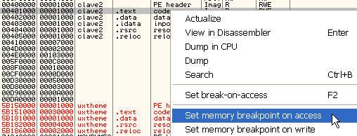
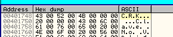

# Глава 30 - P-CODE. Часть 2

*(для запуска крэкми понадобиться MSVBVM50.dll [\[ссылка\]](.gitbook/assets/files/27/MSVBVM50.7z))*

Ок, после того, как попрактиковались, и если вы ещё живы, продолжаем с P-CODE.

У нас есть ещё кое-какие опкоды, собранные из туториалов JBDUC’а.

* 6c -> ILdRf Поместить адрес в стек
* 1b -> LitStr5 Поместить строку в стек
* fb -> Lead0 Сравнить две строки (хе-хе, для чего это могло служить ?)
* 30 -> EqStr Сравнить две строки(хе-хе, для чего это могло служить ?)
* 2f -> FFree1Str Освободить используемую память
* 1a -> FFree1Ad Освободить используемую память
* 0f -> VCallAd Выполнить опкод в виртуальной машине
* 1c -> BranchF Сделать переход, если предшествующее сравнение дало ложь ( аналог jne/jnz в ассемблере )
* 1d -> BranchT Сделать переход, если предшествующее сравнение дало истину ( аналог je/jz в ассемблере )
* 1e -> Безусловный переход ( хе-хе, угадайте, для чего её можно использовать )
* fc -> Lead1 Прерывает выполнение программы (хе-хе, прекрасно...)
* c8 -> End Прерывает выполнение программы (хе-хе, прекрасно...)
* f3 -> LitI2 Сохраняет заданное число типа Integer в стек
* f4 -> LitI2\_Byte Конвертирует Byte-значение в Integer и помещает его в стек
* 70 -> FStI2 Сохраняет последний Integer, помещённый в стек, в заданную глобальную переменную
* 6b -> FLdI2 Загружает в стек Integer из заданной локальной переменной
* a9 -> AddI2 Складывает два последних Integer'а, помещённых в стек, на вершину которого помещает результат
* ad -> SubI2 Использует для вычитания два последних Integer’а, помещённых в стек, и кладёт в последний результат
* b1 -> MulI2 Умножает два последних Integer’а, помещённых в стек, и кладёт в последний результат. Думаю, что если переполнение игнорируется.

Ок, есть ещё опкоды, которые мы сейчас рассматривать не будем. К статье прилагает файл под названием "P-CODE OPCODES" [\[ссылка\]](.gitbook/assets/files/30/P-Code%20OPCODES.7z), который, предположительно, распространялся Микрософтом. Он может немного помочь, так как в нём перечислены опкоды и что они делают (но не все, хе-хе), так что, если встретим незнакомый опкод, то можем посмотреть, есть ли там описание.

Как я и обещал вам, сначала рассмотрим крэкми "clave 2" [\[ссылка\]](.gitbook/assets/files/29/clave2.7z), который остался у нас в качестве домашнего упражнения с прошлого раза. Посмотрим, можем ли мы получить листинг с помощью EXDEC’а [\[ссылка\]](.gitbook/assets/files/29/exdec.7z).


Вот он, и видим, что начинается с 401cc0. Не будем слепо верить EXDEC’у, так как бывали случаи, когда он обманывал. Посмотрим, сможем ли мы найти первый опкод вручную, как мы это делали в предыдущей части.


Смотрим, находится ли переход на API-функцию MethCallEngine за EP.


Вот он. Становимся на него, делаем FOLLOW, чтобы перейти к API-функции и также устанавливаем там BP.


Готово, теперь делаем RUN, чтобы остановиться на одном из установленных BP.


Окно появляется до того, как сработает останов, дело в том, что окно появляется до того, как начинается P-CODE, хотя нужно пояснить, что такое бывает не всегда, может сначала сработать останов, а потом появиться окно, но в данном случае оно сделало это первым. Вводим имя и неправильный серийный номер.

После нажатия на "REGISTRAR" срабатывает останов на JMP. Идём в первую секцию (помните, что не надо использовать пропатченный OllyDbg для OEP’ов [\[ссылка\]](.gitbook/assets/files/26/olly_parcheado_para_vb.7z)) и устанавливаем "BPM ON ACCESS" на секцию кода.



Теперь жмём RUN, пока не встретится знакомая инструкция, где читается опкод.


Вот тут, помним, что ESI всегда должен указывать на опкод (который сам перемещается в AL).

Как видим, EXDEC не ошибся, и первый опкод – это 04 и начинается с 401cc0.

```
Proc: 401e90
401CC0: 04 FLdRfVar                local_008C
```

Помним, что 04 – это просто PUSH, в данном случае его аргументом является EBP-8C, как это видно из пояснения рядом с опкодом

`04    567B 0B8E 2 1 2      Push arg`


Из этого нам становится понятно, что каждая цифра, в нашем случае 0B8E, является RVA опкода, 2 – это количество байтов, которые в общей сложности занимают параметры, 1 нам говорит, что аргумент только один, и последнее значение (2) указывает нам размер, занимаемый каждым аргументом в отдельности.

Хорошо, вот PUSH EBP-8C, продолжаем изучать исходник, пока без трассировки шаг за шагом. Смотрим.

```
401D4C: 0d VCallHresult            get__ipropTEXTEDIT

401DFB: 0d VCallHresult            get__ipropTEXTEDIT
```

Видим, что используется два вызова для считывания введённого в окне регистрации, вероятно, что в первый раз читает имя, а во второй – неправильный серийник, использованный нами. Устанавливаем BPM ON ACCESS на первом вызове, то есть на 401d4C.


Вот опкод, устанавливаем на него BPM и делаем RUN.


Ок, теперь трассируем до следующего опкода, чтобы посмотреть, что будет происходить с именем.


Дошли до следующего опкода, смотрим стек, чтобы узнать, что там находится

```
401D4C: 0d VCallHresult            get__ipropTEXTEDIT
401D51: 3e FLdZeroAd               local_008C
```

Как видим, продолжается работа с локальной переменной 8c (или EBP-8C). Проверим, что там сохранено. На моей машине в ebp-8c содержит 12f454.


Ищем этот адрес в стеке и видим, что там находится моё имя.


Конечно же, оно находится здесь, так что всё идёт хорошо. Раз здесь находится моё имя, то логично предположить, что в следующем будет идти работа с серийником, поэтому устанавливаем на второй опкод BPM ON ACCESS.

`401DFB: 0d VCallHresult            get__ipropTEXTEDIT`


Готово, теперь жмём RUN, чтобы оказаться рядом с этим опкодом.


Как и в предыдущем случае, трассируем до следующего опкода.


И смотрим, сохранён ли в используемой переменной неправильный серийный номер.

```
401DFB: 0d VCallHresult            get__ipropTEXTEDIT
401E00: 3e FLdZeroAd               local_008C
```

Как и в прошлый раз используется EBP-8C.


Хорошо, вот мы и дошли до места, куда помещён наш неправильный серийник. Видим, что зная опкоды, не обязательно трассировать всю программу, можем просто установить BPM и оказаться в нужной части программы. В прошлой главе мы трассировали всё подряд, чтобы понять механизмы, согласно которым работает P-CODE, но как правильно, нам не нужно делать это. Как мы увидим в следующей главе, когда исследуем большую программу, будем локализовывать интересующую нас часть программы и работать именно с ней.

```
401E0F: Lead0/ef ConcatVar
401E13: Lead0/40 NeVarBool
401E15: 1a FFree1Ad                local_0088
401E18: 36 FFreeVar         local_00CC local_00AC
401E1F: 1c BranchF:                401E59
```

Далее видим, что здесь есть все признаки сравнения, потом освобождение локальных переменных с помощью FREE, а затем условный переход, который ведёт в 401e59, где вызывается rtcMsgBox с сообщением о правильном серийном номере, а если перехода не происходит, то отображается сообщение о том, что серийник неверен.


Тут всё совершенно понятно. Вероятное сравнение и условный переход, в зависимости от которого отображается окошко с соответствующим сообщением, так что устанавливаем сюда BPM ON ACCESS.

```
401E0F: Lead0/ef ConcatVar
401E13: Lead0/40 NeVarBool
```


Ок, делаем RUN.


Останавливаемся тут, в первом опкоде и трассируем до второго, который производит некую операцию.


Второй опкод равен EF.

Смотрим в списке опкодов.

```
FB EF 6BAB 25AD 2
FB F0 6B99 259B 0          vbaStrCat
FB F1 C423 B981 0          Push [FC0D134]
```

Что такое FB EF нам ещё не совсем понятно, EXDEC говорит нам что-то о конкатенации переменных, смотрим.

```
401E07: 3a LitVarStr:              ( local_009C ) CRK
401E0C: 04 FLdRfVar                local_018C
401E0F: Lead0/ef ConcatVar
401E13: Lead0/40 NeVarBool
```

Видим, что прямо до этого опкода идёт работа с двумя локальными переменными, в одной из которых находится строка CRK, а другая является EBP-018C. Выясним, что находится в каждой из вышеупомянутых переменных.


Первая переменная – это EBP-9C, которая на моей машине равна 12f444 и находится там следующее:


Как мы знаем, в случае с переменными сначала идёт байт, указывающий тип, в данном случае это 3, а ещё выше находится сама переменная, которая равна 2EA.


Входим в опкод.


Здесь читаются параметры.


После сложения с EBP получается 12f434.


Доходим до API-функции vbaVarCat, у которой три аргумента в стеке.


Смотрим, что находится в каждом из них. Отметим, что когда идёт работа с переменной, то отображается маленькая структура, в которой первый байт задаёт её тип.


Это первый аргумент.


Во втором сначала идёт 3, а потом 02EA, задающее значение.


А в третьем в начале 8, означающее, что 4017648 – это указатель на строку CRK.


Ок, у нас тут мешанина из переменных, посмотрим, что останется. Если войдём в функцию vbaVarCat, то окажемся у внутренней API-функции, которая ясно покажет нам, что будет объединяться.




То есть предстоит объединение CRK с 746. А теперь выясним, что значит параметр 02EA.


Он конвертируется в строку. 02EA – это:


То есть vbaVarCat, в данном случае, получила строку и численную переменную, которая конвертируется в строку, после чего обе объединяются.

Продолжаем трассировать с помощью F8.

Дойдя до RET’а из функции, видим:


Обе переменных объединились в одну строку.


И, как и раньше, до начала следующего опкода это значение сохраняется в качестве первого аргумента.


Видим, что первый аргумент сейчас имеет тип 8, то есть строку, и указывает на 15d88c, то есть на сконкатенированную строку.


Ок, теперь снова должно произойти сравнение, быстро доходим до следующего опкода.


`401E13: Lead0/40 NeVarBool`

Это FB40, и он двойной. Трассируем, пока не дойдём до считывания второго опкода.


Конечно, список опкодов от Микрософта ничего нам о нём не говорит, так что трассируем опкод, чтобы узнать, что он делает.


Видим, что в опкоде всего один вызов, после которого сразу следует завершение. Смотрим параметры вызова.


Первый равен нулю, а второй 12f434. Смотрим, что там находится.


Ок, 08 говорит нам, что это строка, теперь осталось посмотреть, на что указывает 15d88c.


Вот строка, смотрим следующий аргумент.


В данном случае 15ca94 указывает на строку с нашим неправильным серийным номером.


Похоже, что это сравнение двух строк.


Чтобы рассеять сомнения, устанавливаем BP, минуем вызов с помощью F8 и идём к следующему опкоду.

Видим, что в стеке осталось значение FFFFFFFF, вероятно, означающее, что строки не равны. Запишем возможный серийный номер, и попробуем его использовать.


Нажимаем на кнопку "Registrar".


Снова оказались у этого вызова, проходим его с помощью F8 и идём к следующему опкоду, как в прошлый раз.


Видим, что в данном случае результатом является ноль, так как обе строки одинаковы.


Как мы увидели, не обязательно трассировать всё подряд. Нужно найти подозрительную область и трассировать только неизвестные опкоды. Этого оказалось достаточным, чтобы найти серийный номер исследуемой программы.

Для заинтересованных – более детализированный список, где изложены сведения, которые нам удалось узнать.

```assembly
401CC0: 04 FLdRfVar                local_008C
401CC3: 21 FLdPrThis              **; Загрузка ссылочного указателя в указатель на элемент**
401CC4: 0f VCallAd                 text			; Доступ к методу **ITEM DESCRIPTOR TABLE**
401CC7: 19 FStAdFunc               local_0088
401CCA: 08 FLdPr                   local_0088
401CCD: 0d VCallHresult            get__ipropTEXTEDIT  ; Читаем содержимое из текстового поля
401CD2: 6c ILdRf                   local_008C  ; Имя
401CD5: 1b LitStr:                 &  ; Поместить строку в стек
401CD8: Lead0/30 EqStr            	  ; Сравнить две строки
401CDA: 2f FFree1Str               local_008C
401CDD: 1a FFree1Ad                local_0088
401CE0: 1c BranchF:                401CE6  ; Переход, если сравнение не удалось
401CE3: 1e Branch:                 401e8c  ; Безусловный переход
401CE6: 04 FLdRfVar                local_008C
401CE9: 21 FLdPrThis
401CEA: 0f VCallAd                 text  ; Доступ к методу **ITEM DESCRIPTOR TABLE**
401CED: 19 FStAdFunc               local_0088
401CF0: 08 FLdPr                   local_0088
401CF3: 0d VCallHresult            get__ipropTEXTEDIT  ; Читаем содержимое текстового поля
401CF8: 6c ILdRf                   local_008C          ; Имя
401CFB: 4a FnLenStr
401CFC: f5 LitI4:                  0x6  6  (....)  ; Передаём элемент из 4-ёх байт
401D01: d1 LtI4                   			       ; Сравнение меньше чем (?)
401D02: 2f FFree1Str               local_008C
401D05: 1a FFree1Ad                local_0088
401D08: 1c BranchF:                401D3F  ; Переход если ложно (>= 6)
401D0B: 27 LitVar_Missing
401D0E: 27 LitVar_Missing
401D11: 3a LitVarStr:              ( local_00BC ) P-Code
401D16: 4e FStVarCopyObj           local_00CC
401D19: 04 FLdRfVar                local_00CC
401D1C: f5 LitI4:                  0x40  64  (...@)
401D21: 3a LitVarStr:              ( local_009C ) Минимум 6 символов
401D26: 4e FStVarCopyObj           local_00AC
401D29: 04 FLdRfVar                local_00AC
401D2C: 0a ImpAdCallFPR4:          _rtcMsgBox
401D31: 36 FFreeVar                local_00AC local_00CC local_00EC local_010C
401D3C: 1e Branch:                 401e8c  ; Если < 6 символов в строке
401D3F: 04 FLdRfVar                local_008C
401D42: 21 FLdPrThis
401D43: 0f VCallAd                 text
401D46: 19 FStAdFunc               local_0088
401D49: 08 FLdPr                   local_0088
401D4C: 0d VCallHresult            get__ipropTEXTEDIT  ; Читаем содержимое текстового поля
401D51: 3e FLdZeroAd               local_008C		   ; Имя
401D54: 46 CVarStr                 local_00AC
401D57: 04 FLdRfVar                local_00CC
401D5A: 0a ImpAdCallFPR4:          _rtcLowerCaseVar  ; Конвертируем в строчные символы
401D5F: 04 FLdRfVar                local_00CC
401D62: 04 FLdRfVar                local_00EC
401D65: 0a ImpAdCallFPR4:          _rtcTrimVar
401D6A: 04 FLdRfVar                local_00EC
401D6D: Lead1/f6 FStVar            local_011C
401D71: 1a FFree1Ad                local_0088
401D74: 36 FFreeVar                local_00AC local_00CC
401D7B: 04 FLdRfVar                local_011C
401D7E: Lead0/eb FnLenVar
401D82: Lead1/f6 FStVar            local_012C
401D86: 28 LitVarI2:               ( local_00BC ) 0x1  (1)
401D8B: 04 FLdRfVar                local_013C
401D8E: 04 FLdRfVar                local_012C
401D91: Lead3/68 ForVar:           (when done) 401DE0		, Начало цикла for next
401D97: 28 LitVarI2:               ( local_00AC ) 0x1  (1)
401D9C: 04 FLdRfVar                local_013C
401D9F: Lead1/22 CI4Var
401DA1: 04 FLdRfVar                local_011C
401DA4: 04 FLdRfVar                local_00CC
401DA7: 0a ImpAdCallFPR4:          _rtcMidCharVar  ; Загрузка символов из...
401DAC: 04 FLdRfVar                local_00CC	   ; ... имени
401DAF: Lead2/fe CStrVarVal        local_008C
401DB3: 0b ImpAdCallI2             _rtcAnsiValueBstr  **; конвертируем значения символов в  hexadec**
401DB8: 44 CVarI2                  local_00BC
401DBB: Lead1/f6 FstVar		       local_016C
401DBF: 2f FFree1Str        	   local_008C
401DC2: 36 FFreeVar                local_00AC local_00CC
401DC9: 04 FLdRfVar                local_017C
401DCC: 04 FLdRfVar                local_016C
401DCF: Lead0/94 AddVar            local_00AC
401DD3: Lead1/f6 FStVar            local_017C
401DD7: 04 FLdRfVar                local_013C
401DDA: Lead3/7e NextStepVar:      (continue) 401D97  ; Конец цикла for-next?
401DE0: 04 FLdRfVar                local_017C
401DE3: 04 FLdRfVar                local_012C
401DE6: Lead0/94 AddVar            local_00AC
401DEA: Lead1/f6 FStVar            local_018C
401DEE: 04 FLdRfVar                local_008C
401DF1: 21 FLdPrThis
401DF2: 0f VCallAd                 text
401DF5: 19 FStAdFunc               local_0088
401DF8: 08 FLdPr                   local_0088
401DFB: 0d VCallHresult            get__ipropTEXTEDIT  ; Читаем содержимое текстового поля
401E00: 3e FLdZeroAd               local_008C		   ; Серийный номер
401E03: 46 CVarStr                 local_00CC
401E06: 5d HardType
401E07: 3a LitVarStr:              ( local_009C ) CRK
401E0C: 04 FLdRfVar                local_018C
401E0F: Lead0/ef ConcatVar
401E13: Lead0/40 NeVarBool
401E15: 1a FFree1Ad                local_0088
401E18: 36 FFreeVar                local_00CC local_00AC
401E1F: 1c BranchF:                401E59
401E22: 27 LitVar_Missing
401E25: 27 LitVar_Missing
401E28: 3a LitVarStr:              ( local_00BC ) P-Code
401E2D: 4e FStVarCopyObj           local_00CC
401E30: 04 FLdRfVar                local_00CC
401E33: f5 LitI4:                  0x10  16  (....)
401E38: 3a LitVarStr:              ( local_009C ) Серийный номер неверен!
401E3D: 4e FStVarCopyObj           local_00AC
401E40: 04 FLdRfVar                local_00AC
401E43: 0a ImpAdCallFPR4:          _rtcMsgBox
401E48: 36 FFreeVar                local_00AC local_00CC local_00EC local_010C
401E53: 1e Branch:                 401e8c
401E56: 1e Branch:                 401e8c
401E59: 27 LitVar_Missing
401E5C: 27 LitVar_Missing
401E5F: 3a LitVarStr:              ( local_00BC ) P-Code
401E64: 4e FStVarCopyObj           local_00CC
401E67: 04 FLdRfVar                local_00CC
401E6A: f5 LitI4:                  0x30  48  (...0)
401E6F: 3a LitVarStr:              ( local_009C ) Серийный номер верен!!
401E74: 4e FStVarCopyObj           local_00AC
401E77: 04 FLdRfVar                local_00AC
401E7A: 0a ImpAdCallFPR4:          _rtcMsgBox
401E7F: 36 FFreeVar                local_00AC local_00CC local_00EC local_010C
401E8A: Lead1/c8 End
401E8C: 13 ExitProcHresult
```

Отсюда ясно, как работает крэкми.

Полезно знать, как работать с P-CODE в OllyDbg, так как есть программы, которые защищены от WKT и EXDEC, но в случае с OllyDbg мы можем использовать плагины, которые спрячут её практически ото всех, кроме очень редких исключений.

Загружаем прилагающийся крэкми nags1 [\[ссылка\]](.gitbook/assets/files/30/nags1.7z), который просит нас убрать первоначальное наг-окно. Смотрим его листинг в EXDEC.

```assembly
;Proc: 401a40

401A14: 27 LitVar_Missing
401A17: 27 LitVar_Missing
401A1A: 27 LitVar_Missing
401A1D: f5 LitI4:                  0x0  0  (....)
401A22: 3a LitVarStr:              ( local_0094 ) NAG
401A27: 4e FStVarCopyObj           local_00A4
401A2A: 04 FLdRfVar                local_00A4
401A2D: 0a ImpAdCallFPR4:          _rtcMsgBox
401A32: 36 FFreeVar         local_00A4 local_00C4 local_00E4 local_0104
401A3D: 13 ExitProcHresult
```

```assembly
;Proc: 401958

401954: Lead1/c8 End
401956: 13 ExitProcHresult**
```

Видим, что знаменитый NAG – это просто rtcMsgBox. В P-Code нет NOP’ов, хе-хе, поэтому нам нужно забить эту функцию опкодами, которые не изменят хода выполнения программы.


Устанавливаем BPM на опкоде, вызывающем rtcMsgBox, и запускаем программу.

`401A2D: 0a ImpAdCallFPR4:          _rtcMsgBox`


Останавливаемся, когда считывается опкод.


Видим, что в стеке находится 12f9e8. Идём к следующему опкоду. Сначала, конечно, выскочит наг-окошко, поэтому надо будет нажать "Aceptar".


Здесь мы доходим до следующего опкода после CALL EAX, который вызывал API-функцию rtcMsgBox.

В стеке находится 12f9fc.


То есть, для того, чтобы оставить равные, нужно сделать различные POP’ы. Сюда мы не вмешиваемся, можем попробовать использовать PUSH с помощью F5.

`F5    5CBE 1377 4 1 4      Push imm#4`

У нас 4 параметра размером равные 0A. Столько нам нужно заменить.

`0A    664E 1F30 4 2 2 2`

Пробуем изменить 0A на F5 и делаем все параметры равными нулю.


Следующий опкод – это 36, как показывает нам EXDEC. Мы всегда должны быть уверенными, что замещающий опкод имеет такое же количество параметров, как и у замещаемого, чтобы не было проблем. Сохраняем изменения.


Доходим досюда без появления наг-окна. В другой раз, вероятно, можно использовать иной опкод для патчинга. В качестве домашнего упражнения вы можете попробовать решить крэкми nags2 [\[ссылка\]](.gitbook/assets/files/30/nags2.7z), прилагающийся к данной статье.

31 часть будет последней посвящённой P-CODE, и в ней будет рассмотрена коммерческая программа.

\[C\] Рикардо Нарваха, пер. Aquila
