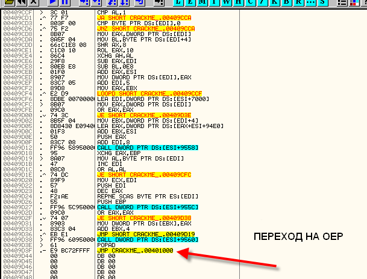
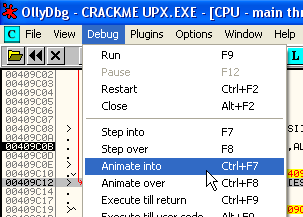

# Глава 31 - Вводные сведения о распаковке

Вы скажете, что объявлять третью часть, посвящённую P-CODE, а потом начинать с распаковки, это безумие. Это всё потому, что многие крэкеры, с которыми я советовался, жаждут улучшить свои навыки в распаковке, а о P-CODE есть множество туториалов, включая те, где используется WKT, да и программ, написанных с его использованием, не так много, поэтому думаю, что лучше начать рассказывать о распаковке. Поскольку распаковщиков тысячи, то всех их рассматривать не будет, но постараемся освоить общие принципы и примеры, которые помогут нам понять работу пакеров, которых мы ещё не видели, чтобы не искать потом отчаянно туториалы о них (хотя иногда это помогает, хе-хе).

В этой первой части рассмотрим некоторые основные концепции и идеи, которые послужат нам в будущих частях для распаковки специальных примеров.

Ок, вот в чём состоит идея упаковки программ.

Мы уже видели, что в распакованной программе с самого начала можно легко изменять нужны байты, так как они легко доступны, не меняются, листинг программы всё время постоянен и в любой момент можем изменить что угодно без особых проблем, а потом сохранить изменения.

Следовательно, в упакованной программе изменить что-либо легко и просто не получится, так как изначальный код зашифрован и недоступен.

Когда приложение упаковывается выбранным упаковщиком, тот шифрует и хорошо прячет изначальный (исполняемый, а не исходный) код программы, затем, обычно, добавляет одну (или больше) секцию, в которую помещает загрузчик, и перенаправляет точку входа на этот загрузчик-распаковщик.

В результате всего этого изначальный код программы становится не виден, если откроем программу в OllyDbg и остановим её, то окажемся в точке входа распаковщика, откуда и будет начинаться выполнение.

Этот распаковщик ищет сохранённую информацию о зашифрованном изначальном коде, расшифровывает её и сохраняет в изначальное места. Как только раскриптовка завершена, он переходит на OEP или изначальную точку входа (Original Entry Point), т.е. та, которая была до упаковки программы.

Поищем наиболее простой из существующих упаковщиков. Это UPX. Качаем версию, что с GUI, поскольку она самая простая. Называется она GUIPEX ***\[[ссылка](files/31/GUiPeX_Setup.7z)\]***.

Ок, устанавливаем её и запускаем.

Хорошо, у нас тут самый простой упаковщик, но чтобы подстраховаться и вы не опухли, используем знаменитый крэкми CrueHead'а ***\[[ссылка](files/1/ollydbg01-Crackme.7z)\]*** и сначала откроем его в OllyDbg без упаковки.

Он открыт в OllyDbg, точка входа – 401000, то есть если мы его запустим, это будет первая выполнившаяся строка.

Таким образом, если мы его запакуем, GUIPEX изменит и добавит секции, закриптует изначальный код, куда-то сохранит его, а затем изменит точку входа так, чтобы она указывала на загрузчик-распаковщик – и вуаля, готово.

Тогда, когда мы запустим упакованную программу, распаковщик достанет из ларца зашифрованный изначальный код, расшифрует его и поместит в первую секцию, а прежде чем завершить свою работу, перейдёт к первой строке изначального кода, которая должна быть выполнена, то есть OEP или изначальная точка входа. В нашем случае, как мы знаем, это 401000, то есть программа до упаковки начиналась оттуда, и это первая строка, которая должна выполниться.

Логично предположить, что когда мы начинаем исследовать упакованную программу, у нас нет оригинала, с помощью которого мы могли бы узнать OEP, то есть первую строку изначальной программы, поэтому нам нужно изучить различные техники и способы для её нахождения. Для этого сначала будем практиковаться на CC (крэкми CrueHead'а, чтобы короче).

Сохраним копию CC в надёжное место, например, на рабочий стол, так как UPX его изменит, и нам потребуется оригинал для сравнения.

Открываем GUIPEX.

Тащим крэкми и бросаем сюда.

Видим, что программа отображает крэкми с полным путём до него и доступные команды. Выбираем COMPRESS, чтобы упаковать крэкми. С помощью данной утилиты мы также можем и распаковывать.

Как только это сделали, нажимаем кнопку RUN, чтобы выполнить заданную GUIPEX'у операцию.

Видим, что всё прошло успешно, и крэкми был упакован.

Изменить имя упакованного крэкми, чтобы отличать его от исходного CRACKME.EXE.

Как видим, запакованный крэкми гораздо меньше, чем исходный. В наше время есть такие упаковщики, которые навешивают столько кода для защиты, что после упаковки файлы становятся куда больше, чем были до этого, хе-хе.

Если запустим упакованный крэкми, то увидим, что он работает точно так же как и исходный. Теперь посмотрим на них с другой стороны. Откроем два OllyDbg, в одном из которых "CRACKME UPX.exe", а в другом "CRACKME.exe", и сравним их.

ТОЧКА ВХОДА В CRACKME.exe:

ТОЧКА ВХОДА В CRACKME UPX.exe:

Как видим, они разные. В "CRACKME UPX" точка входа заменена на 409bf0, где будет начинаться выполнение распаковщика, а если пойдём посмотрим, что находится в 401000, то не найдём ни следа изначального кода.

Как видим, первая секция полностью пуста, то есть упаковщик обнулил все зашифрованные байты, сохранив их содержимое куда-то в другое место, оставив в данном случае первую секцию совершенно пустой.

В общем случае, большая часть упаковщиков создают секцию, из которой начинается выполнение распаковщика, который достаёт зашифрованные байты изначального кода и помещает расшифрованный код в ту самую первую секцию.

Посмотрим снова процедуру распаковщика, не запуская её. Идём вниз.

Продолжаем, пока не увидим:

Это бесхитростный упаковщик, видим, что начинается выполнение раскриптовки, а когда она заканчивается, происходит переход на OEP. Ничего не прячется. Поглядев на настоящие упаковщики, глядя на такое можно рассмеяться, но ладно, продолжаем работу.

Устанавливаем BP на этот JMP.

И делаем RUN.

Останавливаемся на нём, и поскольку наполнение первой секции завершено, переходим на OEP (то есть первую строку изначального кода), нажав на F7.

Вот OEP с тем же кодом, что и в оригинальном крэкми Cruehead'а. Распаковщик завершил свою работу, расшифровав весь изначальный код, после чего сделал переход на OEP, чтобы начать выполнение программы. Сперва, как мы видели, здесь были только нули.

Вот схема работы запакованной программы:

1. Запуск распаковщика
2. Восстановление и расшифровка секции, где должен выполняться изначальный код
3. Переход на OEP
4. Запуск программы

По этой схеме работало множество упаковщиков в течении долгих лет. Со временем создатели упаковщиков стали слегка её изменять, используя разные хитрости, чтобы спрятать OEP, и другие трюки, которые мы рассмотрим позже. Но в целом, всё функционирует так, как сказано выше.

Рестартуем "CRACKME UPX".

Очевидно, что если первая секция является пустой, как в данном случае, и в ней будет восстановлен изначальный код, то необходимо осуществлять запись в данную секцию, поэтому если используем BMP ON ACCESS на ней, то остановимся на процедуре, занимающейся расшифровкой кода.

Идём в M.

Видим, что размеры секций были изменены в соответствии с начальными.

Видим, что секция CODE в исходном файле начинается в 401000 и занимает 1000 байтов, в то время как в CRACKME UPX она начинается в 409000.

Ладно, устанавливаем BPM ON ACCESS на первой секции запакованного крэкми, чтобы посмотреть, произойдёт ли останов, когда начнётся распаковка. Делаем RUN.

Точно, видим, что останавливается на моменте сохранения AL, равного 6A, в 401000. Смотрим, что находится в оригинальном файле по этому адресу.

Видим, что сохраняется первый байт, находящийся в оригинальном файле по адресу 401000. Если нажмём F9, то должен будет сохраниться следующий байт, то есть 00. Смотрим.

И так можем продолжать байт за байтом, сохраняя расшифрованные файлы и реконструируя изначальный код. Конечно, не все упаковщики распаковывают по порядку или вообще начинают с начала, как в данном случае, но для начала мы будем рассматривать самый нормальный вариант.

Если мы не поленимся трассировать дальше, то увидим, что это LOOP, где считывается зашифрованный байт и над ним проводятся математические операции, чтобы его расшифровать (суммирование, умножение и так далее, как пример), а после того, как получается оригинальное значение, оно сохраняется после предыдущего.

Если снимем BPM ON ACCESS, то если нажмём ANIMATE INTO, то увидим забавное зрелище как будто в кино, как первая секция заполняется изначальными значениями, пока не дойдём до BPX, который установили на JMP, ведущему на OEP.

Видим, как работает программа, раскриптовывающая секцию CODE.

Дойдя до сюда, видим как распаковщик в поте лица перемещает байты в цикле, заполняя между тем первую секцию изначальными значениями. После завершения этой процедуры, JMP совершает переход на OEP.

Остановившись на JMP, нажимаем F7, чтобы попасть на OEP.

Находимся на OEP. С помощью OllyDbg мы не сможем менять и сохранять код, как привыкли в данном случае.

Если, например, возьмём два первых байта 6A 00 и решим поменять на, скажем, 90 90, а затем попытаемся сохранить эти изменения, OllyDbg сообщит:

То есть нельзя этого сделать, так как OllyDbg не встретила этот код в исполняемой файле.

Но если настоять и с помощью шестнадцатеричного редактора поместить 90 90 в 401000, открыть крэкми в OllyDbg, а затем посмотреть, что находится в 401000, то сначала будут идти 90 90, нули, а кода запустится распаковочная процедура и сохранит изначальные значения в первую секцию, наши изменения будут перезаписаны.

То есть, если хотите изменить эти байты на самом деле, то нужно отыскать, откуда распаковщик читает эти байты на самом деле, посмотреть, какие операции применяются к ним, чтобы сконвертировать их в изначальные значения, после чего можно высчитать, какие новые значения должны быть, уфф.. Слишком много работы, гораздо проще распаковать файл, чтобы можно было изменять, всё, что душе заблагорассудится, хе-хе.

Конечно, существуют другие техники для патчения в памяти, например, лоадеры, но это не является темой данной части. Лоадеры загружают крэкми, ждут, когда произойдёт распаковка в память, находят нужные байты, после чего делают необходимые изменения в памяти, чтобы тот заработал, но это совсем другая история, будем пока идти медленно-медленно, хе-хе.

Ладно, на этом заканчиваю этот краткий и простой вводный обзор, в следующих двух частях будем рассматривать распаковку знаменитого крэкми CrueHead'а.

\[C\] Рикардо Нарваха, пер. Aquila
