# Глава 32 - Методы нахождения OEP

В предыдущей части мы попытались прояснить концепцию OEP, то есть первой строки, выполняемой изначальной программой. Это строка в 99% случаев находится в первой секции (хотя в этой главе будет рассматриваться случай, когда OEP не находится в первой секции, такой я вредный, хе-хе).

Видим, что когда доходим досюда, и смотрим память, её содержимое напоминает то, что было изначально, что даёт нам возможность попытаться сдампить и создать файл, который будет максимально близок к исходному, в целях его последующего реконструирования.

Классический метод следующий:

1. Находим OEP
2. Делаем дамп
3. Чиним IAT
4. Проверяем, если ли в файле антидамповые и иные проверки, которые могут препятствовать запуску программу, и исправляем эти проблемы

Это классический метод (с небольшими изменениями, зависящими от упаковщика), который обычно используется. В этой главе мы сфокусируемся на методах, которые можно использовать, чтобы добраться до OEP.

Нужно сказать, что во многих случаях необходимо пробовать и ещё раз пробовать. Во многих случаях эти методы работают, в других упаковщики могут препятствовать работоспособности этих методов, поэтому, конечно, нужно приложить немного изобретательности. Идея заключается в том, чтобы найти OEP, так что мы рассмотрим, как можно использовать для этого инструменты, имеющиеся в нашем распоряжении.

Пока для объяснений будем использовать упакованный крэкми Cruehead’а *(самостоятельно упаковывали его в 31 главе)*. Потом рассмотрим другие упаковщики, но для общих разъяснений сойдёт и так.

## Просмотр или поиск опкодов в в листинге до выполнения процедуры распаковки

Это сработает только для невинных пакеров. Мне бы не пришло в голову испробовать этот метод на ASProtect, например, хе-хе, но в некоторых случаях можно поискать опкоды JMP LARGO (0E9) или CALL LARGO (0E8), так как пакеру необходимо совершить переход или длинный вызов на первую секцию, чтобы перейти к OEP (если верны молитвы о том, что тот находится в начале).

В данном случае это было бы так:

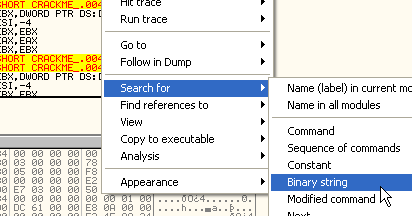

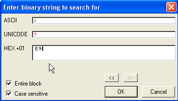

Когда останавливаемся, смотрим, является ли это переход на первую секцию, и если нет, то нажимаем CTRL+L, чтобы искать следующий E9.

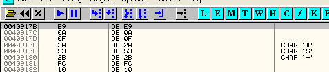

Нажимаем CTRL+L.

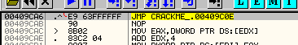

Находим несколько длинных переходов, которые не ведут к первой секции, пока, наконец, не оказываемся здесь:

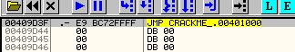

Это переход на первую секцию. Можем поставить BPX, и когда остановимся, нажимаем F7 и оказываемся на OEP.

Также, если есть желание порыться в коде пакера, можно попробовать "CALL EAX", "CALL EBX", "JMP EAX", так как многие упаковщики используют регистры для скрытия перехода на OEP. В данном случае, хорошо то, это полноценные команды, и их можно искать через "SEARCH FOR – ALL COMMANDS" и установить на все BPX. Рассмотрим пример.

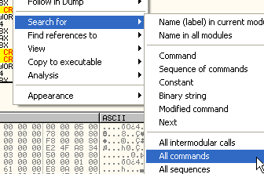

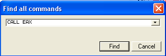

В данном случае не находим никакого результата, но если бы он был, то появился бы список с найденными вхождениями, и можно было бы нажать правой кнопкой мыши на них, чтобы установить BPX. Останавливаясь на каждом из них, можно было бы посмотреть, какое значение находится в EAX, чтобы посмотреть, ведёт ли данный CALL или JMP на первую секцию.

Это способ поиска по листингу не очень часто используется, так как большинство современных распаковочных процедур самомодифицируемые, особенно в районе перехода на OEP, чтобы избежать подобных проверок, но в случае, если упаковщик старый или плохой, то этот метод может сработать.

## Использование искателя OEP’ов, встроенного в OLLYDBG

Открываем крэкми UPX и идём в DEBUGGING OPTIONS-SFX:

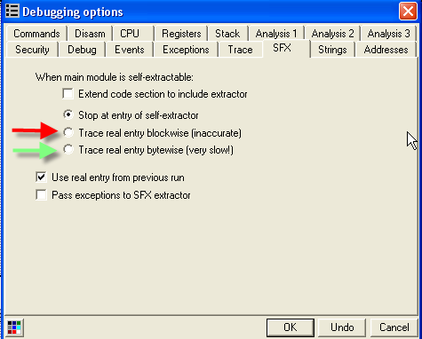

На вкладке SFX видим две опции, чтобы OllyDBG искал OEP’ы. Одна, отмеченная красным, более быстрая, а другая, на которую указывает зелёная стрела, более медленная, но работает временами несколько лучше. Опробуем. Кликаем на опцию, отмеченную красной стрелкой.

Перегрузив крэкми, видим, что в данном случае метод не сработал. Находим объяснение этому.

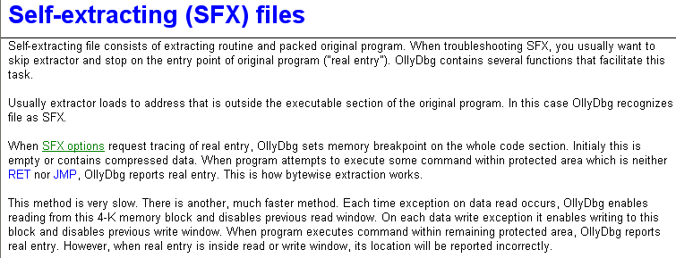

В помощи к OllyDbg видим, что эта опция работает только тогда, когда OllyDbg обнаруживает, что точка входа находится в секции кода, как в большинстве упакованных программ, однако в данном случае этого не происходит, так как UPX меняет секцию кода на ту, в которой запускается распаковщик, поэтому EP находит в той же секции кода, и OllyDbg ничего не находит, так как всё запаковано, и в данном случае метод не работает, хотя упаковщики, делающее подобное изменение, довольно редки.

Чтобы продемонстрировать, как работает этот метод, используем другой крэкми, прилагающийся к статье ***\[[ссылка](.gitbook/assets/files/32/UnPackMe_ASPack2.12.7z)\]***. Он запакован с помощью aspack’а – ещё один простой упаковщик.

Отметим сначала ту опцию, которая была изначально, и увидим, что OllyDbg определяет наличие пакера, посмотрев, находит ли точка входа внутри секции CODE.

Отображает окошко с соответствующим сообщением, и если нажать на кнопку, то оказываемся в точке входа.

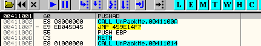

Теперь делаем активной опцию, отмеченную красной стрелкой. Убеждаемся также, что во вкладке EXCEPTIONS также поставлены галочки, чтобы мы не останавливались на исключениях, после чего перегружаем программу в OllDbg.

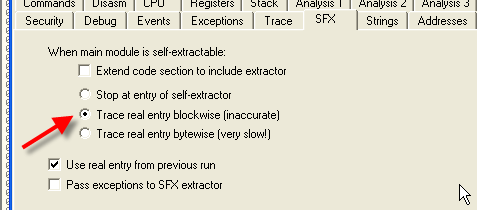

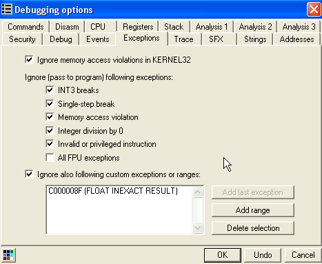

Делаем RUN.

Видим, что останавливаемся в 404000, который помечается как "REAL ENTRY POINT OF SFX CODE", т.е. "настоящая точка входа SFX-кода" (хотя она не находится в первой секции, как уже было сказано, этот крэкми – особый случай, распаковка происходит в третью секцию, что необычно, но возможно).

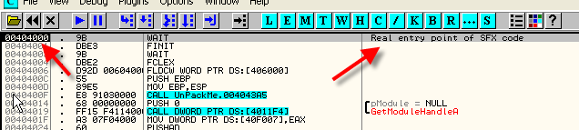

В данном случае метод сработал, это и есть OEP. Теперь посмотрим, насколько будет медленнее, если отметим опцию, на которую указывает зелёная стрелка.

Перезапускаем, работает не намного медленнее, так как код распаковщика невелик. В обоих случаях метод работает, и OEP был правильно определён.

Всегда нужно помнить, что после использования данного метода, нужно установить изначальную опцию, чтобы OllyDbg не искала всё время OEP потом.

## Использование пропатченного OllyDbg для поиска OEP’ов

***\[[ссылка](.gitbook/assets/files/26/olly_parcheado_para_vb.7z)\]***

Это тот же OllyDbg, который мы использовали в главах, посвящённых Visual Basic'у. В нём, когда устанавливается BPM ON ACCESS, он срабатывает только на запуск, но не на чтение и запись (ON READ или ON WRITE), что идеально подходит для поиска OEP'ов. Рассмотрим это на примере UPM, идём в M и смотрим секции.

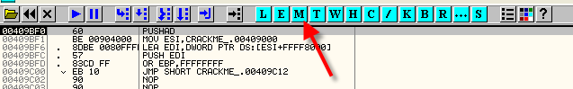

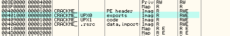

Вот первая секция, в ней распаковщик раскриптовывает и записывает изначальные байты, и нам не нужно, чтобы останов происходил во время этой работы, так как это бы происходило бы тысячи раз до того, как собственно добрались до OEP. Благодаря модифицированному OllyDbg, во время чтения и записи в вышеуказанную секцию остановок происходить не будет, а только когда в ней произойдёт выполнение, а это нам и нужно – узнать, на какой строке произойдёт первое выполнение в первой секции, так как это почти всегда и будет OEP.

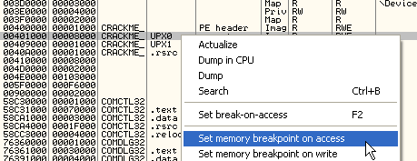

Убеждаемся, что во вкладке EXCEPTIONS отмечены опции, чтобы не происходило останова во время исключений, делаем RUN, и лично я отправляюсь за чашечкой матэ (те, кто не из Аргентины, могут предпочесть чай или кофе, хе-хе).

Конечно, этот метод довольно медленный, поэтому я и сказал, что можно пойти за чашечкой матэ, в зависимости от упаковщика это может занять от пары секунд до нескольких минут.

Когда возвращаемся с матэ, то видим, что OEP найден:

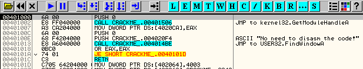

Если попробуем на aspack'е:

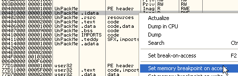

Делаем RUN.

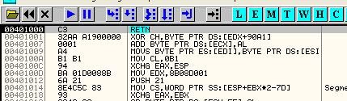

Видим первую строку, где произошло выполнение, смотрим, что случится, если нажмём F7.

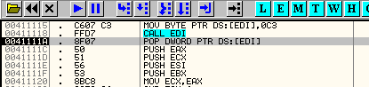

Возвращаемся из процедуры распаковщика, для чего снова жмём RUN, и видим, что программа запускается без остановки. Почему это происходит?

Если посмотрим внимательно, то увидим, что когда ищем OEP с помощью OllyDbg, то в данном случае распаковщик не распаковывает в первую секцию, поэтому нужно установить BPM ON ACCESS на другую секцию, а не на первую. Для того, чтобы определить на какую именно, нужно запустить крэкми без установки BPM'ов.

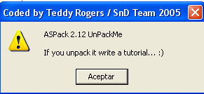

Как того появится вышеуказанное окно, то мы знаем, что произошла распаковка в память. Теперь, чтобы узнать, в какой секции происходит выполнение, можем установить BPM ON ACCESS в каждой секции по очереди, и если программа продолжает выполняться и не останавливается в OllyDbg, то это значит, что в данной секции выполнения не происходит, и нужно пробовать следующую.

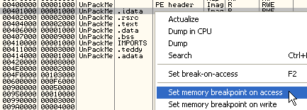

Устанавливаем BPM ON ACCESS на первую, и ничего не происходит, на вторую – тоже ничего, затем смотрим третью, которая начинается в 404000.

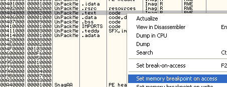

Видим, что происходит останов в OllyDdbg при попытке посмотреть окно крэкми, это значит, что это и есть секция, где происходит выполнение, так что повторяем процесс сначала, чтобы найти OEP, но BPM ON ACCESS уже ставим сразу на третью секцию.

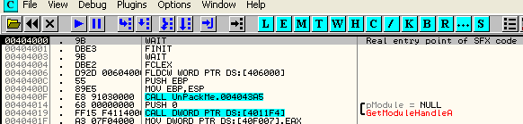

Идём за матэ, кофе, в общем за чем хотите, и когда возвращаемся, находим, что произошёл останов на OEP, хе-хе. Это ещё один метод, который работает на множестве упаковщиков.

## Метод PUSHAD

Этот метод работает на многих упаковщиках и основывается на предыдущем. Многие упаковщики сначала выполняют инструкцию PUSHAD, чтобы сохранить исходные значения регистров, а после распаковки, но до перехода на OEP, получают значения обратно с помощью инструкции POPAD.

Смотрим в крэкми, запакованном UPX.

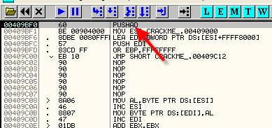

Видим, что PUSHAD находится в начале, иногда он может находится немного дальше, в иногда упаковщики применяют отдельный PUSH для каждого регистра (PUSH EAX, PUSH EBX и так далее), но в случае, когда сохраняются изначальные значения регистров, они должны быть извлечены обратно до перехода на OEP.

Если выполним PUSHAD с помощью F7:

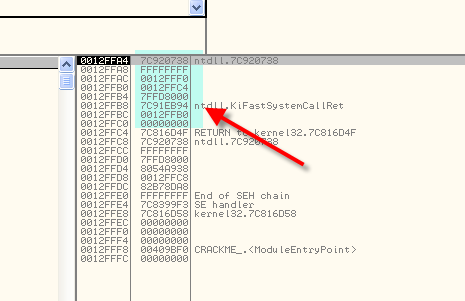

Видим, что сюда были сохранены изначальные значения регистров, и если они считываются до перехода на OEP, можем установить HARDWARE BPX ON ACCESS на одно из этих значений, чтобы остановиться, когда оно будет читаться, и окажемся непосредственно перед переходом на OEP.

Ищем эти значения в DUMP, отмечаем регист ESP и делаем FOLLOW IN DUMP.

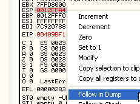

Через DUMP нам показывается содержимое стека.

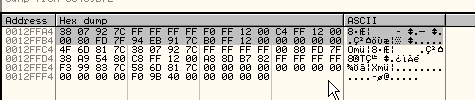

Здесь видим сохранённые значения, можно отметить первый байт или первые четыре и установить HARDWARE BPX ON ACCESS.

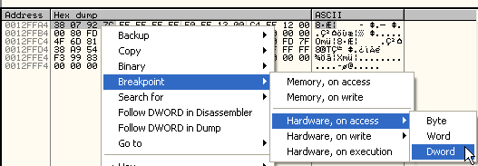

Всё равно, что выбрать, BYTE, WORD или DWORD, главное, что остановка произойдёт во время чтения этого значения. Нажимаем RUN.

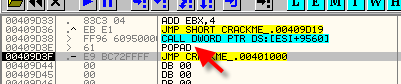

Видим, что для восстановления сохранённых в стек значений выполняется POPAD, они считываются и происходит останов, и чуть ниже находится переход на OEP, так что можно поздравить себя, что этот метод прекрасно сработал.

Пробуем на aspack'е.

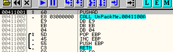

Видим PUSHAD, проходим его с помощью F7, а затем делаем ESP->FOLLOW IN DUMP.

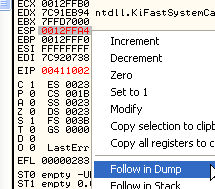

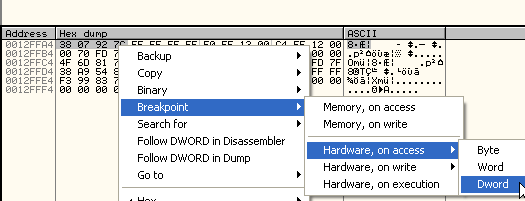

И делаем RUN.

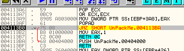

Видим, что останавливаемся тут прямо перед переходом на OEP, который в данном случае выглядит как PUSH 404000, а затем RET. Трассируем с помощью F7.

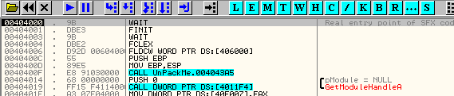

Без проблем доходим до OEP.

Нужно сказать, что многие новые упаковщики имеют защиту от данного метода, но ладно, нужно знать разные методы и пробовать, какой из них подойдёт.

Продолжаем рассматривать методы для поиска OEP.

## Для программ, написанных на Visual Basic'е (NATIVE или P-CODE)

Ок, найти OEP запакованной программы на VB очень легко, так как в ней всегда есть PUSH и CALL API-функции VB в начале, так что используем OllyDbg для VB, и когда запустим программ и остановимся на точке входа, идём в M, ищем DLL VB, и на секцию кода данной DLL ставим BPM ON ACCESS.

Таким образом программы распакуется и остановится прямо на первой строке, выполняемой библиотекой, а на первой строке стека находится адрес возврата из вызова, который привёл сюда. Этот вызов находится на второй строке после OEP, а на самой OEP – PUSH. Так и находится OEP данным методом.

Понятно, что метод, использующий модифицированный для VB OllyDbg, тоже будет работать, если установить BPM ON ACCESS прямо на первую секцию программы, но есть упаковщики с защитой от этого, поэтому может потребоваться попробовать оба метода, так что вы должны знать, как они работают.

Не будем рассматривать примеры, так как это всё очень легко понять. В будущем, если попадётся подходящий запакованный VB-крэкми, опробуем этот метод в деле.

## Метод исключений

Если у нас есть упаковщик, который генерирует множество исключений при распаковке, то существует следующий метод, который мы рассмотрим на примере приложенного к главе крэкми bitarts ***\[[ссылка](.gitbook/assets/files/32/bitarts_evaluation.c.7z)\]***.

Открываем его в OllyDbg для VB с необходимыми плагинами для защиты от обнаружения.

Включаем все опции во вкладке EXCEPTIONS и запускаем крэкми в OllyDbg, после чего прибываем сюда.

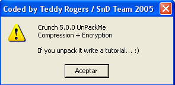

Как только оказались здесь, открываем логи OllyDbg, нажав L.

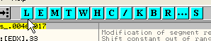

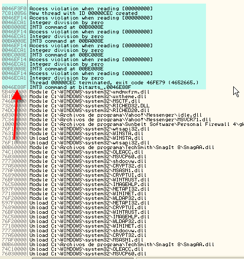

Определяем последнее произошедшее исключение, которое произошло не в первой секции, то есть произошедшее не во время выполнения программы, самое последнее во время распаковки, в данном случае – это 46e88f.

Теперь перегружаем и выключаем все опции в исключениям, оставляя только первую.

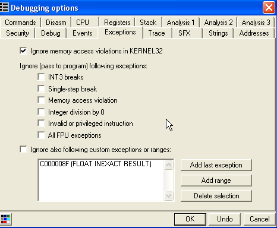

Жмём RUN и каждый раз при остановке проходим её с помощью SHIFT+F9, пока не доходим до последнего, которое запомнили, в данном случае это 46e88f.

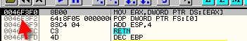

Останавливаемся здесь, это не то, что нам нужно, нажимаем shift+f9, чтобы выйти из исключения. Обратите внимание, что OllyDbg останавливается на следующей после INT3 строки, то есть на 46e890.

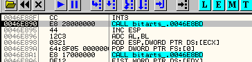

Находимся прямо после последнего исключения, сгенерирвоанного распаковщиком, после чего запускается сама программа.

Здесь есть несколько возможностей. Можно установить BPM ON ACCESS на секцию кода. Многие спросят, почему не установить его в самом начале, и ответ состоит в том, что многие упаковщики могут определять BPM, если он установлен в самом начала, а так мы уже, скорее всего, прошли этап обнаружения.

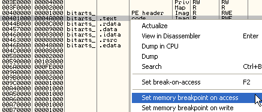

На забываем, что нужно нажимать SHIFT+F9, так как находимся в исключении.

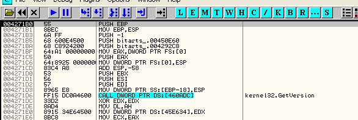

Останавливаемся на OEP, можем попробовать узнать, определяет ли упаковщик BPM, установленный в самом начале.

Перегрузим программу и снова включим все опции во вкладке настроек исключений, затем идём в M, где устанавливаем BPM ON ACCESS на первую секцию, и так как будем использовать OllyDbg для нахождения OEP, то есть время сходить за парой матэ, хе-хе, так как в данном случае это может занять несколько минут.

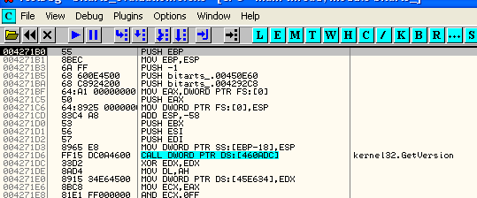

Видим, что всё сработало замечательно, но знать метод исключений полезно, если BPM ON ACCESS определяется упаковщиком, и в этом случае необходимо сначала подобраться к OEP так близко, как это возможно, чтобы избежать обнаружения.

Видим, что для этого этого упаковщика метод поиска OEP с помощью OllyDbg также прекрасно работает.

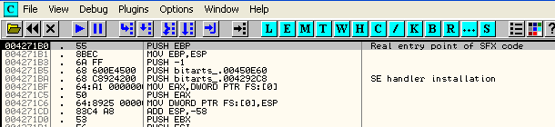

Метод PUSHAD тоже работает, смотрим вначале:

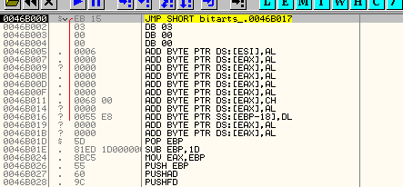

Если оттрассируем немного с помощью F7, то через несколько строк встретим PUSHAD.

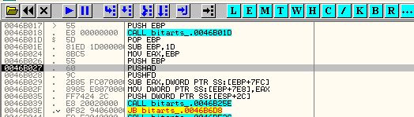

Проходим его с помощью F7 и помечаем (ESP-FOLLOW IN DUMP).

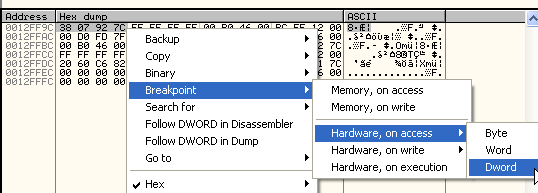

Делаем RUN.

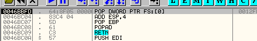

И останавливаемся на считывании сохранённых значений, трассируем до RET, пройдя который окажемся на OEP.

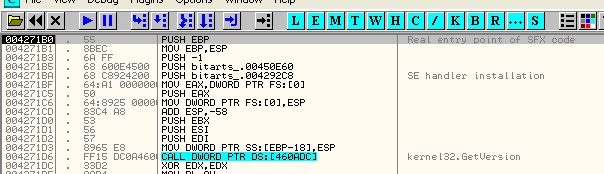

## Метод, использующий самую используемую распаковщиком API-функцию

Перегружаем этот bitarts в OllyDbg для OEP'ов, отметив все опции во вкладке исключений, и ищем часто используемую API-функцию, обычно это GetProcAddress. LoadLibrary также может довольно часть использоваться, ExitThread, в общем, зависит от упаковщика. Попробуем этот метод с GetProcAddress.

Смотрим в CommandBar'е адрес API-функции и устанавливаем на неё BP.

Мы не можем поставить такой BP, какой нам нужен, поэтому нам придётся подправить это вручную.

Делаем RUN.

Меняем BP на BP CONDITIONAL LOG, который не производит остановку, а только пишет в лог.

Устанавливаем, чтобы не происходило остановки, но всегда записывалось в лог, и кроме того, чтобы записывалось значение \[esp\], то есть значение возврата. Это позволит нам узнать, откуда был произведён вызов API-функции. Очищаем лог (правая кнопка мыши-CLEAR LOG).

Делаем RUN и оказываемся в собственно программе, смотрим последний вызов нашей API-функции, производимой не из первой секции.

Видим, что все вызовы были произведены из распаковщика, кроме последнего из 428c2B, то есть уже из первой секции программы, а значит, относящегося уже к самой программе. Таким образом, последний раз эта функция была вызвана распаковщиком из 47009A, так что можем установить условие, чтобы там происходил останов.

Перегружаем.

Редактируем BPX CONDITIONAL.

Устанавливаем условие, отмечая опцию останова на ON CONDITION.

И делаем RUN.

Здесь произошёл останов. Это метод можно сочетать с установкой BPM ON ACCESS на секцию кода, чтобы избежать определение BPM, так как тут у нас такая проблема, что многие новые упаковщики определяют BPX, установленные на API-функции, поэтому во многих случаях лучше подобраться поближе к OEP с помощью BPM ON ACCESS, и оттуда трассировать с помощью автоматического трассировщика, встроенного в OllyDbg (TRACE INTO).

Если подобрались достаточно близко, то можно использовать метод поиска с помощью API-функцию, если повезёт, если нет, можем поменять её. Если заглянем в лог, то увидим, что одна из функций – это завершение треда.

Поэтому можем установить BP ExitThread, подредактировав его конфигурацию в OllyDbg таким образом, чтобы останов происходил каждый раз, когда тред завершается.

Делаем RUN.

Останавливаемся на завершении треда.

Если установлен BPM ON ACCESS на секцию CODE, то останов также прекрасно произойдёт.

## Метод первой API-функции, выполняемой программой

Этот метод заключается в установке BP напрямую на API-функцию, относительно которой есть подозрение, что это первая, выполняемая программа. Обычно вначале программы выполняют GetVersion, GetModuleHandleA, ряд распакованных программ получают список наиболее часто используемых API-функций. В случае с bitarts посмотрим GetVersion, а в CrueHead'е – GetModuleHandleA. Устанавливаем в bitarts BP GetVersion.

Делаем RUN.

Мы должны быть уверены, что вызов производится из программы, то есть из первой секции.

Когда останавливаемся, смотрим первое значение в стеке (адрес возврата) и идём туда.

Тут видим OEP, полученный нами с помощью метода первой используемой программой API-функции. Если программа обнаружит, что на GetVersion установлен BP, можно попробовать установить его на RET из неё.

Думаю, что методов множество, здесь были приведены примеры наиболее часто используемых. Эти методы можно расширять и адаптировать к конкретному случаю, но главное, чтобы вы поняли общую идею, стоящую за ними, чтобы у вас была прочная база.

К главе приложен крэкми UnPackMe\_tElock0.98.exe ***\[[ссылка](.gitbook/assets/files/32/UnPackMe_tElock0.98.7z)\]***, на котором можно попрактиковаться в поиске OEP. В нём используются несколько трюков, и не все из вышеперечисленных методов будут работать. Будет прекрасно, если вы сумеете сами найти OEP.

Помните, что если распаковщик обнаруживает BP или HBP и не запускается, то нужно следить, чтобы не было установлено никаких BP или HBP, а когда он запустится, можно попробовать метод PUSHAD. Если он не сработает, то нужно попробовать другой.

Следующая глава будет посвящена дампу и починке IAT'ов.

\[C\] Рикардо Нарваха, пер. Aquila
