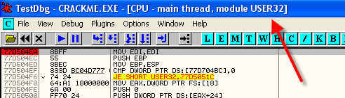

# Глава 33 - Вводные сведения об IAT

Перед тем, как начинать, как безумные, чинить IAT’ы, необходимо введение в то, что такое вообще IAT. Мы рассмотрим на примере оригинального крэкми CrueHead’а ***\[[ссылка](.gitbook/assets/files/1/ollydbg01-Crackme.7z)\]*** и упакованного варианта *(самостоятельно упаковывали его в 31 главе)*, где располагается IAT и что делает с ним упаковщик.

Ок, сначала общая идея, для чего нужен IAT.

Дело в том, что у каждой API-функции есть свой адрес, например, откроем оригинальный крэкми CrueHead’а в OllyDbg и напечатаем:

Видим, что на моей машине адрес этой функции 77D50EA, если вы пойдёте по соответствующему адресу на вашей машине, то у одних это может быть тот же адрес, у других нет, зависит от вашей версии Windows, от установленных обновлений, которых, как мы знаем множество, и каждая новая версия DLL, содержащая API-функцию (в данном случае это User32.dll) обычно меняет адрес.

Почти каждый раз, когда Microsoft выпускает новую версию этой DLL, меняются адреса API-функций, входящих в неё, поэтому если я запрограммирую в крэкми CrueHead’а, чтобы при совершении перехода на API-функцию MessageBoxA, это был переход на 77D504EA, то на моей машине это будет прекрасно работать, а также у тех, у кого та же версия User32.dll, но у остальных, у кого не Windows XP или стоит другая версия User32.dll, нужной функции по этому адресу не будет, и произойдёт ошибка.

Тогда вопрос заключается в том, что операционная система должна предоставлять какой-то способ, чтобы мой крэкми работал на других Windows и с другими версиями DLL.

Для этого были созданы знаменитые таблицы под названием IT (import table – таблица импорта) и IAT (Import Address Table – таблица импортированных адресов).

Не надо бояться этих страшных названий – в этой главе мы подробно рассмотрим, где они находятся в распакованной программе и для чего служат.

Теперь делаем SEARCH FOR-ALL INTERMODULAR CALLS и видим вызовы, которые идут в другие модули или DLL, то есть могут быть вызовами API-функций.

Здесь видим различные вызовы, например функции MessageBoxA, если сделаем двойной щелчок по первой из них:

Видим, что на самом деле это вызов CALL 40143A, и OllyDbg нам поясняет, что произойдёт переход на API-функцию MessageBoxA. Она заключает MessageBoxA в угловые скобки, чтобы показать, что вызов прямой, а не косвенный.

`CALL 40143A`

Видим, что среди опций OllyDbg во вкладке DISASM есть SHOW SIMBOLIC ADDRESSES. Если уберём её, то всё становится более ясным.

Видим, что справа также остаются пояснения с параметрами и названием API-функции, куда будет совершён переход, но теперь CALL действительно похож на прямой переход.

`CALL 40143A`

В SEARCH FOR INTERMODULARS CALLS

Видим, что в реальности три вызова MessageBoxA – это вызовы 40143A, посмотрим, что там находится.

Здесь видим, что вся загвоздка тут, чтобы добраться до API-функции, делает косвенный JMP, который таким образом получает значение, куда надо на самом деле перейти, из 4031AC.

`JMP [4031AC]`

Также видим, что если включить эту опцию, то понять, что это косвенный переход сложнее, поэтому её лучше выключать, когда работаем с IAT.

И вот этот трюк: программа переходит на API-функцию с помощью косвенного JMP, который получает адрес API-функции из 4031AC, и видим, что для остальных функций есть похожие косвенные переходы.

Кажется, вопрос о переносимости между разными компьютерами начинает проясняться. Когда программе нужно перейти на какую-либо API-функцию, делается косвенный переход, считывается адрес, по которому та располагается, из некоего рода хранилища. Посмотрим через DUMP, что это за хранилище.

Здесь, и правда, видим, что 4031AC – это часть хранилища, которое содержит все адреса API-функций, по которым располагаются последние на моей машине. Это хранилище и есть знаменитая IAT или IMPORT ADRESS TABLE, которая является ключом к переносимости, и это означает, что все программы имеют одни и те же косвенные переходы на API-функции, а меняются только значения, находящиеся в хранилище. На разных машинах эти значения могут отличаться.

Но постой, скажет мне кто-то, 4031AC – это адрес в программе, поэтому если на каждой машине такие адреса могут отличаться, то и он может отличаться в разных случаях?

Хе-хе, хороший вопрос *(маэстро сам себе плохих вопросов не задаст ? - прим. пер)*, сейчас мы рассмотрим, как вся эта система работает. Главная её цель заключается в том, чтобы наполнить IAT правильными адресами.

Мы знаем, что если сделать VIEW-EXECUTABLE FILE, то можно увидеть, что находится по адресу 4031AC в самом исполняемом файле, находящемся на нашем жёстком диске.

Видим, что в exe-файле по этому адресу находится значение 60 33, а когда мы находимся на точке входа, то в памяти в этом месте находится адрес API-функции EA 04 D5 77, и это означает, что операционная система, загружая программу, берёт значение 33600, находящееся по СМЕЩЕНИЮ 0FAC, которое соответствует адресу 4031AC, и замещает его реальным адресом API-функции на моей машине.

Магия?

Нет-нет, так работает Windows, для каждого запускающегося исполняемого файла операционная система заполняет IAT правильными для моей машины адресами API-функций, в данном случае в 4031AC помещается адрес API-функции MessageBoxA, а соседние элементы IAT заполняются адресами других функций, пока вся IAT не будет заполнена.

Конечно, система не настолько магическая, как можно подумать, видим, что в 0FAC находится значение 3360, которое указывает на что-то, может быть на то, какую API-функцию надо вызывать?

Если прибавим 3360 к базе образа, то получим 403360, и что мы найдём по этому адресу?

Вот в чём дело, это указатель на строку MessageBoxA, то есть система смотрит на этот указатель, ищет нужную функцию по имени и, с помощью GetProcAddress, получает её адрес на нашей машине, а затем заносит его в IAT, перезаписывая им 3360. Таким образом, гарантируется, что программа будет работать с любой версией DLL, так как адрес будет найден ещё до того, как выполнение перейдёт к точке входа в программу, а как только оно там окажется, IAT уже будет заполнен адресами API-функций. Если посмотрим IAT на другой машине, то увидим, что содержимое 4031AC отличается, так как адрес функции другой.

`JMP [4031AC]`

Переход на MessageBoxA, и программисту не нужно думать о тонкостях, так как значение в IAT всегда будет правильным, будучи заполненным правильными адресами при старте программы.

То есть, чтобы система корректно заполнила IAT адресами API-функций, в файле должны находится следующие указатели:

1)В элементе IAT в самом exe-файле должен находится указатель на строку с текстом, который говорит системе, адрес какой API-функции нужно поместить в этот элемент.

2)Конечно, строка с текстом должна быть именем API-функции.

Если эти два пункта выполнены, то можем заключить, что программа запустится, и система заполнит IAT правильными значениями (позже рассмотрим полностью, как всё это работает).

Ок, мы оказываемся на OEP распакованной программы, вопрос заключается в том, когда мы туда добрались и делаем дамп программы, зачем нам нужно реконструировать IAT, упаковщики её, что, ломают? Да, одни больше, другие меньше, смысл в том, что упаковщику не нужен IAT программы, потому что загрузка начинается с процедуры распаковки, которая может прочитать какие API-функции нужны в IAT, узнать их адреса и заполнить ими IAT, строки же, которые задают имена функций, стираются, так как они программе не нужны – когда она будет загружена, IAT уже содержит правильные адреса.

Большинство упаковщиков хранят эти строки в зашифрованном виде или в таком месте, где найти их нам, крэкерам, не так уж просто.

Посмотрим на примере крэкми, запакованного UPX’ом, отличие от нормального исполняемого файла.

Вот у нас крэкми CrueHead’а, упакованный UPX’ом, который мы уже использовали в прошлых главах.

Смотрим, что находится по адресу 4031AC (в оригинальном крэкми там находится хранилище).

Ничего, всё стёрто, а строки с именами API-функций, располагавшиеся в 403360, где они?

Ничего, совсем ничего, доходим до OEP и смотрим, что находится по тем же адресам, так как чтобы программа работала, в IAT должно быть что-то, чтобы был совершён переход на API-функцию.

`JMP [4031ac]`

Если IAT пуста, то это вызовет ошибку, то есть упаковщик должен сделать работу, которую обычно делает операционная система. Идём в OEP.

Устанавливаем BP на переход на OEP, делаем RUN и доходим досюда.

Смотрим, что находится в том месте, где располагается IAT.

Видим, что для обеспечения нормальной работы программы распаковщик заполняет IAT правильными адресами API-функций на моей машине. Если мы сдампим программу в этот момент, то возникнет проблема, так как у получившейся программы не будет достаточно данных, чтобы запуститься.

Строки, которые идентифицировали каждую из API-функций и находились в 403360, сейчас там отсутствуют.

Сделаем дамп, чтобы посмотреть, что останется, но как мы уже отметили, хотя код программы будет правильный, но запуститься сдампленная программа не запустится, так как система не сможет заполнить IAT из-за отсутствия данных.

Для того, чтобы сделать дамп, будем использовать внешнюю программу, которая называется LORDPE DELUXE ***\[[ссылка](.gitbook/assets/files/33/LordPE-DLX%201.4actualizado.7z)\]***.

Запускаем LORD PE DELUXE, ищем процесс, который нужно сдампить, в нашем случае это crackmeUPX.

Находим, отмечаем.

Нажимаем правую кнопку мыши, выбираем INTELLIDUMP, а затем – DUMP FULL.

Дамп сохраняется под именем DUMPED.exe.

Если попробуем запустить его, то увидим, что происходит ошибка. Открываем дамп в OllyDbg.

Посмотрим, какие ошибки показываются в LOG’е OllyDbg.

Ошибка происходит в 7c929913 на моей машине. Идём по этому адресу (у вас он может быть другим, поэтому надо смотреть в LOG’е).

Устанавливаем здесь HARDWARE BREAKPINT ON EXECUTION и BP, что увидеть, что происходит до возникновения ошибки.

Ок, видим, что останова не произошло, но зато случается другая ошибка из-за исключения. Рестартуем:

Видим, что останавливаемся до прибытия в точку входа из за ошибки.

Раз уж мы оказались здесь, смотрим, что находится в IAT.

Видим, что дампер сохранил значения, которые были в IAT на момент прибытия в OEP, и они являются правильными на моей машине, но для того, чтобы exe-файл запускался на любой машине, там должен быть сохранён указатель на строки с именами API-функций, а так как система не может их найти, то и происходит ошибка.

Не нужно быть гением, чтобы понять, что для того, чтобы программа запустилась, нужно восстановить имена API-функций, и указатели на них. Если делать это вручную, то это адская прорва работы: нужно было бы заменить содержимое 4031AC на указатель на строку MessageBoxA, и так со всеми.

Итак, нам брошен вызов: кроме того, что нам нужно было получить правильный дамп, нам ещё нужно починить его, чтобы он запускался.

Так как у нас правильный код, то без всяких сомнений идём в 401000, и смотрим, что там находится.

Если переместимся в зону переходов на API-функции:

Здесь находится вызов MessageBoxA, уже виденный нами ранее.

В вызове стоит правильный адрес, переходим на тот же JUMP, что и раньше.

JUMP’ы являются тем, что может не работать, так как в нормальных условиях система должна заполнить IAT правильными значениями, основываясь на указателях на строки с названиями функций, которые должны быть здесь до старта программы.

Прежде, чем заняться данной областью, посмотрим правильные определения и их расположение в исходной программе с не упаковонными IAT и IT.

Откроем оригинальный CC в OllyDbg.

Ок, находим нужные нам части, которые должны нормально работать в исходном файле.

В заголовке находим несколько важных указателей.

Идём туда же.

Меняем режим SPECIAL-PE HEADER.

Спускаемся.

Реальные данные идут с 100, где начинается PE SIGNATURE.

"Начинается со 100" - это значит, что начинается в 400100.

Здесь находится указатель на IT, то есть таблицу импорта, которую не надо путать с IAT

* IT = IMPORT TABLE
* IAT = IMPORT ADDRESS TABLE

Как видим, IAT – это хранилище, где система сохраняет после запуска правильные для моей машины адреса. А что такое IT? Идём туда. Как видим, она начинается с 3000 (403000), и её размер 670, то есть заканчивается в 403670. Смотрим, что там.

Поскольку мы ушли из заголовка, выходим из MODE SPECIAL-PE HEADER.

Это знаменитая IT, она у нас в руках, если мы поймём её, и хотя мы не знаем номер каждого из указателей, мы знаем, чем является каждый из элементов и куда указывает. Тогда мы спасены.

Плохо то, что приходится объяснять это в OllyDbg, так как гораздо удобнее и нагляднее делать это, представив IT в виде 5 колонок.

Знаменитая IT состоит из так называемых IMAGE IMPORT DESCRIPTOR’ов, являющиеся строками из 5 dword-значений, по одному дескриптору на каждую из загружающихся с программой DLL-библиотек.

Смотрим IT, помним, что каждый элемент (IID) занимает 5 колонок.

Рассмотрим пример.

Это первый IID нашей IT, в котором 5 DWORD’ов, означающих следующее:

* OriginalFirtsThunks
* TimeDateStamp
* ForwarderChain
* Указатель на имя DLL
* FirtsThunk (Указывает туда, где должен производиться в IAT поиск первого вхождения данной DLL)

Три первых обычно не слишком важны для крэкинга, нас интересуют указатели 4 и 5.

Как видим, 4-ый указывает на имя DLL, которой соответствует данный IID, по адресу 403290 смотрим, что это за DLL.

Здесь у нас первая DLL, которую будет искать система – это USER32.DLL. 5 dword – это указатель, на вхождения этой DLL в IAT, в данном случае это 403184.

Вот IAT и её первый элемент, всё внутри IT, которая заканчивается в 403670. Таким образом, каждой DLL в IT соответствует один элемент, называющийся IID или IMAGE IMPORT DESCRIPTOR, а внутри IT находится IAT, то есть хранилище адресов API-функций, всё в компактном виде, готовое для использования системой.

Многие крэкеры, экспериментировавшие с IAT, говорят, что IAT не всегда находится внутри IT, так как указатель на IID может указывать куда угодно, поэтому тот может располагаться в любом месте программа, куда есть разрешение на запись, чтобы при запуске exe-файла, программа могла сохранить правильные адреса API-функций, но тем не менее, общая последовательность того, что система делает для заполнения IAT, является следующий:

1. Ищет IT
2. Ищет первый IID и устанавливает, к какой DLL относится 4-ый указатель.
3. Затем смотрит пятый указатель, чтобы выяснить, где располагается первый элемент IAT
4. Там находится указатель на строку с именем API-функции.
5. С помощью GetProcAddress ищется адрес и сохраняется в том же элементе.
6. Когда в IAT встречается элемент с нулям, это означает, что первая DLL закончилась, и теперь нужно смотреть второй IID, чтобы найти, где располагается информация о второй, и повторить процесс.

Таким образом, важно хорошо понимать, что делает система, и что произойдёт, если она встретит неправильные указатели.

Ищем адрес в IT

Идём по этом адресу

В первой IID ищем 4-ый DWORD, который указывает на имя DLL, в данном случае это USER32.DLL.

Затем смотрим содержимое 5-ого указателя, чтобы найти первый элемент IAT. Он равен 403184. Идём туда.

Здесь читаем значение и смотрим, на что оно указывает.

Это имя первой API-функции, оно располагается в 4032CC, идём туда.

Видим, что первая API-функция – это KillTimer, её адрес находится с помощью GetProcAddress, мы можем сделать это с помощью OllyDbg.

И это значение, которое на моей машине равно 77d18c42, сохраняется в тот же элемент IAT, перезаписывая его предыдущее значение.

То, что мы здесь видим – это первый элемент IAT, и значение, которое оно содержит на моей машине.

Затем переходим к следующему элементу IAT, который легко найти, прибавив 4 к адресу предыдущего, и находим указатель на имя следующей API-функции.

Конечно, смотрим исполняемый файл и вот оно:

32d8, то есть 4032d8, смотрим имя следующей API-функции по этому адресу, и так как в этом элементе нет ноля, это означает, что продолжается список функций user32.dll.

Вторая API-функция – это GetSystemMetrics, её адрес будет найдён и сохранён во второй элемент IAT, и так будут находиться все API-функции библиотеки user32.dll, пока не будет обнаружен элемент, в котором содержатся все нули. Посмотрим, где он находится в исполняемом файле.

Видим, что поиск в IT user32.dll будет продолжаться, пока не найдётся вот этот элемент с нулями, после чего произойдёт переход к следующему IID.

Вот 4-ый и 5-ый указатели, 4-ый говорит нам, что в 40329b находится имя 2-ой dll, где будет происходить поиск функций.

Это kernel32.dll, и первый элемент её IAT находится после элемента с нулями, т.е. начиная с адреса 40321c.

Здесь видим ноль, который задаёт конец API-функций из user32.dll, и в 40321c начинается IAT Kernel32.dll, где будут искаться указатели на имена функций и которая будет заполнена их реальными адресами.

Думаю, что очень важно понимать этот процесс, я попытался объяснить его и повторить это несколько раза, чтобы вы хорошо поняли его, так как это основа всей темы реконструкции IAT, и хотя мы рассмотрим в следующей части соответствующие инструменты, которые могут нам помочь сделать рутинную работу за нас, очень важно знать, как они работаю, чтобы в случае каких-либо проблем мы не сошли с дистанции и всегда могли понять, почему это произошло.

Ок, на этот раз достаточно, в следующей главе мы приведём IAT в порядок.

\[C\] Рикардо Нарваха, пер. Aquila
