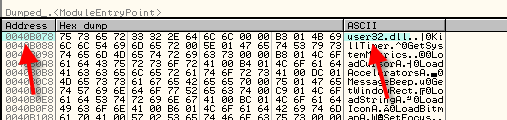

# Глава 34 - Ручная распаковка UPX'a и восстановление IAT

В 33-ей части мы рассмотрели, как работают IT и IAT. Кто-то мог бы подумать, что для починки IAT вовсе не необходимо знать, как она работает, так как есть инструменты, позволяющие это сделать автоматическим образом, но я вас уверяю – знание того, как и что работает – это очень хорошо, так как многие упаковщики вводят подобные инструменты в заблуждение, и те отказываются работать, и в этих случаях необходимо поразмыслить и подумать, как осуществить подобную правку собственноручно, и двигаться дальше.

Начнём с чего-нибудь лёгкого, например, с крэкми CrueHead’а, запакованного UPX *(самостоятельно упаковывали его в 31 главе)*. Сделаем полную распаковку, чтобы подготовить нас к главному, а потом починим IAT, чтобы она работала.

Как видим, первый шаг – это прибытие в OEP, для чего открываем крэкми в OllyDbg.


Применяем метод PUSHAD, чтобы дойти до OEP, жмём F7, чтобы пройти PUSHAD.


Теперь отмечаем ESP-FOLLOW IN DUMP.

И в дампе смотрим сохранённые регистры, отмечаем первые 4 байта и устанавливаем HARDWARE BPX ON ACCESS.


И делаем RUN, чтобы остановиться затем на переходе на OEP.


Хорошо, я нахожусь на переходе на OEP, нажимаю F7 и иду дальше.


Ок, прибыли в то место, где программа распакована в памяти. Теперь сдампим её.

В прошлой части я уже говорил, что существует много разных дамперов, в том числе и для OllyDbg существует плагин под названием OllyDump ***\[[ссылка](files/35/OllyDump%20v3.00.110.7z)\]***, который очень хорошо дампит, но поскольку мы рассматривали ранее LORD PE, то будем использовать PE TOOLS ***\[[ссылка](files/34/PETools.7z)\]***.

В следующие разы мы, возможно, также будем использовать OllyDbg, чтобы научиться использовать оба инструмента.

Открываем PE-TOOLS без закрытия OllyDbg, где мы по-прежнему стоим на OEP.


Ок, вот нужный нам процесс, который в данном случае называется crackme.exe, поскольку я потерял тот, что назывался crackmeUPX, пришлось сделать новый, но я забыл поменять имя, но это точно такой же крэкми, запакованный UPX’ом, что и в прошлый раз.


Делаем щелчок правой кнопкой мыши – DUMP FULL.


Ок, сдампили, теперь переходим к починке IAT. Закрываем PE TOOLS, видим, что сдампленный файл сохранился в директорию PE TOOLS, так что ищем его и копируем в директорию, где находится упакованный UPX’ом крэкми CrueHead’а.


Попробуем запусть этот файл, хотя и знаем, что ничего хорошего из этого не выйдет. Делаем двойной щелчок на dumped.exe.


Ок, как видим, нужно починить IAT, чтобы файл мог работать на любой машине, а не только на нашей, для чего используем IMPORT RECONSTRUCTOR ***\[[ссылка](files/34/ImportReconstructor16f.7z)\]***, конечно, не закрывая OllyDbg с загруженным крэкми CC, остановленным на OEP, так как IMP REC будет работать, используя его.


Запускаем её и ищем процесс с крэкми CrueHead’а, упакованного UPX’ом, которое остановлено на точке входа.

Ок, сейчас встаёт проблема, которая озадачивает множество начинающих, а именно – как найти начало и конец IAT. Конечно, в крэкми, которое у нас остановлено на OEP, мы уже видели, что упаковщик разрушает IT, поэтому 4-ый и 5-ый указатели первого IID (Imaga Import Descriptor), т.е. имя DLL и адрес первого элемента её IAT, у нас нет, поэтому для её нахождения нужно использовать другие способы.

Конечно, знаем, что в общем случае вызовы API-функций реализуются с помощью косвенных JMP или CALL’ов.

`JMP [xxxxxxx] o CALL [xxxxxx]`

Как мы рассматривали в предыдущей части, программа берёт адрес API-функции на нашей машине из IAT, которая является хранилищем адресов API-функций на нашей машине. Ищем переход на API-функцию в упакованном файле, для чего снова идём в OllyDbg с загруженным упакованным CC, остановленным на OEP.


Здесь на второй строке видим CALL, о котором OllyDbg нам говорит, что это API-функция, хотя на самом деле это подготовительный шаг косвенного перехода, так что отмечаем эту строку и делаем FOLLOW.


Здесь находим таблицу переходов, содержащую значения IAT, сюда мы попадаем при вызове каждой API-функции. Как видим, эти переходы начинаются с опкодов FF 25, поэтому во многих туториалах сразу делается поиск двоичной строки ‘FF 25’, чтобы попасть сюда гораздо быстрее.

Дело заключается в том, что не все программы используют косвенные переходы, чтобы добраться до этих API-функций, поэтому иногда этот метод не срабатывает, и лучший способ, который никогда не подводит – это поискать вызов API-функции, и посмотреть, откуда берётся сохранённое значение, которое приводит нас к API-функции, и это значение должно быть сохранено в IAT.

Вот в примере JMP \[403238\]:


Довольно очевидно, что 403238 – это элемент IAT, где сохранён адрес API-функции GetModuleHandleA, и таким же образом можно посмотреть в DUMP’е часть IAT, что необходимо для определения где она начинается и где заканчивается.

Конечно, можно посмотреть на все эти косвенные JMP и определить, у какого из них минимальный, а какого максимальный адрес, но это очень медленно, а лучше пойти в DUMP и подняться немного. Как мы знаем, в каждом элементе содержится адрес одной API-функции, в данном случае это 7C80B529, то есть если перевернуть, получится 29 B5 80 7C. Переключитесь в режим одновременно просмотра двух колонок, чтобы был обзор получше.


Здесь видим структуру IAT. В прошлой части мы рассматривали, что все элементы, относящиеся к одной DLL, идут последовательно, и перед началом следующей идёт элемент-разделитель, состоящий из одних нулей.


Некоторые навороченные упаковщики перезаписывают нули мусором, чтобы сделать реконструкцию более сложной. Все эти элементы не используются, и так как программа уже не должна сама запускаться, не нужно и оставлять эти нули, но здесь они остались, а также IAT для разных DLL находятся друг за другом. Ниже находятся

```
00403238  29 B5 80 7C   0E 18 80 7C  )µ€|##€|
00403240  A2 CA 81 7C   00 00 00 00
```

три API-функции, которые указывают на адреса 7Cxxxxxx, а затем идёт нулевой элемент, который отделяет следующую DLL.

Если используем VIEW-M, то увидим, что секция CODE данной DLL-библиотеки соответствует этим адресами вида 7Cxxxxxx.


Итак, все эти адреса указывают на секцию кода kernel32.dll.


Конечно, на ваших машинах DLL-библиотеки могут находится по другим адресам, но здесь мы увидели, что на моей машине эти элементы соответствуют секции CODE kernel32.dll.


Ок, рассмотрели все элементы, указывающие на kernel32.dll, видим нулевой разделитель, помеченный розовым цветам, а выше находятся элементы, которые ведут в другую DLL, в данном случае в её секцию CODE, среди них встречаются элементы, начинающиеся на 77Dxxxxx, так что смотрим в M, куда они ведут.


Адреса, находящиеся выше разделителя, соответствуют секции CODE библиотеки user32.dll. Продолжаем спускаться до следующего разделителя.


Здесь видим все API-функции, которые находятся внутри секции CODE библиотеки user32.dll и разделитель, но выше ничего нет, это значит, что начало IAT – в 403184, и это первый действительный элемент.


Ясно видим, что выше нет элементов, которые вели бы в какую-либо DLL, и в этом случае, вдобавок, ещё выше находятся все нули, которые нам облегчают нахождения начала IAT. Некоторые сложные упаковщики обычно заполняют мусором место перед IAT и после неё, что затрудняет обнаружение её начала, но как только мы знаем, что элементы IAT всегда должны вести в секцию кода библиотеки, то мы легко можем определить, что это мусор, так как он не ведёт в код никакой библиотеки.

Итак, в образе началом IAT является 403184, теперь идёт вниз, пока не найдём конец IAT, используя тот же метод: продолжаем, пока элементы указывают на секцию кода какой-либо DLL.

Позже мы также рассмотрим упаковщики, которые меняют элементы IAT и перенаправляют на свои процедуры, в свою очередь совершающие переход на API-функцию. В этом случае метод выше не сработает, и мы будем изучать дальше, что делать, а пока будем исходить из того, что элементы IAT – это адреса на API-функции, которые должны указывать на секцию кода DLL-библиотеки.


Здесь видим последние элементы IAT, которые ведут по адресам 76xxxxxx. Проверим, какой DLL они соответствуют.


В данном случае они соответствуют секции CODE в библиотеке COMDLG32.DLL, и после них больше нет элементов, так что это конец IAT, таким образом, адресом, отмечающим конец таблицы, будет 40328C, мы также могли бы принять, что концом является последний элемент 403288, и это бы было тоже самое, но для большей ясности рассмотрим, что конец в 40328C, и установим это как конец IAT.

Поэтому у нас теперь есть начало и конец IAT.

> НАЧАЛО: 403184

> КОНЕЦ: 40328C

IMPORT RECONSTRUCTOR запрашивает у нас сведения о следующих трёх вещах:

1)Начало IAT, но нужно сначала отнять от 403184 базу образа, которая в данном случае равна 400000, так что получится 3184.
2)Второе значение, которое у нас запрашивается — это размер IAT. Чтобы его узнать, нужно отнять КОНЕЦ от НАЧАЛА.

Размер=40328c-403184=108

Поэтому второе значение равно 108.

1) Третье – это OEP, также с вычтенной базой образа, то есть 401000-400000=1000


Эти данные вводятся в IMP REC.


Здесь видим данные, которые ввели в IMP REC, в OEP ввели 1000, то есть 401000 с вычтенной базой образа, в RVA начало таблицы, также с вычтенной базой, и в Size – размер IAT.

Здесь нажимаем GET IMPORTS.


Видим, что IMP REC, чья задача установить, какие API-функции относятся к каждому элементу IAT, и кроме их нахождения, он сообщает, правильны ли они, отмечая их словом YES. В случае, если элементы не ведут напрямую на API-функцию, как это бывает с некоторыми упаковщиками, он показывает NO, и в этом случае необходимо установить, куда этот элемент ведёт на самом деле. После того, как он приведён в порядок, IMP REC распознает его как корректный элемент и скажет "YES", и как только всё станет "YES", мы можем починить дамп.

Прежде, чем это делать, посмотрим на каждую DLL, развернув содержимое путём нажатия на +.


Тут у нас все элементы, к которым относятся API-функции, и если есть желание, то можно поместить первую из них (а это GetModuleHandleA) в IAT.


Если помните, это был первый элемент, который мы смотрели в IAT. Он соответствует 403238, но в IMP REC, конечно, все значения содержатся с вычтенной базой образа, поэтому ищем 3238. Кроме того, мы знаем, что он относится к Kernel32.dll.


Поэтому мы должны открыть kernel32.dll, для чего сделаем щелчок мышью на "+" слева от названия библиотеки.


Видим, что элемент 3238 соответствует GetModuleHandleA. Так что сейчас починим дамп, идём к кнопку FIX DUMP.


Ищем дамп и открываем его.


Ок, видим, что IMP REC починил его, хотя сохранил изменённый файл не под именем DUMPED, а под именем DUMPED\_.exe.

Смотрим, что находится в папке.


Можем попытаться запустить его, чтобы узнать, нормально ли он работает.


Хе-хехе, похоже, что не работает. Не пугайтесь, такое часто происходит после починки IAT. В PE TOOLS есть решение этой проблемы.


И идём в REBUILD PE, ищем DUMPED\_.EXE, оно прекрасно срабатывает, а теперь запускаем его ииииии…


Рабоооооотает! И теперь будет работать на любой машине, потому что IAT починен с помощью IMP REC, которые поместил правильные вызовы API-функций во все элементы IAT, заново записав туда имена API-фукций и приведя в порядок IT, чтобы она соответствовала тому, как должна быть, и что программа запускалась без ошибки.

Если откроем DUMPED\_exe в OllyDbg.


OllyDbg говорит нам, что точка входа была обнаружена за пределами секции кода, и это из-за того, что UPX поменял секцию кода на 3-ю. Данное положение вещей также можно исправить.


Прибываем в точку входа и идём смотреть заголовок с помощью GOTO EXPRESSION=400000.


Меняем режим на SPECIAL-PE HEADER.


Чуть ниже:


Видим, что сигнатура PE начинается в 80, идём туда (400080).


Здесь находится этот негодный указатель, означающий BASE OF CODE=9000, а мы хотим, чтобы первая секция была секцией кода, которая начинается в 401000, так что меняем 9000 на 1000.


Отмечаем и идём в MODIFY INTEGER.


Теперь сохраняем изменения как обычно с помощью щелчка правой кнопки мыши – COPY TO EXECUTABLE, в открывшемся окне опять правый щелчок и SAVE FILE.


Теперь рестартуем крэкми в OllyDbg и увидим, что назойливое окошко исчезло, так как OllyDbg больше не считает ту секцию секцией кода.


Если посмотрим секции сдампленного файла, то увидим, что для его починки IMP REC добавил новую секцию, названную mackt, где находится новая IT. Проверим её. В том же заголовки в режиме SPECIAL посмотрим указатель на IT.


Видим, что IT находится в B000, то есть 40B000, что является адресом секции, которая добавляет IMP REC. Идём посмотреть, что там, выходя из режима SPECIAL.


Здесь видим такую же IT, как и ту, что мы видели в предыдущей главе, указывающую на другой адрес, но полностью рабочую, и если хотим, то можем найти указатели таким же образом, как в прошлой главе.


Здесь у нас первый IID, относящийся к первой DLL, и его 4-ый DWORD указывает на имя DLL, и в данном случае имя этой DLL находится по адресу B078, то есть 40B078.



Это user32.dll.

И 5-ый указатель, как мы знаем из предыдущей главы, - это 3184, поэтому первый элемент реконструированной IAT находится в 403184, т.е. её начало.


И, конечно, первый элемент IAT у нас сейчас содержит значение API-функции, но если посмотрим в исполняемый файл, то до того, как быть перезаписанным адресом API-функции на моей машине, он должен был содержать указатель на имя API-функции.


В этом элементе IAT в исполняемом файле есть значение B084, которое соответствует 40B084, где должно находится имя API-функции, чей адрес будет помещён в этот элемент.


И это KillTimer.

Видим, что IMP REC провёл изумительную работу, обнаружил все API-функции, сконструировал новую IT, в которую добавил все указатели, и реконструировал список имён всех API-функций, чтобы система знала при запуске программы, какому элементу IAT какая функция соответствует. Настоящее чудо.

Хорошо, это было наше первое восстановление IAT, самое лёгкое, какое можно было придумать, но это база, на которой основывается всё остальное, и важно, что изложенное в этой и предыдущих главах было понятно, потому что в дальнейшем мы встретим IAT’ы, которые полностью растерзаны, переадресованные API-функции и другие сложные случаи, поэтому необходимо хорошо понимать, как это всё работает.

Кроме того, этот упаковщик не применяет противодамповых приёмов, поэтому мы их не рассматривали, но в дальнейшем, когда мы погрузимся в сложность упаковщиков, мы встретим случаи, где такие приёмы применяются.

Таким образом, мы мягко повышаем сложность, чтобы новые концепции не испугали вас, идём шаг за шагом, хе-хе-хе.

\[C\] Рикардо Нарваха, пер. Aquila
