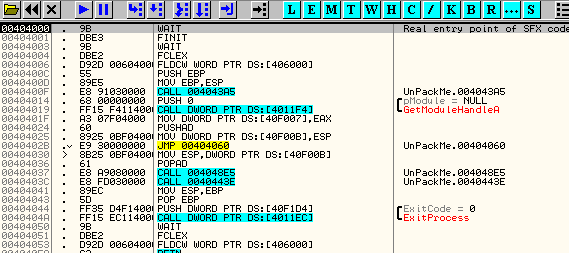

Глава 35 - Распаковка ASPack v2.12
==================================

Продолжаем практиковаться в распаковке, каждый раз используя более трудный упаковщик, постепенно повышая тем самым уровень сложности.

Следующим упаковщиком на шкале сложности является aspack, очень похожий на UPX, и для которого у нас есть крэкми UnPackMe\_ASPack2.12.exe ***\[[ссылка](files/32/UnPackMe_ASPack2.12.7z)\]***, использовавшийся в главе 32.

Для практики установим OllyDump ***\[[ссылка](files/35/OllyDump%20v3.00.110.7z)\]*** в директорию с плагинами, чтобы сделать дамп с его помощью.

Открываем OllyDbg, защищённый плагинами от обнаружения, и находим OEP с помощью метода PUSHAD.

Видим, что здесь нам сообщают о том, что точка входа находится за пределами секции кода, как это обычно бывает с большинством упаковщиков.

Видим начальный PUSHAD, который проходим с помощью F7, а затем делаем

ESP-FOLLOW IN DUMP, чтобы установить в DUMP’е железную (hardware) точку останова на доступ к значениям двух регистров, которые сохраняются инструкцией PUSHAD.

Затем нажимаем F9.

И останавливаемся прямо после POPAD, который восстанавливает сохранённые в эти регистры значения. Трассируем с помощью F7, пока не прибудем в OEP.

Как видим, код был не понят, выходим из анализа.

И видим, что если проанализировать его ещё раз, всё становится гораздо лучше.

Затем приступаем к дампу файла. Идём в меню PLUGINS и ищем там OllyDump.

Нам открывается окно плагина, в котором уже отображено то, что можно модифицировать. Можно исправить базу кода без необходимости потом править её в заголовке. В окне видим, что база кода равна 4000, а если помним, то aspack выполняется не в первой секции, поэтому не меняем это значение, которое соответствует 404000, где находится OEP и выполняется программа.

Ещё одна важная фишка – это опция «REBUILD IMPORT», находящаяся внизу окна. OllyDbg пытается сделать работу IMP REC’а, для чего ему служат METHOD1 и METHOD2, которые могут работать для простых упаковщиков. Вы можете сделать два дампа, используя каждый из этих методов, и посмотреть, работает ли хотя бы один из них. Это не всегда срабатывает, но иногда может.

Мы снимаем галочку с «REBUILD IMPORT», так как мы будем использовать IMP REC для большей надёжности.

Ок, сейчас сделаем дамп и посмотрим, что из этого выйдет.

Вот дамп, если запустим его без починки IAT, то может запуститься без проблем, но только на моей машине, а может выдать ошибку. Посмотрим.

Ок, не закрывая упакованный архив, который остановлен на точке входа, открываем IMP REC ***\[[ссылка](files/34/ImportReconstructor16f.7z)\]*** и выбираем вышеуказанный процесс в выпадающем меню.

Возвращаемся в OllyDbg, чтобы найти значения начала IAT, её размера и OEP.

OEP равна 404000, то есть в IMP REC это будет 4000, так как нужно отнять базу образа, равную 400000.

Ищем начало и конец IAT, для этого нам нужно найти вызов какой-нибудь API-функции. Прямо под OEP есть вызов GetModuleHandleA.

Отмечаем данную строку, затем правая кнопка мыши и FOLLOW.

Видим, что идём напрямую на API-функцию без посредничества косвенного JMP, по крайней мере в этом вызове (хотя если поищем, то увидим, что косвенные переходы есть, значит, используются они не всегда, как в данном случае).

Это значит, что здесь используется косвенный вызов для перехода на функцию, поэтому выяснить, откуда считывается адрес API (а он считывается из IAT), легко.

Легко видеть, что 4011F4 – это элемент IAT, где сохраняется адрес API-функции GetModuleHandleA.

Те, кто хочет увидеть косвенные переходы, могут поискать FF 25, чтобы их найти.

И получаем тот же результат, так как JMP к GetModuleHandleA читает значения из того же элемента IAT.

Идём в DUMP, чтобы посмотреть данный элемент в частности и IAT в общем.

Здесь видим, что все элементы соответствуют тем, что мы видели в начале, все идут в секцию кода той же DLL. Посмотрим с помощью VIEW-M, какой DLL они соответствуют.

Все находятся внутри указанной секции, поэтому видим, что эти элементы, относящиеся к Kernel32.dll, указывают на секцию CODE.

Здесь же можем посмотреть конец IAT. Снизу от 401218 особенно ничего нет, так что конец IAT – это 401218, и теперь нам осталось найти начало.

Видим разделяющие нули, а после них другую группу элементов.

Которые точно являются элементами, смотрим адреса, куда на которые они указывают (10xx или 11xx), Это не DLL, ни что-нибудь ещё, так как самый нижний адрес в карте памяти – это 10000.

Так что здесь находятся элементы, которые не ведут ни в какую-либо DLL, ни в какую-то реальную секцию. Так же они могли бы указывать на секцию, созданную упаковщиков, но не в данном случае. Это мусор, разбросанный для того, чтобы заставить нас думать, для чего он нужен. Спускаемся дальше.

Видим, что среди нулей есть другая группа элементов, указывающих на адреса 77Dxxxxx. Смотрим в карте памяти, какой DLL они соответствуют.

Видим, что они принадлежат User32.dll.

Также видим, что в карте памяти есть много других DLL, таких как GDI32 и Ntdll, которые могут загружаться упаковщиком для собственного использования, а не для использования программой. Чтобы проверить это, сделаем в этом же списке SEARCH FOR – ALL INTERMODULAR CALLS.

Видим, что есть вызовы 3-х DLL, две из них – те, которые мы нашли, и другая – это Ntdll. Смотрим.

Если, например, перейдём к вызовам этой DLL.

Видим, что соответствующий элемент находится в 401200, то есть это смешение (mezclada – чего-то я не совсем понял, о чём он толкует, кто понял – отпишитесь – прим. пер.) с kernel32.dll.

То же самое относится и к другой из указанных DLL, которая смешана с kernel32.dll. Мы не заметили, что эти две секции кода находятся рядом друг с другом, но это так.

Ок, посмотрим какие проблемы могут быть из-за подобного начала IAT. Вот все эти элементы:

Начала IAT находится в 40119C, которое совпадает с меньшим значением, найденным в таблице переходов.

Видим, что оно самое маленькое из всех этих значений, так что у нас получается:

> OEP=4000
> RVA или НАЧАЛО IAT=119C
> РАЗМЕР = КОНЕЦ МИНУС НАЧАЛО = 401218-40119c = 7C

Задаём эти значения в IMP REC, чтобы посмотреть, что получится, видим, что оба смешанных элемента относятся к ntdll и kernel32.

Видим, что указанная часть не та, которая соответствует мусорным элементам, и внизу видим, что у нас есть только элементы для kernel32, и если посмотрим редко встречающиеся элементы, соответствующие 401200 b 401210, то увидим, что:

Заменяем его на похожие элементы, соответствующие kernel32.dll, и что это будет означать?

Видим, что теперь в логе нам говорят, что эти элемент похожи на элементы из kernel32.dll, и пакер может свободно менять их, что всё запутать и усложнить.

Хорошо, теперь нам осталось убрать мусор из середины. Проверяем эти элементы и смотрим, если написано NO, то это мусор. Чтобы убедиться в этом, идём к одному из них.

Отмечаем первый, нажимаем правую кнопку мыши и выбираем DISASSEMBLE-HEX VIEW.

Здесь видим, что это не приводит нас к реально существующему месту, так что отмечаем все элементы как мусор.

Нажимаем SHOW INVALID, а затем, держа все эти элементы отмеченными, нажимаем на правую кнопку мыши и выбираем CUT THUNKS.

Таким образом мы аннулировали все эти неверные элементы, чтобы система при загрузке не выдавала ошибку, пытаясь загрузить несуществующие API-функции.

Теперь можно нажать FIX DUMP, так как все элементы отмечены как YES, то есть как правильные.

И создаётся dumpaspack\_.exe, файл, который предположительно должен быть починен, запускаем и смотрим, так ли это.

Работает превосходно, поэтому на этот раз здесь и остановимся. Сложность нужно повышать постепенно.

  \[C\] Рикардо Нарваха, пер. Aquila
