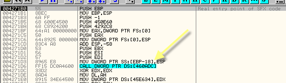

# Глава 36 - Переадресовочные элементы IAT

Продолжаем, очень плавно повышая сложность изучаемых упаковщиков. В этой главе мы рассмотрим два распакуй-меня – crunch (или bitatrs 5.0) и telock 0.98, которые послужат нам для освоения темы переадресовочных элемент IAT. Оба распакуй-меня приложены к данному туториалу, поэтому у вас не должно быть проблем, где их взять.

Начнём с самого простого – с BITARTS [\[ссылка\]](.gitbook/assets/files/32/bitarts_evaluation.c.7z). Загрузим его в OllyDbg.


Видим, что начального PUSHAD нет, так что потрассируем немного с помощью F7.


Доходим до PUSHAD, проходим его с помощью F7 и делаем ESP – FOLLOW IN DUMP.


И устанавливаем точку аппаратного останова (hardware breakpoint) на доступ к первым байтам.


Теперь нажимаем F9 и после прохода через другое исключение останавливаемся на точке аппаратного останова.


Трассируем строки дальше и оказываемся в OEP.


Также оказаться в OEP можно с помощью поисковика OEP OllyDbg, если последняя пропатчена для этого, или почти любым другим методом, рассмотренным в предыдущих главах "Введения…".

Как видим, указанный адрес находится в первой секции после заголовка.


Поэтому кажется, что всё в порядке, включая отмеченную секцию CODE, так что проблем не должно быть.


Видим, что в данном случае первая вызываемая API-функция – это GetVersion, поэтому также устанавливаем на данную API-функцию BP, и когда останавливаемся при вызове её из первой секции, то по возвращению мы оказываемся в области OEP.

Ок, OEP не представляет секрета, и теперь заглянем в IAT. Конечно, рассматриваемый нами вызов выглядит как прямой, но легко убедиться, что, на самом деле, он косвенный: загружается правильный для моей машины адрес API-функции GetVersion для того, чтобы совершить на него переход.

Значит, 460ADC – это элемент IAT, соответствующий GetVersion. Идём в DUMP и сверяемся с IAT.


Она довольно большая, хе-хе.


Первый элемент в IAT – это GetVersion, который соответствует Kernel32.dll, можно посмотреть в карте памяти, куда ведёт указанный адрес 7Cxxxxxx.


Видим, что всё соответствует Kernel32.dll, рядом с серединой, как и в прошлой части, есть пара смещений, соответствующих ntdll, но мы уже проверили, что система выдаёт исключения для этих API-функций, которые изначально относились к kernel32.dll и были заменены на похожие из ntdll.dll, но для совместимости они считаются системой вызываемыми из kernel32.dll без каких-либо проблем. В любом другом случае система не станет делать исключений, и API-функции должны относиться к соответствующей DLL, которые, в свою очередь, должны быть отделены нулями, как того требует правильно составленная IAT.

Хорошо, после этого спускаем ниже и находим группу API-функций с адресами вида 77xxxxxx.

Если есть какие-то сомнения относительно того, к какой DLL принадлежит элемент, то кроме анализа карты памяти, можно отметить его в IAT, нажать правую кнопку мыши и выбрать FIND REFERENCES.


Так что ищем в списке все инструкции, использующие данный элемент (это будет работать всегда: и когда список показывает секцию программы, где собственно выполняется работа, в данном случае первая секцию, если будем искать в ней ссылки, и в списке, отображающем другую секцию, поищем в ней, вероятно, что ничего не найдём, так что нужно проверять перед использованием данного метода, находимся ли мы в правильной секции, где исполняется распакованная программа, или рядом с областью OEP, что одно и то же),


Здесь видимы CALL’ы, которые есть в первой секции и соответствующие указанному элементу. Та, которая относится к API-функции VariatClear из OleAut32.dll:


Смотрим в карте памяти, видим, что, конечно, следующая группа попадает в секцию кода OleAut32.dll.


Если продолжим спускаться без указания каждой DLL, то увидим группы элементов, ведущие в другие элементы, разделение нулями, другую группу, следующее разделение, и так пока не дойдём до самого конца этой IAT-схемы.


Здесь видим завершающую часть, лазурным цветом выделена группа API-функций, соответствующих некой DLL, затем – разделение, затем розовым цветом обозначена другая группа, разделение, а после – элемент, отмеченный стрелкой и ещё одно разделение, после которого привычная схема IAT уже не соблюдается. Мы можем проверить, является ли отмеченный стрелкой элемент ссылкой на API-функцию. Это можно сделать двумя способами.


Видим, что есть элемент IAT, который приводит нас в данном случае к OleUiBusyA из oledlg.dll. Проверим через карту памяти.


Логично, что элемент ведёт в секцию кода указанной DLL, поэтому это элемент IAT, единственный для данной DLL. Далее видим разделение, а после него группу множества переходов, которые ни сгруппированы так, чтобы указывать на последовательные адреса, ни сами эти адреса не указывают на какую-либо DLL.


Если отметим какой-нибудь из них и сделаем FIND REFERENCES:


Никаких результатов, приведших бы нас к API-функциям, поэтому можно прийти к выводу, что ниже мы также не встретим элементов, ссылающихся на API-функции, то есть концом IAT является:

КОНЕЦ: 460F28


Теперь проверим, откуда начинается IAT-схема.


Идём вверх и видим, что схема повторяется, пока не доходим до сюда. Лазурным отмечены разделения, группа, отмеченная жёлтым, опознаётся как ведущая в одну и ту же DLL, далее есть одно разделение, а затем элемент, ведущий в 80000008. Так как не знаем, соответствует ли он какой-либо DLL, то проверяем это с помощью FIND REFERENCES.


Никаких результатов ни для этого элемента, ни для идущих перед ним, так что можем быть уверены, что первым элементом является 460818.


Теперь у нас есть начало и конец IAT. Вычисляем размер:

НАЧАЛО – КОНЕЦ = 460F28 – 460818


То есть размер равен 710.

Данные для IMP REC (от OEP и НАЧАЛА надо отнять базу образа):

```
OEP = 271B0
НАЧАЛО или RVA = 60818
РАЗМЕР = 710
```

Хорошо, теперь сделаем дамп с помощью OllyDump [\[ссылка\]](.gitbook/assets/files/35/OllyDump%20v3.00.110.7z).


Убираем галочку с Rebuild Import и дампим.


Далее открываем IMP REC [\[ссылка\]](.gitbook/assets/files/34/ImportReconstructor16f.7z) без закрытия OllyDbg, в котором загружен исходный файл, остановленный на OEP.


Ищем процесс в выпадающем меню и устанавливаем найденные значения.


И нажимаем GET IMPORTS.


Видим, что упаковщик не делает ничего особенного, чтобы затруднить нам работу здесь, все DLL правильны, так что нажимаем FIX DUMP и ищем дамп для починки.


Починенный файл сохраняется под именем unpacked\_.exe, смотрим, работает ли он.


Работает прекрасно, то есть не используются антидамповые приёмы, которые, как правило, можно встретить в более продвинутых упаковщиках.

Следующая жертва – это telock 0.98 [\[ссылка\]](.gitbook/assets/files/32/UnPackMe_tElock0.98.7z), которая послужит нам для того, чтобы открыть тему о переадресовочных элементах IAT.


Пробуем метод PUSHAD, трассируем немного, чтобы понять, есть ли здесь какой-нибудь PUSHAD.


Проходим его с помощью F7, затем ESP-FOLLOW IN DUMP.


Убираем анализ, чтобы посмотреть код.


Видим, что метод PUSHAD не работает, а также есть защита от точек аппаратного останова, потому что при их использовании возникнет ошибка, так что убираем их.


И перезапускаем OllyDbg.

Так, этот метод не сработал, пробуем основанный на исключениях. Очищаем LOG и запускаем программу, чтобы отобразились случившиеся из них.


Убираем галочки с исключений и перезапускаем, пытаясь отловить 4666а1, которая является последней в распаковщике.


После прохода через несколько исключений с помощью SHIFT+F9, доходим до 4666f1.


Теперь устанавливаем MEMORY BREAKPOINT ON ACCESS на первую секцию.


Помним, что нужно нажать SHIFT+F9, чтобы миновать исключение, на котором остановились, без ошибок.

Ок, останавливаемся на паре исключений типа SINGLE STEP и прибываем в OEP в первой секции, где оказываемся на MEMORY BREAKPOINT ON EXECUTION.


Значит, OEP равен 4271B0, такой же, как и у предыдущего примера CRUNCH, поэтому похоже, что это та же программа, упакованная другим пакером, но всё равно будем работать с ней, как если бы мы ничего не знали о ней.

Ок, в предыдущем примере мы знали, что этот видимый вызов ведёт на API-функцию GetVersion, но в данном случае это не так, здесь мы начинаем тему переадресовочных элементов, хе-хе.

Если сделаем


для того, чтобы увидеть вызовы на другие секции и выяснить, есть ли вызовы каких-либо API-функций.


Видим, что множество косвенных вызовов, которые вместо того, чтобы указывать на API-функции, ведут на моей машине в секцию 9fxxxx. Очевидно, что на других машинах эти адреса могут меняться и иметь другие значения.

Если посмотрим, что в этом списке ниже:


Видим, что есть кое-какие прямые вызовы API-функций, отмеченные лазурным цветом, очевидно с помощью косвенного JMP (что-то он меня запутал – прим.пер.). Идёмте посмотрим некоторые из этих вызовов.


Тут у нас один – это CALL 435CDE, который точно выведет нас на косвенные переходы к API-функциям, отмечаем его, нажимаем правую кнопку мыши и выбираем FOLLOW.


Видим косвенные переходы на API-функции, поэтому знаем, что берутся значения из IAT, т.е. 460ED4 – это элемент IAT. Идём в DUMP, чтобы посмотреть на него.


Видим, что заключительная часть IAT корректна и совпадает с той, что в примере CRUNCH. Конец IAT здесь также 460F28. Здесь конец легко определить, так как потом идут одни нули. Теперь идём вниз.


Видим, что следующая группа конфликтует, элемент, непосредственно стоящий до разделения, соответствует 76B1A8F7. Если отметим его, нажмём правую кнопку мыши и выберем FIND REFERENCES:


Видим, что он относится к API-функции PlaySoundA из WINMM.dll, больше других значений, ведущих в DLL не встречается, однако если поищем ссылки:


Видим, что раз существуют ссылки, то вот в чём дело, когда мы идём вверх и вниз от начала IAT, то если, например, искали до начала, то не нашли никаких ссылок, программа при этом переходит на API-функции из DLL с помощью IAT, за пределами её мы также не нашли никаких ссылок, теперь мы видим, что это возможные элементы IAT, так как нашли ссылки, которые берут значения из них в коде, но вместо перехода в DLL, происходит переход на секцию, которая в моём случае является Axxxxx (а на другой машине может быть другой), что это такое?

Это как раз то, что называется переадресовочными элементами. При запуске упаковщик перезаписывает некоторые элементы IAT значениями, указывающими на его собственные процедуры. В случае с предыдущим изображением:

```
004038A6 CALL DWORD PTR DS:[460E48]

Comment=DS:[00460E48]=00A00B61
```

Вместо сохранения правильного на моей машине адреса API-функции распаковщик заменяет его адресом собственного секции, им же созданной, во время выполнения, и там находится процедура, которая в результате выполняет правильную API-функцию.

Чтобы лучше понять это, давайте посмотрим на вхождение API-функции GetVersion, которое встречается под OEP.



На самом деле мы не знаем, что оно ведёт на GetVersion, мы знаем только, что в предыдущем примере, где была запакована такая же программа с помощью CRUNCH. Здесь находится косвенный CALL, доходим до него с помощью F7 и входим внутрь, чтобы посмотреть, что там находится.


Видим, что откуда-то берутся значения, откуда мы точно не знаем, но возможно, что из элементов IAT, так как ниже видим правильные вхождения вызовов API-функций.


Поэтому программа при запуске CALL идёт сюда, на моей машине это адрес 9F06F7, на ваших оно может быть другим.

Это адрес не принадлежит какой-либо секции программы.


Здесь видим секции программы (выделены лазурным цветом), а ниже секцию без имени, где находится процедура, куда переходит программа.

Если перезапустим программу, то увидим, что эта секция в начале не существует.


Поэтому понятно, что она создаётся программой во время распаковки. Теперь, можем ли мы найти момент, когда создаётся данная секция?

Можем поставить BP на API-функцию VirtualAlloc, которая используется для создания виртуальных секций.


Теперь делаем RUN и, если все галочки в исключениях были отмечены, то увидим, что программа завершилась и более не выполняется. Очевидно, что она обнаружила установленный BP, попробуем поставить его на RET из вышеуказанной функции.


Теперь делаем RUN.


Когда выполнение останавливается на возвращении из API-функции, в EAX содержится адрес созданной секции.


Созданные секции можно посмотреть в карте памяти.


Нам может помочь то, что когда программа создаёт секции для собственного использования, они помечаются как PRIV (т.е. private или собственная), это означает, что этих секций не было в начале до распаковки, так что точно знаем, что они были созданы распаковщиком.

Поэтому убираем BP и прибываем в OEP, как и раньше убрав галочки с исключений, и дойдя до последнего, устанавливая BPM ON ACCESS на первую секцию. Последнее исключение проходим с помощью SHIFT+F9.


Теперь снова прибываем в OEP и посмотрим в карту памяти:


Видим созданные секции, которые будут использоваться программой, отмеченные как PRIV, и сюда будут перенаправляться косвенные вызовы. К ним мы и возвратимся, используя F7.


Трассируем, чтобы узнать, куда приведёт данная процедура.


Видим, что дошли до PUSH, который помещает адрес GetVersion в стек, а затем переходит на API-функцию, дойдя до RET, поэтому данная процедура служит посредником для вызова API-функции GetVersion.

То есть распаковщик заменяет вхождения API-функции GetVersion адресом, указывающим на собственную секцию, то есть созданную им самим, и если оттрасируем до конца, то дойдём до места, где вызывается правильный API-адрес.

Это и есть переадресовочный элемент.

Поэтому когда проверяем начало и конец IAT, не только нужно проверять, что элемент ведёт в DLL, но так же нужно учитывать существование элементов IAT, которые содержат ссылки и ведут нас на собственный код упаковщика, служащий посредником, вызывающим собственно API-функцию.

Поэтому возвращаемся в IAT, который мы уже смотрели, чтобы найти НАЧАЛО и КОНЕЦ.


Все элементы, которые ведут в секцию 0Axxxxxx (на моей машине) являются переадресовочными элементами. Идём в код, созданный распаковщиком, который не существует при запуске программы с OEP, поэтому идём ниже, чтобы увидеть, найдётся ли НАЧАЛО IAT.


Видим, что далее есть несколько элементов, которые ведут в DLL, а затем выше них элементы, ведущие в 9Fxxxx – другую секцию, созданную распаковщиком.


Видим, что указанные элементы содержат ссылки, поэтому это элементы IAT, спускаемся дальше.


Далее видим элементы, которые на моей машине ведут в A1xxxx – это ещё одна секция, созданная упаковщиком.


Также, если поищем, то найдём в них ссылки.


Значит, это элементы IAT, и продолжаем спускаться дальше, видим, что оказались здесь:


Где есть элементы, ведущие в какую-то DLL, затем разделения, а выше никакие элементы не содержат ссылки.


Как и в случае с CRUNCH’ем началом IAT является 460818, размер 710, и OEP равен 4271B0. Отнимаем от него базу образа.

OEP = 271B0

НАЧАЛО или RVA = 60818

РАЗМЕР = 710

Поэтому открываем IMP REC, не закрывая OllyDbg.


И устанавливаем найденные значения.


Теперь нажимаем GET IMPORTS.


Как видим, IMP REC обнаружил, что есть переадресовочные элементы и пометил их как NO, посмотрим их, нажав SHOW INVALIDS.


IMP REC показал нам элементы IAT, которые не указывают на какую-либо API-функцию и которые ведут в секции, созданные упаковщиком.

Конечно, мы не будем трассировать все эти неправильные элементы вручную, есть несколько методов, чтобы их починить. IMP REC предоставляет несколько возможностей, также есть другие "ручные" методы, но без трассировки, хе-хе.

Все эти методы мы рассмотрим в 37 главе, поэтому вы должны хорошо уяснить рассмотренную тему о переадресовочных элементах, так как в следующей главе будут изложены несколько методов, чтобы их починить. Пока что мы не можем починить дамп, так как IMP REC’у требуется, чтобы все элементы были отмечены как YES, то есть указывали на API-функции из DLL, и не было никаких переадресовочных элементов, так что эту проблему на надо будет решить.

\[C\] Рикардо Нарваха, пер. Aquila
