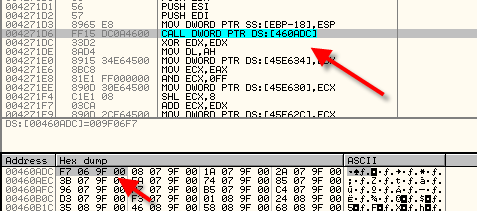
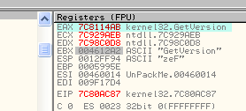
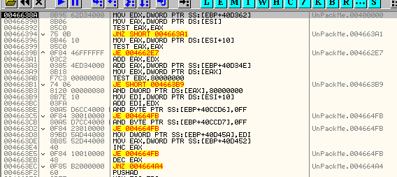
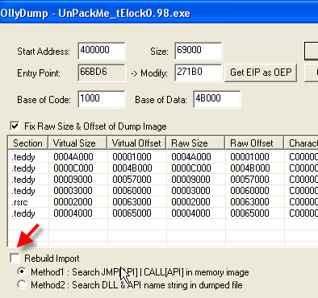

# Глава 37 - Способы восстановление переадресовочных элементов IAT

В этой части мы рассмотрим несколько методов, с помощью которых можно починить переадресовочные элементы, но наша задача не переутомиться – так как, как и в случае с нахождением OEP, методов столько же, сколько существует упаковщиков, и когда будем рассматривать какие-нибудь другие упаковщики, то там могут встречаться новые методы как для нахождения OEP, так и для починки IAT.

Эти методы являются общими концепциями, и в других упаковщиках они могут работать, а могут не работать, и тогда потребуется их скорректировать для данного случая, поэтому всегда хорошо пытаться что-то сделать и много практиковаться, делая что-то разными способами.

Так же, как и когда мы пытались найти OEP, мы будем пробовать общие методы, а затем уже рассмотрим несколько упаковщиков, под которые надо будет адаптировать данные методы или использовать что-то новое специально для этого случая и свойственные только этому упаковщику.

Ок, мы находимся на OEP telock’а [\[ссылка\]](.gitbook/assets/files/32/UnPackMe_tElock0.98.7z), и как и в предыдущей главе, тут есть переадресовочные элементы на разные секции, созданные упаковщиком во время выполнения.

Окинем IAT и её элементы, которые нужно починить, общим взглядом. На самом деле, некоторые упаковщики переадресовывают всего лишь один-два элемента, поэтому желательно знать методы, позволяющие починить конкретный элемент, который можно обнаружить в самом начале. Конечно, если таких элементов много, то вы состаритесь прежде, чем их почините данным образом, но знать, как определить, какая API-функция относится к какому элементу, необходимо, так как иногда нужно проверить сомнительный элемент.

Возьмём элемент, который мы трассировали вручную и знаем, что он в итоге приводит к GetVersion.

Здесь есть CALL, а в DUMP’е – элемент IAT 460ADC, чьё содержимое на моей машине указывает на 9F06F7. Также у нас должен быть открыт IMP REC [\[ссылка\]](.gitbook/assets/files/34/ImportReconstructor16f.7z) со всеми значениями, RVA, РАЗМЕРа и OEP, которые были найдены вручную, и если глянем на плохие элементы:

Раскрываем, чтобы увидеть эти элементы.

60ADC соответствует элементу IAT 460ADC.

Вернёмся к OllyDbg и нашему элементу, мы уже рассматривали как дойти до API-функции, трассируя в ручную, и знаем, что у OllyDbg есть встроенный трассировщик. Используем его, чтобы сделать то же самое гораздо быстрее. Конечно, здесь у нас всего 5-6 строк, которые нужно оттрасировать, но есть упаковщики, петляющие и виляющие на пути к API-функции, поэтому автоматическая трассировка бывает в таких случаях полезна.

До начала трассировки устанавливаем BP на возврат из API-функции, чтобы не случилось так, что мы ошиблись и не оттрасировали до самого конца без остановки.

В DEBUG-SET CONDITION можно выбрать опции, при которых OllyDbg остановит трассировку.

Видим окошко под названием "Условия остановки трассировки", посмотрим, что за условия и какие из них можно использовать в нашем случае.

EIP IS IN RANGE означает, что если поставить здесь галочку, OllyDbg остановится, когда EIP окажется в границах интервала значений, заданного справа, например:

Этот пример означает, что OllyDbg будет трассировать, пока не увидит, что EIP содержит значение между 401000 и 500000. Конечно, это всего лишь пример, и в нашем случае он не поможет, так как мы хотим, чтобы остановка произошла на API-функции. Для нахождения нужных нам значений, посмотрим карту памяти.

Здесь видим область, отмеченную лазурным цветом, которая может представлять для нас интерес, так как здесь остановился OllyDbg при трассировке, то есть отсюда пойдёт первая DLL. Мы не хотим останавливаться ни в секциях exe-файла, ни в секциях, созданных упаковщиком, так как это промежуточный код, и нам нужно останавливаться в DLL, поэтому отметим первый столбец и установим, что EIP должен быть между 58000000 и 7FFFFFF, то есть будет содержать адрес, максимально гарантирующий, что остановимся в какой-либо DLL (пояснение: не обязательно задавать точный адрес первой DLL, так как мы видели, что между 58000000 и 58C30000 (началом первой DLL) нет кода, так что мы там не остановимся, и во избежание необходимости задавать точные цифры можем без всяких проблем их слегка округлить).

Это всегда означает, что OllyDbg запустит построчную трассировку, и в каждой будет проверять, что выполняется указанное условие, то есть содержит ли EIP значение в пределах секции данной DLL, и если да, то остановит выполнение.

Доходим до CALL и устанавливаем на него BP.

Если до этого был установлен MEMORY BREAKPOINT, использовавшийся для нахождения OEP, то убираем его и доходим до CALL.

В случае, если нет CALL’а в начале, и не знаем, где может находиться он или JMP, можно отметить байты соответствующего элемента и установить на них MEMORY BREAKPOINT ON ACCESS, после чего нажать RUN. Остановка произойдёт, когда элемент будет прочитан, то есть сработает соответствующий JMP или CALL.

Хорошо, дошли до CALL’а с помощью любого из этих двух методов.

Входим в режим трассировки в OllyDbg.

Важно выбрать TRACE INTO, чтобы трассировать строку за строкой. Если выберем TRACE OVER, не будем входить в CALL’ы и можем потерпеть неудачу в задуманном нами.

Теперь останавливаемся на условии, установленном нами. Если глянем в нижнюю часть OllyDbg:

Остановились, так как EIP находится в диапазоне 58000000-7FFFFFFF. Давайте проверим и убедимся, что остановка не произошла из-за исключения или по какой другой причине.

Следующее, что нужно сделать – это проверить, происходит ли после выполнения API-функции возврат в основную программу на строку после CALL, так как есть упаковщики, которые для запутывания идут сначала в одну API-функцию, а продолжают выполнение другой API-функцией, и истинной целью из них является последняя, и именно ею возвращённое значение будет использоваться программой и инструкцией, идущей непосредственно за CALL’ом.

Возвращаемся в 4271DC, как и должно быть.

Ок, сейчас нам не удалось увидеть, что это за API-функция, так как OllyDbg ничего не сказал, и перво-наперво нужно проанализировать код из этой DLL.

Видим непосредственно внизу пояснение, в котором OllyDbg отображает имя API-функции, которой соответствует значение EIP.

Другая возможность оттрасировать CALL, чтобы дойти до API-функции – это:

Данный случай – это противоположность предыдущего. OllyDbg проверяет, что EIP выходит за рамки секций EXE-файла и секций, идущих до первой DLL.

Другая возможность:

В редких случаях, когда упаковщик создаёт смешанные секции внутри DLL, можно использовать комбинированный метод: сначала остановиться при нахождении RET, а затем – когда первая строка стека будет равна 4271DC, то есть возврату из API-функции. Этот метод имеет целью остановку на возврате из API-функции, и во многих случаях он эффективен для многих упаковщиков, которые эмулируют первые строки функции и прыгают на третью или четвёртую, обычно RET всегда соблюдается и остановка происходит на нужной строке. Если рестартуем OllyDbg и снова остановимся на CALL’е, то можем его быстренько опробовать.

То есть здесь нужно указать два условия за раз с помощью объединения их, используя "&&", который указывает, что оба условия должны выполняться, то есть "&&" эквивалентно "И".

В случае, если захотим остановиться на том месте, где выполняется одно из условий, используем "||", что эквивалентно "ИЛИ".

То есть

\[ESP\]==4271dc && byte \[eip\]==0C3

означает, что выполняются одновременно два условия, то есть

\[ESP\]==4271dc (первая строка стека, являющаяся точкой возврата из API-функции)

byte \[eip\]==0C3 (байт, на который указывает EIP и который запускается – RET, то есть C3)

Если от CALL запустим трассировку с данным условием, то увидим, что произойдёт остановка на RET’е API-функции.

При срабатывании обоих условий за раз, трассировка останавливается. Сейчас, находясь на RET’е, нам сложнее узнать имя выполняющейся API-функции, так как не находимся в её начале. То же самое случается, когда упаковщик имитирует две-три первые строки API-функции и находимся на 4-ой или 5-ой – тогда OllyDbg не показывает имя, но есть различные способы, чтобы его узнать.

Смотрим список того, что мы трассируем, для чего нажимаем на кнопку с тремя точками.

Видим, что первая оттрасированная строка DLL отмечена стрелкой. Имя API-функции нам не показывается, так что сделали анализ кода, а затем – двойной щелчок, отмеченный стрелкой.

Видим, что OllyDbg нам показывает содержимое регистров на этот момент. Они отображаются серым, потому что это не текущие значения. Также нам показывается информация, связанная с выполнением данной строки, среди которой есть и имя API-функции. То же самое произойдёт, если вместо трассировки будем нажимать на клавишу "минус", OllyDbg также будет показывать информацию и значения, сохранённые при проходе через каждую инструкцию.

В случае с упаковщиками, которые эмулируют две или три первые строки API-функции, и при трассировке идут на четвёртую или пятую строку, трассировщик не проходит через первую строку, так как они эмулируются упаковщиком, поэтому на это нужно обращать внимание. Перейдём к следующему методу.

В любой части после RET введём CALL (используя "Assemble" или нажав на клавишу пробела на строке), который должен вести в место, являющееся, как мы подозреваем, началом API-функции. В данном случае:

CALL 7C8114ab

Похоже на начало API-функции на моей машине, ввожу адрес:

Если это действительно начало API-функции, OllyDbg покажет нам имя, если мы ошиблись, то можем повторить:

И так делаем в области, где должно располагаться начало API-функции, пока OllyDbg нам не покажет имя API-функции. Обычно довольно легко предположить, где находится начало,

Убираем введённую нами строку с помощью UNDO SELECTION.

Ок, мы научились вручную определять имя API-функции, так что можем пойти в IMP REC, сделать двойной щелчок на неправильном элементе, который нужно починить, и ввести правильное имя.

Теперь нажмём SHOW INVALID и увидим, что указанный элемент уже отмечен как правильный, что для нас очень хорошо.

Другой способ, которым можно починить элемент – это написать в данном элементе с помощью OllyDbg правильный адрес API-функции на нашей машине.

Элемент, который мы исследуем, находится по адресу 460ADC. Перезапишем его значение найденным адресом API-функции на нашей машине (мы ранее узнали, что API-функция начинается на моей машине по адресу 7C81114AB).

Теперь видим, что элемент починен. Если сейчас очистим в IMP REC’е все элементы, нажав на кнопку CLEAR IMPORTS, а потом снова нажмём GET IMPORTS, то увидим, что элемент отмечен как правильный.

Как видим, указать правильный адрес API-функции в соответствующем элемент напрямую в IAT с помощью OllyDbg или указать имя API-функции в IMP REC’е для данного элемента – это одно и то же.

Хорошо, если проделаем это с каждым из переадресовочных элементов, а затем запустим дамп, то он будет работать, проблема в том что этот метод очень скучный, хотя и очень хорошо, для того, чтобы развеять любые сомнения, имеющиеся относительно каких-либо элементов.

В IMP REC’е есть функция для помощи фанатикам ручного метода – он позволяет сохранить таблицу с исправлениями с помощью нажатия на кнопку "SAVE TREE", а потом, если прервали работу, можем вернуться на OEP программы, открыть IMP REC, установить данные OEP, RVA и SIZE, а затем загрузить сохранённый ранее IAT, используя кнопку "LOAD TREE".

Другим возможным способом починки переадресовочных элементов является использование плагинов для IMP REC.

Скачиваем [плагин для telock](.gitbook/assets/files/37/tELock0.98b1.7z), который нужно скопировать в папку плагинов для IMP REC’а. Посмотрим, как он работает.

Копируем DLL в папку PLUGIN.

Теперь перезапускаем IMP REC, и возвратившись к вводу данных, нажимаем SHOW INVALID, делаем щелчок правой кнопкой мыши, выбираем PLUGIN TRACERS и ищем telock. После трассировки видим, что исправны все элементы, кроме четырёх, поэтому видим важность ручной трассировки, так как плагин пропустил несколько элементов, которые можно починить вручную.

Здесь видим, что IMP REC сообщает нам об оставшихся 4 элементах, которые нужно починить. Их можно оттрассировать вручную, как мы это делали в начале. Таким образом, использование плагина имеет свои ограничения, так что всё зависит от того, существует ли плагин для упаковщика, который применяется в данном случае.

Кроме плагинов у IMP REC’а есть встроенные трассировщики. Вы можете попробовать, сработают ли она, но перед этим рекомендуется сохранить результаты работы, так как в большинстве случаев их использование приводит к зависанию IMP REC’а.

Отмечаем неправильный элементы и нажимаем правую кнопку мыши. Видим три уровня трассировки и сначала попробуем, что произойдёт, если использовать первый уровень.

Неудача, пробуем с помощью остальных двух, после второго IMP REC виснет, поэтому несмотря на то, что эти методы существуют, в данном случае они не работают, а обычно приводят к зависанию. Срабатывают они только для самых простых упаковщиков.

Следующий метод – это "JMP-CALL MAGICO", который стал популярен в туториалах CRACKSLATINOS о различных упаковщиках.

Этот метод основывается на попытке найти момент, когда упаковщик сохраняет значения в IAT, и сравнить, что происходит, когда сохраняется правильное значение, и что, когда неправильное.

Используем в качестве примера элемент, которые мы исследовали ранее – GetVersion, являющийся переадресовочным или плохим. Перезапустим крэкми, упакованный telock’ом, и поищем указанный элемент в начале до запуска программы.

В DUMP’е смотрим адрес 460ADC, куда при запуске крэкми в некоторый момент до прибытия в OEP записывается плохое значение переадресовочного элемента, которое на моей машине равно 9F06F7, и это означает, что в этот момент упаковщик записывает данное значение в элемент.

Для того, чтобы перехватить момент, в который происходит запись данного значения, обычно вначале на элемент устанавливается HARDWARE BPX ON WRITE, но так как этот упаковщик обнаруживает HARDWARE BPX, устанавливаем MEMORY BREAKPOINT ON WRITE

.

Нажав RUN, видим, что в первый раз MEMORY BREAKPOINT срабатывает здесь:

Видим, что это не то место, которое мы ищем, потому при выполнении строки с помощью F8 плохое значение не сохраняется в элементе, так что жмём RUN снова.

В следующий раз останавливаемся здесь:

Видим, что здесь также не происходит сохранение плохого значения, опять жмём RUN.

Следующее место также не содержит нужного нам.

Продолжаем искать, где сохраняется плохое значение, и видим, что проходимые нами места его не содержат.

При проходе через "REP MOVS, IAT" IAT содержит эти значения, но плохого среди них нет, нажимаем RUN и продолжаем.

Когда прибываем сюда, видим, что ECX содержит плохое значение, которое сохраняется в элемент.

ECX равен 9F06F7, и это значение сохраняется по адресу, содержащемуся в EAX, то есть в 460ADC, в исследуемый нами элемент, и это и есть место, которое мы хотели найти.

Видим, что при нажатии на F8 сохраняется плохое значение. Это первый шаг, который мы должны были сделать при использовании этого метода, а теперь нам предстоит куда более трудоёмка часть – найти волшебный переход.

Как видим, дойдя до данного JE, чуть ниже в регистрах отображается имя API-функции (GetVersion), которая отвечает за данный элемент, загруженный плохим значением.

Далее видим, что дошли до вызова GetProcAddress для нахождения адреса GetVersion на моей машен, так как параметры следующие:

Заходим в API-функцию, чтобы посмотреть параметры, хотя это не обходимо. Проходим CALL с помощью F8.

А в EAX нам возвращается адрес GetVestion на нашей машине. Продолжаем трассировку.

Мы у перехода. Посмотрим, куда он ведёт без трассировки. Нажимаем кнопку мыши и FOLLOW.

Видим, что здесь сохраняется адрес, но не в IAT, а в другое место, так как EDI равен:

После сохранения данных значений идёт следующий JMP:

Который нас возвращает в начало процесса.

Смотрим с помощью FOLLOW, куда мы придём.

Здесь чётко видно, что EAX на второй строке потеряет правильный адрес API-функции на моей машине, и начнётся повторение цикла для следующего элемента, который должен быть неподалёку. Мы можем сконцентрироваться на тех плохих элементах, у которых есть условные переходы, чтобы сравнить их после трассировки с хорошими элементами.

Много раз я составлял себе табличку, которая сильно мне помогала, и где я отмечаль, что в данном чикле происходит с такими переходами у хороших элементов и что у плохих.

**ДЛЯ ПЛОХИХ ЭЛЕМЕНТОВ (помещаю изображения всех переходов по мере их появления в трассировка вплоть до момента, когда происходит сохранение значения)**

Это миницикл сразу после выхода из него:

Здесь доходим до GetProcAddress, а затем делаем переход туда, где он сохраняется.

Здесь он сохраняется, и это полная трассировка для плохих элементов с рассмотрением того, как работают условные переходы в данном случае. Теперь идём в OEP и ищем хороший элемент для того, чтобы повторить процесс, сравнить и найти отличия.

Идём в OEP.

В качестве хорошего элемента выбираем 460BAC, теперь повторяем тот же процесс, что и с плохим.

Рестартуем и ищем элемент до запуска самой программы.

Теперь устанавливаем MEMORY BREAKPOINT ON WRITE, чтобы попытаться перехватить момент, в который упаковщик сохрняет хороший элемент.

Видим, что EAX содержит значение возможной API-функции, хотя её имя нам сообщается, однако если посмотрим с помощью GOTO EXPRESSION-EAX.

Видим, что мы прибыли сюда, и по возвращению к волшебному коду появляется имя функции, хе-хе.

Теперь сделаем ту же процедуру, что проделали с плохим элементом, ожидаем, что всё будет идти в том же порядке.

**ДЛЯ ХОРОШИХ ЭЛЕМЕНТОВ**

Доходим до начала цикла и начинаем трассировку.

Этот переход такой же как и в плохом элементе.

В плохих элементах перехода не происходило, но переход очень маленький, не думаю, что он решающий.

Этот переход не равен тому, что в плохом элементе.

Здесь видим значительное отличие: этот переход в плохих элементах не срабатывает, а здесь – да, и видим, что перепрыгиваемый код велик по объёму.

Здесь видим, что переход достаточно велик, что может приводить к значительной разнице в обработке элемента в зависимости от того, является ли он хорошим или плохим, то есть если всё идёт, как мы считаем, то это может быть волшебный переход, который решает, будет ли элемент сохранён как хороший или плохой. Это значит, что для сохранения элемент как правильный, переход должен сработать, так что в данном случае есть значительная вероятность, что будет сделан прыжок.

Но этот переход не встречается в начале программы, поэтому мы должны быть очень внимательны, если рестартуем OllyDbg и будем искать этот переход.

Видим, что в начале идёт чистый мусор, так что упаковщик создаёт этот переход гораздо позже.

Дело в том, что так как останавливаемся здесь, HBP использовать нельзя, а BP будет обнаружен, так что нам нужно напрячь воображение.

Устанавливаем BPM ON WRITE, который охватывает весь IAT, чтобы остановиться, когда туда будет записано первое значение.

IAT начинается в 460818, а заканчивается в 460F28. Охватываем всю эту область с помощью BPM ON WRITE.

Весь IAT охвачен BPM ON WRITE, теперь продолжаем, пока не будет сохранено первое значение.

На STOS’ах останавливаемся множество раз, так как BPM охватывает весь IAT, так что сейчас мы узнаем, виден ли уже в этот момент возможный волшебный переход.

Так, он есть, мы проходим через него, и если заменить на JMP, снимем BPM и пойдём в OEP:

Есть две возможности: упаковщик обнаружит изменения и прекратит выполнение, или всё пройдёт нормально и мы окажемся в OEP, так что делаем RUN.

Прибываем в OEP, смотрим IAT:

Все значения верны, хе-хе, наша IAT починена, теперь делаем дамп.

Снимаем галочку с REBUILD IMPORT.

И дампим. Потом открываем IMP REc и снова устанавливаем значения RVA, SIZE и OEP.

Видим, что сейчас всё в порядке, волшебный переход сделал своё волшебство, хе-хе.

Теперь чиним дамп, нажимая FIX DUMP.

Сохраняем его как dumped\_.exe и запускаем, чтобы убедиться, что он работает.

Работает прекрасно, хе-хе.

Отлично, мы рассмотрели метод для нахождения волшебного перехода, который всегда различается у разных упаковщиков, но сравнив, что происходит при заполнении хороших и плохих элементов, всегда можем легко найти решение. В главе 38 мы продолжим рассмотрение упаковщиков.

\[C\] Рикардо Нарваха, пер. Aquila
