# Глава 38 - Распаковка Yoda's Protector v1.3 (Yoda's Crypter)

В предыдущей главе мы рассмотрели одну из программ с переадресовочными элементами и как её починить, а теперь продолжаем, плавно повышая уровень сложность упаковщиков, сопровождая это практическими упражнениями.

У нас есть распакуй-меня ***\[[ссылка](files/38/UnPackMe_YodasCrypter1.3.e.7z)\]***, упакованная Yoda Crypter 1.3, на котором мы будем практиковаться, разумеется, OllyDbg должен быть с установленными плагинами, необходимыми для борьбы с обнаружением и антиотладкой.

Находимся в точке входа.

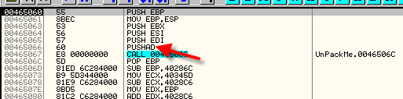

Сработает ли PUSHAD? Попробуем этот метод. С помощью трассировки идём досюда и проходим PUSHAD с помощью F7.

Делаем ESP-FOLLOW IN DUMP, а затем отмечаем первые 4 байта как в прошлые разы и устанавливаем HARDWARE BPX ON ACCESS.

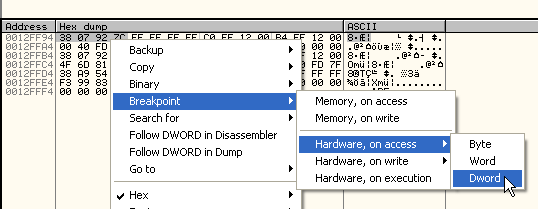

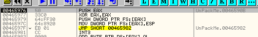

Видим процедуру, создающую обработчик исключений, а затем как совершается переход с помощью JMP в область, заполненную нулями, чтобы вызвать ошибку, так что если оттрассируем и дойдём до JMP:

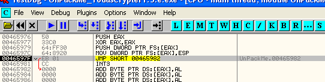

Здесь мы перейдём на ошибку, посмотрим, куда перейдём в обработчике исключений.

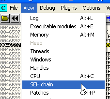

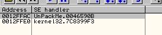

Тот, что в 46590B не сильно усложняет жизнь и приведёт в OEP, здесь мы можем установить BPM ON ACCESS на первую секцию и при проходе через исключение окажемся в OEP.

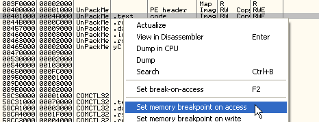

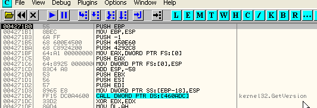

OEP равна 4271B0, так как запакован тот же самый крэкми, хе-хе.

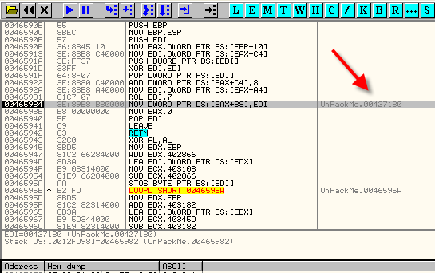

Те, кто хочет лучше исследовать этот вопрос, могут посмотреть, как обработчик исключений манипулирует контекстом для изменения EIP. Адрес исключения (т.е. где происходит исключение), обычно равный 465982, перезаписывается адрес OEP (т.е. 4271B0) для того, чтобы вернуться из исключения напрямую в OEP, хотя сейчас это не так важно. Выходим, отметив на будущее, что происходит со структурой CONTEXT.

Ок, вопрос заключается в том, находимся ли мы уже в OEP, делаем дамп.

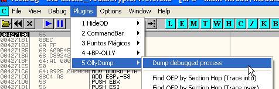

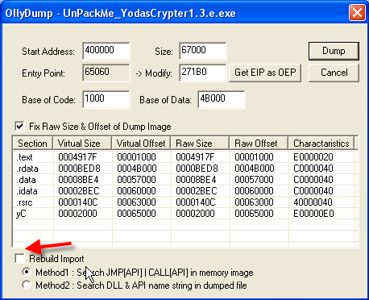

Снимаем галочку, так как не собираемся чинить IAT и делаем дамп.

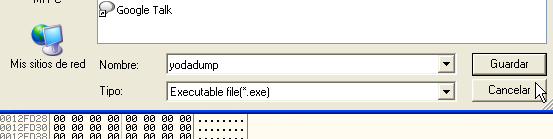

Конечно, если запустить yodadump.exe, то нам отобразится ошибка. Нам очень повезёт, если она запустится хотя бы на нашей машине, но мы уже видели, что в IAT’е есть переадресовочные элементы, которые точно не сработают при попытке получить доступ к этим несуществующим адресам через дамп.

Ладно, начнём анализировать IAT, ищем вызов API-функции, это будет GetVersion, как обычно, хе-хе.

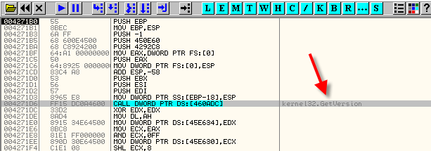

Итак, видим, что указанный вызов имеет значение 460ADC, и для того, что увидеть, куда он переходит, то есть какой элемент IAT ему соответствует, идём в DUMP.

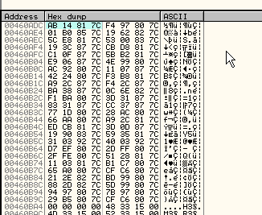

Так, эта часть IAT выглядит как правильная, так как если посмотрим на карту памяти, куда ведут элементы, они все относятся к 7C8XXXXX или нулям, и эти адреса располагаются в секции кода kernel32.dll, то есть данные элементы являются правильными.

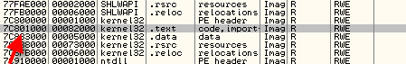

Однако если поищем ссылки на какой-нибудь из них наугад – щелчок правой кнопкой мыши – FIND REFERENCES – и вот ссылки:

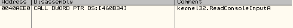

Если продолжим спускаться до разделения:

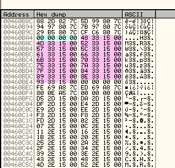

Видим, что следующая группа ведёт в область памяти 15XXXX, посмотрим, что там:

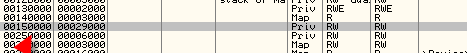

Видим секцию, которая не в DLL, так что она точно создана упаковщиком. Перезапустим распакуй-меня, чтобы проверить это.

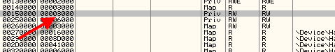

Видим, что есть секция, созданная системой, размером в 3000 байтов, но та, которую использует упаковщик гораздо больше и равна 29000 байта, так что упаковщик увеличил эту секцию для собственного использования.

Поэтому это элементы, переадресующие упаковщиком в данную секцию, посмотрим один из них, что он из себя представляет и как с ним работать.

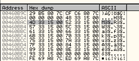

Возьмём один из них, например этот, и поищем ссылки на него. Щелчок правой кнопкой мыши и FIND REFERENCES.

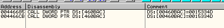

Есть два вызова, которые принимают значение данного элемента, посмотрим первый, делаем двойной щелчок на нём и попадаем в то место в листинге, где находится этот вызов.

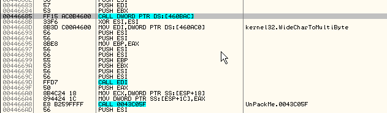

Видим вызов, делаем щелчок правой кнопкой мыши, а затем выбираем FOLLOW, чтобы увидеть, что происходит в переадресовочной секции.

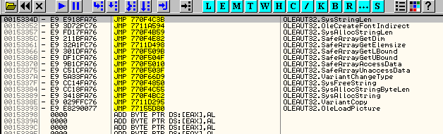

Видим, что без особых заморочек напрямую прыгаем на API-функцию SysStringLen, поэтому если будем трассировать вручную, то уже знаем, что это правильная функция для данного элемента.

Видим, что переадресация очень простая, сможет ли IMP REC починить её с помощью своих трассировщиков, чтобы не надо было искать волшебный переход?

Открываем IMP REC ***\[[ссылка](files/34/ImportReconstructor16f.7z)\]***.

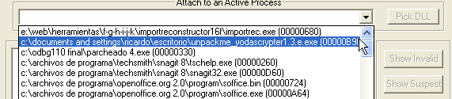

Вот процесс, остановленный на OEP; выбираем его в выпадающем меню.

Не забываем, что нужно задать IMP REC’у три значения: OEP, НАЧАЛО IAT и РАЗМЕР.

OEP=4271B0, из чего вычитаем базу образа, остаётся **271B0**.

Начало IAT, если спустимся ниже:

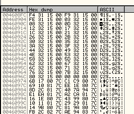

Видим, что элементы IAT ведут или в секции кода DLL или в секцию 15XXXX.

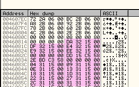

Смотрим до тех пор, пока схема повторяется. Если выше поискать ссылки на предмет, есть ли в IAT ещё элементы, ничего не находим.

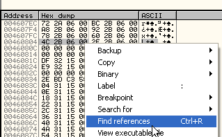

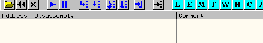

Поэтому первый элемент IAT – это 460818, для IMP REC’а RVA=60818, если отнять базу образа.

Конец IAT находим таким же образом, спускаемся ниже, чтобы найти, где кончается закономерность, проявляющаяся в том, что элементы ведут или в секции кода DLL или в секцию 15XXXX.

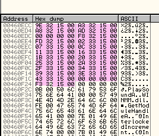

Здесь видим последний элементы IAT, находящийся по адресу 460f24, и если ниже поищем ссылки, то не найдём ни для какого элемента, так что в качестве конца IAT задаём 460F28. Теперь нужно найти её размер.

РАЗМЕР = КОНЕЦ - НАЧАЛО = 460f28 - 460818 = 710

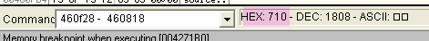

Так что задаём:

OEP=271B0

RVA или НАЧАЛО=60818

SIZE или РАЗМЕР=710

Забиваем эти значения в IMP REC.

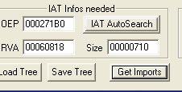

По нажатию на GET IMPORTS:

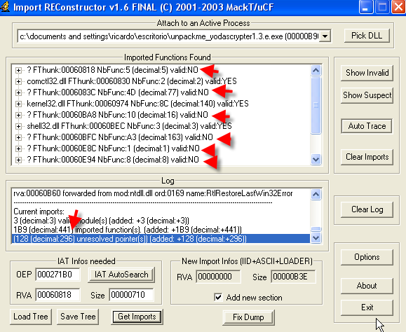

Видим, что есть 296 необработанных элементов, получится ли исправить их с помощью одного из встроенных трассировщиков?

Если нажмём на кнопку AUTO TRACE, программа повиснет. Пробуем с другими трассировщиками. Нажимаем SHOW INVALIDS и на отмеченных элементах делаем щелчок правой кнопкой мыши и выбираем "TRACE LEVEL 1".

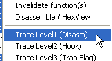

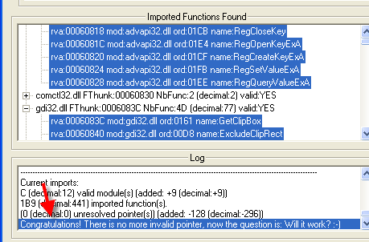

Говорит, что всё исправлено и неправильных элементов больше нет, поверим ему? Хе-хе. Если снова нажмём "SHOW INVALID", то увидим, что всё помечено как YES.

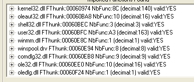

Пробуем починить yodadump.exe, нажимаем "FIX DUMP".

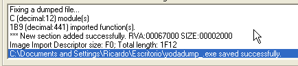

Думаю, что yodadump\_.exe починен, попробуем запустить его.

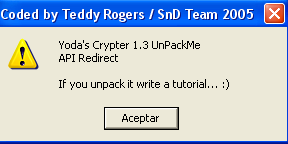

Хе-хе, в этот раз IMP REC показал себя и сэкономил мне много времени и сил.

А теперь слегка напряжёмся и посмотрим, есть ли волшебный переход у этого упаковщика?

Ищем плохой элемент IAT остановленной на OEP программы.

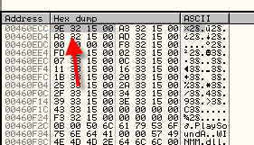

Устанавливаем на него HARDWARE BPX ON WRITE до рестарта программы, так как HBP остаются даже после этого, и как мы уже видели при использовании метода PUSHAD, упаковщик не реагирует на этот вид остановов.

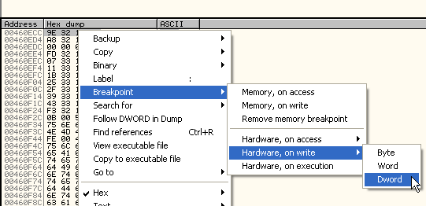

Очевидно, что метод заключается в том, чтобы остановиться, когда в элемент сохраняется плохое значение 15XXXX. Делаем рестарт и нажимаем RUN.

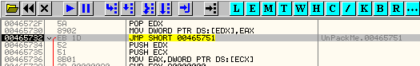

Останавливаемся здесь и сохраняем хорошее значение в элемент IAT. Видим, что EAX содержит значение API-функции.

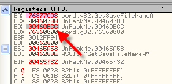

И значение сохраняется в элемент, на который указывает EDX, и это значит, что в данном случае сначала сохраняется хорошее значение, а потом меняется на плохое. Продолжает трассировать, чтобы увидеть, где это происходит.

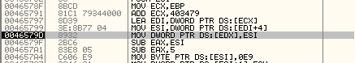

Видим, что всего лишь несколькими строками ниже ESI принимает плохое значение, и готовится к загрузке его в элемент.

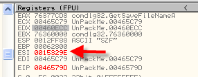

Это означает, что хорошие элементы получают значение только в первый раз, но не во второй, когда элемент перезаписывается плохим значением.

Повторяем процесс с хорошим элементом, связанным с GetVersion и находящимся несколько строки ниже OEP. Используем его и установим HBP ON WRITE.

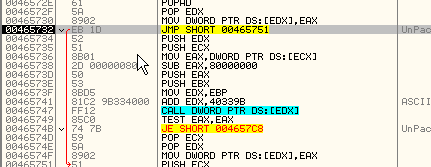

Останавливаемся здесь при сохранении правильного адреса, находящегося в EAX.

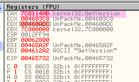

Немного потрассируем.

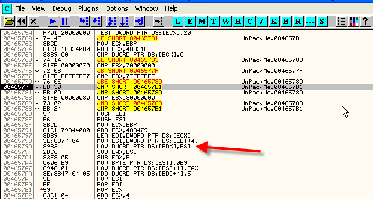

Видим, что оказались на JMP, который перепрыгивает через отмеченную красной стрелкой область, где содержимое элемента меняется на плохое значение, так что суть заключается в том, срабатывает или нет этот JMP или нет, предыдущие переходы, избегавшие этого JMP и есть волшебные переходы, посмотрим, были ли до JMP какие-то условные переходы.

Мы также можем попытаться забить NOP’ами строку, где сохраняется плохое значение, так чтобы этого не происходило, и это будет нормальным решением, попробуем, сработает ли это.

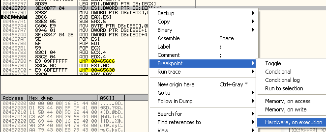

Отмечаем строку, где сохраняется плохое значение, и устанавливаем HBP ON EXECUTION, рестартуем и останавливаемся здесь в первый раз. Установили HBP на предыдущую строку, так как нам не нужно, чтобы плохое значение сохранилось.

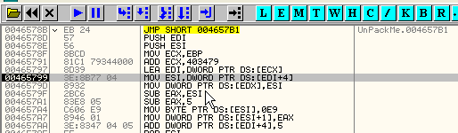

Остановились тут, попробуем забить NOP’ами строку, где сохраняется плохое значение.

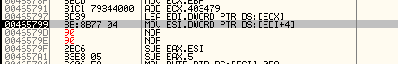

Продолжаем, чтобы узнать, определиться ли сделанная нами забивка, и оказываемся в OEP.

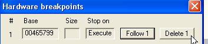

Снимаем HBP и делаем RUN.

Да, чёртов упаковщик определил, что произошли изменения и выдал ошибку, так что забивка NOP’ами не годится, продолжаем работать с волшебным переходом.

Оттрасировав какой-нибудь плохой элемент, смотрим, является ли он волшебным, т.е. избегает ли вышеуказанного JMP, чтобы оказаться в области, где происходит сохранение плохого значения, и попробуем забить его NOP’ами, хотя сомневаюсь, что упаковщик не обнаружит забивки. Пробуем.

Программа и в этом случае выдаёт нам ошибку, но уже после починки таблицы.

Видим, что IAT – правильная, так что с ней проблем нет. У нас есть две возможности. Одна – открыть другую копию крэкми в другом экземпляре OllyDbg и, ничего не меняя, остановится на OEP и скопировать правильную таблицу поверх плохой с помощью BYNARY COPY и BINARY PASTE, что проще всего. Также можно использовать напрямую этот процесс для IMP REC’а, так как хотя мы не прибыли в OEP, у нас есть правильная IAT, и это то, с чем работает IMP REC, остальное неважно, так что можем открыть процесс в IMP REC’е, установить правильные значения OEP, RVA и SIZE и нажать GET IMPORTS.

Видим, что IMP REC признал все значения правильными, и хотя остановленный процесс не служил в качестве источника для дампа, так как мы не дошли до OEP, это неважно, так как крэкми был сдамплен раньше, используя процесс, остановленный на OEP, и единственное, что в этом дампе неправильно – это IAT, которую мы можем починить, и всё будет будет работать. Нам нужно стереть предыдущий yodadump\_.exe, который уже починен, и поискать дамп yodadump.exe и нажать "Fix Dump", и он починится.

Создан новый yodadump\_.exe, смотрим, работает ли он.

Если работает нормально, то это значит, что мы теперь знаем: дамп необходимо делать из OEP, так как именно тогда вся программа уже распакована в памяти, но таблицу можно брать, когда она уже заполнена правильными значениями, хотя бы мы ещё и не были в OEP, потому что IMP REC ничего не меняет в дампе, кроме IAT, которая берётся правильная, так что дамп прекрасно работает.

В качестве упражнения прилагается файлик для распаковки ***\[[ссылка](files/38/unpackme-%20FSG%201.31%20-%20dulek.7z)\]***, он очень прост, и думаю, что вы должны с ним справиться без особого труда.

\[C\] Рикардо Нарваха, пер. Aquila
