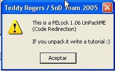
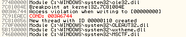
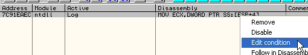

Глава 39 - Украденные байты, украденный код
===========================================

В этой и последующей главах мы будем разбирать украденные байты и скрипты для них, которые мы будем использовать для распакуй-меня, известного как UnPackMe\_PELock1.06.d.exe ***\[[ссылка](files/39/UnPackMe_PELock1.06.d.7z)\]***, в котором есть своя изюминка, и который (или вариации которого) используется в некоторых отличных туториалах.

Находимся в начале программы, открытой в OllyDbg.

Используем разновидность метода исключений, позже увидим почему, в данном случае вместо того, чтобы полагаться на лог OllyDbg, сделаем собственный лог исключений, потому что в данных упаковщиках исключения камуфлируются, так что может получиться большая путаница, ведь OllyDbg несовершенен, и со мной это уже бывало в некоторых упаковщиках, так что будем изучать следующий BP.

Этот BP будет нашим самописцем исключений. OllyDbg их тоже записывает, но когда я встречаю упаковщик с большим количеством исключений, а тем более создающий нить (а я думаю, что этот её создаёт), то, до того как оказаться в OEP, всегда полагаюсь на самописец, установленный мной, а не на встроенный OllyDbg. Дело в том, что все исключения должны проходить через место, в которое мы только что установили BP. Если посмотрим в OllyDbg:

Мы легко можем проанализировать эту процедуру следующим образом:

То есть сначала идёт место, отмеченное как "Вход" – это начало процедуры, которя обрабатывает исключения в ntdll.dll, потом вызов, помеченный как "Обработчик", переход на обработчик исключений, который мы можем увидеть с помощью VIEW-SEH CHAIN, после запуска обработчика исключений идёт возврат на эту процедура, а затем до ВОЗВРАТА ("Возврат"), где внутри этого вызова продолжается выполнение программы.

Для тех, кто начнёт трассировать, поясню, что когда выходим отсюда в программу, не можем использовать всё время трассировку, так как есть посреднические процедуры, работающие в нулевом кольце, и OLLYDBG не может их перехватить. В этом случае, если хотим остановиться в программе, нужно установить BP на обработчик, или на возврат, или BPM ON ACCESS на всю секцию, где происходит исключение, из-за чего OllyDbg, когда не сможет выполнить код, работающий в нулевом кольце, снова остановится в программе. Говорю это, потому что всегда найдётся человек, который захочет оттрассировать отсюда вглубь программы, и не сможет этого сделать, когда OllyDbg дойдёт до метса, где происходит переход в нулевом кольце.

Ок, теперь у нас есть всё, что нужно, и если нажмём RUN, то остановимся на первом исключении.

Видим в логе, что оно возникло на моей машине в 3a5c74, а сразу же после него останавливаемся на установленном нами BP, так как в настойках у нас отмечена опция DEBUGGING OPTIONS-EXCEPTIONS.

Теперь если взглянем на стек.

Видим, что несколькими строками ниже находится адрес, где произошло исключение, а точнее в \[esp+14\].

Поэтому если установим BREAKPOINT CONDITIONAL LOG вместо BP, чтобы происходило отслеживание \[ESP+14\].

Поэтому нажимаем правую кнопку мыши и изменяем установленный нами BP на CONDITIONAL LOG.

Отмечаем галочкой, чтобы всегда происходило отслеживание значения \[esp+14\] каждый раз, когда проходим эту точку, и чтобы не происходило остановки, а только запись в логе. Нажимаем RUN.

Видим, что программа запустилась. Странно, но почти ни один упаковщик не обнаруживает обычные или условные BP, установленные на KiUserExceptionDispatcher.

Смотрим, что происходит в логе.

Доходим до сюда, и OllyDbg записывает, что здесь произошло; то, что нас интересует находится немного ниже.

Видим, что последнее исключение – это ACCESS VIOLATION в 3A6744, но здесь мы не можем установить ни BP, ни HE, так как они будут обнаружены упаковщиком, и программа не запустится. Смотрим:

Возможность, которая у нас есть – это дойти до нужно места со снятой галочкой MEMORY ACCESS VIOLATION и останавливаться везде, пока не остановимся в последний раз. Хотя этот метод работает хорошо, лучше бы что-нибудь более типичное и быстрое, и что работало бы для всех типов исключений, так что поставим галочку обратно.

И без лишних страданий идём в B, где находится список точек останова, и даже мой условный BP тоже тут. Нажимаем правую кнопку мыши – EDIT CONDITION.

Всего лишь нужно добавить условие для остановки, если мы записываем \[esp+14\] и в момент, когда там содержится значение 3a7644, чтобы это была инструкция, где генерируется исключение. Тогда нам нужно записать \[esp+14\]==3a6744.

Отмечаем PAUSE PROGRAM-ON CONDITION, чтобы остановка происходила, когда выполняется заданное нами условие. Нажимаем RUN.

Здесь программа останавливается на последнем исключении, и нет нужды останавливаться на каждом из них. Кроме того, если мы захотим вернуться сюда, можем просто перезапустить распакуй-меня, снова нажать RUN и остановиться здесь. Это можно повторять столько раз, сколько нужно без необходимости подсчитывать исключения.

Конечно, если мы отсюда установим BPM ON ACCESS на первой секции, то остановимся на OEP.

Видим, что останавливаемся в первой секции на предполагаемой OEP, но что здесь точно происходит?

Здесь мы начинаем изучать тему о украденных байтах.

УКРАДЕННЫЕ БАЙТЫ – это байты программы, которые выполняются упаковщиком. Так же УКРАДЕННЫЙ КОД – это код программы, выполняемый упаковщиком.

Обычно украденные байты – это первые инструкции исходной программы, идущие с OEP, которые упаковщик стирает из первой секции и запускает в другой, собственной секции, а затем вместо того, чтобы переходить на OEP, переходит, например, на 5 или 6-ую строку, выполнив перед этим предыдущие строки в собственной секции, которая обычно идёт в исполняемом файле последней.

Для чего это делается? Если я сдамлю этот файл, починю IAT и установлю, что OEP – это 4271D6, то программа не запустится, так как отсутствуют первые строки, которые выполняются упаковщиком в собственной секции, поэтому в дампе их нет и они не выполняются

Что нужно делать?

Возможный метод – это попытаться оттрассировать процедуру упаковщика; после последнего исключения и прибытия в ФАЛЬШИВУЮ OEP трассируем и сохраняем в текстовый файл всё, что запускается, чтобы можно было проанализировать, что происходит после перехода на фальшивую OEP в 4271d6.

Поэтому мы и используем метод исключений образом, описанным выше, так как во многих случаях при трассировке с помощью OllyDbg есть столько разных возможности, галочек и опций, которые нужно попробовать, что если каждый раз для попадания в последнее исключение нужно пройти через все остальные, то можно сойти с ума, так что нам больше подходит нажатие RUN и остановка в одной, нужной нам точке на последнем исключении.

Перед рестартом программы взглянем на общую картину, что необходимо, если есть подозрение относительно украденных байтов.

Рестартуем программу.

Если посмотрим на начало стека:

На моей машине это 12FFc4, и каково ни было бы его содержание, в OEP, за исключение очень странных случаев, программа должна начинаться со стеком в 12FFc4 или рядом с ним. Сверху этого адреса находится код, который выполняется из истинной OEP, находящейся до фальшивой.

Снова глянем на фальшивую OEP:

Видим, что если бы это была настоящая OEP, стек должен был бы начинаться в 12FFC4 или рядом. Всё, что есть сверху – это инструкции, выполняющиеся из программы, несколько строк, которые упаковщик убрал из программы и перенёс в другую секцию. Запускаются инструкции, которые должны находиться до фальшивой OEP и которые были стёрты. Если запишем данный крэкми и укажем в качестве OEP 4271b0, то если посмотрим на эту область:

Видим, что упаковщик заменил исходные байты OEP и инструкций мусором, который ещё и не запустится. Если установим BPM ON ACCESS, то остановимся на первой строке исполняемого кода в этой секции, и не останавливается на этих байтах вплоть до 4271d6.

Есть много методов для поиска украденных байтов. Самым "классическим" является возврат из последнего исключения. Попробуем его, перезапустив распакуй-мена и вернувшись в последнее исключение.

То же самое было сгенерировано в 3A6744, поэтому в данном случае мне не интересен обработчик исключений, так что устанавливаем BP на возврат.

Сейчас нажимаем RUN, если кто-то хочет знать, куда вернётся программа, остановимся для установки туда BP. Посмотрим на стек.

У нас есть параметр, который нам отмечает здесь начало структуры CONTEXT; посмотрим его в DUMP’е.

Те, кто уже знаком со структурой CONTEXT, знают, что это её EIP. Также там содержатся значения остальных регистров после возврата программы из исключения. В дальнейшем мы более детально изучим структуру CONTEXT, а пока нам нужно узнать только куда происходит возврат. Так как мы не хотим усложнять себе жизнь поиском в CONTEXT’е, установим BPM ON ACCESS на секцию, где происходит исключение.

И делаем RUN. Посмотрим, остановится ли он в том же месте:

Здесь устанавливаем параметры трассировки, есть множество вариантов, так как можем задать, чтобы проверялись начальные значения регистров, и когда они все будут равны тем, чтобы были до запуска программы, то будем находится в OEP. Посмотрим как этот работает.

Первая галочка останавливает на фальшивом OEP, но с трассировкой, что может позволить мне увидеть в логе инструкции, которые запустились после попадания сюда. Вторая галочка нужна для того, чтобы остановиться в момент попадания на истинную OEP, как мы уже видели, esp в этот момент равно 12ffc4.

Отмечаем обе галочки в конфигурации, чтобы проверить, будет ли это работать так, как задумывалось, что наиболее вероятно, если нет, то можем выйти.

Также указываем, что сообщения в логе записывались в файл.

Нажимаем TRACE INTO и выскакивает окошко с условием для ESP, из-за которого приходится останавливаться много раз. Если выйти из него и продолжить делать TRACE INTO, то остановимся на фальшивой OEP, а в текстовом файле будут находиться все инструкции, которые запустились до этого. К сожалению, остановки на истинной OEP не произошло, не повезло.

Одна из вещей, которую вы можете попытаться сделать, это установить, чтобы остановка происходила на каком-нибудь PUSH EBP или POPAD, которые зачастую или находятся непосредственно в OEP в одном случае, или восстанавливают регистры в другом. Это может сработать, а может и нет, так как зачастую PUSH EBP эмулируется, но ладно, посмотрим.

Это может быть истинный OEP, продолжаем трассировать.

Конечно, настоящие инструкции не должны содержать переходы или SAL или другие мусорные инструкции.

Похоже на вторую недостающую инструкцию. Они не эмулируются, а копируются напрямую, поэтому их легко обнаружить.

И так продолжаем трассировать и копировать хорошие инструкции, которые будут запущены до попадания в фальшивую OEP.

Здесь мы доходим до фальшивой OEP, так как делается PUSH 4271D6, а это адрес фальшивой OEP, а после идёт RET, так что мы перейдём туда.

Конечно, сейчас должны быть скопированы все украденные инструкции и помещены до фальшивой OEP. Смотрим в DUMP’е.

Здесь видим область фальшивой OEP, наверху находится место, куда должны попасть украденные байты. Мы уже проверили, что они все верны, и останавливаем немногим после истинной OEP.

И теперь-то делаем двоичную копию каждой строки, которая выполнилась, и копируем в нотепад байты кроме последнего PUSH и RET, так как это переход на фальшивую OEP, а не украденные байты.

`55 8B EC 6A FF 68 60 0E 45 00 68 C8 92 42 00 64 A1 00 00 00 00 50 64 89 25 00 00 00 00 83 C4 A8 53 56 57 89 65 E8`

Это 38 украденных байтов, что в шестнадцатеричной системе равно 26-ти.

Так что отнимаем от адреса фальшивой OEP эти 26 байтов.

Теперь находим адрес, где должна была бы находиться истинная OEP.

То есть вместо 4271b0 нужно вставить найденные байты.

Отмечаем байты в нотепаде, копируем их в буфер обмена, а потом в OllyDbg делаем правой щелчок мыши и выбираем BINARY PASTE.

После это смотрим, что стало с кодом.

Стало лучше, можем сдампить и поменять OEP на 4271B0, так как мы решили проблему украденных байтов.

В следующей части мы рассмотрим скрипты, которые необходимы для починки IAT и остальное, что необходимо для победы над этим упаковщиком.

\[C\] Рикардо Нарваха, пер. Aquila
