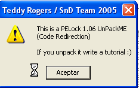

# Глава 40 - Баг обработки исключений в OllyDbg, скрипт для скрытия HBP

После того, как мы продолжили разбираться с таблицей IAT pelock’а ***\[[ссылка](.gitbook/assets/files/39/UnPackMe_PELock1.06.d.7z)\]***, а также антидамповыми приёмами, в этой части будет рассмотрено две темы: одна, которая была пропущена ранее, и другая, которая очень поможет в работе с tpelock’ом или другой похожей программой, которая снимает или обнаруживает установленные HBP.

Первая тема была затронута в главе 39, но мы не уделили ей никакого внимания. Если вы скачивали файл, прилагаемый к предыдущей главе, то там был файл leer.txt, в котором было сказано:

*Для того, чтобы решить данный туториал, нужно использовать пропатченный ollydbg (в архиве Parcheado 4.rar **\[[ссылка](.gitbook/assets/files/40/Parcheado%204.7z)\]**). Необходимо разместить его в той же папке, что и Ollydbg.exe, так как у обычного Ollydbg есть баг обработки неправильных инструкций, которые выбрасывают окошко с выбором "да или да" для установки галочки на debugging options-exceptions для выхода. "Parcheado 4" чинит этот баг. На тот момент, когда я писал главу, я забыл об этом, но Solid мне напомнил, что нельзя решить туториал из-за этой проблемы, так что используйте фикс, и не будет никакой проблемы.*

*Рикардо Нарваха*

Пробуем пропатченный Ollydbg под названием "Parcheado 4", который находится в той же папке, что и Ollydbg.exe, и используем для решения туториал по PELOCK’у.

Что я хотел объяснить, так это главную вещь, которая делает этот "parcheado 4" особенным.

Хорошо, в Ollydbg есть баг обработки исключений типа "ILLEGAL INSTRUCTION". Если в обычном Ollydbg с плагинами для его сокрытия отметим все галочки в DEBUGGING OPTIONS-EXCEPTIONS и нажмём RUN:


Получаем данную ошибку, в то время как в "parcheado 4" выполняется превосходно. Нажимаем на "Aceptar" и смотрим, что случилось в логе Ollydbg.exe.


Видим, что последнее исключение, до которого появляется окошко – это ILLEGAL INSTRUCTION. Сейчас посмотрим debugging options-exceptions, и уберём галочку с данного типа исключений.


Это и есть галочка, отвечающая за данное исключение, снимаем её, запускаем pelock и делаем RUN.


Останавливаемся на исключении, и если пройдём его с помощью SHIFT+F9, то не будет никакой проблемы и pelock запустится.

Это значит, что у Ollydbg проблема с прохождением данного исключения в автоматическом режиме.

Если просто нажать SHIFT+F9, то всё будет в порядке, но этот баг может стать проблемой, так как многие программисты генерируют 200 или 300 таких исключений, и их прохождение в ручном режиме по меньшей мере трудновыносимо.

Теперь возвращаемся, чтобы установить галочку и снова получаем сообщением об ошибке.


Как самые модные крэкеры, мы может попытаться крэкнуть сам Ollydbg, чтобы починить баг, для чего откроем второй пустой Ollydbg, с помощью которого и крэкнем остановку на сообщении с ошибкой.


В этом пустом Ollydbg выполним FILE-ATTACH, чтобы прикрепить и отладить другой Ollydbg, который остановлен на сообщении с ошибкой.


В открывшемся окне ищем процесс Ollydbg, чьё окно имеет название "Error", и прикрепляем его.


Останавливаемся здесь, делаем RUN.

Теперь смотрим карту памяти.


Конечно, жертвой является другой Ollydbg, чьи секции мы здесь и наблюдаем. Установим Bp MessageBoxA.


Установив BP на RET API-функции MessageBoxA и нажав на кнопку в окошке с сообщением, остановимся на RET при возврате из этого окошка.


Здесь видим место в программе, куда возвратились из API-функции. Нажимаем F7.


Если помните, таков был текст сообщения.

Поищем среди строк в OllyDbg.


И здесь ищем слово "bypass", которое есть в сообщении.


Видим, что это правильная строка, делаем двойной щелчок, чтобы перейти в место, где она используется в листинге.


Видим, что один из этих JNZ можно заменить на JMP и вот наша программа пропатчена, сохраняем наши изменения с помощью COPY TO EXECUTABLE и SAVE FILE.

Откроем "parcheado 4" в OllyDbg и посмотрим эту область кода:


Видим, что переходы пропатчены таким образом, чтобы перепрыгнуть через окошко, всё, что нужно сделать – это изменить последний перед выводом окошка условный переход на JMP 43528D, а если переход случиться в другом месте, то окошко будет обойдено естественным путём.

Ок, вот и весь секрет "parcheado 4", поэтому в нём нет бага с ILLEGAL INSTRUCTION как в обычном Ollydbg.exe, так что можете его пропатчить сами или использовать тот, что шёл с 39 главой.

Вторая часть этого туториала заключается в создании простого скрипта, для чего мы будем использовать OLLYSCRIPT 0.92 ***\[[ссылка](.gitbook/assets/files/40/OllyScripts092.7z)\]***, который можно найти в файлах к этой главе. Положим DLL плагина в соответствующую папку.


Теперь открываем "parcheado 4".


Видим, что наш плагин появился в соответствующем подменю.

Теперь открываем pelock, изучаемый нами. Идея в том, чтобы сделать минискрипт, который обеспечит работу HBP и не будет определяться упаковщиком.

Это будет простой скрипт. Команды можно посмотреть в README к плагину OLLYSCRIPT.

Идея следующая. Как видели в предыдущей части, каждый раз, когда останавливаемся на KiUserExceptionDispatcher, то находимся прямо перед тем местом, где операционная система доходит до обработчика исключений и где, как мы знаем, могут быть обнаружены и стёрты HBP, так что нам нужен скрипт, который каждый раз, когда программа останавливается на Bp KiUserExceptionDispatcher, стирал бы HBP, а при вызове ZwContinue восстанавливала бы его обратно.


Так как это наш первый скрипт, то не будем его усложнять. BP по адресам KiUserExceptionDispatcher и вызова, ведущего к ZwContinue, устанавим вручную, так как мы уже знаем, где они находятся. Это можно сделать без особых проблем и скриптом, но незачем слишком усложнять, так что идея заключается в том, чтобы установить BP по адресам KiUserExceptionDispatcher и вызова, ведущего к ZwContinue, вручную согласно картинке.

Теперь, установив вручную BP, начинаем скрипт, который обычно начивается с

`inicio:`

Это метка необходима, если потребуется перейти в начало скрипта, что делается с помощью команды Jmp inicio. После inicio идёт HBP, который нужно установить. Например:

`bphws 12ffc4, "r"`

bphws – это команда, которая устанавливает аппаратную точку останова по указанному адресу, в данном случае это 12ffc4, а r в кавычках означает "на доступ" или "на чтение", что одно и то же. Также есть "w" – "на запись" и "x" – "на выполнение".

```assembly
inicio:
bphws 12ffc4, "r"
trabajo:
```

После установки одной или нескольких аппаратных точек останова идёт ещё одна метка, чтобы можно было вернуться в место непосредственно после установки HBP.

```assembly
inicio:
bphws 12ffc4, "r"
trabajo:
eob pirulo
run
```

Здесь видим команду eob, которая делает то же, что происходит, когда OllyDbg обнаруживает исключение или точку останова – передаёт управление по метке, в данном случае "pirulo". Это означает, что когда программа остановится на исключении или точке останова, то скрипт продолжит своё выполнение с метки pirulo. Дальше делаем RUN с помощью команды run.

Это главная часть, где OllyDbg начинает выполнять жертву. Нам нужно подготовиться к тому, что делать, когда будет обнаружено исключение или точка останова, для чего распишем метку pirulo:

```assembly
pirulo:
cmp eip, 7c91eaec
je quitar
cmp eip, 7c91eb03
je restaurar
jmp final
```

На моей машине 7c91eaec – это адрес KiUserExceptionDispatcher, то есть когда происходит остановка на этом BP, eip моей машины будет содержать 7c91eaec, так что это инструкция гарантирует, что если мы действительно здесь, то происходит переход по метке quitar, чтобы стереть HBP.

Затем идёт другое сравнение на то, когда происходит остановка на другом BP, находящемся на CONTINUE. Когда обнаруживается, что программа остановилась на данном BP, то переходим на метку restaurar, чтобы заново установить HBP.

Дальше остаётся немного:

```assembly
quitar:
bphwc 12ffc4
jmp trabajo
```

Когда переходим на quitar, чтобы стереть HBP, то для этого используем команду bphwc, а затем переходим на метку trabajo, чтобы продолжить выполнение программы, но уже без HBP.

Другая метка служит для восстановления HBP при вызове ZwContinue.

```assembly
restaurar:
jmp inicio
 ```

Которая напрямую переходит на начало, где снова устанавливается HBP, а цикл начинается заново.

Конечно, нужно учитывать возможность остановки программы, когда OllyDbg останавливается на нашем HBP, в данном случае это последняя часть.

Как запускается eob, когда случается точка останова или исключение, так при остановке на нашем HBP будет совершён переход на pirulo, и так как нет никакого BP, который бы мы установили вручную, то управление передаётся по метке final:

```assembly
pirulo:
cmp eip, 7c91eaec
je quitar
cmp eip, 7c91eb03
je restaurar
jmp final
```

Вот что там:

```assembly
final:
MSGYN "Continuar?"
cmp $RESULT,1
je inicio
ret
```

MSGYN заставляет появиться окошко с опцией "continuar" (продолжить). Смотрим, подходит ли нам место, где мы остановились, или хотим продолжить выполнение до следующего раза. Если нажимаем "YES", то в переменную $RESULT будет помещено значение 1, а если нажмём "NO", то 0, поэтому когда хотим продолжить, то по нажатию на "YES" скрипт проверяет, равен ли $RESULT одному, и передаёт управление на начало скрипта, а если "NO", то следующей идёт инструкция ret, где выполнение скрипта завершается, и OllyDbg останавливается там, где мы хотим.

Вот полный исходный текст скрипта (не забудьте поставить вручную BP на KiUserExceptionDispatcher и CALL’е, ведущего к ZwContinue).

```assembly
inicio:
bphws 12ffc4, "r"
trabajo:
eob pirulo
run

pirulo:
cmp eip, 7c91eaec
je quitar
cmp eip, 7c91eb03
je restaurar
jmp final

quitar:
bphwc 12ffc4
jmp trabajo

restaurar:
jmp inicio

final:
MSGYN "Continuar?"
cmp $RESULT,1
je inicio
ret
```

Внизу изображена большая часть скрипта с поясняющими стрелочками, в inicio устанавливаем HB, и запускаем программу. Когда встретится BP или исключение, будет совершён переход на метку pirulo.

Переход на pirulo совершается только тогда, когда есть BP или исключение, и в этом момент нужно проверить различные возможности: является ли этот BP одним из установленных нами вручную, или это аппаратное исключение, или же какое-то другое исключение. Проверяем EIP. Можем определить, откуда произошёл переход на метку. Если это случилось из BP в KiUserExceptionDispatcher, то снимаем HBP, чтобы он не был определён обработчиком исключений, и продолжаем выполнение программы, но уже без HE.

Когда срабатывает BP, установленный на ZwContinue, снова прыгаем на метку pirulo, сравниваем EIP, и нам нужно перейти на restaurar, так как в этот момент обработчик исключений уже пройден, и можем снова установить точку останова. В случае, если сработал другой BP или остановились на HE, то переходим на final, где можем решить, хотим ли остановиться или продолжить. Если останавливаемся, то выполняется инструкция ret, если продолжаем, то совершается переход на inicio.


Попробуем скрипт в действии. Сохраняем его в текстовый файл и запускаем pelock, после чего устанавливаем вручную 2 BP и идём в меню плагина.


Видим, что остановились на HBP. Чтобы продолжить, нажимаем YES.




Видим, что программа прекрасно выполнилась и в окошке аппаратных точек останова видим:


То же самое при установке, поэтому программа выполняется с HBP и останавливается на них без каких-либо проблем, чего мы и хотели добиться.

В главе 41 мы продолжим делать скрипты и починим pelock полностью.

\[C\] Рикардо Нарваха, пер. Aquila
