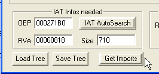

# Глава 41 - Работа с секциями, борьба с "антидампом"

Продолжаем с распаковкой pelock [\[ссылка\]](.gitbook/assets/files/39/UnPackMe_PELock1.06.d.7z), с которым мы пока не справились. Теперь начнём работать с IAT и посмотрим, существуют ли для него волшебные переходы или что-нибудь в этом роде.

Для этого снова идём OEP.

Ок, теперь идём в фальшивую OEP, ищем вызовы API-функций и с помощью клика на правую кнопку мыши смотрим SEARCH FOR-ALL INTERMODULAR CALLS.

Вот они, выбираем один и делаем двойной щелчок на нём, чтобы посмотреть листинг.

Это значит вызов API-функции принимают значение 460d38, что является адресом элемента IAT.

Вот IAT и видим, что все элементы – правильные, поднимаемся наверх, чтобы найти начало IAT.

Видим, что начало IAT находится в 460818, так как если отметим какие-нибудь элементы выше и нажмём FIND REFERENCES, то не будет найдено никаких ссылок, ведущих в секции кода DLL. К сожалению, вся IAT правильная, поэтому нам не нужно искать волшебные переходы. Ищем конец IAT.

Вот и он.

До части выделенной серым нет проблем, есть ссылки а вот элемент 460f24 сомнителен, для него нет ссылок. То, что мы отметили серым это элементы, ведущие в секцию кода ole32.dll.

Видим, что сделав щелчок правой кнопкой мыши на любом из элементов, ведущих в эту DLL, также нет ссылок, которые появляются здесь.

Если снова посмотрим на OEP, увидим, что редкий JMP, который на моей машине переходит в секцию по адресу Axxxxx, которая относится к секциям самого исполняемого файла (на вашей машине она может находиться по другому адресу). Посмотрим на карту памяти:

Видим, что программа переходит в эту секцию и что оригинальная программа, запускающаяся из OEP не может перейти в секцию, находящуюся вне exe-файла до того, как она будет создана с помощью VirtualAlloc или другой подобной функцией, поэтому делаем вывод, что эта секция была создана упаковщиком и не является часть оригинального кода программы, так же как и JMP, которые туда переходят, как, например, тот, который стоит в фальшивой OEP и многие другие.

Поэтому возможно, что в эту секцию упаковщик поместил вызовы и переходы, которые берут значения из IAT. Откроем конфигурацию OllyDbg.

Ищем только в секции, которая отображается в листинге в данный момент, поэтому так как секция, созданная упаковщиком, в листинге не видна, поиск там производиться не будет.

Пробуем искать ссылки в других секциях.

Здесь у нас одна из секций, созданных упаковщиком. Проверим, работает ли моя теория о том, что не найдём ссылки, так как вызовы протранслированы в другие секции (поэтому я упираю на то, что не нужно использовать только один метод; в данном случае, чтобы определить является ли элемент частью IAT или нет, можно или поискать в секциях, созданных упаковщиком, или посмотреть, ведут ли элементы в секцию кода какой-либо DLL через карту памяти и листинг).

Но ладно, сейчас у нас отображается одна из секций, созданных упаковщиком. Ищем в ней ссылки.

Ничего, но не падайте духом, так как у нас есть ещё секции, созданные упаковщиком, так что переходим к следующей.

Теперь ищем ссылки.

Ничего, но у нас несколько секций, и знаем, что вызов, читающий значения из элемента 460f24 будет выглядеть как:

`CALL [460f24]`

а байты, из которых состоит эта команда:

`FF 15 24 0f 46 00`

Например, если посмотрим другой вызов одной из API-функций:

Видим, что последовательность байтов вызова равна "FF 15", а затем идёт адрес элемента в обратном порядке, так что можем поискать эти байты по всей памяти и таким образом выяснить, есть ли эта ссылка где-либо, что позволить нам избежать посекционного поиска.

Идём в карту памяти и нажимаем на правую кнопку мыши.

И пишем в поле "HEX" последовательность байтов, которую мы хотим найти. Нажимаем OK и не получаем результатов (грр), но так как мы настойчивые ребята, и есть множество возможностей вызвать API-функцию, не использующие косвенные вызовы, стираем "FF 15" и ищем в памяти только адрес.

Находим что-то и как раз в одной из секций, созданных упаковщиком. Идём в листинг, чтобы посмотреть эту область.

Здесь находим эту чудесную ссылку, очевидно что мы пытались искать "FF 15" (косвенный вызов), но не "FF 25" (косвенный JMP), но ладно, проведя поиск по этому образцу мы получим ссылки на любую команду, которая вызывает API-функцию.

Таким образом, мы установили, что это элемент IAT.

И здесь IAT завершается, так как ниже, проведя поиск ссылок, я вижу, что нет значений, ведущих в секцию кода какой-либо DLL, таким образом, IAT заканчивается в 460f28.

Ок, данные из IAT равны:

РАЗМЕР = КОНЕЦ - НАЧАЛО = 460f28 - 460818 = 710

Так что у нас получается следующее:

OEP = 271B0

RVA или НАЧАЛО = 60818

SIZE или РАЗМЕР =710

Теперь видим, что IAT правильная, так что нужно снова пойти в фальшивую OEP, добавить украденные байты и сделать дамп.

Идём в фальшивую OEP.

Украденные байты равны:

`55 8B EC 6A FF 68 60 0E 45 00 68 C8 92 42 00 64 A1 00 00 00 00 50 64 89 25 00 00 00 00 83 C4 A8 53 56 57 89 65 E8`

Прикрепляем их в дампе после 4271b0, как мы это делали в главе 39.

Теперь сдампим, изменив OEP на 4271b0.

Здесь изменяем OEP, снимаем галочку с "REBUILD IMPORTS" и нажимаем "Dump", чтобы сделать дамп.

Сохраняем его как "dumpeado pelock", можем сейчас починить IAT, так как мы определили OEP. Открываем IMP REC [\[ссылка\]](.gitbook/assets/files/34/ImportReconstructor16f.7z).

Устанавливаем данные IAT, найденные нами и нажимаем GET IMPORTS.

Говорит, что "NO", но давайте вспомним, что переадресовочных элементов нет. Проблема заключается в том, что упаковщик заменил нули, отделяющие элементы друг от друга на разный мусор. Давайте посмотрим.

Здесь ясно видно, что вместо нулей, отделяющих элементы для каждой из DLL, находится мусор. IMP REC легко это исправит, нажимаем SHOW INVALID.

Вот подтверждение того, о чём мы говорили – элементы advapi32.dll и comctl32.dll отделены мусором, так что помечаем весь этот мусор, нажав SHOW INVALID, затем делаем правой кнопкой мыши выбираем CUT THUNKS, тем самым обнуляя все эти элементы.

Как видим, после обнуления мусорных элементов, IMP REC показывает, что всё правильно и таблица починена.

Теперь нажимаем FIX DUMP для того, что починить дамп.

Создаётся "dumpeado pelock\_.exe" с починенной IAT, и теперь, если запустим исправленный файл, то выдаст ошибку. Открываем его в OllyDbg без закрытия другого, который должен быть остановлен на OEP.

Так как выдал ошибку формата, передаём его [LORDPE](.gitbook/assets/files/33/LordPE-DLX%201.4actualizado.7z) с опцией REBUILDPE, чтобы починить заголовок, и теперь можем видеть в Ollydbg результаты исправлений.

Видим, что остановлен на EP в правильном виде. Смотрим IAT.

Здесь видно, что IAT была правильно починена IMP REC'ом. Видим, что он заменил мусорные значения нулями, для того, чтобы было нормальное разделение между различными DLL. Несомненно, что запустив программу тут же в OllyDbg, получим ошибку, что и происходит.

Мы дошли до следующего пункта, который необходимо изучить после починки дампа, IAT и украденных байтов. Этим трюком под названием "антидамп" пользуются многие упаковщики.

Есть много типов антидампа. Некоторые представляют собой просто проверку, совпадает ли размер программы или продолжительность секций, проверка, не добавил ли IMP REC секцию, которая всегда добавляется при починке IAT, но в данном случае антидампом являются различные секции, которые упаковщик создаёт во время выполнения и в которые перенаправляет некоторые части программы, и при распаковке этих секций нет, поэтому дамп не запускается, что ясно видно в точке входа.

Программа запускается, но когда доходит до JMP, выдаёт ошибку. Трассируем досюда.

Видим, что если нажмём F7, то перейдём на несуществующую секцию.

И не можем продолжать. Если посмотрим на исходный файл, то увидим, что JMP ведёт в область, созданную упаковщиком во время выполнения.

Делаем щелчок правой кнопкой мыши – FOLLOW, и отображается, куда ведёт JMP.

Здесь видим, что запускается CALL одной из API-функций, а потом происходит возврат в код программы. Есть много способов починить это, но наиболее простым будет добавить к дампу отсутствующую секцию и поместить её в то же место, как и в исходном файле. Идём-те глянем.

Смотрим отсутствующую секцию в исходной программе. Сначала добавим ту, из-за которой происходит ошибка в начале, потом, если будут снова ошибки, добавим другие.

Необходимо сдампить только ту секцию, из-за которой происходит ошибка, для чего используем "PUPE" [\[ссылка\]](.gitbook/assets/files/41/pupe2002.7z)

Делаем щелчок правой кнопкой мыши - CAJA DE HERRAMIENTAS.

Открываем в ней нужный процесс, идём в карту памяти, чтобы сдампить отсутствующую секцию, для этого нажимаем кнопку MAPA *("карта" по-испански – прим. пер.)*

Вспоминаем, что отсутствующая секция начиналась в A80000, так что ищем этот адрес в карте памяти PUPE.

Теперь нажимаем VOLCAR и сохраняем под именем "секция".

Теперь открываем PE EDITOR [\[ссылка\]](.gitbook/assets/files/45/PEditor1.7.7z) и добавляем её к дампу.

Ищем починенный дамп и открываем его в PE EDITOR'е.

Нажимаем кнопку "sections".

Здесь видим секции дампа, которые перешли туда из исходного файла, ещё секцию mackt, которую присоединяет IMP REC, чтобы починить IAT, теперь, наконец, добавляем отсутствующую секцию.

Делаем щелчок правой кнопкой мыши и выбираем COPY A SECTION FROM HD TO EOF (конец файла).

Теперь нам осталось только поменял VIRTUAL OFFSET на 0A80000, чтобы она запускалась отсюда, как и в исходном файле.

Меняем виртуальное смещение на 0A80000, отняв 400000, остаётся:

680000 является адресом виртуального смещения новой секции.

Теперь остаётся один шаг – снова починить заголовок с помощью LordPE, используя опцию REBUILD PE.

Запускаем и видим, что работаем, если открыть в OllyDbg.

Смотрим карту памяти.

Видим, что LordPE, чтобы сделать дамп рабочим, увеличил предыдущую секцию, чтобы не было "провалов" между ней и той, которую добили с помощью PUPE.

Если посмотрим переход, то увидим, что сейчас у нас есть ранее отсутствовавший код.

Если образ оказывается слишком велик, то можем пропатчить всё, что нам нужно, а потом упаковать с помощью UPX, который уменьшит файл, но оставит при этом работоспособным, а также может распаковать его обратно. Если запустим [GUIPEX](.gitbook/assets/files/31/GUiPeX_Setup.7z), то там есть опции упаковки и распаковки. В данном случае это не является необходимым, так как дамп после починки и с добавленными секциями занимает меньше 500k.

Другой возможностью для тех, кто хочет изучить другой способ исправления антидампа, является добавить отсутствующую секцию или секции в продолжение последней, что не слишком сильно увеличит размер exe-файла, а затем поменять OEP в дампе, сделать вставку, чтобы расположить её в позиции созданной с помощью VirtualAlloc и скопировать байты, которые мы добавили туда. Этот метод очень хорошо изложен marcian'ом в одном из последних состязаний crackslatinos.

В этом pelock'овском распакуй-меня, который похож на тот, что мы изучали, IAT является переадресовочной. Я хотел починить её скриптом, но в нашем случаен не было переадресовочной IAT, так что применим скрипт в будущем, так как есть тысячи упаковщиков, где это может понадобиться.

marciano применяет другой метод, который заключается в том, чтобы присоединить отсутствующую секцию вместо изменения Virtual Offset. Я много раз применял этот метод и он очень хорош, хотя если отсутствующих секций много, то добавлять их одну за одной несколько утомительно. С помощью метода добавления, используя LordPE, задействуется вся память между последней и добавленной секциями.

Таким образом, с помощью метода PeEditor'а первой удобно добавлять самую дальнюю секцию, так как после починки с помощью LordPE, вся память между последней секции и началом вставленной секции будет выделена без каких-либо проблем. Затем мы можем скопировать байты из исходной программы, остановленной на OEP в дамп, а затем вносить и сохранить изменения в нём, если будет отсутствовать какая-то из "серединных" секций.

Думаю, что это хорошо понятно на нашем примере. Если самая дальняя добавляемая секция начинается в 0A80000, то LordPE увеличит последнюю секцию дампа так, чтобы она заканчивалась как раз у 0A80000, поэтому если надо будет добавить секцию, находящую до этого места, можно будет легко скопировать и вставить её, а потом сохранить изменения.

ИСХОДНАЯ КАРТА ПАМЯТИ:

КАРТА ПАМЯТИ ДАМПА:

Здесь видно, какие секции исходной программы, предшествующие A80000, существуют в дампе, и для них найдётся место, так как LordPE увеличил секцию mackt до места, куда присоединили недостающую секцию. Суммарный размер затребованной памяти составил с 401000 до A80000 + 3C0000 (размер последней серции) = 0E40000.

То есть в любую секцию, которая находится между 401000 и E40000, мы, если необходимо, сможем добавить в дамп просто скопировав и вставив её из исходной программы, остановленной на OEP, сохранив затем изменения.

Рассмотрим примеры, используя оба метода, так как оба полезны, так что вам нужно прочитать оба туториала – этот и marciano, и практиковать оба, поэтому бывают случаи, когда лучше использовать один из них, а в других – другой, в зависимости от обстоятельств.

\[C\] Рикардо Нарваха, пер. Aquila
