# Глава 42 - Распаковка ACProtect v1.09 (Поиск OEP, скрытие HBP, восстановление украденных байт)

Ок, теперь мы перейдём к более сложным упаковщикам и увидим, что используемые методы могут быть очень разными, в зависимости от случая, поэтому у нас должен быть большой запас различных трюков. В этот раз нас будет занимать ACPROTECT 1.09, распакуй-меня со всякого рода защитами.

В этом распакуй-меня есть всего понемножку, поэтому пойдём медленно, анализируя каждую часть защиты.

Распакуй-меня приложен к данной статье ***\[[ссылка](.gitbook/assets/files/42/UnPackMe_ACProtect1.09g.f.7z)\]***, так что здесь нет никакой проблемы: открываем его в пропатченной OllyDbg с установленными плагинами для её скрытия.

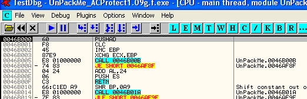

Вот он открыт в OllyDbg, и так как все защиты должны работать, проверить, запускается ли в OllyDbg до того, как мы что-нибудь сделаем с этим распакуй-меня.

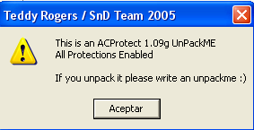

Ок, в моём parcheado4 ***\[[ссылка](.gitbook/assets/files/40/Parcheado%204.7z)\]***, который был приложен к предыдущей главе со всеми отмеченными исключениями и используя плагин HideOD 0.12 ***\[[ссылка](.gitbook/assets/files/22/hideod.7z)\]*** с конфигурацией, указанной на картинке ниже, нет никакой проблемы и всё прекрасно запускается. Вспомним, что этот упаковщик проверял с помощью API Process32Next, какие процессы открыты, и если обнаруживал, что он был открыт не с помощью двойного щелчка, то есть в отладчике или загрузчике, то не запускался, но плагин HideOD пытается защищаться от этого трюка и аннулирует антиотладку без каких-либо хлопот с нашей стороны.

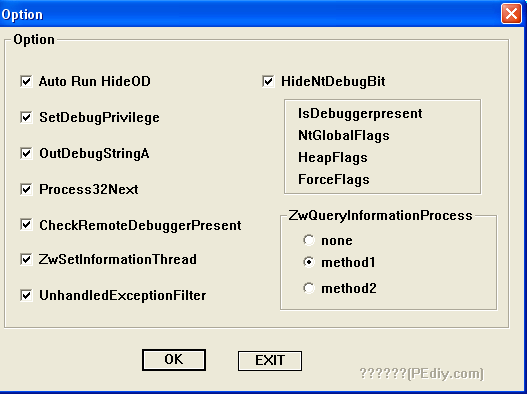

Так что нам не приходится думать об этом, поэтому можем сконцентрироваться на нахождении OEP.

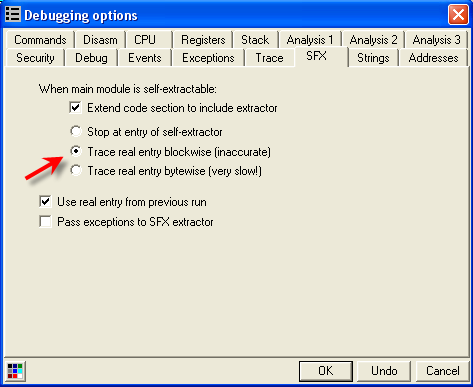

Из разных методов, которых так много используется для нахождения OEP в OllyDbg, используем встроенный поисковик OEP’ов, так что идём во вкладку SFX и устанавливаем галочку на "TRACE REAL ENTRY BLOCKWISE", нажимаем "OK" и перезапускаем OllyDbg, которая через некоторое время остановится здесь.

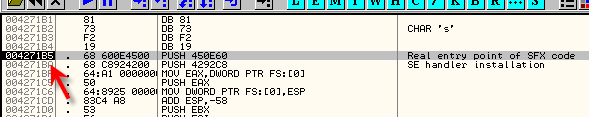

Теперь вопрос заключается в том, настоящий ли это OEP, или же это ситуация с украденными байтами.

Посмотрим в этот момент на стек.

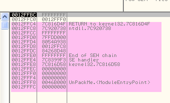

Если уберём галочку поиска OEP’а и перезапустим:

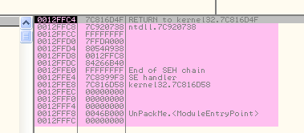

Видим, что когда произошла остановка на OEP, стек содержит на два значения больше, чем при запуске, и за исключением редких случаев – это признак украденных байтов, так что готовимся к их поиску.

Но сначала должны запустить скрипт ***\[[ссылка](.gitbook/assets/files/40/HBP%20(40).7z)\]*** для обработки аппаратных точек останова, который мы рассматривали в прошлых главах, так как из-за небольшого бага нам нужно применять его для этого и для многих других упаковщиков.

Теперь можем попробовать, так как если сейчас мы хотим остановиться на OEP, который нам уже известен, и установить на неё HBP ON EXECUTION, то видим, что не останавливаемся на нём, так как программа его дезактивировала. С использованием скрипта также не останавливается, так как здесь имеется баг.

До это ничего не указывает, где происходит ошибка, поэтому нужно разобраться как ведёт себя скрипт и как его нужно изменить.

Запускаем снова распакуй-меня в OllyDbg и устанавливаем два BP. Столько же в KiUserExceptionDispatcher, сколько в CALL’е, которые ведёт нас к ZwContinue, как это показано на изображении.

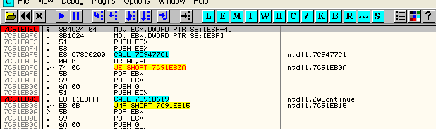

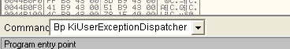

Теперь устанавливаем аппаратную точку останова на выполнение по адресу OEP, для того, чтобы попробовать, сотрётся оно или нет. Можем использовать другой адрес, но мы знаем точно, что здесь выполнение произойдёт точно, и случится это после всех манипуляций упаковщика, поэтому и используем именно этот адрес.

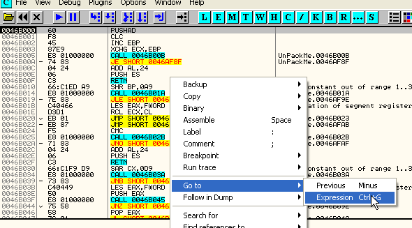

Здесь в начале выбираем "GOTO EXPRESSION" и устанавливаем адрес OEP, равный 4271B5.

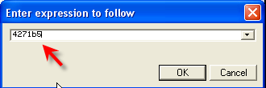

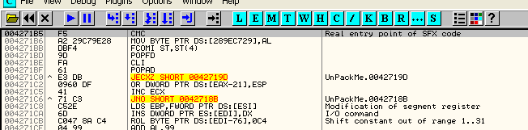

Здесь устанавливаем HBP ON EXECUTION.

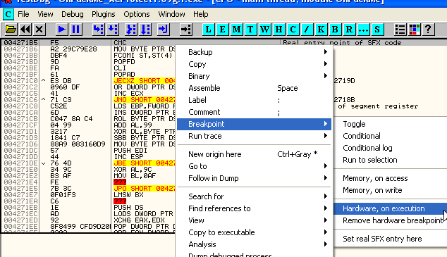

Отмечаем первую строку и устанавливаем HARDWARE BPX ON EXECUTION.

Теперь нажимаем RUN.

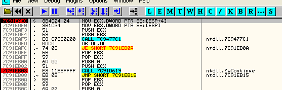

Останавливаемся на BP и смотрим стек.

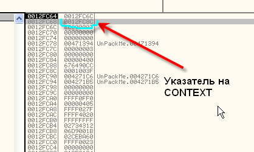

Когда останавливаемся на KiUserExceptionDispatcher, указатель на контекст находится во второй ячейке стека, смотрим контекст через дамп.

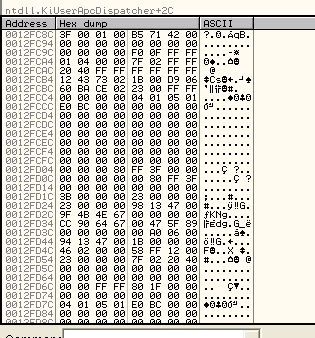

Конечно, не буду объясняет все значения структуры CONTEXT, но вот будем использовать на данный момент.

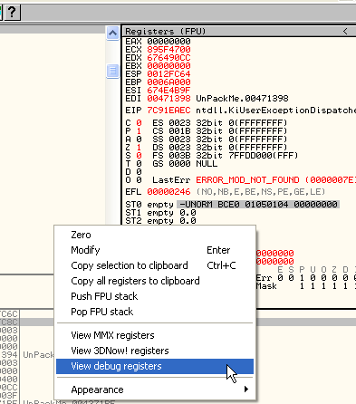

В регистрах меняем режим отображения, чтобы увидеть отладочные, если такой опции нет, значит, мы уже в правильном режиме отображения.

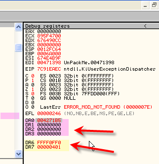

Это знаменитые отладочные регистры от DR0 до DR7. DR0 по DR3 соответствуют аппаратным точкам останова.

Когда программа останавливается на BP, то в этот момент отладочные регистры OllyDbg заполняется значениями HARDWARE BPX, которые они имеют на данный момент. Как видим, остановились на BP, и нам показываются текущие значения HBP, в DR0 находится 4271B5, что является значением установленного нами HBP, DR4 и DR5 не используются, DR6 нас пока не интересуется и DR7 указывает на тип аппаратной точки останова согласно таблице, которую мы рассмотрим позже. Важно то, что DR0 содержит значение нашего HARDWARE BPX. Теперь смотрим CONTEXT.

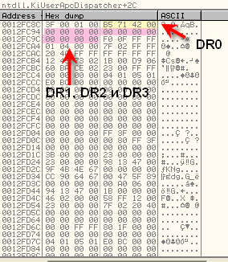

Здесь видим положение регистров DR0-DR3 в контексте. Жёлтым выделен адрес 4271B5, который соответствует установленному HBP, который сейчас активен. Другие три, выделенные розовым, равны нулю, так как мы установили только один HBP, поэтому они пусты.

То есть когда программа доходит до вышеупомянутого обработчика исключений, эти значения контекста обнуляются. Делаем RUN, чтобы оказаться в втором BP.

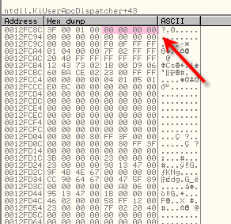

Видим, что при проходе через обработчик исключений в DR0 помещается ноль, и моя ошибка заключается в скрипте. Снова восстановим его, так как если помните, когда доходим до 2-го BP, скрипт восстанавливает их, но здесь ошибка, так как затирание DR0 – это только подготовка, установка контекста, истинное использование HBP происходит при выходе из ZwContinue и вход в RING0, до выхода из программы, то есть больше чем снова установить HBP в OLLYDBG не могу из за нуля в CONTEXT’е. При выходе из ZwContinue они будут стёрты *(короче, Нарваха превзошёл сам себя в образности мыслей, и что он хотел сказать, я не понял J – прим. пер.)*.

Тогда есть две возможности. Первая – это когда произойдёт остановка на первом BP сохранить значения, прочитанные из отладочных регистров в CONTEXT’е, а когда дойдём до второго BP, снова скопируем в контекст в Dr0…Dr3 имеющиеся у нас значения, которые будут верно восприняты при возвращении в программу.

Вторая возможность, которая пришла мне в голову, гораздо короче, но сначала надо узнать, где в CONTEXT’е находится адрес возврата в программу?

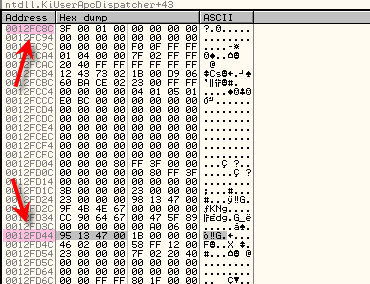

Если к адресу начала CONTEXT’а прибавим 0B8, то получим указатель на адрес возврата. На моей машине он равен:

12FC8c + 0b8 = 12FD44

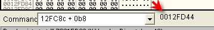

То есть 12FD44 на моей машине указывает на адрес возврата в программ. Если в скрипте установим сюда BP, когда остановимся на нём, то значит, уже произошёл возврат в программу после стирания HBP, и можно снова их установить. Смотрим, что остаётся в скрипте.

```assembly
var aux
inicio:

bphws 4271b5, "x"

trabajo:

eob pirulo
run

pirulo:
log eip
cmp eip, 7c91eaec
je quitar
cmp eip, 7c91eb03
je restaurar
cmp eip,aux
je restaurar2
jmp final

quitar:
bphwc 4271b5
jmp trabajo

restaurar:
mov aux,esp
mov aux, [aux]
add aux, 0b8
mov aux, [aux]
log aux
bp aux
jmp inicio

restaurar2:
bc aux
jmp inicio

final:
MSGYN "Continuar?"
cmp $RESULT,1
je inicio
ret
```

В начале изменяемого нами скрипта находится

```assembly
var aux
```

var – это команда для объявления переменной. Объявляем переменную aux, которую я использую для хранения и расчёта адрес возврата в программу после исключения.

```assembly
restaurar:
mov aux,esp
mov aux, [aux]
add aux,0b8
mov aux, [aux]
log aux
bp aux
jmp inicio
```

Здесь видим часть, где восстанавливаются HBPы, потом в aux помещается значение ESP.

```
mov aux,[aux]
```

Вот, что здесь происходит: так как aux указывает на ESP, содержимое которого указывает на начало структуры CONTEXT, то после этой строки в aux будет находиться адрес начала структуры CONTEXT (в моём случае это 12fc8c), затем прибавляется 0b8, в результате чего получается 12fd44, а на ваших машинах это будет значение указатель на адрес возврата. И наконец:

```assembly
mov aux, [aux]
```

Перемещаем в aux то, что там должно быть, теперь там, наконец-то, адрес последнего возврата, на следующей строке BP aux, устанавливаем BP на адресе возврата из исключения, а затем снова запускаем программу, и наконец:

```assembly
pirulo:
log eip
cmp eip, 7c91eaec
je quitar
cmp eip, 7c91eb03
je restaurar
cmp eip,aux
je restaurar2
```

После расчёта исключений, смотрим вызывается ли по адресу возврату какое-нибудь из них, о котором мы знаем, что оно находится в точке возврата.

```assembly
restaurar2:
bc aux
jmp inicio
```

Поэтому, совершив возврат в программу, с помощью команды BC стираем точку останова, которую установили в адресе возврата, а затем возвращаемся в начало, где снова устанавливаем стёртые ранее HBP и делаем RUN с ними восстановленными.

Хорошо, как видим, сделанные изменения не слишком велики. Посмотрим, работают ли они, перезапустив программу.

Редактируем скрипт, чтобы установить HBP по адресу OEP.

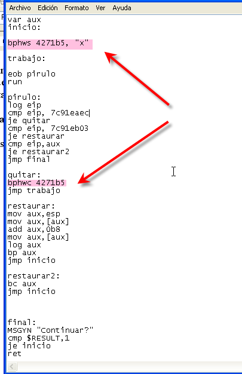

Здесь редактируем адрес HBP в запускаемом нами скрипте, устанавливаем два BP вручную, что необходимо для его работы, стираем все старые HBP, которые были.

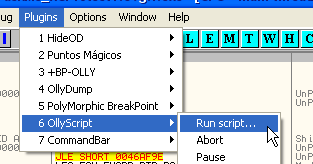

Запускаем скрипт (не забыв установить два BP и установив все галочки в разделе настроек исключений).

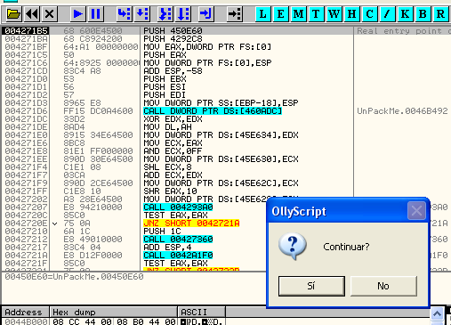

Здесь говорится, что сработал наш HBP, так как нам не нужно, чтобы скрипт продолжал работу, то нажимаем NO.

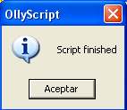

Избегаем стирания установленного нами HBP и останавливаемся на OEP, используя HBP.

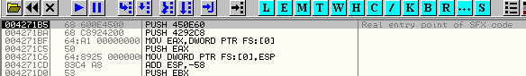

Для этих новых упаковщиков очень важно иметь какой-нибудь способ избегать стирания HBP, и этого нам удалось достичь.

Сейчас, так как можем легко управлять HBPами, переходим к украденным байтам.

Смотрим, возможно ли дойти до последнего исключение и трассировать оттуда.

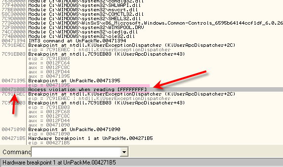

Лог показывает, что это последнее исключение до того, как прибудем в OEP, и как видим, это ACCESS VIOLATION WHEN READING. Снимаем галочку, чтобы остановиться на нём.

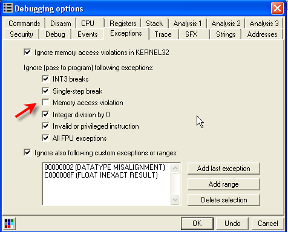

Запрещаем эти BP, чтобы использовать скрипт.

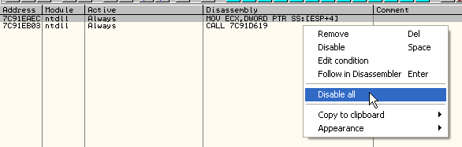

Теперь перезапускаем и делаем RUN.

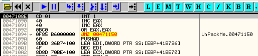

Здесь останавливаемся на последнем исключении, устанавливаем BPM ON ACCESS на секции исполняемого кода, и останавливаемся в обработчике исключений.

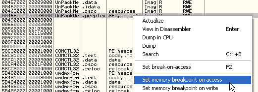

Проходим исключение с помощью SHIFT+F9.

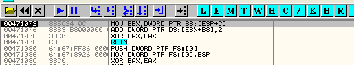

Теперь трассируем с помощью F7 строки обработчика исключений, пока не доходим до RET. Нажав на RUN, возвращаемся в программу в:

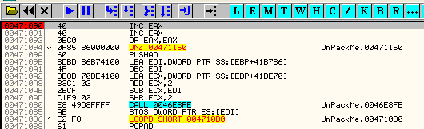

```
00471090    40    INC EAX
```

Теперь, раз уже прошли исключение, устанавливаем BP на OEP, так как распаковка уже произошла. BP послужит мне для того, чтобы остановится, когда завершим трассировку.

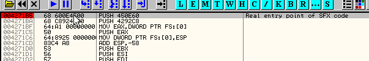

И с 471090 начинаем трассировку и видим, что она идёт довольно медленно, так как не совершается никаких переходов, и проходим инструкции одна за одной.

Здесь, наконец, останавливаемся на OEP, так что можем заглянуть в листинг txt.

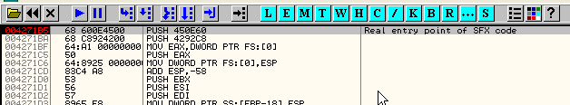

```
00485EAE Main     JL SHORT 00485ECA
00485ECA Main     POPAD            ; EAX=00000000, ECX=0012FFB0, EDX=7C91EB94, EBX=7FFDF000, ESI=FFFFFFFF
00485ECB Main     JMP SHORT 00485ECE
00485ECE Main     JMP DWORD PTR DS:[485ED4]
    Breakpoint at UnPackMe.004271B5
```

Это последние строки txt, и поищем отсюда наверх PUSH EBP, который обычно является первой инструкцией программы.

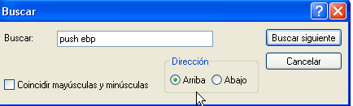

```assembly
00485AF3 Main     PUSH EBP
00485AF4 Main     MOV EBP,ESP         ; EBP=0012FFC0
00485AF6 Main     PUSH -1
00485AF8 Main     NOP
00485AF9 Main     PUSHAD
00485AFA Main     PUSHAD
00485AFB Main     CALL 00485B00
00485B00 Main     POP ESI             ; ESI=00485B00
00485B01 Main     SUB ESI,6           ; ESI=00485AFA
00485B04 Main     MOV ECX,35          ; ECX=00000035
00485B09 Main     SUB ESI,ECX         ; ESI=00485AC5
00485B0B Main     MOV EDX,E3D6D5FD    ; EDX=E3D6D5FD
00485B10 Main     SHR ECX,2           ; ECX=0000000D
00485B13 Main     SUB ECX,2           ; ECX=0000000B
00485B16 Main     CMP ECX,0
```

Здесь видим украденные байты, а за ними начинается какая-то ерунда, но до этого правильное значение регистров сохраняется с помощью PUSHAD, которые восстанавливаются с помощью POPAD прямо перед прыжком на фальшивый OEP.

```assembly
00485ECA Main     POPAD              ; EAX=00000000, ECX=0012FFB0, EDX=7C91EB94, EBX=7FFDF000, ESI=FFFFFFFF
00485ECB Main     JMP SHORT 00485ECE
00485ECE Main     JMP DWORD PTR DS:[485ED4]
     Breakpoint at UnPackMe.004271B5
```

Конечно, видим, что украденные байты совпадают со значениями, которые остались в стеке.

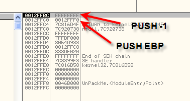

Кроме того, другой регистр, который вначале может иметь случайное значение, это EBP, чьё содержимое изменяется с помощью MOV EBP, ESP.

```assembly
00485AF3 Main     PUSH EBP
00485AF4 Main     MOV EBP,ESP   ; EBP=0012FFC0
00485AF6 Main     PUSH -1
```

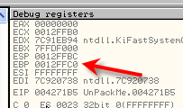

Листинг секции txt показывает нам, что EBP содержит значение 12FFC0, которое равно тому же значению, которое есть, когда выполнение доходит до фальшивого OEP. Всё, что дальше – просто трюке, чтобы сбить со следа. Видим, что после данного перехода EBP снова содержит значение 12FFC0, и это доказывает, что данные украденные байты являются правильными, а всё, что посередине, просто шелуха.

Ок, мы получили знаменитые украденные байты, изменили скрипт, и думаю, что для этой главы достаточно, поэтому продолжим в 43-ей.

\[C\] Рикардо Нарваха, пер. Aquila
