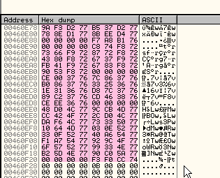

# Глава 43 - Распаковка ACProtect v1.09 (Восстановление IAT при помощи скрипта "IAT.txt")

В предыдущей части мы сосредоточились на починке украденных байт, а сейчас нашей задачей является IAT. Снова открываем распакуй-меня ***\[[ссылка](.gitbook/assets/files/42/UnPackMe_ACProtect1.09g.f.7z)\]*** в OllyDbg и доходим до фальшивой OEP с помощью скрипта.


Сейчас находимся в начале программы. Теперь, поскольку у нас есть скрипт ***\[[ссылка](.gitbook/assets/files/42/HBP%20(42).7z)\]*** для того, чтобы попасть в OEP, который остался нам с прошлой главы, устанавливаем две необходимые точки останова и используем их.


И сейчас находимся на OEP. Ниже рассмотрим, как улучшить скрипт, чтобы автоматически устанавливать две точки останова, и чтобы запрашивался адрес HBP. Пока редактировать не будем, послужит нам как есть.


Ищем вызов API-функции, для чего можем использовать SEARCH FOR INTERMODULARS CALLS.


Видим несколько вызовов API-функции, которые берут значения из IAT, и видим несколько хороших элементов, так как здесь присутствует имя API функции. Большинством же, как несложно определить, являются переадресовочными элементами и никаких имён не показывают. Берём первый из плохих, т.е. переадресовочных, делаем двойной щелчок на нём и идём в листинг.


Здесь видим вызов, который берёт значение 460e80, что является элементом IAT. Смотрим IAT в дампе.

Видим ворох элементов, которые, в данном случае, являются переадресовочными не в секцию, созданную упаковщиком. Может в ту же секцию, где исполняется сам упаковщик? Смотрим карту памяти.


Вот эта секция. Если спустимся ниже и посмотрим образ точки входа, где запускается упаковщик, то вспомним, что это был адрес 46b000, поэтому упаковщик не заморачивался сильно с созданием новой секции, чтобы скрыть в ней API-функции.

Вопрос заключается в том, что раз мы знаем, что это переадресовочные элементы, может нам повезёт, и мы найдём волшебный переход или другой способ починить IAT?


Используем указанный переход 460aDC, чтобы попытаться найти волшебный переход. Чтобы не пришлось менять скрипт из OEP, скопируем его в другую папку, переименуем его в OEP и скопируем обратно.


Таким образом, мы сохранили под именем "OEP" скрипт, который используем для нахождения OEP, а теперь можем модифицировать HBP, чтобы найти волшебный переход.

Здесь меняем HBP на плохие элементы, а затем меняем тип на W, то есть на запись или WRITE.

Теперь стираем HBP, установленные ранее, и делаем перезапуск.


Остановились тут, смотрим в DUMP плохой элемент, за которым мы будем наблюдать после того, как решим, тот ли это момент, чтобы прервать выполнение скрипта.


Вот здесь находится плохое значение, тут и происходит HBP ON WRITE. Останавливаемся на следующей инструкции после того места, где сработало исключение, так что смотрим предыдущую.


Вот эта инструкция, сохраняющая плохое значение, и видим, что EAX содержит значение, которое будет сохранено.

Проверим, происходит ли запись в переадресовочную зону, для чего нам не нужно идти до OEP, смотрим 46b492:


Видим, что переадресация довольно дурацкая – здесь помещается в стек 5bf11a9, а затем это значение XOR'ится с 793e0502. Результат этой операции становится первым значением стека, и когда доходит до выполнения RET'а, возврат произойдёт по этому адресу.

Смотрим, может ли посчитать адрес API-функции, куда, в итоге, произойдёт переход.

5bf11a9 XOR 793e0502 = 7C8114AB

Это адрес API-функции, куда ведёт переадресация. Возвращаемся обратно в OllyDbg, и смотрим, найдём ли мы здесь что-нибудь.


Если поднимемся чуть выше по стеку, то увидим там правильный адрес API-функции. Теперь нам нужно узнать, работает ли это для все переадресовочных элементов, так что останавливаем скрипт.


И смотрим, что произойдёт, если установим BPM ON WRITE на плохие элементы, которые ещё не заполнены из таблицы.


Делаем RUN и останавливаемся, чтобы остановиться на следующем элементе.


И видим, что это API-функция MulDiv. Если нас не затруднит пойти в переадресовочную область и сделать XOR, что ведёт сюда, так что мы видим возможность починки. Хорошая API-функция расположена в стеке, а точнее в \[ebp-0c\].


Видим, что когда сюда сохраняется что-нибудь хорошее, то происходит остановка в том же самом место. Посмотрим на образ IAT по состоянию на момент прибытия в OEP, и в 460ba8 находится хороший элемент.


Так что устанавливаем BPM ON WRITE на него.


Делаем RUN и останавливаемся здесь.


Видим, что это тот же адрес, где сохраняются плохие элементы. Также в случае хороших элементов смотрим \[ebp-0c\], где находится правильный адрес.


Видим, что в случае с хорошими API-функциями правильного адреса здесь не сохраняется, что очень жалко, так как иначе было бы очень легко сделать скрипт, который был смотрел значение \[esp-0c\], но решить эту проблему также легко.

Ничего сложного, сделаем скрипт, используя тот же HBP.

Что мы сделаем? Установим HBP ON EXECUTION на то место, где сохраняются значения IAT, и когда скрипт определит, что остановились здесь, проверим, содержит ли EAX хорошее значение или плохое. В последнем случае сохраним значение \[esp+0c\] в \[EDI\], которое указывает на заполняемый элемент таблицы.

Смотрим скрипт.

```assembly
var aux
var aux2

inicio:

bphws 4743d5, "x"

trabajo:

eob pirulo
run

pirulo:
log eip
cmp eip, 7c91eaec
je quitar
cmp eip, 7c91eb03
je restaurar
cmp eip, aux
je restaurar2
cmp eip, 4743d5
je reparar
jmp final

quitar:
bphwc 4743d5
jmp trabajo

restaurar:
mov aux, esp
mov aux, [aux]
add aux, 0b8
mov aux, [aux]
log aux
bp aux
jmp inicio

restaurar2:
bc aux
jmp inicio

reparar:
cmp eax, 500000
ja inicio
mov aux2, esp
sub aux2, 0c
mov aux2, [aux2]
log aux2
mov [edi], aux2
jmp inicio

final:
MSGYN "Continuar?"
cmp $RESULT, 1
je inicio
ret
```

Вот скрипт. Первое, что нужно пояснить – устанавливаем HBP ON EXECUTION на следующую инструкцию, то есть на 4743d5. Раз HBP ON EXECUTION, то остановка будет происходит точно в тот момент, когда происходит выполнение, чего не было бы с HBP ON WRITE или ON ACCESS.

Скрипт прост и основывается на том, что мы делали раньше, только устанавливаем HBP ON EXECUTION на 4743d5 – следующей строке после сохранения плохого значения.

```assembly
cmp eip, 4743d5
je reparar
```

В части pirulo, где скрипт получает контроль по нахождению исключения, добавляем к ней сравнение EIP с 4743d5, чтобы узнать, действительно ли находимся в желаемом месте, и оттуда прыгаем к reparar, где и творится магия.

```assembly
reparar:
cmp eax, 500000
ja inicio
mov aux2, esp
sub aux2, 0c
mov aux2, [aux2]
log aux2
mov [edi], aux2
jmp inicio
```

В reparar мы делаем следующее: проверяем, содержит EAX хорошее значение или плохое, и как видим, все переадресовочные значения ведут в секцию упаковщика. Его адрес меньше 500000, поэтому если видим, что EAX больше 500000, то потому что это хорошая API-функция. В этом случае мы ничего не чиним и возвращаемся в начало. В противном случае у нас плохое значение, и используем переменную aux2, чтобы найти значение ESP, от которого отнимаем 0c, а затем находим его содержимое. Его записываем в лог, а затем сохраняем в \[EDI\], который указывает на элемент, откуда загружается плохое значение на предыдущей строке программы. Вот мы и разобрались с этим, затем возвращаемся и пробуем скрипт.

Перезапускаем программу. Обращаем внимание, чтобы не было старых HBP (есть ли есть, то стираем их) и убеждаемся, что уставлены два необходимых BP для правильной работы, и запускаем.


Запускается программа, смотрим, что осталось в IAT.


Красота, хе-хе. С помощью запущенной программы с починенным IAT можем починить дамп. Уже видели, что нет необходимости останавливаться на OEP, чтобы использовать процесс в IMP REC’е, когда есть правильная таблица, так что без проблем починим дамп.

Переименовываем скрипт в IAT, и снова пробуем скрипты, теперь, когда они все разделены.


Единственное, что осталось, связанное с IAT – это найти начало и размер таблицы, которые необходимо указать в IMP REC’е.


Поднимаясь по IAT, ясно видим, что IAT начинается в 460818, конец в 460f28, и его также несложно найти:



OEP = **271b5**

НАЧАЛО = **60818**

РАЗМЕР = 460f28 - 460818 = **710**

Можем использовать фальшивый OEP, нет проблем – потом это можно исправить вручную.

Друзья, в следующей части будем решать антидампы, так что оставайтесь на связи.

\[C\] Рикардо Нарваха, пер. Aquila
