# Глава 44 - Распаковка ACProtect v1.09 (Борьба с "антидампом")

Ок, продолжаем как обычно. Мы уже нашли украденные байты, и у нас теперь есть скрипты [\[ссылка\]](.gitbook/assets/files/44/scripts%20(44).7z) для того, чтобы легко попасть в OEP и чтобы починить IAT, так что осталось сделать дамп.

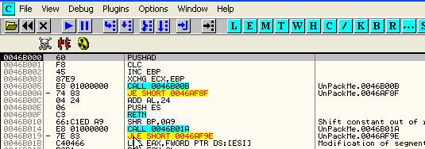

Открываем программу [\[ссылка\]](.gitbook/assets/files/42/UnPackMe_ACProtect1.09g.f.7z) в OllyDbg и устанавливаем два BP, необходимых для работы скриптов, и стираем BPX, которые могли остаться от прошлого раза.

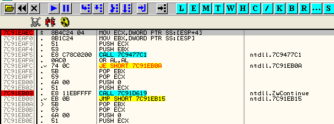

Теперь используем скрипт для OEP и тут же попадаем в него.

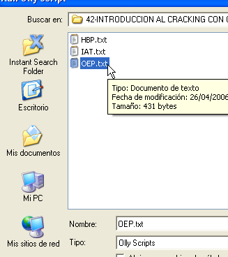

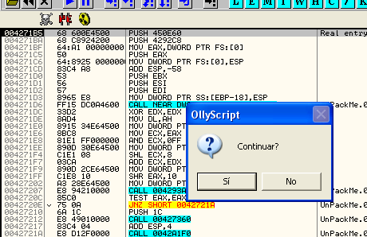

Отвечаем, что нет и находимся в OEP.

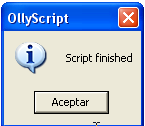

Теперь делаем дамп.

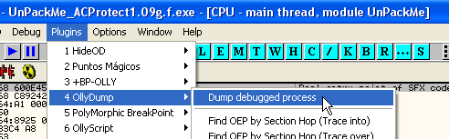

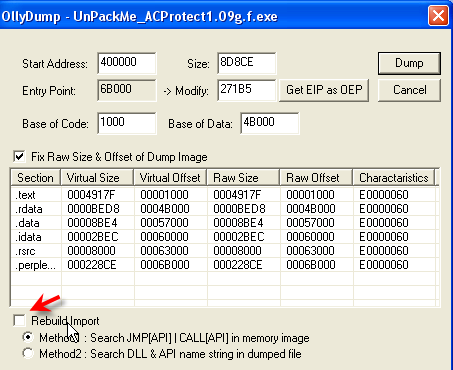

Снимаем галку и сохраняем как dumped.exe или другое имя, которое мы хотим. Теперь перезапускаем OllyDbg и используем скрипт для того, чтобы работать с починенной таблицей.

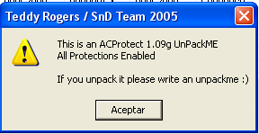

Здесь уже всё работает, так что открываем IMPORT RECONSTRUCTOR [\[ссылка\]](.gitbook/assets/files/34/ImportReconstructor16f.7z) и ищем нужный нам процесс в списке процессов в выпадающем меню.

Теперь ищем данные OEP, RVA и РАЗМЕР IAT, как мы это делали в прошлой части.

OEP=**271b5**

НАЧАЛО=**60818**

РАЗМЕР= 460f28-460818= **710**

Видим, что все API-функции правильны кроме одной. Я её пропустил?

Можем посмотреть, что случится, если бы эта ошибка не была показана. Рестартуем OllyDbg и устанавливаем на этот элемент MEMORY BREAKPOINT ON WRITE.

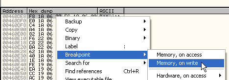

И делаем RUN, чтобы оказаться в месте, где сохраняется плохое значение.

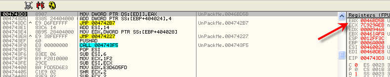

Здесь видим, что будет сохраняться значение и в ESP-0C нет никакой API-функции.

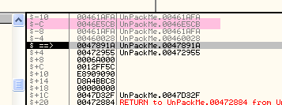

Видим, что скрипт изменил его на значение, которое в данном случае равно 46E5CB, так что видим значение, которое сохраняется в IAT без использования скрипта. Нажимаем F7.

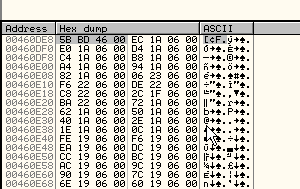

Значение, сохраняющееся без использования скрипта, будет плохим, так что смотрим, куда оно ведёт. Идём в 46BD5B.

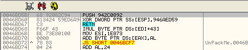

Хорошо, как видели раньше, выполняется PUSH константа, и над ней совершается XOR с другой константой, а результатом этой операции становится адрес API-функции. Считаем.

942c0892 xor 946aed59

Если нет желания использовать калькулятор, может использовать то, что OllyDbg выполнит сама эти строки и получит результат, хе-хе.

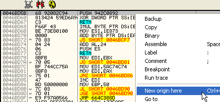

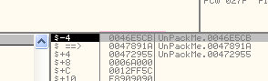

Видим, что результатом XOR является 46E5CB – это значение, которое скрипт поместит в элемент, поэтому скрипт не ошибается. Дело в том, что этот элемент особенный, так что рестартуем и прибываем в OEP, что посмотреть, найдём ли то, к чему динамически относится API-функция, то есть, откуда она запускается.

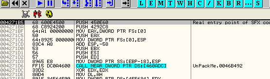

Тут оказываемся в OEP с помощью соответствующего скрипта и устанавливаем BPM ON ACCESS на элементе IAT, относительно которого хотим узнать, к какой API-функции он ведёт, для чего останавливаемся, чтобы получить к нему доступ.

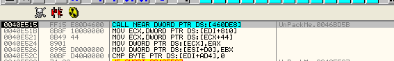

Останавливаемся, трассируем.

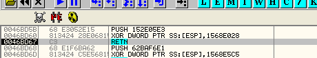

Конечно, доходим до RET и отсюда прыгаем:

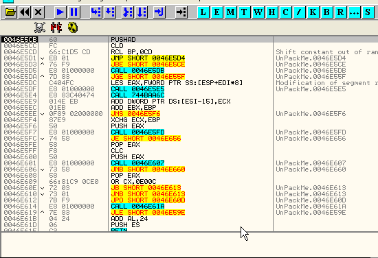

Посмотрим, ведёт ли это к какой-нибудь API-функции. Начинаем трассировать с помощью F7 и видим, что это ведёт в большой кусок кода, так что применяем метод pushad. Вот эта инструкция в начале, и останавливаемся на POPAD, до куда нужно оттрасировать некоторое количество строк.

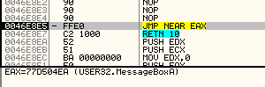

И видим, что API-функция, с которой у нас проблемы – это MessageBoxA.

Другой, более быстрый метод – это сделать RUN TRACE с условием, что необходимо остановиться, когда EIP станет, например, больше 500000, то есть когда произойдёт выход из секции в API-функцию. Смотрим:

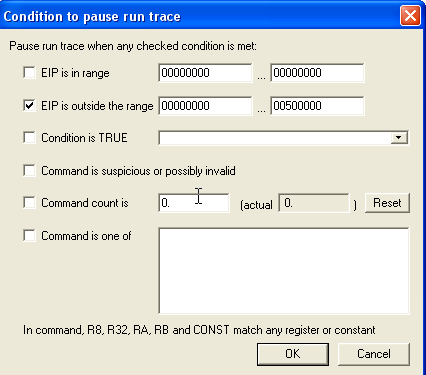

Здесь останавливаемся, когда EIP выходит за пределы 0-500000. Пробуем, сработает ли.

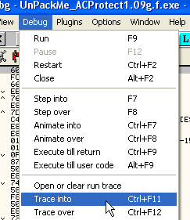

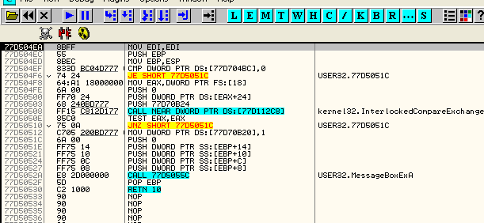

Останавливаемся прямо на API-функции MessageBoxA. Последняя проверка, чтобы убедиться, что это правильная API-функция и не фальшивка, заключается в том, чтобы возвратиться в исполняемый файл в то место, где находится продолжение вызова, из которого отправились. Это можно узнать в первой строке стека. Смотрим:

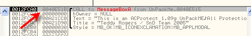

Адрес возврата – это 40E51B. Если пойдём туда:

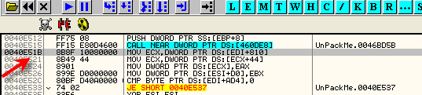

Возвращаемся прямо на следующую строку вызванного call’а, так что у нас уже есть все данные. Перезапускаем процесс с помощью скрипта для IAT и устанавливаем данные как в прошлый раз в IMP REC.

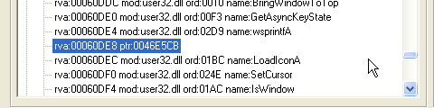

Делаем двойной щелчок по неправильному элементу и меняем его на MessageBoxA.

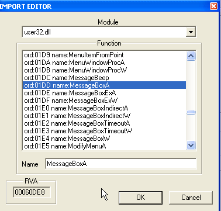

Теперь, если всё правильно, починим дамп с помощью FIX DUMP. Ищем файл дампа.

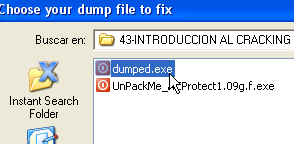

И сохраняем его как dumped\_.exe. Нам осталось исправить OEP на предмет украденных байтов, так что открываем файл в OllyDbg.

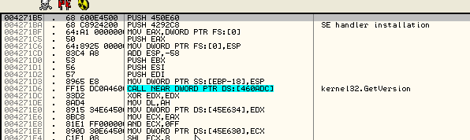

Нам нужно скопировать украденные байты и поменять OEP.

```assembly
00485AF3 Main     PUSH EBP
00485AF4 Main     MOV EBP,ESP                               ; EBP=0012FFC0
00485AF6 Main     PUSH -1
```

Вот украденные байты, которые мы можем ввести с помощью функции "Assemble".

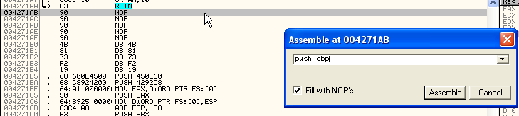

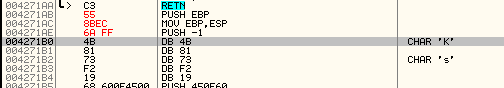

Видим введённые байты, которых ровно пять, так что теперь считаем: 4271b5 (фальшивая OEP) минус пять байт дают нам правильный OEP, то есть 4271b0.

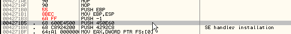

Теперь, если сохраним изменения с помощью COPY TO EXECUTABLE – SAVE FILE, мне останется поменять OEP. Перезапускаем и идём в заголовок дампа с помощью GOTO EXPRESSION 400000.

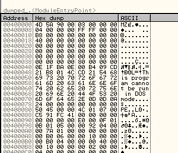

Переходим в режим SPECIAL-PE HEADER, ищем значение ADDRESS OF ENTRY POINT, меняем его и сохраняем изменения.

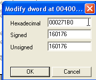

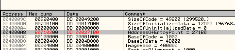

Ок, если запустим файл после починки, то будет показана ошибка. Снимаем все галочки с исключений и смотрим, какой ещё трюк был применён против нас.

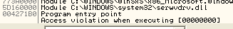

Видим в LOG’е, что произошла ошибка, смотрим CALL STACK, то есть нажимаем кнопку с буквой "K", показывающую последние исполненные call’ы (можем также посмотреть в стеке RETURN TO…).

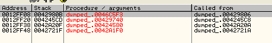

Последний CALL был выполнен из 429806, идём туда.

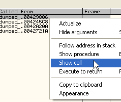

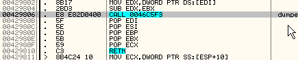

Продолжаем с помощью FOLLOW, чтобы посмотреть куда идёт CALL.

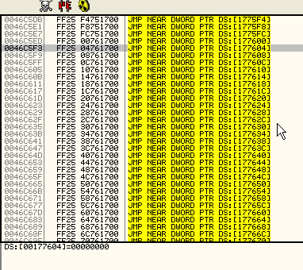

Хе-хе, таблица косвенных переходов, которая приводит к появлению ошибки, так как секции памяти, в которой находится 177658 и следующие адреса, нет в дампе и создаётся упаковщиком во время распаковки оригинального кода, так что нам осталось решить эту проблему, которая является одним из многих противоотладочных методов.

Запускаем оригинальный файл в другом OllyDbg и доходим до OEP с помощью скрипта, стирая старые HBP и устанавливая два необходимых BP.

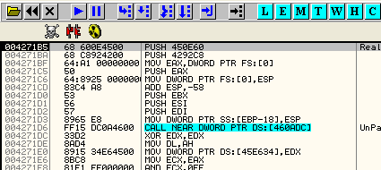

Доходим до сюда, смотрим область этих косвенных переходов.

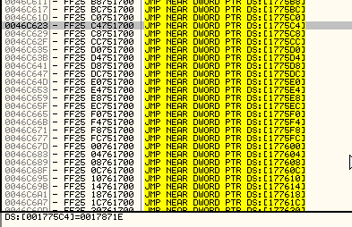

Если пойдём в DUMP, то там табличка, откуда берутся значения для перехода.

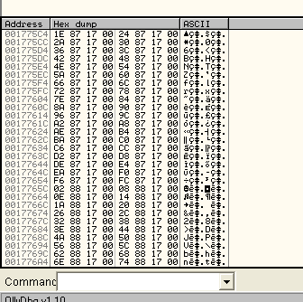

Ок, есть много способов решить эту проблему. Классический – это сделать инъекцию в то же место, где создаётся секция и скопировать все байты в вышеуказанную секцию, откуда всё сохраняется, а затем перейти на OEP, починив всё. Смотрим, сможем ли найти альтернативный метод, который были бы гораздо проще, так как описанный метод мы будем использовать часто в других упаковщиках.

Ищем первый переход в 46c0f5.

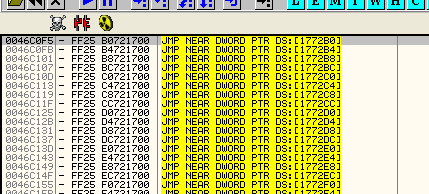

Он занимает 6 байт – инструкция JMP, ведущая в 178250, где также происходит выполнение 6 байт и возврат.

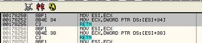

Идея заключается в том, чтобы заменить 6 байтов косвенного перехода на 6 байтов, которые действительно что-то делают.

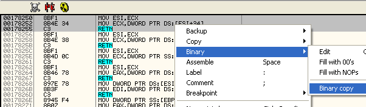

Отмечаем три строки и делаем BINARY COPY.

Возвращаемся к переходу и делаем BINARY PASTE.

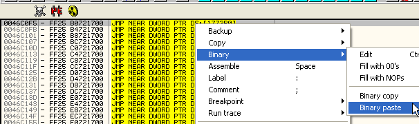

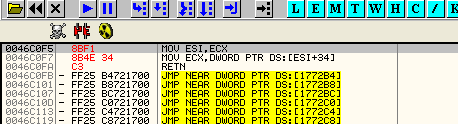

Должно работать. Эти косвенные переходы вызываются call’ами из программы, так что выполняется шесть байт, и при срабатывании RETN будет происходить возврат туда, откуда произошёл вызов.

Поскольку переходы идут друг за другом и размер выполняемых команд всегда равен шести байтам, то мы можем скопировать сюда всю секцию, чтобы заменить переходы собственно тем, что должно выполняться.

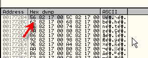

Байты начинают выполняться с 178256 – это первый элемент таблицы, а последний заканчивается в 1799ba.

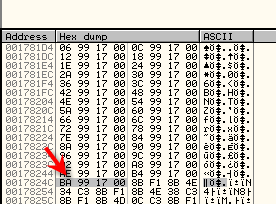

Так что копируем с помощью BINARY COPY всю область с нужными нам байтами и заменяем переходы с помощью BYNARY PASTE.


Видим, что получилось, также видим, что некоторые переходы в конце ведут к частям, у которых нет RET.


Я предположил, что эти переходы не используются, так что, по идее, проблем возникнуть не должно. Ок, починили секцию. Теперь может сделать BINARY COPY всей секции и скопировать её в файл дампа с помощью BYNARY PASTE.


Теперь сохраняем изменения в дамп с помощью COPY TO EXECUTABLE и так далее.


Чтобы сохранить их и нам не было сказано, что не можем этого сделать, делаем так: от конца секции поднимается до последней строки, где есть данные.


Отмечаем отсюда и до начала секции вверх и сохраняем изменения. Перезапускаем и пробуем.


Работает превосходно. Мы победили украденные байты, переадресовочную IAT, антидампы, и защиту против HBP.

\[C\] Рикардо Нарваха, пер. Aquila
