# Глава 45 - Распаковка ReCrypt v0.80

В этой главе мы рассмотрим распакуй-меня, сделанном с помощью упаковщика, который сложно победить в OllyDbg, так как в нём есть одна часть, которая не работает в Олли и выдаёт ошибку. Но мы всё равно будем использовать OllyDbg, несмотря ни на что. Мы могли бы использовать другой отладчик, но ведь это же "Введение в крэкинг с нуля, используя OllyDbg", хе-хе.

Так что даже с распухшими головами мы будем использовать OllyDbg вопреки всему. Распакуй-меня ***\[[ссылка](files/45/UnPackMe_ReCrypt0.80.7z)\]*** идёт вместе со статьёй, и он кажется реально противоОллиным. Запустим его без отладчика.

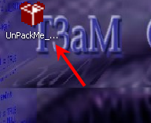

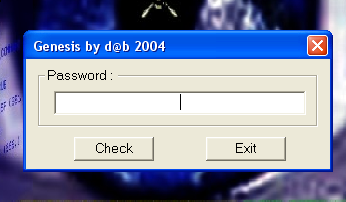

Вот в чём дело, когда он запущен, то пожирает 99% ресурсов моей машины. Давайте узнаем, делает ли он это для защиты или ещё почему.

Если хотим приаттачиться к нему, то нужно пойти в FILE-ATTACH и поискать процесс.

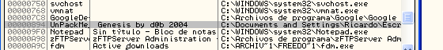

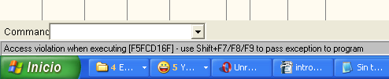

И не забудьте приаттачиться.

Если откроем в Ollydbg, пропатченной для поиска OEP, которую использовали в прошлых главах:

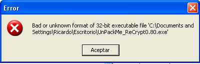

Если нажмём кнопку подтверждения:

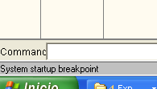

И если сделаем RUN:

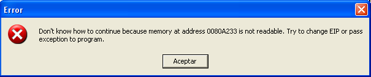

Перезапускаем и снова идём к SYSTEM STARTUP BREAKPOINT, а когда останавливаемся, то идём в окно "M".

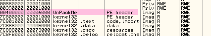

Видим, что тут есть одна секция, которая является результатом известной ошибки, когда меняется RVA и размеры в заголовке файла. Пока что установим BPM ON ACCESS на указанной секции. Помним, что эта OllyDbg – особенная, и останавливаемся только на выполнении кода, но не тогда, когда он читается или записывается.

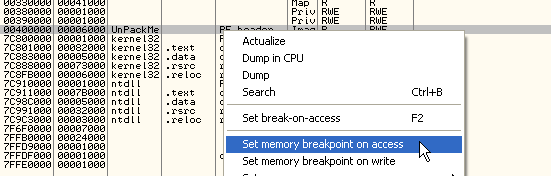

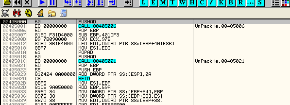

Теперь снимаем BPM и делаем RUN.

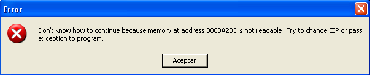

Ок, смотрим в заголовке значения RVA и размеров.

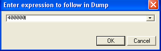

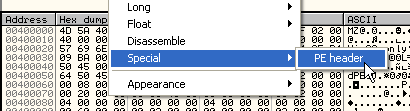

Теперь идём вниз, пока не найдём значение.

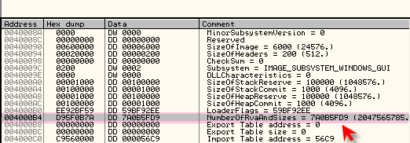

Вот это значение, которое должно быть равно 10 в шестнадцатеричной системе. Посмотрим, что будет, если мы его изменим.

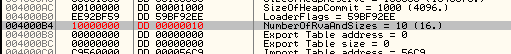

Пытаемся сохранить изменения.

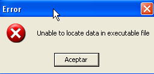

Грр… Попробуем изменить в шестнадцатеричном редакторе.

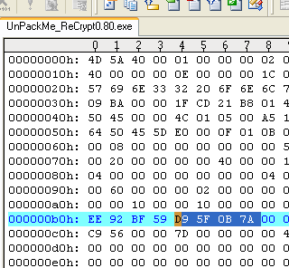

Меняем на 10.

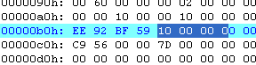

Теперь сохраняем изменения.

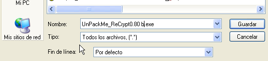

Сохраняем под другим именем.

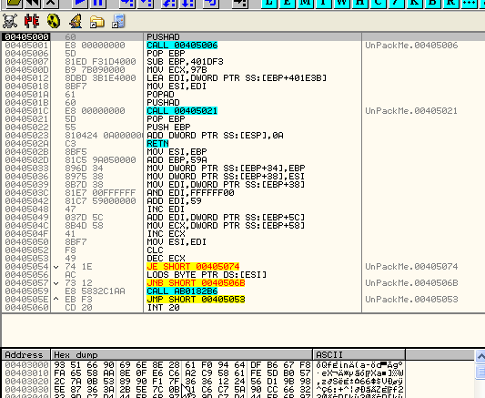

Видим, что при открытии в Ollydbg происходит остановка на точке входа (как и должно быть). Починка файла с помощью данного приёма была правильной. Теперь делаем RUN.

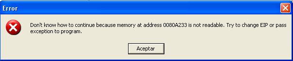

ГРРРР… Снова ошибка. Теперь, когда находимся на точке входа, изменим в памяти значения RVA и размеров на те, что были сначала. Это необходимо для правильной распаковки.

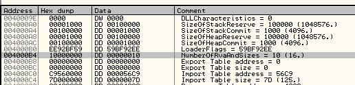

Так как мы уже находимся где нужно, установим нужное значение и проверим, сработает ли это.

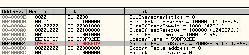

Значение установили, теперь делаем RUN.

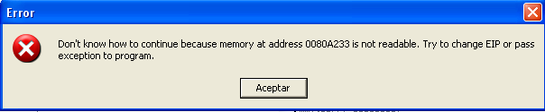

Очевидно, что какая-то часть кода не пролезает через OllyDbg, пробуем оттрассировать, но не встречаем ничего странного, доходим до точки, где совершается переход на несуществующую секцию и до свидания. В OllyDbg не выполняется.

Мы хотим во что бы то ни стало показать методы, которые обычно используются в таких случаях. Здесь нам понадобится что необычное, для этого требуется вдохновение. Отойдём ненадолго, подумаем, что можно придумать такого неожиданного.

ДУМАЕМ

ДУМАЕМ

ДУМАЕМ

хе-хе

ДУМАЕМ ЕЩЁ

Хорошо, я покажу все возможности. Следующий способ мне не помог (но вам нужно быть знакомыми с этими методами, так как часто они работают).

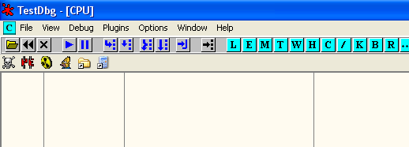

Открываем [PARCHEADO 5](files/26/olly_parcheado_para_vb.7z) и устанавливаем его как JUST IN TIME DEBUGGER, то есть когда программа вызывает ошибку, отладчик автоматом подсоединяется к ней.

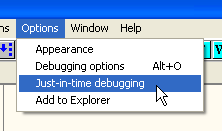

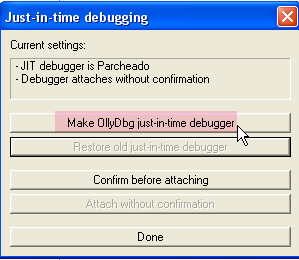

Нажимаем эту кнопку, чтобы перевести OllyDbg в режим JIT. Когда закончим работать с OllyDbg, следует восстановить старый JIT-отладчик с помощью кнопки "RESTORE OLD JUST IN TIME DEBUGGER", иначе OllyDbg будет запускаться при каждой программной ошибке, а это весьма утомительно.

Теперь закрываем PARCHEADO 5 и делаем щелчок правой кнопки на исходном файле распакуй-меня. Тот, где мы изменили RVA и другие размеры можно стереть, так как он нам не помог.

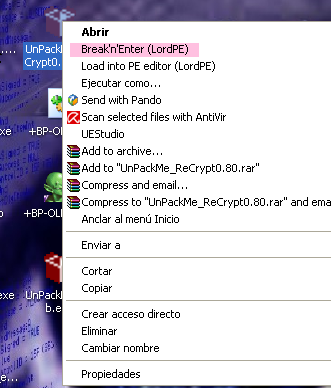

У тех из нас, кто иногда использует LORD PE DELUXE ***\[[ссылка](files/33/LordPE-DLX%201.4actualizado.7z)\]*** в системном меню правой кнопки мыши есть опция "BREAK AND ENTER", которая устанавливает INT3 на точку входа программы, что приводит к ошибке и запуска JIT-отладчика, которая присоединяется к вызвавшему ошибку процессу. Пробуем.

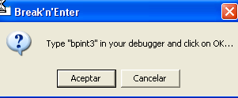

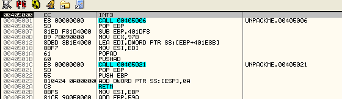

Запускается OllyDbg и присоединяется к процессу. Видим INT3, установленный LordPE. Заменяем INT3 на PUSHAD, который должен быть здесь.

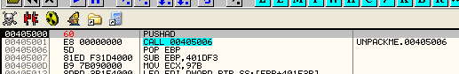

Делаем RUN.

ГРРРРР, так как немного выполняется в OllyDbg, мы должны провести трассировку построчно и выяснить, что происходит, но по-правде, у меня нет никакого желания это делать, поэтому лучше ПОДУМАТЬ, ПОДУМАТЬ, ПОДУМАТЬ, хе-хе.

Всегда будем использовать исходный файл. Откроем его в PeEditor’е ***\[[ссылка](files/45/PEditor1.7.7z)\]***.

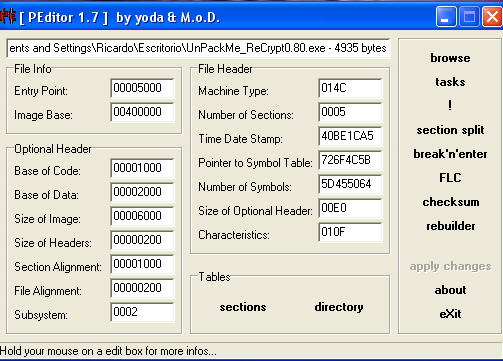

Теперь смотрим секции.

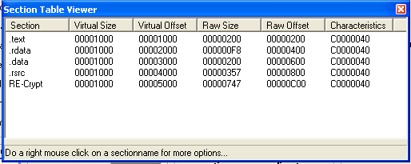

С помощью PeEditor’а можно прекрасно посмотреть все секции.

Мы ничего не знаем о программе, но очень возможно, что в ней есть функциональность большинства других упаковщиков, которые распаковываются в секцию, начинающуюся с 401000, то есть ту, которая у нас здесь идёт первой, так как здесь не показывается заголовок. Что произойдёт, если изменим параметры доступа к какой-нибудь секции, убрав право на запись, и произойдёт попытка записи сюда? Произойдёт ошибка и откроется PARCHEADO 5, который установлен как JIT-отладчик, хе-хе, так ли это? Можем попробовать это на первой секции, но думаю, что после распаковки программа сохранить API-функции из IAT, и это может быть в следующей секции, поэтому попробуем сначала с ней, а потом, если ничего не выйдет, можем попробывать с первой.

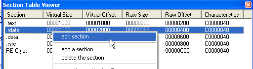

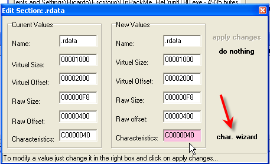

Открываем WIZARD, чтобы изменить параметры доступа к секции.

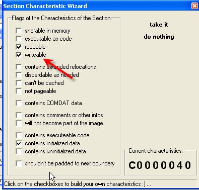

Снимаем галочку с "writeable".

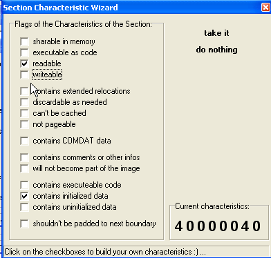

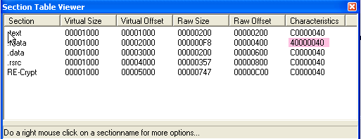

Здесь показаны изменённые параметры секции. Отметим, что автор может оказаться куда умнее меня и несмотря на начальное состояние секции менять права доступа к ней на желаемые во время выполнения с помощью API-функции VirtualProtect, но ладно, смотрим.

Запускается этот распакуй-меня, у которого мы изменили права доступа, после чего появляется пропатченный OllyDbg, установленный как JIT-отладчик.

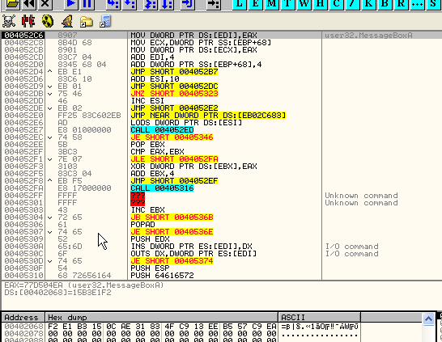

Видим, что программа остановилась, когда попыталась сохранить значение одной из API-функции в вышеуказанной секции (хе-хе, моё предположение было правильным), что привело к ошибке, открывшей OllyDbg, который автоматически подсоединился к программе.

Теперь ,чтобы можно было продолжить выполнение, нужно вручную изменить права доступа к этой секции, чтобы в неё можно было писать. Нажимаем "M".

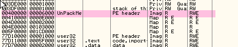

Неважно, что OllyDbg показывает нам только одну секцию. Делаем следующее: жмём на правую кнопку мыши и устанавливаем полный доступ, то есть "Full access".

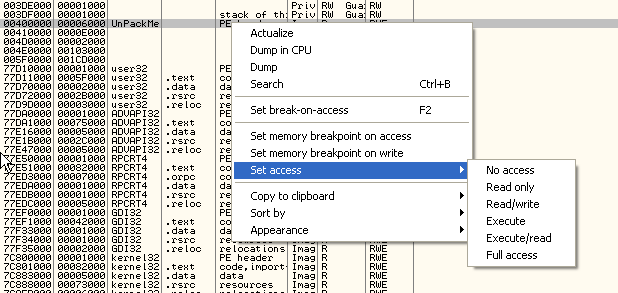

Теперь пробуем выполнить инструкцию с помощью F7, посмотрим, нормально ли сохранится или снова выдаст ошибку.

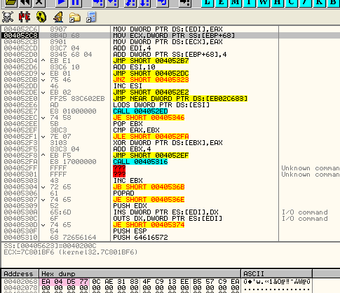

Видим, что сохранилось без каких-либо проблем, теперь запомним как располагаются секции в PeEditor'е, так как OllyDbg нам показывает эту информацию не очень хорошо.

Видим, что первая секция занимает в памяти 1000 байт, так как VIRTUAL SIZE равен 1000, то есть располагается по адресам от 401000 до 402000. Следующая секция, права доступа к которой мы меняли, располагается с 402000 до 403000, хе-хе.

Если посмотрим, что находится в 401000, то увидим, что это распакованная программа.

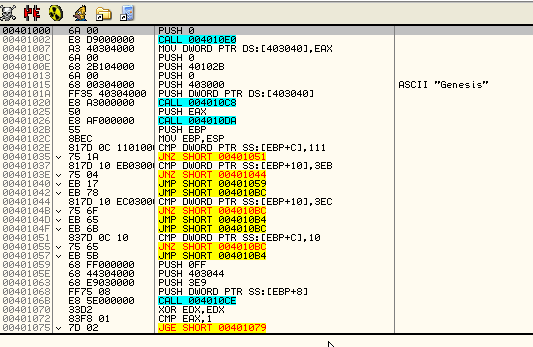

Так что, хотя не можем установить BPM на всю секцию с помощью карты памяти, так как OllyDbg показывает нам её неправильно, можем отметить в дампе байты с 401000 до 402000, то есть всю секцию, и установить на них BPM ON ACCESS, что по сути будет то же самое.

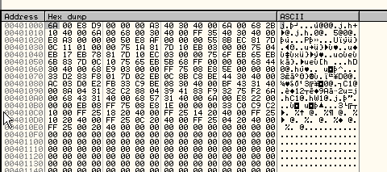

Затушёвываем всё с 401000 до 402000 и устанавливаем туда BPM ON ACCESS.

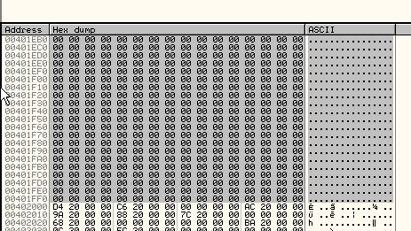

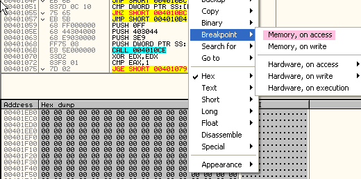

Теперь делаем RUN.

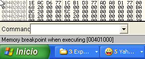

Теперь останавливаемся на OEP, который располагается точно в 401000.

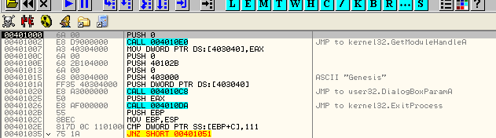

Ок, мы сделали самое сложное, теперь нужно сдампить программу.

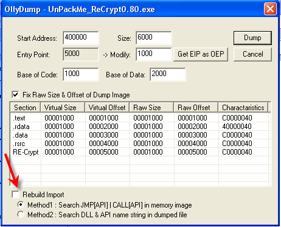

И сохраняем дам, теперь ищем IAT и данные для IMP REC'а.

Под OEP есть вызов одной API-функции.

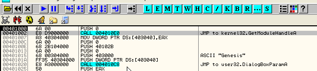

И если сделаем FOLLOW, то это приведёт нас к переходам на API-функции.

Так что найти IAT очень просто, посмотрев какой-нибудь из этих переходов, например тот, который ведёт на GetModuleHandleA содержит значение из области 402000, так что оно относится к IAT.

Эта IAT очень маленькая, так что начинается она в 402000, а заканчивается в 40201C, поэтому размер равен 1C. Открываем IMP REC ***\[[ссылка](files/34/ImportReconstructor16f.7z)\]*** и отнимаем от найденных адресов начала и конца базу образа, то есть 400000.

RVA или НАЧАЛО: 2000

SIZE: 1C

OEP: 1000

Заполняем поля для OEP, RVA и SIZE, а затем нажимаем GET IMPORTS. Оно говорит нам, что всё "YES", хе-хе.

Пропускаем дамп через "FIX DUMP", и при запуске нам выдаётся ошибка.

Нам потребуется обработать его в LordPE c помощью "Rebuild PE".

Запускаем, и прощай, упаковщик!

Наши усилия по применению необычных методов дали свои плоды. Некоторые вещи упаковщики делают одинаково, однако они также защищают себя против обычных методов.

\[C\] Рикардо Нарваха, пер. Aquila

## Дополнение к Главе

*От переводчика: приложении к 45-ой главе находился PDF на испанском языке, и эта статья является его переводом на русский язык.*

В этой статье показан другой способ противостоять упаковщику из вышеуказанной главы единственно с помощью щелчков по кнопкам мыши без необходимости делать что-то ещё.

Замечание: используемый Ollydbg - это обычная версия, единственные модификации - это Ollyghost ***\[[ссылка](files/45/+/OllyGHOST++.7z)\]*** и плагин OllyDump ***\[[ссылка](files/35/OllyDump%20v3.00.110.7z)\]*** для дампа процесса.

Также используется PE Editor, LordPE и две утилиты из списка - Estricnina ***\[[ссылка](files/45/+/Estricnina%20v0.12.7z)\]*** и Pokemon Anti\_Attach ***\[[ссылка](files/45/+/POKEMON%20AntiAttach.7z)\]***.

### Сводная информация

Первым делом до того, как атаковать программу в памяти, посмотрим на данные файла, для чего откроем программу в LordPE.

Эти данные нам понадобятся, так как упаковщик может изменить их во время распаковки, и мы ничего не сможет сделать. Как видим, данные NumberOfRvaAndsizes были изменены, так как знаем, что это поле содержало 10 в шестнадцатеричной системе. Изменим его, для чего необходимо его смещение, так что открывает редактор PE. Видим, что смещение равно B4.

Следующее, что нам необходимо знать - это OEP, и с этим нам поможет плагин PEID.

Ок, теперь у нас есть все сведения, которые нам нужны, чтобы начать... Стало быть, идём в атаку.

Полученые данные:

1. OEP 00401000
2. SizeOfImagen 00006000
3. NumberOfRvaAndSizes Находится по смещению b4 и было изменено на 10

### Атака

Запускаем упаковщик вне OllyDbg, и он работает.

Чтобы работать с большим удовольствием, будем использовать утилиту Marciano, которая называется Estricnina, с помощью которой остановим третью нить, которая содержит упаковщик (этот шаг не является необходимым, но делает работу более удобной).

Если мы делаем это, то загрузка процессора нитью падает с 99 процентов до нуля.

Теперь мы можем спокойно использовать нашу машину.

### Атака в памяти, чтобы нас не обнаружили

После использования Pokemon'а, чтобы избежать возможных противоприсоединительных и тому подобных приёмов, восстанавливаем значение NumberOfRvaSizes, которое, как мы помним, находится по смещению B4.

Хорошо, если была защита против присоединения, то она исчезла. Продолжаем атаковать упаковщик в памяти. Открываем LordPE, и ищем упаковщик в списке процессов.

Как видим, у него размер образа равен 0001000, и мы знаем, что он должен быть равен 0006000, и это запутывает OllyDbg и любой дампер, поэтому у нас на выходе и не получается хорошего исполняемого файла, кроме того это мешает использовать программу Import для восстановления таблицы импорта.

Вывод: нужно починить его, это понятно. Кликаем по нёму в LordPE правой кнопкой мыши и исправляем

 

И как видим на скриншоте справа, размер стал 0006000, каким он и должен быть.

Уже починили часть программы в памяти, теперь подсоединяемся с помощью OllyDbg и видим, что она сообщает нам о том, что заголовок неверен.

Жмём на "Oк" и программа аттакуется, останавливается на API-функции.

Теперь, так как знаем его OEP, идём в окне кода в 00401000 и оказываемся на OEP программы.

 

И видим, что с ней всё в порядке... Нажимаем правую кнопку мышью.

И видим в регистре EIP, что остановились на OEP, так что теперь переходим к сдампливанию с помощью плагина.

Осталось только добавить таблицу, которую подготавливаем с помощью Import. Вводим OEP и нажимаем три кнопки по порядку, выбираем сдампленный ранее файл и не выходим из окна, в котором заголовок находится в плохом состоянии. Об этом нам ещё ранее сказал OllyDbg.

Реконструируем заголовок с помощью какой-нибудь программы, у которой есть такая функция, в данном случае это LordPE, и программа становится нормальной.

 

И если посмотрим в администраторе задач Windows, увидим, что программа больше не пожирает ресурсов - упаковщик исчез.

Ок, достаточно на сегодня.

\[C\] Lisa и Alquimista, пер. Aquila
