# Глава 46 - Крэкми от Fatmike. Часть 1

В этой главе продолжаем изучать методы, которые мы пытаемся применить, когда всё начинает идти не так, как мы ожидали. В этой главе для этих целей нам послужить прекрасный защищённый крэкми Fatmike’а, который называется PATRICK.exe [\[ссылка\]](.gitbook/assets/files/46/patrick.7z). Оно довольно мощное, и думаю, что прежде, чем углубляться в более сложные упаковщики, необходимо научиться этим альтернативным методом, включая те, о которых я рассказываю, но они не срабатывают, так как во многих случая нам придётся подстраиваться, адаптироваться и искать брешь среди лабиринта защиты, воздвигнутого программой, как, например, с этим крэкми, который мы собираемся распаковать.

Конечно, нужно упомянуть, что коммерческий упаковщик не всегда может иметь все стандартные приёмы упаковщика, сделанного специально (как в данном случае), так как если упаковщик коммерческий, то его должно быть возможно применить к любой программе, в то время как авторский может содержать специальную защиту, завязанную на конкретную программу.

Хорошо, открываем наш OllyDbg, как обычно используем знакомый нам модифицированный OllyDbg, замаскированный плагинами (патч №4).

Согласно автору, целью является не только распаковать крэкми, но и заставить его запуститься без DLL защиты, которую мы видим рядом с exe-файлом.

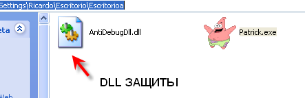

Хорошо, это нам говорит, что указанная DLL, предположительно, ответственна за всё. Если удалим её из этой папки, то программа попросит у нас эту библиотеку и прекратит выполнение.

Ок, запускаем крэкми в патче №4.

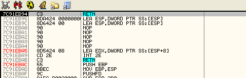

Видим, что выполнение прекращается ещё до прибытия в точку входа.

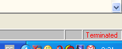

Хорошо, посмотрим, как изменить, что OllyDbg останавливается до точки входа, то есть на системной точке останова, которая находится немного раньше, в которой система может остановиться немного раньше точки останова.

Для этого в настройках OllyDbg меняем в DEBUGGING OPTIONS-EVENTS.

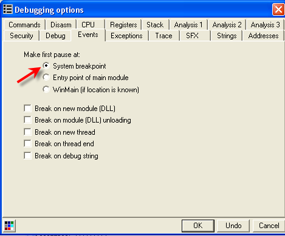

Первая настройка приводит к остановка на SYSTEM BREAKPOINT, и дело в том, что некая DLL запускается раньше того, как управление доходит до точки входа, обнаруживает, что программа выполняется под отладчиком, и завершает её.

Конечно, нам не нужно долго гадать, кто за это ответственен, так как системные библиотеки не защищают программы против отладки под OllyDbg.

В любом случае, хорошо знать, что все DLL запускаются раньше прибытия в точку входа. Те, через которые проходит выполнение – это нормальные библиотеки и на нас не влияют, и поскольку OllyDbg в них не останавливается, то нам они особенно не интересны. Но посмотрим в программу.

Идём в заголовок с помощью GOTO EXPRESSION-400000.

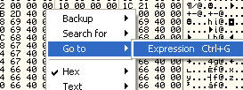

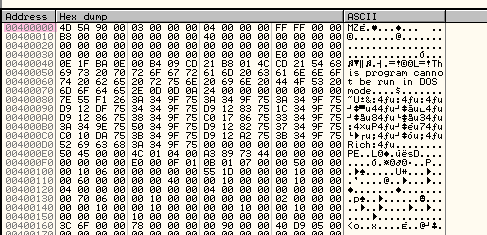

Меняем режим на SPECIAL- PE HEADER.

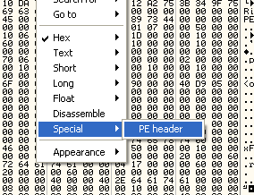

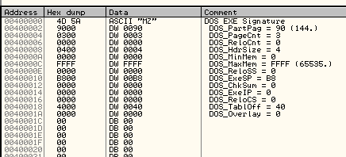

Теперь спускаемся вниз и видим следующий указатель.

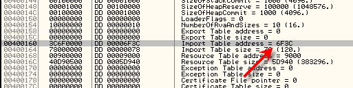

Как мы знаем, это указатель на IMPORT TABLE или IT (не путайте с IMPORT ADDRESS TABLE, которая IAT, к сожалению, это делают довольно многие, хе-хе).

Ок, как мы уже видении, если пойдём сюда в 6F3C + база образа (400000), то увидим IT.

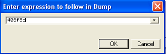

Выходим из специального режима.

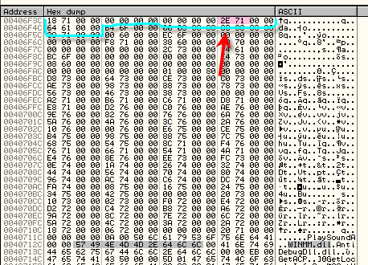

Если помним, первые пять DWORD’ов соответствуют первой DLL, следующие пять – второй, и так в порядке, в котором они загружаются в IAT.

Чтобы узнать имя первой DLL, нужен 4-ый DWORD, который является указателем на имя, то есть по адресу 407712e будет находится имя первой DLL, загружаемой в IAT. Посмотрим, что это за библиотека.

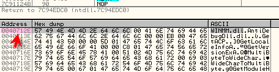

Там находится WINMM.dll – это первая DLL. Но запускается ли она раньше прибытия в точку входа, в которой останавливается OllyDbg?

Открываем её и то место, где сработал SYSTEM BREAKPOINT.

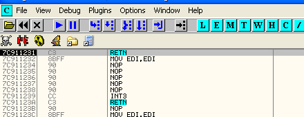

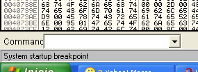

Останавливаемся здесь. Теперь знаем, что этот крэкми не доходит до EP, потому что завершается раньше в какой-то из DLL, который загружаются до неё. Это, не иначе как, происходит в библиотеке, прилагающейся к крэкми, но всё равно посмотрим, какие библиотеки запускаются раньше OEP, так что идём в карту памяти M и устанавливаем BPM ON ACCESS на секцию CODE вышеупомянутой DLL.

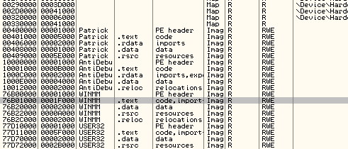

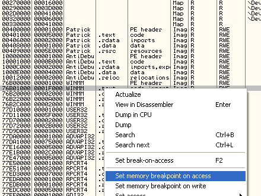

Ок, устанавливаем точку останова сюда, чтобы посмотреть, сработает ли она, делаем RUN несколько раз и смотрим в низ OllyDbg, фиксируя, происходит ли выполнение или чтение/запись. Продолжаем нажимать RUN.

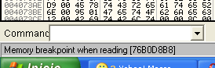 .

В первый раз, когда останавливаемся здесь, происходит чтение. Продолжаем, пока не произойдёт выполнение.

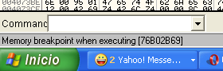

Останавливаемся здесь, когда начинается выполнение DLL.

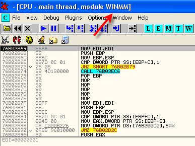

Это значит, что ничего странного в том, что эти DLL выполняются, нет. Теперь повторим это способ, но с DLL, которую хотим исследовать. Перезапустим OllyDbg и когда остановимся, то идём в M и устанавливаем BPM ON ACCESS на секцию кода в AntidebugDll.dll.

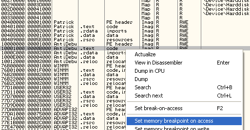

Делаем RUN и останавливаемся на выполнении DLL.

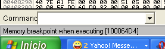

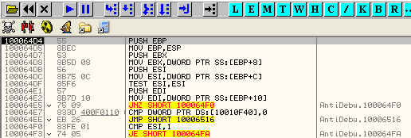

Хе-хе, тут начинаются проблемы.

Нам нужно, чтобы программа работала под OllyDbg, поэтому прежде всего посмотрим кое-что.

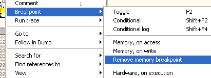

Хорошо, убираем BPM, установленный ранее, и так программа обнаруживает OllyDbg не по имени, не по окну, не с помощью всех иных приёмов, против которых служит HIDEOD [\[ссылка\]](.gitbook/assets/files/22/hideod.7z), то заключаем, что где-то просматривается процесс, который открывает программу, а для этого, как мы уже знаем, служит приём с Process32Next, но HIDEOD, предположительно, также защищает против него. Что же здесь происходит?

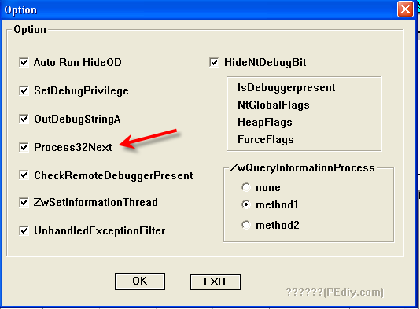

Таким образом, если сделать несколько дополнительных исследований, можно придти к заключению, что крэкми не работает, если запускается не из-под EXPLORER.EXE, то есть нужно, чтобы оно нормально запускалось из-под него двойным щелчком мыши, а если запустим из-под любой другой программы, то он работать не будет.

То, из-под какого процесса он запустился, крэкми узнаёт с помощью API-функции Process32Next, так что устанавливаем BP на него и смотрим.

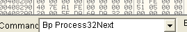

Делаем RUN.

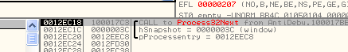

Здесь у нас результат работы функции, на моей машине он равен 12EEC8, и это адрес на отчёт.

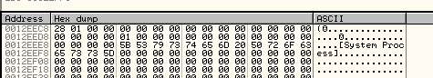

Используем утилиту [Pupe](.gitbook/assets/files/41/pupe2002.7z), которая нам покажет процессы по порядку и их PID’ы, чтобы продвинуться дальше.

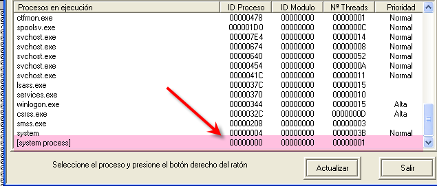

Первый процесс здесь имеет PID равный нулю, и если глянем в WINAPI32:

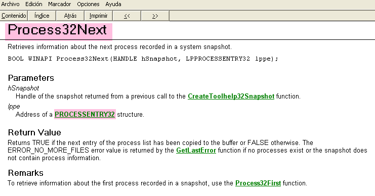

Вот эта API-функция Process32Next и видим, что этот параметр, указывающий на отчёт, здесь называется структурой PROCESSENTRY32, если кликнем на ссылку, то узнаем о ней подробнее.

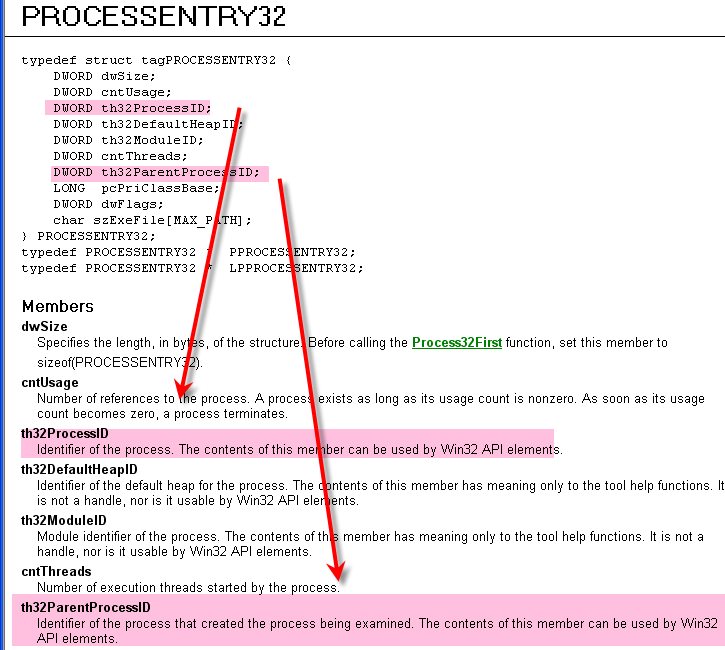

Здесь видим, что 3-ий DWORD – это PID изучаемого процесса, а 7-ой – это PID процесса, который его запустил, в данном случае оба равны нулю, то есть оба были запущенны системой.

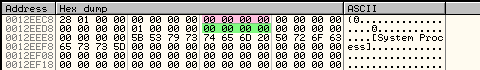

Розовым выделен PID процесса и зелёным – кто его запустил. Ничего особенного здесь нет, делаем RUN заново.

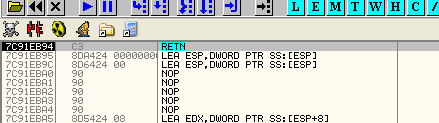

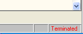

Эй, уже прекратила работу, но только изучая системный процесс, определить в чём причина закрытия нельзя. Попробуем отключить защиту HIDEOD, чтобы не возникали никакие конфликты. Снимаем в HIDEOD галочку, относящуюся к Process32Next и повторяем:

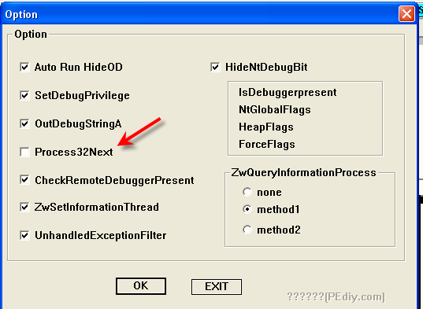

Теперь при перезапуске не нужно останавливать BPM заново на секцию кода, потому что можно использовать BP на API-функцию.

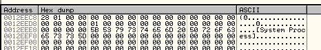

Теперь останавливаемся и смотри отчёт, в котором раньше было два PID’а равных нулю.

Аа, теперь понятна проблема. Когда в HIDEOD была установлена галочка на Process32Next, то по возвращению из API-функции EAX содержал ноль, что говорит о произошедшей ошибке при её выполнении, и программа сразу закрывалась. Без галочки EAX равен одному, и тогда начинается поиск процесса, так что мы теперь знаем, что этот случай надо решать без данной опции.

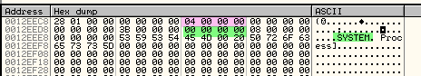

Ок, без галочки мы можем дойти до второго процесса в снимке процессов. Им является SYSTEM с PID’ом 4, который отмечен розовым цветом. Этот процессом был запущен процессом с нулевым PID’ом, то есть предыдущим.

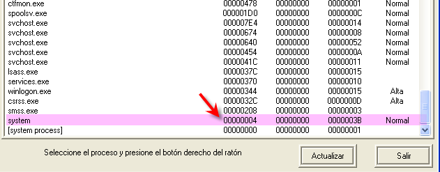

Хорошо, нам будет удобнее снять BP с начала API-функции и установить его на её RET, чтобы точно узнать, когда возвращается отчёт PATRICK’а при его завершении, и изменить его до того, как программа его прочтёт.

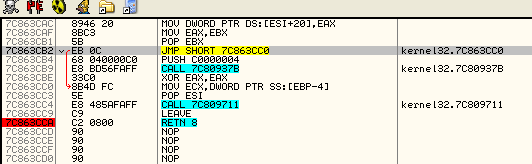

Теперь продолжим до того, как в PATRICK.exe появится отчёт.

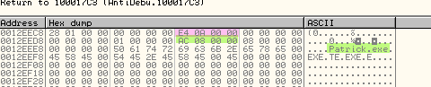

Здесь видим PID patrick’а, который равен AE4, и он был запущен процессом с PID’ом 8AC. Смотрим в PUPE, вспоминаем, что если перезапускали крэкми, то нужно обновить информацию в этой утилите, так что нажимаем кнопку "Actualizar".

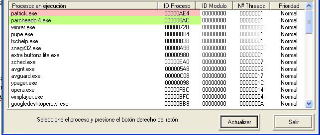

Patrick с PID’ом AE4 был запущен parcheado4 [\[ссылка\]](.gitbook/assets/files/40/Parcheado%204.7z) с PID’ом 8AC.

Вот истинная причина, почему крэкми, запущенный не из-под EXPLORER.exe завершает работу. Устанавливаем BPM ON ACCESS на PID parcheado 4, чтобы узнать, где происходит сравнение.

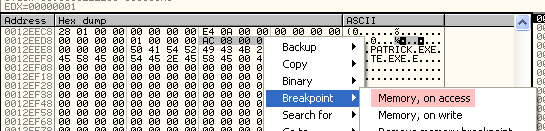

Делаем RUN и останавливаемся здесь.

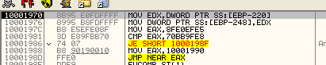

Где считывается PID и сохраняется в другое место. Смотрим, куда имеет, чтобы можно было установить туда HBP ON ACCESS.

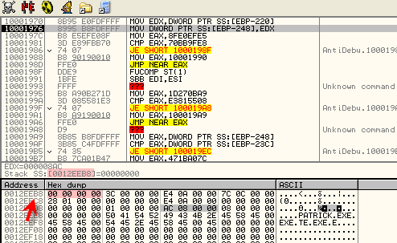

Нажимаем F7, чтобы сохранить по другому адресу.

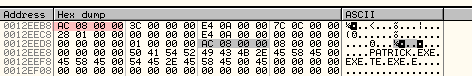

Так что установим HBP ON ACCESS туда и будем наблюдать за тем, когда там произойдёт чтение.

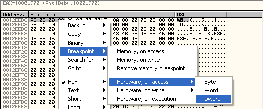

Если нажмём RUN, то увидим, что начальное значение отчёта стирается, но сохраняется куда-то, а куда именно мы должны выяснить с помощью HBP.

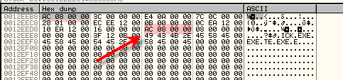

По нажатию на F7 останавливаемся на BPM ON WRITE, где оно стирается, что означает, что нам здесь BPM уже не нужен, так как уникальное значение защищается HBP в другом месте. Снимаем BPM.

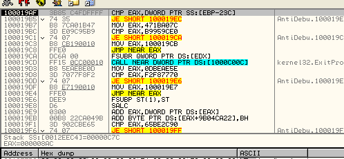

Делаем снова RUN и доходим до сравнения – здесь сравнивается 08AC, что является PID’ом parcheado4 или программы, которая запустила крэкми, и сравнивается он с C7C.

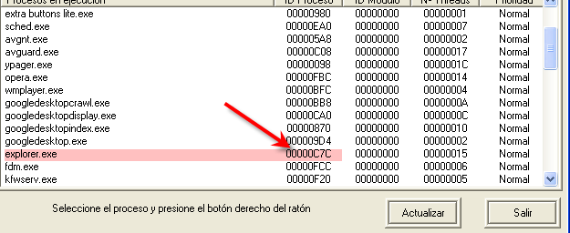

Как и можно было предположить, это PID Explorer’а.

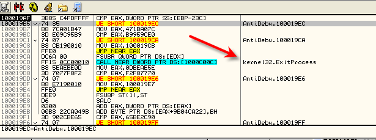

Видим, что если PID’ы запустившей крэкми программы и explorer’а равны, то происходит переход, чтобы обойти ExitProcess, а если различны, то перехода не происходит и крэкми завершает выполнение. Проблема в том, что если изменить DLL и сохранить эти изменения, то в ней есть другие проверки, из-за которых она не запустится. Так что лучшее, что мы можем сделать, чтобы не менять ничего – это снять предыдущий HBP и установить HBP ON EXECUTION на эту строку со сравнением.

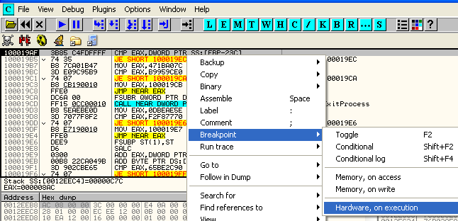

Таким образом, каждый раз, когда будем доходить до сравнения здесь, сможем вручную изменить PID parcheado 4 на PID explorer’а, чтобы они были равны и не было проблем.

На самом деле будет более удобным установить его строку, предшествующую сравнению, так как именно там считывается PID parcheado 4 и помещается в EAX.

Теперь перезапускаем и смотрим, можем ли мы напрямую отредактировать PID без того, чтобы устанавливать Process32Nex и проходить через API-функции одну за другой. Стираем точки останова и перезапускаем.

Останавливаемся здесь, и у нас есть информация, где надо редактировать. На моей машине это 12eeb8 – идём туда и меняем PID 8AC на C7C.

Если теперь нажмём F7, то раз оба PID’а равны – произойдёт переход, и программа продолжит своё выполнение.

Это только первый из трюков, которые нам необходимо обойти. С помощью установленного HBP это легко сделать, заменив здесь PID и продолжив выполнение.

Немного оттрасировав отсюда, видим, что теперь крэкми хочет сделать снимок процесса с PID’ом C7C (на моей машине), чтобы убедиться, что это эксплорер, проверив другие его характеристики. Поскольку C7C на самом деле является эксплорером, то ничего странного он не замечается. Этот приём предназначается для противодействия попыткам переименовать другую программу в EXPLORER.exe, чтобы запустить из-под неё крэкми.

И если ещё немного оттрасируем, то увидим Module32First, которая служит для проверки модуля процесса.

Ок, здесь у нас отчёт, в данном случае – это информация о модулях. Точно мы не знаем, что проверяется, но так как ищется информация об explorer.exe, то знаем, что всё верно. Здесь мы видим данные о первом модуле, которым является сам исполняемый файл.

Самые важные данные следующие: розовым выделен идентификатор 01, который имеет значение только внутри снимка и идентифицирует модули внутри процесса. Этот внутренний номер в снимке, который не слишком важен. Затем зелёным отмечен PID процесса, которому принадлежит модуль, а потом голубым цветом – адрес базы модуля, который в моём случае равен 1000000, то есть это база образа данного модуля. Жёлтым цветом – размер модуля. Кроме того, видим, что показывается имя модуля, а ниже идёт путь к нему.

Хорошо, это даёт нам достаточно информации, так что посмотрим, что мы с этим сможем сделать.

Оттрасировав немного, видим, что считывается C7C и сравнивается, что находится в этом отчёте, чтобы убедиться, что модули также относятся к explorer.exe.

Продолжаем шаг за шагом.

Здесь видим обращение к GetWindowsDirectory. Эта функция возвращает путь, по которому находится директория Windows, то есть куда установлена система, и explorer.exe всегда должен находится в ней, так что, как мы видим, путь из отчёта сравнивается с тем, что возвращает API-функция.

Смотрим в буфере, куда сохраняется путь.

Сохраняется сюда, так что он готов для сравнения с путём в отчёте. В нашем случае проблем не будет, потому что в отчёте содержится путь до explorer.exe, так что спокойно продолжаем.

Видим, что чуть ниже к "C:/WINDOWS" добавляется "/", а затем "explorer.exe", чтобы можно было осуществить сравнение.

Здесь читаем и доформировываем путь.

Хех, прекрасно. Посмотрим, что тут делается.

И подходим к сравнению. Здесь начинается считывание пути из отчёта.

Доходим до CharUpperBuffA.

Эта API-функция преобразует строку, которая находится в BUFFER, в верхний регистр

Ничего особенного здесь нет, так что путь из отчёта преобразуется в верхний регистр. Это делается для того, чтобы было удобнее сравнивать. Путь создаётся с помощью функции GetSystemDirectory, к которой прибавляется EXPLORER.EXE, также в верхнем регистре, так что переходим к самому сравнению.

Доходим до CALL'а, который сравнивает обе строки, очевидно, что на выходе будет ноль в EAX. Ноль или единица означают, что строки равны/не равны соответственно.

Здесь видим строку, где сравниваются оба пути, так что если кто-то переименует OllyDbg в explorer.exe, то он должен запускать отладчик из директории WINDOWS, куда установлена система, и проблема заключается в том, что там находится настоящий запущенный EXPLORER.exe, так что с этим методом могут возникнуть сложности.

Продолжаем и проходим через этот CALL с помощью F8.

Видим, что EAX содержит ноль, поэтому на JE происходит переход.

Если сразу посмотреть на финальное решение, то не надо было бы столь сильно хвататься за голову и многое из того, что мы делаем, не было бы необходимым, однако нет ничего плохого в том, чтобы учиться и узнавать, что мы можем делать, каким образом и где лежат пределы наших возможностей.

Видим, что крэкми всё ещё не убеждён в том, что всё в порядке и продолжает искать данные о других модулях процесса, который его запустил. Здесь мы доходим до Module32Next, чтобы посмотреть отчёт о втором модуле.

В данном случае это ntdll.dll. Видим, что те же данные, что и в прошлом случае. Идентификатор 01, который используется для определения всех модулей одного процесса, затем PID процесса (равный в моём случае 0C7C) и другие данные, такие как база и размер.

Продолжается сравнение, принадлежат ли все модули explorer.exe. Этого парня сложно убедить!

Уф, теперь GetWindowsDirectoryA.

Держу пари, он сравнивает путь из отчёта с путём, возвращаемым данной API-функцией, не очень оригинально. Продолжаем смотреть.

Здесь снова получаем путь, куда установлена Windows, и видим, что повторяется то же самое, что и с первым модулем, поэтому вдаваться в детали не будем и трассируем до вызова сравнения.

Добравшись туда, видим, что сравнивается путь к Эксплореру с путём к DLL. Они, естественно, не равны, так как системные библиотеки находятся в другой директории, так что они никоим образом не равны.

Поэтому после возвращения из вызова в EAX находится 1, так как они не равны и перехода не происходит.

Продолжив, становится видна обфускация для запутывания кода.

Как видим, здесь в EAX помещается константа, которая затем сравнивается с другой, и они никогда не будут равны, поэтому переход JE не срабатывается. Затем идёт MOV EAX, XXXXX, помещающий в регистр адреса (отмечены красным), а следом за этим – JMP NEAR EAX, который совершает переход по этому адресу, конечно, если будем трассировать, то увидим весь код. Обфускация не может предотвратить того, что мы будем трассировать и найдём настоящий код. Если не будем трассировать, а хотим быстро просмотреть запутанный код, направляем курсор на один из отмеченных MOV’ов, делаем щелчок правой кнопкой мыши и выбираем FOLLOW INMEDIATE CONSTANT.

Ниже можем увидеть обфусцированный код без необходимости его выполнять.

Здесь всё ясно видно без запуска, и если хотим посмотреть на следующий MOV, находящийся ниже, то повторяем.

И видим обфусцированный код без необходимости его запускать.

Это информационный уровень, пока продолжаем трассировать.

Продолжаем трассировать и видим, что игра с путями продолжается, в этот раз это SYSTEM32\\NTDLL.DLL. Идём следом.

Снова считывается имя EXPLORER.exe.

Затем видим, что E из EXPLORER.exe сравнивается с N из NTDLL.DLL.

Затем идёт переход на ExitProcess, видим, что никакой проблемы нет и мы его минуем, так как очевидно, что эти два имени не равны, так что идём дальше.

Видим, что этот крэкми пробегает по всем модулям один за другим. Не вижу большого смысла в этой части, так как если процесс убедился, что его главный модуль находится по правильному пути, какой смысл в этих проверках?

Но ладно, это прояснится по мере того, как продолжим трассировку, терпение.

Трассируем до сравнения.

Видим, что покамест продолжается проверка модулей один за другим, и каждый из них сравнивается с EXPLORER.exe и только первый так назывался, поэтому для остальных сравнение каждый раз оказывается ложным.

Ладно, чтобы сэкономить на трассировке, устанавливаем HBP ON EXECUTION на CALL COMPARADOR, так нам удастся быстрее пройти через сравнения.

В PUPE у нас также есть список модулей Explorer’а, поэтому можем пройти один за другим, пока не закончится сравнение каждого из них. В PUPE входим в CAJA DE HERRAMIENTAS (Коробка с инструментами), смотрим модули.

Поскольку они располагаются по порядку, нам ничего не стоит следовать за ними.

Последним в моём случае идёт idle.dll.

Так что нужно пройти все остальные, пока не встретим этот.

Мы уже почти у цели.

Здесь прибываем в последний. Теперь можем продолжить трассировку, чтобы видеть, что происходит.

Видим, что продолжаем проскакивать ExitProcess и снова идём в Module32Next.

Здесь считывается последний. Если видите, то изменился PID explorer’а, это потому что в середине туториала перегружал машину, и PID изменился, но всё идёт точно таким же образом, только PID другой.

Видим, что это последнее сравнение, и снова минуем ExitProcess.

Ок, похоже, что крэкми устал повторяться, и начинается что-то иное. Доходим до API-функции GetModuleFileNameA.

С помощью которого получаем путь до крэкми.

Хорошо, сейчас прибываем в CreateMutexA, который я объясню, раз мы не встречали его в предыдущих частях. Он используется тогда, когда программа запускает второй экземпляр (процесс) самой себя. С помощью этой API-функции можно проверить, в первый ли раз была запущена программа или это уже второй процесс. Здесь видим её работу.

Вот параметры функции.

Пройдя API-функцию с помощью F8, видим, что система предоставляет хэндл, равный 50, а также OllyDbg нам сообщает об "ERROR SUCCESS", что на русский можно перевести как удачное создание мутекса, то есть успех.

Видим, что есть два мутекса, один зовётся MYFIRSTINSTANCE, а другой WAIT, можем посмотреть более подробную информацию о них, если пойдём в окно H (хэндлы).

Один был очевидно создан в начале части, которую мы не трассировали, но вот она:

Затем вызывается API-функция, которая возвращает последнюю произошедшую ошибку. OllyDbg сообщила нам об успехе, а теперь программа с помощью данной API-функции узнаёт о том же.

Как видим, после возврата из API-функции EAX содержит ноль, который в данном случае как раз и обозначает успешное выполнение.

Здесь мы видим ловушку и предполагаем, что она называется WAIT. Первый из двух мутексов называется MY FIRST INSTANCE, и он решает, является ли этот процесс первым или вторым запущенным, и иногда вызывается WAIT, видим, что в этом случае в результате SUCCESS’а программа не идёт на ExitProcess, но в случае со вторым процессом, если здесь проверяется мутекс, а существует ранее запущенный процесс, то результат будет равен не нулю, а B7, что приведёт к завершению программы. Выполнение продолжится только, если это первый экземпляр крэкми. Пока что запомним, что если это первый экземпляр процесса, то мутекс будет равен SUCCESS, а если нет, то ERROR ALREADY EXISTS, и таким образом в большинстве случаев и выясняется, является ли этот экземпляр программы первым или нет.

Продолжаем дальше.

Так, здесь видим, что программа собирается создать второй процесс с помощью API-функции CreateProcessA.

Вот её параметры. Идея в том, что предположительно, если нажмём F8, то будет создан второй процесс, но прежде чем закроется этот, второй процесс пройдёт проверку мутексом WAIT, и так как первый процесс не был закрыт, то второй процесс завершится.

Очевидно, что если это делается, когда запущена программа, этот первый процесс создаёт второй и немедленно его закрывает, гораздо раньше, чем второй начнёт проверять все модули и дойдёт до проверки MUTEX WAIT.

То есть нажатие на F8 не поможет нам, так как другой процесс закроется. Мы может сделать немногое, попробуем его заморозить, для чего поменяем параметр CreationFlags на 4.

Смотрим, что произойдёт.

Как видим, при запуске второй процесса было возвращено EAX=0 и это означает, что создать его было невозможно. Это озадачивает.

Устанавливаем HBP ON EXECUTION на вызов CreateProcessA и идём пробовать, почему не создаётся второй процесс, то есть требуется два HBP, один раз, чтобы изменить PID parcheado 4 на PID эксплорера, а второй HBP здесь на CreateProcessA.

А, снова HideOD, возможно, что он каким-то образом меняет права доступа крэкми, не давая ему создать другой процесс.

На картинке показано, какие галочки убираем в HideOD. Теперь смотрим, создастся ли второй процесс.

Установив галочки указанным образом, проходим API-функцию с помощью F8, и в EAX помещается EAX=1, так что мы на правильном пути.

Теперь снова доходим до нужного места, при установленных как надо опциях HideOD, и заново устанавливаем параметр функции, чтобы процесс создавался замороженным.

Посмотрим в Pupe.

У нас есть два созданных patrick.exe, и второй заморожен, хе-хе.

Теперь пойдёт сложная тема – как остановить и приаттачиться к процессу, так как видим, что проверяется всё, а если что-то находится, то программа завершает выполнение. Это сделать не слишком просто.

Попробуем следующий метод. Перезапускаем parcheado 4 и когда останавливаемся на системной точке останова, устанавливаем BPM ON ACCESS на секции кода antidebug.dl. Когда останавливаемся на её EP, смотрим это значение на нашей машине.

Здесь нам необходимо найти место где останавливать выполнение второго процесса до того, как запустится DLL, но DLL ещё не загружена, можно сделать бесконечный цикл в этом же адресе, но во втором процессе, так что смотрим стек, чтобы выяснить, откуда попадаем в EP.

Идём, посмотрим эту область.

То есть этот вызов и есть тот, откуда совершается переход на точку входа DLL. Теперь здесь есть адреса, которые относятся к NTDLL.dll, той, которая запускается всегда, так что возвращаемся сюда, создаём замороженный процесс и, когда он заморожен, устанавливаем на этот вызов бесконечный цикл, чтобы когда он будет запущен снова, здесь было зациклено.

Так что отмечаем адрес. На моей машине для цикла он 7с9111a4, оригинальные байты равны FF 55.

Снова доходим до CreateProcessA, помним, что до остановки на HBP ON EXECUTION надо изменить PID эксплорера, чтобы нас не выкинуло.

Меняем PID parcheado 4 на PID эксплорера, а затем доходим до CreateProcessA.

Заменяем 20 на 4 (CREATE\_SUSPENDED).

Нажимаем F8, и успешно создаётся второй процесс.

Вот оба процесса в PUPE.

Теперь выше открываем тот, что второй и выбираем "PARCHEAR" (патчить).

Пишем адрес, куда хотим добавить ЦИКЛ и меняем оригинальные байты на EB FE, которые означают бесконечный цикл.

Затем нажимаем PARCHEAR, и в нужном месте установлен ЦИКЛ. Теперь до того, как приаттачиться к процессу, нужно снять задержку с процесса, чтобы он запустился и был зациклен.

Для этого используем прекрасную утилиту ARAPUMK’а, которая называется ESTRICNINA [\[ссылка\]](.gitbook/assets/files/45/+/Estricnina%20v0.12.7z).

Хорошо, ищем по PID’у второй процесс, в данном случае вот он, и так как они здесь не по порядку, то нужно точно убедиться, какой из них является вторым. Делаем щелчок правой кнопкой мыши и выбираем "INFO THREADS".

И нажимаем "REANUDAR".

Теперь замороженный процесс запустился и зациклился, так что может присоединиться к нему.

Для этого можно попробовать присоединиться напрямую с помощью функции attach отладчика, но когда я так делал, мне не отображались модули и не завершалось выполнение, может что-то с моим компьютером или с HideOD, поэтому используем следующий способ для присоединения. Установим PARCHEADO 4 как JIT, сделаем CTRL +ALT+DEL и выберем второй процесс patrick’а. Обратите внимание, что PID’ы не показываются, поэтому надо сделать так, чтобы отображалась колонка с ними.

Теперь PID’ы видны, плохо то, что эти PID’ы в десятеричной системе, но ладно, в PUPE просто посмотрим, какой из двух больше, чтобы найти второй процесс.

В моём случае у второго процесса PID больше, так что ищем самый высокий PID в списке процессов и выбираем DEPURAR ("очистить").

Здесь остаётся запущенным, затем делаем паузу.

Похоже, что в OllyDbg ничего нет, но не пугайтесь, идём в T, то есть THREADS.

И делаем двойной щелчок на одной из двух ветвей. Находимся в бесконечном цикле, созданном нами ранее. Сделаем на нём щёлчок и не находимся в цикле. Попробуем по-другому.

Аа, находимся здесь, теперь посмотрим эту часть в дампе, чтобы выйти из ЦИКЛА.

Оригинальные байты равны FF 55. Восстановим их.

Если присоединились нормально, то смотрим в окне E (для исполняемых файлов) какие уже загруженны. Если там пусто, то возможно, что не удалось подсоединиться.

Видим, что хотя даже нет перехода на DLL, поэтому видно, что несколько раз происходит остановка на одном и том же адресе, так что устанавливаем BP и делаем RUN.

Каждый раз, когда происходит остановка, смотрим, не появилась ли antidebugdll.dll в списке модуле. Сейчас её видим, так что можем установить BPM ON ACCESS на её секцию кода.

Устанавливаем BP и делаем RUN.

И останавливаемся на точке входа DLL. Уф, какой дикий напряг знать, что ничего из этого не нужно для решения этого крэкми, хе-хе, но всё это является практикой, которая нужна для овладения мастерством.

Попробуем поставить BP CreateMutexA, чтобы понять, что там происходит с мутексами и к какому процессу всё это относится.

И делаем RUN.

Видим, что остановились на создании мутекса "MY FIRST INSTANCE", но это так как он уже был создан первым процессом, так что идём до RET.

Здесь видим, что когда первый процесс создавал MUTEX, который не существовал, результатом было ERROR\_SUCCESS, а значение было равно нулю. Здесь же результат равен ERROR\_ALREADY\_EXISTS, то есть "уже существует" и возвращаемое значение равно B7.

Конечно, далее идёт API-функция, которая считывает последнюю ошибку, и после её срабатывания видим, что EAX = B7.

То есть теперь видим что разница между тем, когда процесс запускается в первый раз и когда во второй, заключается в разных ошибках при создании мутексов.

Ок, в общем, мы подошли к концу этой части. Нам ещё осталось проанализировать, что делать, когда запускается второй процесс, просто для изучения, так как для решения этого крэкми ничего из этого не нужно – всё это для обучения, а также, потому что я люблю всё потрошить до самого конца.

\[C\] Рикардо Нарваха, пер. Aquila
