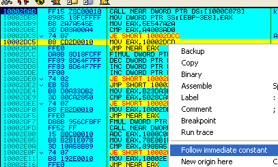
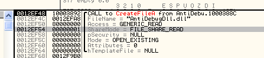
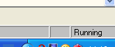

# Глава 47 - Крэкми от Fatmike. Часть 2

Продолжим с Patrick’ом [\[ссылка\]](.gitbook/assets/files/46/patrick.7z). Когда я дошел до места, на котором мы остановились в предыдущей главе, то заметил, что после восстановления оригинальных байтов команды, где был бесконечный цикл для присоединения, было бы хорошо вместо обычного BP установить на эту инструкцию аппаратный брейк, поскольку обычный обнаруживается и DLL’ка не запускается. Установка HE обеспечивает остановки не хуже, а после появления в списке загруженных модулей AntiDebugDll.dll можно установить в ее секции кода BPM ON ACCESS и оказаться на ее Entry Point:

Это Entry Point DLL’ки. В данный момент все модули загружены. Теперь можно приступать, но продвигаться следует постепенно, шаг за шагом.

Наша задача — оказаться в OEP крэкми с помощью OllyDbg, а это сделать, как уже упоминалось, сложнее, чем с помощью способа, не использующего Олли. Но в данном случае мы пользуемся именно Олли, поэтому оставим тот способ на потом и продолжим наш сложный путь сквозь патрицианскую защиту, как сказал Jack.

Давайте снова попадем в то место, где создается второй процесс: вначале изменим PID Олли на PID Проводника, затем, дойдя до CreateProcessA, изменим параметр dwCreationFlags для заморозки процесса и выполним эту функцию до ее команды RET. Далее установим бесконечный цикл в ntdll.dll, как это было описано в предыдущей главе. Присоединимся ко второму процессу. Затем, после снятия бесконечного цикла, установим на той же строке аппаратный брейк. Произведя нескольких остановок, дождемся загрузки AntiDebugDll.dll, после чего установим BPM ON ACCESS в секцию ее кода — и окажемся в ее EP. Всё это было проделано в предыдущей главе. Теперь открыты два OllyDbg: в одном отлаживается первый процесс, который мы назовем РОДИТЕЛЕМ (он находится в точке возврата из API-функции CreateProcessA), а в другом — второй процесс, остановленный на EP AntiDebugDll.dll, пусть он будет ПОТОМКОМ.

Если вам что-либо из этого не понятно, то перед продолжением исследования крэкми стоит повторить пройденный материал и попрактиковаться, так как далее будет не проще (даже сложнее, хе-хе).

Таким образом, в родителе мы остановились на возврате из API-функции CreateProcessA.

А в потомке — на EP AntiDebugDll.dll. Чтобы видеть, что это именно потомок, в этом отладчике желательно установить другую цветовую схему. Так я делаю не только для того, чтобы читателям было понятнее, какой из двух процессов я имею в виду — это и мне самому помогает не запутаться при взломе.

Теперь, по идее, нужно эмулировать одновременное выполнение двух процессов, но это невозможно. Однако известно, что процесс выполняется до места, где он ожидает действий другого, поэтому можно довести один процесс до состояния ожидания, а далее продолжать работать с другим.

Мы начнем с потомка. Как известно, если при его запуске он замечает что-либо подозрительное, то через несколько секунд закрывается. Следовательно, перед этим должна осуществляться проверка, какой это процесс: первый или второй, родительский или дочерний. В результате процесс станет выполнять соответствующую роль родителя или потомка. Важно понять, что, хотя эти процессы похожи (так как начинают выполняться с одной и той же строки), но, тем не менее, первый обнаруживает, что это первый процесс, а второй — что второй, поэтому они решают различные и даже противоположные задачи.

Как мы уже знаем, с помощью API-функции CreateMutexA проверяется, первый ли это запуск процесса, поэтому установим на нее BP в потомке.

Остановка произошла здесь. Родитель уже выполнял эти действия и сейчас мьютекс уже существует, поэтому API-функция теперь должна возвратить 0B7 (ERROR\_ALREADY\_EXISTS), а не 00 (ERROR\_SUCESS), как это было при создании мьютекса родителем. Дойдем до команды RET API-функции:

Код возвращенной ошибки говорит, что это была попытка создания уже созданного родителем мьютекса. Важно понимать, что когда программа обнаружит код спровоцированной ошибки B7, возвращенной API-функцией, она начнет выполнять совсем другую роль, нежели родитель, поэтому данный процесс надо будет рассматривать как отдельный процесс-по­то­мок.

Теперь вызывается API-функция, возвращающая последнюю произошедшую ошибку, и программа получает значение B7, которое отладчик уже показал, т.е. ERROR\_ALREADY\_EXISTS.

Затем это значение сохраняется. Если установить BPM ON ACCESS на ту ячейку памяти, где оно сохраняется и нажать RUN, то остановка произойдет в момент его считывания перед сравнением.

Здесь сохраненный код сравнивается с 0B7.

При истинном результате сравнения команда SETE поместит в EAX единицу. Далее идет решающий переход: если регистр EAX окажется ненулевым, то процесс станет потомком, иначе — родителем. В данном случае переход выполняется, поскольку это дочерний процесс. Если бы это был родитель, то переход бы не состоялся. Таким образом, здесь ход выполнения процессов разветвляется: до сих пор они делали одно и то же, а теперь родителю надо будет подтвердить, что он был создан Проводником и будет вызвана CreateProcessA для создания потомка. А то, что будет делать потомок, мы рассмотрим далее.

Для отслеживания API-функций существуют весьма полезные утилиты, подобные Kam и APISpy. Они логируют используемые в программе API-функции и помогают избежать лишней трассировки. Давайте попытаемся сделать собственный Kam с помощью Olly, что позволит нам переходить от API-функции к API-функции, сэкономит время и поможет в изучении таких насыщенных программ, как наш крэкми.

Прежде всего, надо в потомке найти IAT DLL’ки. Не трассируя, посмотрим в листинге выше команду CALL, вызывающую какую-либо API-функцию:

Вот подходящий вызов: он берет значение из адреса 1000C034, который должен соответствовать элементу IAT’а. Посмотрим его в DUMP’е:

Это IAT; после нахождения ее начала и конца установим BPM ON ACCESS на всю таблицу:

Сделав то же самое в родителе, получим второй собственный Kam. Конечно, IAT там находится по тем же адресам:

Таперь у нас есть два собственных Kam’а. Следует заметить, что они позволяют останавливаться на API-функциях из IAT’а DLL’ки. В случае с API-функциями не из IAT’а, полученными с помощью GetProcAddress, надо будет установить HARDWARE BPX ON ACCESS куда потребуется. Важно, что это работает с API-функ­циями из IAT’а, где наш Kam будут функционировать без нужды в чем-либо еще, хе-хе.

Вернемся к потомку, нажмем F9 и посмотрим, в какой API-функции он остановится. Кроме того, при каждой остановке будем смотреть параметры, передаваемые функции.

Однако, это избавило нас от часов трассировок: первая же остановка в потомке произошла снова в CreateMutexA при создании еще не существующего мьютекса:

Если вспомнить, то название рассмотренного нами ранее мьютекса, созданного родителем, было MYFIRSTINSTANCE, что означает: "мой первый экземпляр". А новый мьютекс называется MYMAININSTANCE, что значит: "мой главный экземпляр"; он создан потомком при выполнении программы, поэтому главный.

Нажмем F8, чтобы пройти API-функцию:

Не думаю, что результат этой второй проверки в процессе потомка на что-то влияет. Так как больше процессов не создается, мы не будем смотреть сравнение значений — в данном случае это не столь важно. Лучше нажмем F9 и перейдем с помощью нашего OllyKam’а к следующей API-функции, хе-хе.

Эта функция возвращает последнюю ошибку, произошедшую в результате вызова CreateMutexA. Нажмем F9 и остановимся на очередной API-функции:

Чтобы можно было произвести какие-либо изменения в текущем процессе, надо получить его псевдохэндл. Данная API-функция возвращает FFFFFFFF, то есть хэндл текущего процесса (или псевдохэндл). Нажмем F8:

А теперь — F9:

Для тех, кто не знаком с данными API-функциями, это будет хорошим упражнением. Если бы мы были на экзамене, а я был учителем, то я бы обязательно спросил: "Что возвращает эта API-функция?" Нам необходимо знать это до такой степени, чтобы и без помощи Win32 API, а только увидев это, мы и без нажатия на F8 могли понять, что здесь происходит, хе-хе.

Поскольку параметр функции — ntdll.dll, то после нажатия на F8 получим основание этой DLL’ки, которое затем станет параметром GetProcessAddress при поиске адреса новой API-функции.

Надеюсь, я был прав. Нажмем F9:

Ну, посмотреть чуть ниже было не так трудно, хе-хе.

Вот параметры функции:

Хмм, этот вызов даст программе адрес указанной API-функции. Снова F9:

Итак, поскольку здесь пропатчивается API-функция того же самого процесса, то это реализация части системы антиотладки. Для тех, кто желает изучить данный вопрос глубже, можно сказать так: здесь изменяются настройки доступа упомянутой API-функции, чтобы в ней можно было писать.

Изменения вносятся API-функцией WriteProcessMemory. Посмотрим ее параметры:

Итак, что за байт будет записан в этом процессе с помощью псевдохэндла FFFFFFFF по адресу исследуемой API-функции?

В этой процедуре есть вызов DbgBreakPoint. Если вспомнить, то после присоединения остановка произошла именно на DbgBreakPoint, так что данное место имеет к этому отношение. Выполнив API-функцию WriteProcessMemory, посмотрим, что изменится в DbgUiRemo­teBreakin:

Эта функция аннулируется установкой команды RET в ее начале.

Теперь опять воспользуемся нашим OllyKam’ом, который достаточно много рассказывает нам о происходящем в программе и о вызываемых в ней API-функциях:

Снова извлекается основание ntdll.dll. Далее идет вызов GetProcAddress для поиска адреса процедуры DbgBreakPoint, чтобы пропатчить и ее.

Устанавливаются настройки доступа для чтения/записи. Далее:

Теперь будут внесены изменения. Посмотрим параметры этой API-функции:

Она изменит один байт в процедуре DbgBreakPoint. Взглянем на нее до внесения изменений:

После нажатия на F8 начало функции станет таким:

То есть удалена команда INT3, которая вызывает исключение, дающее нам возможность приаттачиться, а вместо нее установлена инструкция RET, не позволяющая нам это сделать. Хе-хе, OllyKam действительно помогает тем, кто желает изучить систему антиотладки! Нажмем F9:

Остановились на API-функции OpenMutexA, которая используется при работе с мьютексами. Один из них уже создан родителем, и это можно проверить в окне хэндлов родительского процесса: там есть мьютекс под названием WAIT:

В потомке этот мьютекс ни разу не вызывался, и чтобы с ним можно было работать, нужно получить его хэндл с помощью функции OpenMutexA.

Как это обычно бывает при успешном открытии объектов, хэндл возвращается в регистре EAX.

Теперь он загружен и появился в списке хэндлов потомка.

После сравнения полученного хэндла с нулем и выяснения, что такой объект уже был создан родителем (поскольку можно получить его хэндл), был предотвращен вызов ExitProcess. Это очередная проверка, в результате которой потомок мог закрыться. Нажмем F9:

Вызов WaitForSingleObject — еще одно критическое место потомка, где придется бороться с Patrick’ом. Как известно, если родитель не выполнит определенные действия за несколько секунд или войдет в цикл и потратит время, потомок закроется. Данная функция как раз в этом и виновна. Посмотрим ее параметры:

Первый — это хэндл мьютекса, названного WAIT. Значит, потомок будет ожидать от родителя определенных действий, а после освобождения этого мьютекса выполнение потомка продолжится. Проблема заключается во втором параметре, где указан период в 5000 мс: если за этот промежуток времени потомок не дождется от родителя освобождения мьютекса, он будет закрыт, и, как это ни прискорбно, закроется также и потомок. Посмотрим, не трассируя, что идет далее после вызова этой функции:

Здесь происходит сравнение с нулем, и, в зависимости от результата, выполняется или не выполняется обход JMP’а, ведущего к вызову ExitProcess.

То есть, во избежание закрытия потомку следует не выходить из этой API-фун­кции до тех пор, пока родитель не освободит мьютекс WAIT. Мы просто изменим параметр времени dwMilliseconds (Timeout в Olly) на INFINITE (бесконечность), и потомок не сможет выйти из функции WaitForSingleObject:

После замены значения параметра 00001388 на FFFFFFFF (–1), установим BP сразу за API-функцией, чтобы после освобождения мьютекса родителем произошла остановка:

Теперь нажмем F9:

Как видим, потомок выполняется, и это будет продолжаться до тех пор, пока родитель не окажется в области, где освобождается мьютекс. Поэтому теперь мы ничего не сможем сделать в потомке. В момент освобождения мьютекса родителем произойдет остановка на установленном нами брейке, а сейчас, когда потомок вечно выполняется, есть время для продолжения работы с родителем.

Не стоит забывать, что если бы мы не изменили заданный в миллисекундах параметр времени API-функции WaitForSingleObject, это встревожило бы потомка и он перестал бы ждать родителя и отправился бы к ExitProcess, хе-хе. Бедный сын — воспитав его, мы заставили его послушно ожидать, хе-хе.

Теперь настала очередь трудиться родителю, поэтому начнем направлять его с помощью его OllyKam’а. Нажмем F9, чтобы узнать, что он будет делать.

Остановка произошла на API-функции Sleep, которая заставляет потерять его немного времени. Продолжая нажимать F9, пройдем не очень важную API-функцию и дойдем досюда:

Параметры этой функции стоит рассмотреть, поскольку здесь организован гнусный трюк и нужно быть настороже.

Но перед тем как продолжать объяснение трюка, следует заметить, что в данном случае API-функция CreateFileA используется для обнаружения изменения кода. Установленные брейки изменяют код, а это после сравнения дает различия, которые потом приводят к плохой расшифровке программы. Поэтому все BP следует удалить. Можно оставить BPM ON ACCESS, который используется в OllyKam’е, но придется удалить все BP **как в родителе, так и в потомке,** а BP, который мы поместили для остановки потомка после прекращения вечного выполнения, нужно заменить на HPB ON EXECUTION, иначе возникнут проблемы при расшифровке.

Эти BP в родителе нужно удалить все, даже One-shot, останавливающий OllyDbg на EP, так как он модифицирует код. А также следует удалить все BP в потомке.

После оставления насиженного добра можно продолжать изучение трюка, реализованного с помощью API-функ­ции CreateFileA. Но теперь мы не будем устанавливать ни одного обычного брейкпоинта — все брейки должны быть либо BPM, либо HE.

Вот параметры API-функции CreateFileA:

Здесь происходит что-то странное, что я считаю багом OllyDbg — другого объяснения я не нахожу. Если кто-то, прочитав дальнейшее, узнает, почему так происходит, скажите мне. Я никогда не видел такого противооллиного трюка и у меня нет никакой информации о том, что в API-функции CreateFileA может использоваться баг Olly. Поиски в форумах ничего не дали. Возможно, друг Fatmike обнаружил какой-то новоявленный баг. И только из-за того, что я довольно давно в крэкинге, после усиленных поисков удалось вычислить, что здесь происходит. Я постараюсь объяснить эти довольно необычные вещи как можно более ясно.

Если попытаться изменить в DLL’ке хотя бы один байт и сохранить изменения, то при следующем запуске программа узнает, что произошло изменение, дойдет до OEP, но окажется плохо распакованной, т.е. будет состоять из мусора, вызывающего ошибки.

Дело в том, что программа с помощью CreateFileA проверяет AntiDebugDll.dll, а затем с помощью ReadFile считывает и сравнивает байты файла с теми, которые выполняются, проверяя таким образом их равенство. При обнаружении несоответствия даже одного байта происходит плохая распаковка. Так должно быть в случае, если изменен один или более байтов, но мы в файле ничего не меняли, а делали всё в памяти, поэтому после считывания файла байты должны совпасть (если, конечно, не установлены BP). Однако, при использовании OllyDbg произойдет то же самое: программа плохо расшифруется и в OEP окажется мусор. Похоже, в Olly происходит нечто, из-за чего при прочтении файла программа ведет себя так, как если бы ее байты были изменены.

Вернемся к API-функции CreateFileA и ее параметрам:

Большинство из них довольно стандартны, но параметр dwShareMode требует особого внимания. Давайте выясним его возможные значения по Win32 API:

Здесь сказано, что если этот параметр равен FILE\_SHARE\_READ, то следующий вызов файла будет успешен только при установке параметра dwDesiredAccess в GENERIC\_READ. Установка нуля вместо FILE\_SHARE\_READ запрещает разделение доступа к файлу и следующая попытка его открыть будет тщетна, поскольку файл уже открыт.

В нашем случае в следующий раз файл будет открыт только при установке параметра GENERIC\_READ. Нажмем F8, чтобы посмотреть, будет ли возвращен хэндл:

Хэндл получен. Теперь с помощью OllyKam’а перейдем к очередной API-функции:

Здесь вызывается CreateFileMappingA, создающая проекцию файла в памяти, о чем можно прочитать в новых туториалах этого курса. Она не сильно влияет на функционирование программы. С ее помощью последняя получает хэндл проецированного файла.

Затем вызывается API-функция MapViewOfFile, которая мэппирует файл в память с помощью полученного хэндла. После нажатия на F8 станет известен адрес, по которому загружена проекция:

AntiDebugDll.dll загружена в память побайтно, начиная с адреса 9F0000. Казалось бы, теперь эти байты должны быть сравнены с теми, которые выполняются, но этого не происходит — сравнивается несколько байтов заголовка, а вовсе не код программы. Посмотрим в дампе загруженные байты DLL’ки:

Они должны совпадать с байтами выполняющейся в данный момент DLL’ки, загруженной по адресу 10000000. И действительно, это те же самые байты:

Программисту было бы легко сделать сравнение прямо здесь, поскольку байты уже загружены, и в секции, созданной проецированием файла в память, нельзя устанавливать ни BPM ни HE. Можно было замести следы с помощью переходов и начать сравнение здесь, проверяя наличие измененных байтов, но, как бы это удивительно ни было, сравниваются только 4 или 5 значений в заголовке. Я трассировал дальше с помощью F7, так как в секции 9F0000 нельзя устанавливать ни BPM, ни HE. После долгой бессмысленной трассировки я заметил, что байты почему-то не сравниваются. Было бы проще установить брейки, но пришлось всё делать вручную. Это была одна из причин подозревать, что автор что-то замышляет. Затея, подобно первым шагам ребенка, завершилась, чтобы продолжиться позже. Какая-то причина однозначно существует!

Что ж, далее воспользуемся OllyKam’ом:

Здесь считывается размер файла, чтобы узнать, был ли он изменен, а затем идут довольно нелепые сравнения расширения DLL’ки: dll или DLL, exe или EXE… Ну и пусть теряет свое время, если ему так хочется, хе-хе.

Продолжим:

Здесь удаляется проекция файла, загруженного в 9F0000, то есть эти байты больше не потребуются.

Затем закрывается хэндл только что удаленной проекции файла, и это должно поставить точку в данном вопросе.

Тем не менее, снова вызывается CreateFileA, но уже с такими параметрами:

Параметр dwDesiredAccess по-прежнему установлен в GENERIC\_READ, и, согласно Win32 API, при существующем файле его хэндл можно получить снова. Нулевой dwShareMode приводит к тому, что хэндл не возвращается только при последующих вызовах CreateFileA, а здесь такого ограничения нет, и он должен возвратиться, поскольку файл существует. Посмотрим, что произойдет.

Вместо хэндла файла OllyDbg возвратил код FFFFFFFF, а также показал сообщение об ошибке разделения доступа ERROR\_SHARING\_VIOLATION:

Но мы видели, что всё было нормально и такой ошибки не должно было возникнуть. Похоже, предыдущее проецирование файла в память было выполнено неверно. После длительного исследования этой проблемы приходится сделать заключение, что в данном случае ошибочно функционирует сам отладчик.

Тот факт, что далее в программе хэндл, который должен был получен здесь, используется для чтения DLL’ки с помощью ReadFile и выполняется сравнение, когда это можно было сделать ранее, доказывает, что так было сделано намеренно. Кто-то нашел в OllyDbg баг и воспользовался им, чтобы в этом отладчике было невозможно считать байты файла и сравнить их: это приводит к тому же, что и изменение байтов — файл плохо расшифровывается. Все эти догадки были подтверждены экспериментально.

После неудачной попытки получения хэндла вызывается ReadFile и производится чтение файла с параметром FFFFFFFF. В результате этого в регистре EAX оказывается ноль и происходит переход. Если бы был указан хэндл, то чтение выполнилось бы и переход бы не состоялся. Это означает, что пока программа выполняется в OllyDbg, адрес в образе 10003901 никогда не будет достигнут, поскольку выше происходит переход из-за неудачного выполнения ReadFile.

А что, если попытаться обеспечить нормальную работу ReadFile вне OllyDbg, чтобы эта функция возвратила единицу и переход, обходящий указанную область, не состоялся?

Я воспользовался не очень информативным способом: в файерволе Kerio есть возможность установить в настройках галку, чтобы программы спрашивали разрешения на запуск. Я запустил Patrick’а вне OllyDbg, и окошко с вопросом выскочило. Потом в Pupe [\[ссылка\]](.gitbook/assets/files/41/pupe2002.7z) установил EB FE по адресу ntdll.dll, из которого происходит переход на EP DLL’ки (на моем компьютере это 7C9111A4) и ответил в диалоговом окне. Затем установил другой цикл несколькими строками выше в 7C911199 и снял первый, и так поочередно устанавливал один и снимал другой, пока DLL’ка не загрузилась. Потом поместил бесконечный цикл в 10003901 и удалил циклы из ntdll, чтобы программа запустилась и осталась там зацикленной. Это позволило приаттачиться к процессу и увидеть, что он был остановлен в месте, в которое из OllyDbg никогда не попасть и которое достижимо только в случае возвращения функцией CreateFileA валидного хэндла. Таким образом было установлено, что программа выполняется нормально и в OllyDbg действительно есть баг.

Сделаем так, чтобы OllyDbg оказался в месте возвращения хэндла: повторим всё и дойдем до CreateFileA:

Заставить OllyDbg возвратить валидный хэндл можно, заменив нулевое значение параметра dwShareMode единицей:

Нажмем F8:

И вот наш злополучный хэндл! Этот трюк, кажущийся таким простым, когда он известен, заставил меня провести целые дни в изнурительных попытках выяснить, что же здесь происходит. Так что на самом деле он совсем не прост…

Ладно, теперь продолжим юзать наш OllyKam:

Дойдя до ReadFile, нажмем F8:

Теперь EAX=1, как и должно быть, и обход адреса 10003901 не производится.

Сразу после сравнения идет закрытие хэдла:

Нужно быть внимательным, поскольку этот трюк используется несколько раз.

OllyKam, вперед!

После нескольких остановок на не очень важных API-функциях снова вызывается CreateFileA, теперь уже для считывания файла Patrick.exe:

Так как это происходит впервые, то проблем не возникает и возвращается валидный хэндл, позволяющий работать с файлом.

Теперь с файлом Patrick.exe происходит то же самое, что было с AntiDebugDll.dll: создается проекция файла в памяти, т.е. возвращается ее хэндл.

Здесь копируются байты файла и API-функция возвращает адрес проекции, в данном случае на моем компьютере это 0AF0000:

Если посмотрим этот адрес в дампе, то увидим отображение файла, содержащее считанные из файла Patrick.exe байты:

Конечно, они будут совпадать с байтами Patrick.exe, находящимися по адресу 400000:

Как видим, они абсолютно одинаковы. Далее, как это было с DLL’кой, сравнивается лишь несколько указателей заголовка, а не весь файл. Нажмем F9:

Опять происходит проверка расширения, но на этот раз у экзешника Patrick.exe.

Затем изображение файла удаляется, хотя сравнение было неполным.

После пары незначительных API-функций изменяются настройки доступа потомка, находящегося в 401000; это нужно для расшифровки.

Через параметры функции передаются хэндл потомка и разрешение на чтение/запись в секции, начинающейся в 401000.

Так вызывается ReadProcessMemory — командой CALL, которая находится чуть ниже. Войдем в нее:

Из параметров функции видно, что будет прочитано 16 байтов, начиная с адреса 401000. После их расшифровки они будут сохранены там же функцией WriteProcessMemory. В 401000 родителя окончательные байты не видны, но это не проблема, так как далее потомок произведет для него повторную расшифровку.

Этот цикл будет повторяться вплоть до начала следующей секции в 406000, так что нам придется терпеливо удерживать клавишу F9 нажатой, увеличивая адрес, пока не окажемся рядом с 406000, где скорость надо будет замедлить, чтобы не проскочить.

Скоро произойдет завершение цикла, поэтому следует отпустить клавишу и продолжать продвигаться уже отдельными нажатиями.

Затем вызывается RealeaseMutex для освобождения потомка, который продолжает выполняться. Вспомним, что потомок выйдет из функции WaitForSingleObject только при освобождении родителем мьютекса, названного WAIT.

Если посмотреть параметры, то там указан хэндл 50 (так на моем компьютере):

Он, конечно же, соответствует мьютексу (или "Mutant", как указано в Olly) с именем WAIT. Сейчас потомок запущен и ожидает освобождения. После нажатия на F8 он будет освобожден и продолжит дальнейшее выполнение, поэтому на строке, следующей за вызовом WaitForSingleObject, был установлен брейк.

Нажмем F8, чтобы потомок освободился и остановился на HE.

Теперь свободны оба процесса, но мы пока продолжим работать с родителем: с помощью нашего OllyKam’а посмотрим, что будет далее:

Этой API-функцией устанавливается другое ожидание, на этот раз в родителе:

Единственный параметр задает период времени, после окончания которого происходит выход из API-функции. Но в данном случае это не случится, так как задана бесконечность; выход произойдет только в момент запуска потомка при вводе с клавиатуры или подобном событии.

Как и прежде, установим HE на следующей за вызовом команде и нажмем RUN:

Теперь родитель будет находиться в состоянии Running до тех пор, пока отпрыск не вырастет, а мы тем временем поможем ему подрасти, хе-хе. Продолжим юзать его Olly­Kam:

На этот раз мьютекс WAIT будет освобожден в потомке, но на родителя это никак не повлияет, поскольку он находится в функции WaitForInputIdle, а не WaitForSingleObject и ожидает запуска потомка. Продолжим:

Здесь потомок впервые считывает DLL’ку, чтобы проверить ее содержимое. Так как это происходит в первый раз, то проблем не возникает и извлекается валидный хэндл (скриншоты далее привожу без комментариев, ибо этот трюк уже объяснялся в родителе):

Очередь доходит до ключевого вызова:

Как и прежде, обойдем баг Олли, изменив параметр dwShareMode на 1:

Возвращен валидный хэндл.

После пары незначительных API-функций вызывается ReadFile с хэндлом файла в параметрах для считывания его байтов и их сравнения. Так проверяется оригинальность файла.

После проведения проверки хэндл закрывается.

Теперь опять CreateFileA, но уже для экзешника Patrick.exe:

Здесь проблем не возникает и хэндл возвращается.

Происходит то же самое, что было в родителе, поэтому опустим подробности.

Теперь тот же трюк применяется к файлу Patrick.exe:

Но мы изменим dwShareMode на 1, и хэндл будет возвращен:

Продолжим нажимать на F9, и после нескольких API-функций дойдем до ReadFile, выполняющей проверку содержимого файла:

Опять то же самое! Что ж, изменим dwShareMode на 1. Предполагается, что если ты смог дойти досюда, то трюк уже раскрыт.

Снова вызывается ReadFile для проверки.

Дошли до GetCurrentProcess, которая возвращает псевдохэндл (хэндл выполняющегося процесса) FFFFFFFF. Наконец-то эти проверки пройдены и начинается что-то новое!

Здесь, как и ранее в родителе, разрешается чтение и запись в секцию кода программы для обеспечения функционирования ReadProcessMemory иWriteProcessMemory.

Теперь вызывается WriteProcessMemory:

После нажатия на F8 расшифруются первые 16 байтов и их можно будет увидеть по адресу 401000:

Как видим, они расшифрованы верно.

Остается добавить только штрих, хе-хе.

Как и в прошлый раз, надо удерживать нажатой клавишу F9 до тех пор, пока не окажемся около 406000.

Область OEP расшифрована тоже правильно:

После окончания расшифровки создаются потоки защиты. Можно создать их замороженными, изменив параметр dwCreationFlags на 4.

Это начало первого треда.

А это — второго. Здесь снова будет произведена проверка выполняющихся процессов, поскольку видны соответствующие API-функции.

Итак, изменим параметр dwCreationFlags на CREATE\_SUSPENDED:

После создания тредов на всякий случай снимем все аппаратные брейки, установим BPM ON ACCESS в секцию кода Патрика (начинающуюся в 401000) и BREAK ON ACCESS *\[**Break-on-access?**\]* в секцию кода AntiDebugDll.dll. После нажатия на F9 произошла незапланированная остановка в этой области:

Можно оказаться на OEP Патрика быстрее, но так как галки в настройках исключений Олли оказались сняты и BPM установлен на всю секцию *\[**в секцию кода AntiDebugDll.dll**?\]**,* нажмем F9. Одно исключение генерируется этой командой:

Это попытка перейти на адрес 00000000. После нажатия на Shift+F9 окажемся в OEP из-за остановки на BREAK ON ACCESS *\[**Рикардо что-то мудрит…**\]*

Теперь можно было бы сразу приступить к сдампливанию, но мы поступим иначе: откроем еще один Patrick.exe в третьем OllyDbg и оставим его на системном брейке:

Теперь скопируем в его первую секцию все байты первой секции потомка:

Сохраним изменения: Copy to executable. Поскольку здесь правильная IAT, то проблем возникнуть не должно.

После открытия сохраненного Патрика в его первой секции содержится правильный код уже на System startup breakpoint. Но проблема в том, что далее запускается гнусная DLL’ка, поэтому перед ее удалением следует установить RET в ее EP и сохранить изменения:

Потом откроем Patrick.exe в PE Editor’е [\[ссылка\]](.gitbook/assets/files/45/PEditor1.7.7z) и изменим настройки доступа всех секций на E0000020:

А также есть CALL, который вызывает AntiDebugDll.dll — просто занопаем его:

Сохраним изменения и перезагрузим крэкми:

Теперь он запускается, но чтобы DLL’ка вообще не загружалась, следует сделать следующее:

Найдем в заголовке адрес начала IT — 406F3C.

Это IT. Вспомним, что первые 5 DWORD’ов соответствуют 1-й DLL’ке. Узнаем ее имя по ее указателю — 4-му DWORD’у:

Имя первой DLL’ки находится в 40712E, посмотрим его:

Это WINMM.DLL, а вторая — AntiDebugDll.dll. Таким образом, если скопировать первые 5 DWORD’ов таблицы импорта и вставить их в позицию следующих, то AntiDebugDll.dll аннулируется и второй DLL’кой будет опять WINMM.DLL:

Осталось только сохранить изменения и установить новое начало IT — 406F50:

Сохранившись и перезагрузив крэкми, изменим адрес начала IT:

Теперь будет так:

После сохранения изменений и перезапуска крэкми противная DLL’ка не загружается и крэкми выполняется верно:

Хе-хе, вот и финал внушающего страх Патрика!

Простое же решение состоит в изменении настройки доступа 40000040 секции данных  файла Patrick.exe, что лишает его всех привилегий и нескольких строк ниже OEP, вызывающих ошибку при открытии в JIT-отладчи­ке OllyDbg. В таком виде можно дойти чуть ниже OEP, дождаться распаковки и сделать то же самое: скопировать и вставить первую секцию в третий OllyDbg, изменить IT — и он заработает, хе-хе.

Прощай, ПАТРИК! хе-хе

\[C\] Рикардо Нарваха, пер. Рома Стремилов, 01.2010
