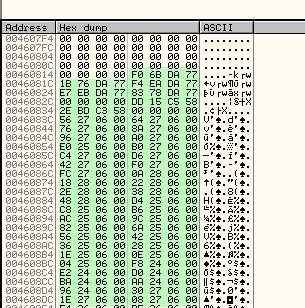
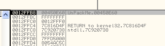

# Глава 48 - Распаковка PeSpin v1.3.04f. Часть 1

Если вы загрузили главы 46 и 47 сразу после их появления, то, возможно, не читали добавленное к ним позднее примечание:

>После того, как была написана 46 глава и еще не было завершено решение Patrick’а, я заметил, что эти туториалы слишком сложны для уровня, до которого мы дошли, так что если вам главы 46 и 47 покажутся очень сложными, то советую оставить их до тех времен, когда вы будете более подготовлены, а сейчас сразу перейти к 48 главе, соответствующей тому уровню, на котором мы остановились.
>
>***Рикардо Нарваха***

Так уж вышло, что когда я занялся Patrick’ом, то сначала решил его простым методом (упомянутым в конце 47-й главы) и посчитал, что он легок до неприличия. Как следствие, данные главы оказались труднее прежних и пришлось добавить процитированное выше примечание.

В этой главе мы рассмотрим упаковщик PeSpin 1.304 Full ***\[[ссылка](UnPackMe_PeSpin1.3.04.f.7z)\]***, о котором уже существуют достаточно хорошие туториалы. На самом деле, написать еще не существующий туториал практически невозможно, так как ресурс CracksLatinoS содержит очень хорошие статьи почти обо всех упаковщиках.

В PeSpin дойти до OEP очень просто.

Сейчас анпэкми остановлен на его EP. Мы будем пользоваться Parcheado 5 ***\[[ссылка](.gitbook/assets/files/26/olly_parcheado_para_vb.7z)\]*** — версией OllyDbg, которая предназначена для поиска OEP’ов.

Открыв карту памяти, установим MEMORY BREAKPOINT ON ACCESS в первой секции после заголовка. Этот брейк равнозначен ON EXECUTION, поскольку, как помните, пропатченная для поиска OEP’ов версия отладчика в данном случае останавливается только при выполнении, а не при чтении или записи.

Следует убедиться, что все галки во вкладке Exceptions окна Debugging options установлены:

После нажатия на RUN можно пойти спокойно пить кофе:

Как следует напившись кофе, хе-хе, обнаружим, что остановка произошла на непохожем на OEP месте, а значит, от команд исходной OEP ничего не осталось из-за украденных байтов:

Посмотрим стек:

Можно заметить, что перед прибытием в ложную OEP было выполнено много кода, и это свидетельствует о том, что байты OEP были украдены.

Кроме того, если сделаем Search for –> All intermodular calls, то найдем очень мало вызовов API-функций:

Посмотрим один из них:

Дойдя до косвенных переходов на API-функции, заглянем в IAT:

Здесь виден конец IAT’а — 460F28. Теперь поднимемся выше:

Похоже, это переадресовочные элементы. Чтобы проверить, принадлежат ли они IAT’у, посмотрим их референсы:

Поиск ничего не дает, но если подняться еще выше, то станет ясно, что это всё-таки часть IAT’а. Таким образом, в PeSpin используется и переадресация.

Начало IAT’а находится по адресу 460818. Мы еще вернемся к этому месту, когда будем исправлять IAT, а сейчас займемся возвращением украденных байтов; чуть выше ложной OEP для них как раз есть подходящая нулевая область:

Перезагрузим программу и посмотрим состояние стека:

Здесь видно, что перед запуском анпэкми адрес вершины стека равен 12FFC4 (так на моем компьютере). Это означает, что при прибытии к истинной OEP вершина стека должна находиться по тому же адресу, то есть в 12FFC4. Обычно первой командой программы является PUSH EBP, которая записывает значение в следующую ячейку стека (12FFC0), поэтому найдем ее в дампе и установим на ней HARDWARE BPX ON WRITE. Такое рассуждение логично, но оно может и не дать результатов, если упаковщик обнаруживает аппаратные брейкпоинты или, для осложнения поиска OEP, меняет адреса стека.

После установки брейка нажмем RUN:

Первая остановка произошла здесь, но данная инструкция скорее всего принадлежит распаковщику. Нажмем F9 еще раз:

Теперь остановились на PUSH EBP, что весьма похоже на команду из OEP. Чтобы проверить это предположение, воспользуемся, хе-хе, трассировкой. Конечно же, JMP’ы нас не интересуют, так как они не влияют на состояние регистров или стека.

Здесь встречается необычная комбинация команд: сначала выполняется PUSH, а затем только что записанное в стек значение суммируется с константой:

После выполнения инструкции ADD значение в стеке оказывается 450E60, поэтому данная комбинация равнозначна PUSH 450E60.

Затем этот трюк повторяется, но уже вместо PUSH 4292C8:

Далее идет еще одна подходящая инструкция:

И еще парочка:

Продолжим:

Сейчас мы просто скопируем этот CALL, а потом, при восстановлении IAT’а, посмотрим, относится ли он к какой-нибудь API-функции.

Переход на ложную OEP завершает трассировку, а мы тем временем узнали список украденных байтов, хе-хе.

Скопируем их в область OEP:

Они байт-в-байт заполнили нулевую область, так что теперь украденные байты возвращены, хотя мы даже не приступали к сдампливанию. В следующей главе мы будем разбираться с IAT’ом.

До встречи в 49-й главе!

\[C\] Рикардо Нарваха, 17.07.06 пер. Рома Стремилов, 01.2010
