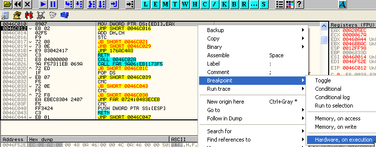

# Глава 49 - Распаковка PeSpin v1.3.04f. Часть 2

Теперь займемся восстановлением IAT PeSpin [\[ссылка\]](UnPackMe_PeSpin1.3.04.f.7z), что будет не так уж и просто.

Возможно, вы обратили внимание, что когда выполнение доходит до предполагаемой OEP, API-функции вызываются не через IAT, начало которой в 460818 и окончание в 460F28:


Назовем приведенную выше таблицу ВЕРНАЯ IAT программы. Однако есть такие элементы IAT, которые не являются ссылками, не направляют ни к одной API-функции и содержат какие-то странные значения, не принадлежащие ни одной DLL’ке и никуда не переадресующие — они похожи на какой-то мусор.

Сделаем Search for —> All intermodular calls:


Здесь есть много CALL’ов, берущих значения из IAT второго вида. Назовем последнюю просто Таблицей, чтобы отличать ее от правильной IAT.

Посмотрим нашу Таблицу в DUMP’e. Все эти CALL’ы берут из нее значения, так что выберем любой:


Вот этот CALL в листинге:


Теперь смотрим в Таблице:


Здесь отсутствует нормальный порядок элементов, присущий IAT’у, но, тем не менее, это всё же Таблица, которая, судя по всему, служит для переадресации API-функций.


С помощью Follow проверим, ведет ли данный вызов к API-функции:


После пары переходов оказываемся здесь:


И далее:


Переход произошел на 4-ю команду API-функции. Перед этим первые три выполняются в собственной секции, вероятно, для предотвращения остановки на BP и для усложнения определения имени API-функции. Тем не менее, это можно сделать, заменив значение EIP адресом самого начала API-функции с помощью правого клика мыши –> New origin here:


В окне регистров появится искомое имя:


Узнав его, следует возвратиться к JNZ во избежание проблем:


Что ж, это только начало: мы узнали имя API-функции, к которой приводит один CALL, а у нас есть еще исковерканная правильная IAT и CALL’ы, ведущие к API-функциям, которые вместо того, чтобы брать значения из правильной IAT, берут их из Таблицы, не стоящей того, чтобы ее восстанавливали.

Ладно, нам известно, что этот CALL


приводит к API-функции RtlLeaveCriticalSection, и это уже информация, которая пригодится в дальнейшем. Попытаемся решить анпэкми в несколько этапов. В первом из них возьмем наш CALL, использующий значение из Таблицы, и удалим переадресацию:


Нам нужно найти способ создания прямого обращения к правильным адресам API-функций, то есть в данном случае в Таблице вместо 00A205EC должно быть 7C9110ED (таков адрес упомянутой API-функции на моем компьютере).

Чтобы узнать адрес инструкции, сохраняющей значение в элементе Таблицы, установим на нем HARDWARE BREAKPOINT ON WRITE:


Перезагрузим программу и найдем то место, где сохраняется значение 00A205EC (так на моем компьютере, а у вас оно будет другим).


Нажмем RUN:


После пары остановок оказались здесь, при сохранении значения. Так как HARDWARE ON WRITE срабатывает всегда после выполнения команды, то посмотрим предыдущую строку:


Эта область кода обфусцирована, поэтому реально выполненной инструкции не видно, но если выделить предшествующий JMP и сделать Follow, то она отобразится:


Данная команда сохраняет плохое значение; это становится очевидно, если посмотреть в окно регистров:


Установим на ней HARDWARE BPX ON EXECUTION:




Нажатия на RUN приведут к перебору элементов Таблицы и ее заполнению.

Одновременно с этим происходит и нечто подозрительное в регистрах. Обратим на это внимание при сохранении очередного элемента:


Нажмем RUN еще раз:


Можно заметить, что при увеличении значений в EDI, указывающих на элементы Таблицы, одновременно увеличиваются и значения EDX, указывающие на верную IAT, как если бы это были адреса, по которым должно происходить сохранение на самом деле вместо указанных в EDX. Но пока оставим это и сделаем вот что: перезагрузим анпэкми и дойдем до того места, где сохраняется элемент, идущий перед изучаемым нами:


Здесь сохраняется значение в предыдущем элементе 46F529, и если еще раз нажмем F9 (не делайте этого), то окажемся на сохранении знакомого нам элемента.

Отсюда придется трассировать, так как перед сохранением переадресовочного значения его необходимо вычислить, исходя из правильного адреса API-функции. Поскольку нам известно, что следующий элемент соответствует функции RtlLeaveCriticalSection, адрес которой 7C9110ED на моем компьютере, будем трассировать до тех пор, пока этот адрес не появится в одном из регистров.

Можно попробовать запустить Trace into с таким условием:

EAX==7C9110ED

EBX==7C9110ED

ECX==7C9110ED

EDX==7C9110ED

ESI==7C9110ED

EDI==7C9110ED

Следует всегда помнить, что в условиях трассировки используются двойной знак равенства и двойной знак | для логической операции ИЛИ.

Приведенное условие остановит трассировку, когда в одном из регистров (EAX, EBX, ECX и т.д.) появится значение 7C9110ED.


Здесь следует установить две галки, первую — чтобы не было остановок при прохождении по DLL’ке, вторую — чтобы не терять время на повторах REPS, считая такую команду единой инструкцией. Теперь запустим Trace into:


Наверно, стоило бы пойти и долго-долго пить кофе, ведь все эти команды, по идее, нужно было трассировать вручную, хе-хе.


И вот, остановка произошла здесь, после возврата из CALL’а. Посмотрим лог трассировки:


Дважды кликнув на указанной строке лога, окажемся в этом месте:


Отладчик подсветил команду, соответствующую строке лога, и это момент, когда программа что-то делает с адресом API-функции перед переадресацией в свою собственную секцию.

Хорошо, у нас есть первая точка, далее нужно найти место, где извлекается адрес 00A205EC, поэтому изменим условие трассировки следующим образом:

EAX == 00A205EC

EBX == 00A205EC

ECX == 00A205EC

EDX == 00A205EC

ESI == 00A205EC

EDI == 00A205EC


Снова запустим Trace into (Ctrl+F11):


Теперь в регистре EAX находится правильный адрес API-функции, а в ESI — переадресовочный, так что это весьма правильный момент, хе-хе. Поэтому снимем все прежние HBP и установим новый здесь:


Перезагрузим программу и посмотрим, где будет первая остановка:


Произошло то же самое: в EAX находится правильный адрес API-функции, а в ESI — переадресовочный. Посмотрим, что будет, если изменить эту инструкцию следующим образом:


Данная команда сохраняет правильный адрес вместо переадресовочного. Теперь удалим HBP и нажмем на RUN:


Программа запустилась и не обнаружила изменений. Посмотрим Таблицу:


Наша первая цель, состоявшая в том, чтобы снять переадресацию элементов данной Таблицы, была только что выполнена: у нас есть прямые адреса API-функций, и Таблица заполняется верными значениями.

Взглянем на исследованный нами прежде элемент:


Теперь это прямой вызов API-функции, а не переадресованный. Но он всё еще берет значение из Таблицы, а не из IAT’а, поэтому на очереди второй этап — восстановление IAT таким образом, чтобы правильные значения извлекались только из нее.

Мы уже выявили две интересные точки, одна — 46BBC4, где, заменив ESI на EAX, была ликвидирована переадресация Таблицы. Другая — 46C010, где происходит сохранение. Установим HBP ON EXECUTION на обе и перезагрузим анпэкми.


Первая остановка произошла здесь, где, как и прежде, следует заменить ESI на EAX:


Снова запустим программу:


Вторая остановка произошла на сохранении правильного адреса API-функции в Таблицу. Кроме того, нам известно, что в EDX содержится адрес соответствующего элемента IAT’а, но просто заменить EDI на EDX мы не можем, так как CALL’ы берут значения из Таблицы, а не из IAT’а, и программа после замены работать не будет. Однако, вот что мы можем сделать:


Нам известно, что этот JMP отправляет к инструкции, где происходит сохранение, и что находящиеся между ними байты — просто мусор, поэтому занопаем JMP вместе с мусором:


Должно стать так:


Осталась только инструкция, сохраняющая адрес API-функции в Таблице. Добавим команду, производящую сохранение того же самого адреса в соответствующем элементе IAT’а:


Теперь верный адрес API-функции будет сохраняться и в Таблице, и в IAT’е, что сохранит работоспособность. Снимем HBP и вернемся на шаг назад, чтобы был выполнен добавленный нами MOV.

Если сейчас установить BPM ON ACCESS на секцию кода и нажать RUN, то вскоре окажемся на предполагаемой OEP.


Итак, прибыли к ложной OEP. Посмотрим, есть ли в обеих таблицах адрес API-функции, вызываемой CALL’ом, который можно найти в листинге чуть ниже:


В Таблице верное значение есть, осталось взглянуть на IAT:


IAT тоже восстановлена. Остается всего лишь сделать так, чтобы программа брала значения из IAT’а, а не из Таблицы. Это легко реализуется простым скриптом, который, обнаружив CALL и узнав, какая API-функция им вызывается, ищет ее адрес в IAT’е и производит соответствующую замену, чтобы чтение происходило оттуда, а не из Таблицы.

Перед рассмотрением скрипта следует вернуть украденные байты, найденные нами ранее:


А вот и наш незамысловатый, как табуретка, скрипт [\[ссылка\]](.gitbook/assets/files/49/Spin.7z):

```assembly
var CALL
var tabla
var api
var iat
var programa
var end
mov programa, 401000
mov iat, 460818
start:
findop programa, #FF15??#
log $RESULT
mov CALL, $RESULT
cmp CALL, 0
je final
cmp CALL, 44904b
jae final
sigue:
add CALL, 2
log CALL
mov tabla, [CALL]
log tabla
mov api, [tabla]
log api
cmp api, 50000000
jb saltar
loop:
cmp api, [iat]
je solucionar
add iat, 4
cmp iat, 460f28
jae saltar
jmp loop
solucionar:
log iat
log CALL
mov [CALL], iat
cmp CALL, 449068
jae final
saltar:
sti
mov eip, 4271f7
mov programa, CALL
log programa
mov iat, 460818
jmp start
final:
ret
```

Это начало:

```assembly
var CALL
var tabla
var api
var iat
var programa
var end
```

В нем заявляются вспомогательные переменные, необходимые программе; далее мы разберем назначение каждой из них.

```assembly
mov programa, 401000
mov iat, 460818
```

Это установка начальных значений: переменная programa задает адрес начала секции кода, откуда следует начинать поиск CALL’ов, а переменная iat — адрес начала IAT’а.

```assembly
start:
findop programa, #FF15??#
log $RESULT
```

Это место, откуда начинается выполнение скрипта. Устанавливаем метку start и используем команду findop для поиска первого опкода, начинающегося с FF 15, то есть это будет поиск косвенных CALL’ов.

Здесь также задается ведение лога, хотя он и необязателен — он нужен лишь для учета происходящего в LOG’е OllyDbg, поэтому не будем больше заострять на нем внимание.

```assembly
mov CALL, $RESULT
cmp CALL, 0
je final
cmp CALL, 44904b
jae final
```

Первый адрес косвенного CALL’а помещается в переменную CALL и происходит его сравнение с нулем. В случае, если ни один косвенный CALL найден не будет, результат окажется нулевым и выполнение скрипта подойдет к концу. Кроме того, проверяется, не восстановление ли это последнего косвенного CALL’а секции кода: если адрес выше заданного, скрипт также завершится.

```assembly
sigue:
add CALL,2
log CALL
mov tabla, [CALL]
log tabla
mov api, [tabla]
log api
cmp api, 50000000
jb saltar
```

Здесь адрес CALL’а увеличивается на 2 для указания косвенного адреса, находящегося на два байта ниже (сразу после FF 15).

Затем в переменную tabla помещается адрес элемента Таблицы, а его содержимое —адрес API-функции — в переменнаю api. Этот адрес API-функции и надо будет отыскать в IAT’е.

На всякий случай предусмотрим такую проверку: поскольку сейчас на моем компью­тере API-функции расположены выше 50000000, то в случае, когда адрес станет меньше (и это будет точно не API-функция), ничего изменено не будет и программа перейдет к следующему значению.

```assembly
loop:
cmp api, [iat]
je solucionar
add iat, 4
cmp iat, 460f28
jae saltar
jmp loop
```

Теперь у нас есть значение адреса API-функции, поэтому в данном цикле происходит его поиск по IAT’у. При его нахождении программа переходит к метке solucionar:

```
solucionar:
log iat
log CALL
mov [CALL], iat
```

Здесь элемент IAT’а записывается в положение, на которое указывает CALL, то есть сразу за байтами FF 15.

Далее выполнение скрипта повторяется: меняется значение переменной CALL, чтобы поиск происходил для следующего вызова, а также заново устанавливается переменная iat для поиска следующей API-функции.

```assembly
sti
mov eip, 4271f7
```

Эти две команды на самом деле не обязательны, но плагину OllyScript жизненно необходимо выполнять какую-либо программу, а не только производить поиск и менять значения, иначе со временем он зависает. Поэтому пришлось добавить команду STI, соответствующую одному нажатию на F7 или шагу вперед, а следом (также для предотвращения зависания) — возврат в ложную OEP.

К сожалению, OllyDbg при изменении скриптом большого количества байтов иногда достает своим MessageBox’ом, сообщающим, что произведено более 1000 патчей, но если несколько раз нажать на OK, скрипт завершится и всё будет восстановлено.

Теперь можно сдампливать и использовать ImpRec [\[ссылка\]](.gitbook/assets/files/34/ImportReconstructor16f.7z) для восстановления IAT’а:


Я обнаружил один мусорный элемент, который удалил с помощью Cut Thunk(s), и запустил исправленный крэкми, но он и теперь не заработал.


Дело в том, что в листинге есть антидампы — переходы в область заголовка, а у дампа соответствующего кода в заголовке нет, так как там у него расположены новые данные заголовка, секций и т. д.

Выполним Search for –> All intermodular calls в исходной программе, остановленной на OEP:


Здесь всё исправлено; посмотрим в районе OEP:


Вот несколько вызовов, требующих восстановления, однако особого желания заморачиваться со вторым скриптом нет. Поскольку для успешного запуска дампа мы не можем на постоянно сохранить так много информации в заголовке, то сделаем следующее: поищем в дампе область памяти размером примерно 1000h байтов, в которую можно было бы писать, например, эту:


Убедимся, что она существует на самом деле и не принадлежит ни какой виртуальной секции, выбрав в контекстном меню View –> Executable file:


Теперь скопируем туда 1000h байтов заголовка исходной программы, остановленной на OEP’е:


Выделим всю эту секцию:


Скопировав ее, сделаем в выбранной области дампа Binary paste и сохраним изменения:


Теперь осталось чуть выше нашей области разместить вставку, которая перед запуском программы копировала бы эти байты в заголовок. Но она будет не так проста, как хотелось бы, поскольку IAT крэкми не содержит адреса API-функции VirtualProtect.

По идее, чтобы достичь совместимости со старыми системами, нам нужно использовать API-функции LoadLibrary и GetProcAddress, и, кроме того, найти адрес VirtualProtect, но я покажу вам более быстрое решение. Посмотрите на это:


На скриншоте зеленым выделена API-функция LoadLibraryA, которая есть в IAT’е, а лазурным — нужная, но отсутствующая там VirtualProtect. Мы просто возьмем адрес LoadLibrary и вычтем из него нужное количество байт, чтобы дойти до VirtualProtect, поскольку во всей XP соблюдается дистанцирование.


Это элемент IAT’а, относящийся к LoadLibrary.


Загрузим его содержимое в EAX. Давайте посмотрим, каково расстояние между нашими API-функциями:


То есть, если вычесть 2A7 из адреса LoadLibraryA, то попадем на VirtualProtect. Проверим это:


Поскольку адрес одной API-функции находится через другую, расположенную в IAT’е, осталось изменить настройки доступа к заголовку, чтобы в него можно было писать.


Это описание и параметры API-функции, которая будет нами применена.


А это — код вставки полностью: сначала выполняется PUSHAD, потом в регистр EAX помещается адрес LoadLibrary, из которого вычитается 2A7 для получения адреса VirtualProtect. Затем, для изменения настроек доступа к заголовку (чтобы в него можно было писать), данная API-функция вызывается с такими параметрами:


Здесь видно, что область 1000h байтов, начинающаяся в 400000, получает разрешение на запись. Потом байты заголовка исходной программы, сохраненные в 45CAB0, копируются в 400000. И, наконец, после команды POPAD происходит переход на EP.


Всё, что нам осталось — это изменить EP в заголовке дампа, чтобы программа запускалась непосредственно с нашей вставки.


Заменим значение поля AddresOfEntryPoint на относительный адрес начала вставки 5CA10 (VA 45CA10).


Сохраним все изменения, и… вуаля:


Выполняется так, что аж ветер свистит, хе-хе.

До встречи в 50-й главе!

\[C\] Рикардо Нарваха, 17.07.06 пер. Рома Стремилов, 04.2010
