# Глава 50 - Распаковка ReCrypt v0.80 (API-функция OutputDebugString)

После рассмотрения двуличных Patrick’а и PeSpin эта глава может показаться простой, даже несмотря на то, что данный упаковщик не запускается ни в одной из версий OllyDbg, защищенных всеми плагинами, в том числе и наиболее эффективным из них — Olly Advanced ***\[[ссылка](files/50/OllyAdvanced-1.26-beta10.7z)\]***. Но запустить его в OllyDbg, на самом деле, совсем не трудно, и мы вскоре этого добьемся, чтобы у нас осталось больше времени на отдых, хе-хе. Исследовать мы будем приложенный к данному туториалу файл UnPackMe\_ReCrypt0.80.exe ***\[[ссылка](files/50/ReCrypt_0.80.7z)\]***.

Что ж, попытаемся запустить подопытного в OllyDbg; пользоваться будем версией отладчика, предназначенной для поиска OEP’ов.

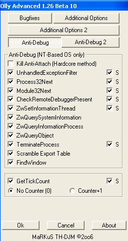

Можете поэкспериментировать с конфигурацией плагина. Конечно, он находится на стадии бета-тестирования и у него тоже есть ошибки, но он всё же выполняет свои задачи, хотя наш упаковщик и не запускается ни с одним из опробованных мной средств сокрытия.

Но у данного плагина есть еще и опция исправления бага секций, из-за которого при неправильнм значении заголовочного поля NumberOfRva показывается одна-единственная секция:

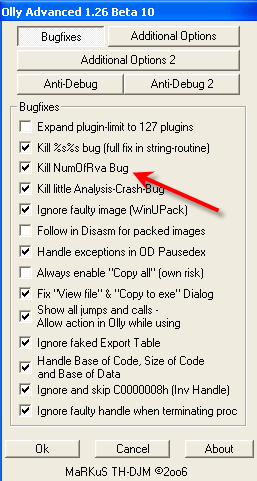

Хорошо, запустив программу, мы сэкономили время; посмотрим, где произошла остановка:

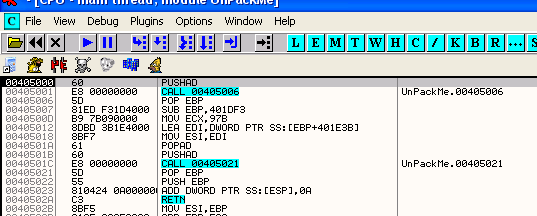

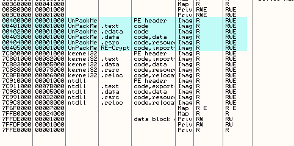

Теперь секции в карте памяти отображаются корректно, хотя без содействия плагина Olly Advanced это выглядело бы так:

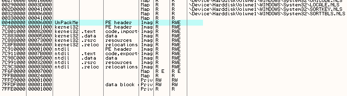

И нам было бы сложно дойти до OEP, поскольку это первая секция. Конечно, мы могли бы открыть PE Editor, посмотреть размер первой секции и вручную установить BPM на все соответствующие байты в DUMP’е, но наш плагин всё упростил, хе-хе.

Нажмем RUN:

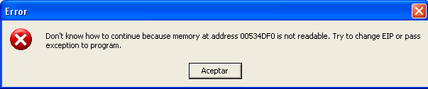

Привет и чау! И это в сверхзамаскированном OllyDbg! Разберемся, что же произошло; посмотрим лог, ответив на сообщение и подождав немного, если это потребуется:

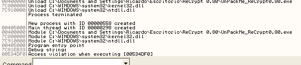

После запуска программы вызывается API-функция OutputDebugStringA, обычно использующаяся для подвешивания OllyDbg длинной строкой типа `%$%$%$%$%$%$`. Хотя Olly Advanced и другие плагины предоставляют защиту от подобных трюков, анпэкми всё же не запускается. Вызов данной API-функции генерирует исключение и программа не может выполняться дальше. Посмотрим, что произойдет, если на OutputDebugStringA установить BP:

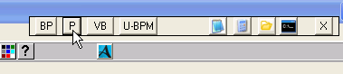

Поскольку мне не хочется каждый раз вводить вручную имена API-функций, то я пользуюсь второй версией плагина +BP-OLLY ***\[[ссылка](files/50/+BP-Olly_v2.0beta4.7z)\]*** моего друга Red’а, дающего возможность простым кликом устанавливать BP на наиболее часто используемые API-функции (в т. ч. и для VB), а также добавлять то, что нужно именно нам.

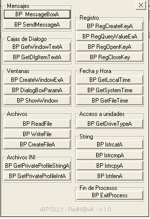

Поскольку в этом окне нужной нам API-функции нет, то добавим ее в список собственных, нажав на кнопку P (Personalizar):

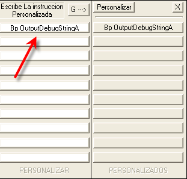

Обратите внимание, что при вводе имени функции следует соблюдать регистр букв. После нажатия на кнопку G при следующем открытии этого окна в нем появится кнопка с только что введенным именем:

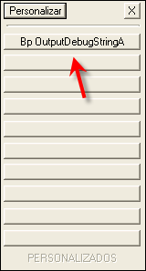

Теперь соответствующий BP можно будет устанавливать простым кликом, и нам больше никогда не придется вручную вводить имя этой API-функции для установки на нее простого брейка.

Однако запуск программы приводит всё к той же серьезной ошибке, поэтому простые BP на этой API-функции в данном упаковщике не подойдут. После перезагрузки анпэкми установим в Command Bar’е соответствующий HE и посмотрим, что это даст.

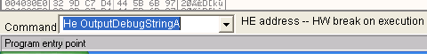

После удаления BP нажмем RUN:

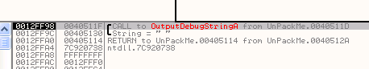

Брейк сработал. Дойдем до команды RET API-функции:

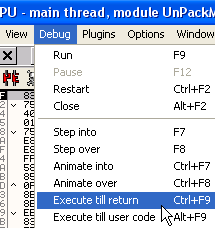

Возврат из API-функции происходит сюда:

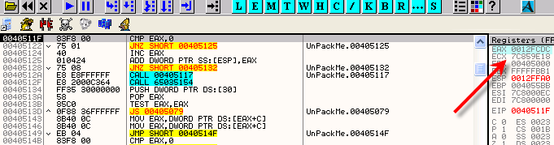

Здесь содержимое EAX сравнивается с нулем, но в данном случае оно не нулевое. Воспользуемся трассировкой для выяснения, что происходит дальше:

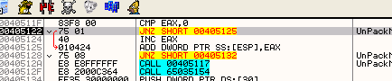

Это такой трюк: после выполнения условного перехода содержимое регистра EAX суммируется со значением, находящимся в вершине стека:

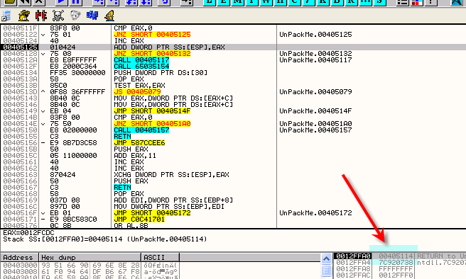

И стек становится таким:

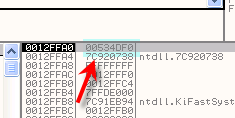

Дальнейшая трассировка приводит к команде RET, отправляющей выполнение на адрес, который был только что сохранен в вершине стека:

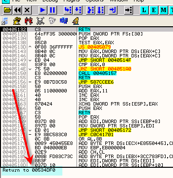

Поскольку такого адреса не существует, возникает исключение типа "No continuable" (Продолжение невозможно). Обработчик исключений обычно исправляет такое положение дел, но в данном случае он специально не установлен, чтобы программа далее просто завершилась.

После перезагрузки анпэкми и возврата из OutputDebugStringA попробуем обнулить EAX:

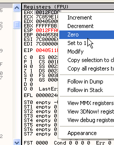

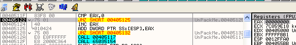

Теперь переход не срабатывает, команда INC EAX увеличивает нулевое содержимое EAX на единицу, результат операции суммируется со значением из вершины стека и выполняется RET:

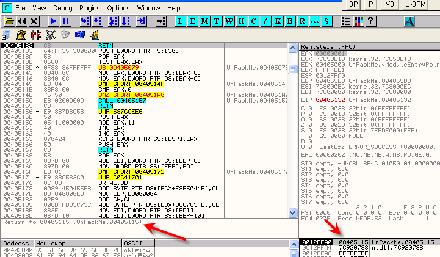

Возврат произошел в существующий адрес и ошибок не возникло. Теперь установим BPM ON ACCESS в первой секции и посмотрим, дойдем ли до OEP.

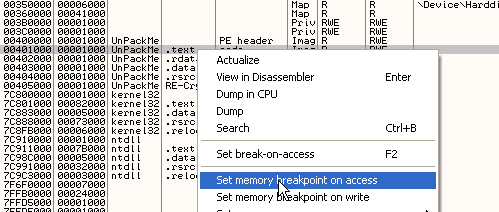

Так как наш OllyDbg пропатчен для остановок на OEP, то очередная остановка происходит при выполнении:

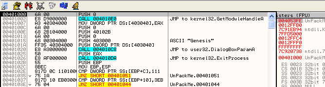

Это настоящая OEP и нам остается только петь и танцевать!

Сделаем Search for –> All intermodular calls:

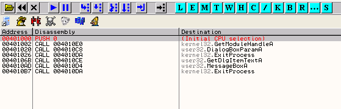

Как видим, API-функций мало, поэтому и IAT маленькая:

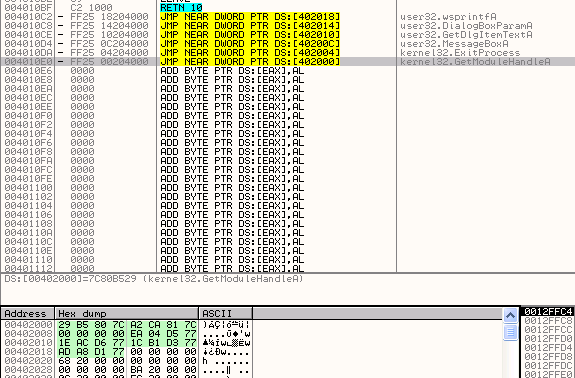

На скриншоте видно, что IAT заключена между адресами 402000 и 40201C, то есть RVA IAT = 2000, Size IAT = 1C и RVA OEP = 1000. Теперь сдампим программу, а затем восстановим файл в ImpRec’е ***\[[ссылка](files/34/ImportReconstructor16f.7z)\]***:

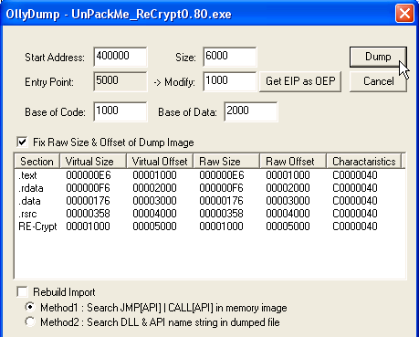

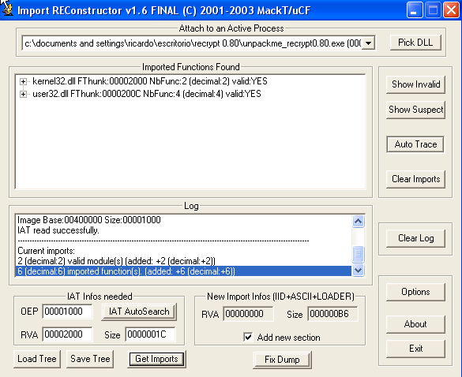

При сохранении исправленного дампа к его имени добавляется, как всегда, символ подчеркивания '\_':

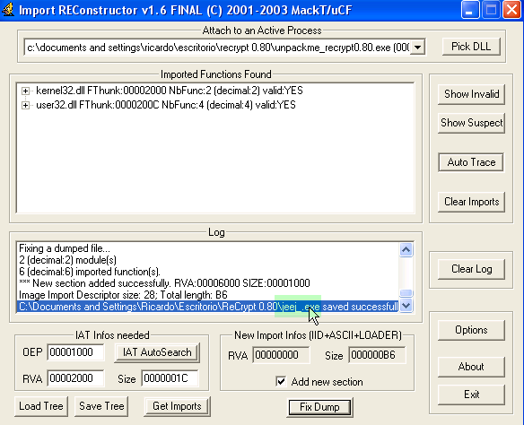

Попробуем запустить его…

Вот и решен наш простой упаковщик!

До встречи в 51-й главе!

Рикардо Нарваха,

\[C\] Рикардо Нарваха, 26.07.06 пер. Рома Стремилов, 04.2010
